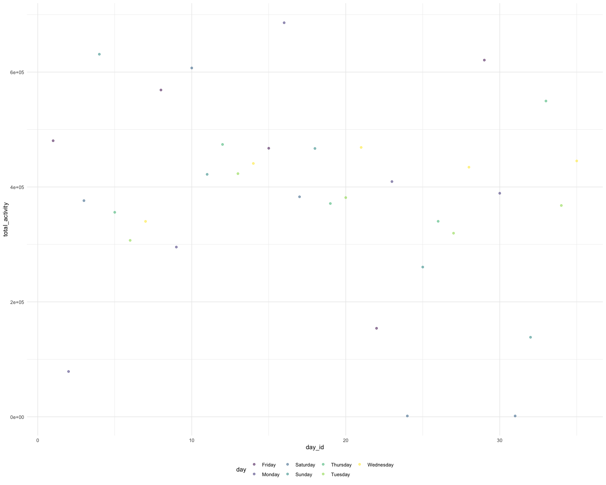

p8105\_hw3\_sl5009
================
Shengzhi Luo
15/10/2021

## Problem 1

``` r
library(p8105.datasets)
data("instacart")
```

``` r
library(tidyverse)
library(dplyr)

knitr::opts_chunk$set(
  fig.width = 15,
  fig.asp = .8,
  out.width = "150%"
)

theme_set(theme_minimal() + theme(legend.position = "bottom"))

options(
  ggplot2.continuous.colour = "viridis",
  ggplot2.continuous.fill = "viridis"
)

scale_colour_discrete = scale_colour_viridis_d
scale_fill_discrete = scale_fill_viridis_d
```

How many aisles are there, and which aisles are the most items ordered
from?

``` r
instacart %>%
  group_by(aisle,aisle_id) %>% 
  summarise(n_obs=n()) %>% 
  arrange(desc(n_obs))
```

    ## `summarise()` has grouped output by 'aisle'. You can override using the `.groups` argument.

    ## # A tibble: 134 × 3
    ## # Groups:   aisle [134]
    ##    aisle                         aisle_id  n_obs
    ##    <chr>                            <int>  <int>
    ##  1 fresh vegetables                    83 150609
    ##  2 fresh fruits                        24 150473
    ##  3 packaged vegetables fruits         123  78493
    ##  4 yogurt                             120  55240
    ##  5 packaged cheese                     21  41699
    ##  6 water seltzer sparkling water      115  36617
    ##  7 milk                                84  32644
    ##  8 chips pretzels                     107  31269
    ##  9 soy lactosefree                     91  26240
    ## 10 bread                              112  23635
    ## # … with 124 more rows

As from the above table, we can see there are 134 aisles in total and
the most items ordered are fresh vegetables.

Make a plot that shows the number of items ordered in each aisle,
limiting this to aisles with more than 10000 items ordered. Arrange
aisles sensibly, and organize your plot so others can read it.

``` r
instacart %>%
  group_by(aisle,aisle_id) %>% 
  summarise(n_obs=n()) %>% 
  filter(n_obs>10000) %>% 
  ggplot(aes(x = aisle_id, y = n_obs, color = aisle_id)) +
    geom_point() + geom_line() +
    theme(legend.position = "bottom")
```

    ## `summarise()` has grouped output by 'aisle'. You can override using the `.groups` argument.


Make a table showing the three most popular items in each of the aisles
“baking ingredients”, “dog food care”, and “packaged vegetables fruits”.
Include the number of times each item is ordered in your table.

``` r
instacart %>% 
  filter(aisle==c("baking ingredients","dog food care","packaged vegetables fruits")) %>% 
  group_by(aisle) %>% 
  count(product_name,name = "product_count") %>% 
  mutate(product_rank=min_rank(desc(product_count))) %>% 
  filter(product_rank==1) %>% 
  knitr::kable()
```

| aisle                      | product\_name                                   | product\_count | product\_rank |
|:---------------------------|:------------------------------------------------|---------------:|--------------:|
| baking ingredients         | Light Brown Sugar                               |            157 |             1 |
| dog food care              | Organix Grain Free Chicken & Vegetable Dog Food |             14 |             1 |
| packaged vegetables fruits | Organic Baby Spinach                            |           3324 |             1 |

Make a table showing the mean hour of the day at which Pink Lady Apples
and Coffee Ice Cream are ordered on each day of the week; format this
table for human readers (i.e. produce a 2 x 7 table).

``` r
mean_instacart =
  instacart %>% 
  filter(product_name==c("Pink Lady Apples","Coffee Ice Cream")) %>% 
  select(order_dow,order_hour_of_day,product_name) %>% 
  group_by(order_dow,product_name) %>% 
  summarise(mean_hour=mean(order_hour_of_day)) %>% 
  pivot_wider(
    names_from = order_dow, 
    values_from = mean_hour
  ) 
```

    ## Warning in product_name == c("Pink Lady Apples", "Coffee Ice Cream"): longer
    ## object length is not a multiple of shorter object length

``` r
colnames(mean_instacart)<-c("product_name","Monday","Tuesday","Wednesday","Thursday","Friday","Saturday","Sunday")
mean_instacart=knitr::kable(mean_instacart,digits = 1)
mean_instacart
```

| product\_name    | Monday | Tuesday | Wednesday | Thursday | Friday | Saturday | Sunday |
|:-----------------|-------:|--------:|----------:|---------:|-------:|---------:|-------:|
| Coffee Ice Cream |   13.2 |    15.0 |      15.3 |     15.4 |   15.2 |     10.3 |   12.4 |
| Pink Lady Apples |   12.2 |    11.7 |      12.0 |     13.9 |   11.9 |     13.9 |   11.6 |

## Problem 2

``` r
library(p8105.datasets)
data("brfss_smart2010")
brfss_smart2010=janitor::clean_names(brfss_smart2010)
```

``` r
brfss_smart2010_OH=
  brfss_smart2010 %>% 
  filter(topic=="Overall Health") %>% 
  mutate(response = forcats::fct_relevel(response, c("Poor","Fair","Good","Very good","Excellent"))) %>%
  arrange(year,locationabbr,response)
```

In 2002, which states were observed at 7 or more locations? What about
in 2010?

``` r
brfss_smart2010_OH %>% 
  filter(year=="2002") %>% 
  group_by(locationabbr) %>% 
  distinct(locationdesc) %>% 
  summarise(location_obs=n()) %>% 
  filter(location_obs>=7)
```

    ## # A tibble: 6 × 2
    ##   locationabbr location_obs
    ##   <chr>               <int>
    ## 1 CT                      7
    ## 2 FL                      7
    ## 3 MA                      8
    ## 4 NC                      7
    ## 5 NJ                      8
    ## 6 PA                     10

``` r
brfss_smart2010_OH %>% 
  filter(year=="2010") %>% 
  group_by(locationabbr) %>% 
  distinct(locationdesc) %>% 
  summarise(location_obs=n()) %>% 
  filter(location_obs>=7)
```

    ## # A tibble: 14 × 2
    ##    locationabbr location_obs
    ##    <chr>               <int>
    ##  1 CA                     12
    ##  2 CO                      7
    ##  3 FL                     41
    ##  4 MA                      9
    ##  5 MD                     12
    ##  6 NC                     12
    ##  7 NE                     10
    ##  8 NJ                     19
    ##  9 NY                      9
    ## 10 OH                      8
    ## 11 PA                      7
    ## 12 SC                      7
    ## 13 TX                     16
    ## 14 WA                     10

Construct a dataset that is limited to Excellent responses, and
contains, year, state, and a variable that averages the data\_value
across locations within a state. Make a “spaghetti” plot of this average
value over time within a state (that is, make a plot showing a line for
each state across years – the geom\_line geometry and group aesthetic
will help).

``` r
brfss_smart2010_OH_mean=
  brfss_smart2010_OH %>% 
  filter(response=="Excellent") %>% 
  group_by(year,locationabbr) %>% 
  summarise(
    mean_data=mean(data_value)
  ) %>% 
  mutate(
    mean_data=round(mean_data,digits = 2)
  )
```

    ## `summarise()` has grouped output by 'year'. You can override using the `.groups` argument.

``` r
brfss_smart2010_OH_mean
```

    ## # A tibble: 443 × 3
    ## # Groups:   year [9]
    ##     year locationabbr mean_data
    ##    <int> <chr>            <dbl>
    ##  1  2002 AK                27.9
    ##  2  2002 AL                18.5
    ##  3  2002 AR                24.1
    ##  4  2002 AZ                24.1
    ##  5  2002 CA                22.7
    ##  6  2002 CO                23.1
    ##  7  2002 CT                29.1
    ##  8  2002 DC                29.3
    ##  9  2002 DE                20.9
    ## 10  2002 FL                25.7
    ## # … with 433 more rows

``` r
brfss_smart2010_OH_mean %>% 
  ggplot(aes(x = locationabbr, y = mean_data, color = year)) + 
    geom_point() + geom_line() + 
    theme(legend.position = "bottom")
```

    ## Warning: Removed 4 rows containing missing values (geom_point).

    ## Warning: Removed 3 row(s) containing missing values (geom_path).


Make a two-panel plot showing, for the years 2006, and 2010,
distribution of data\_value for responses (“Poor” to “Excellent”) among
locations in NY State.

``` r
brfss_smart2010_OH %>% 
  filter(locationabbr=="NY",year==c("2006","2010")) %>% 
  ggplot(aes(x =data_value, fill = response)) +
  geom_density(alpha = .5) + 
  facet_grid(~year) + 
  viridis::scale_fill_viridis(discrete = TRUE)
```

    ## Warning in year == c("2006", "2010"): longer object length is not a multiple of
    ## shorter object length


## Problem 3

Load, tidy, and otherwise wrangle the data. Your final dataset should
include all originally observed variables and values; have useful
variable names; include a weekday vs weekend variable; and encode data
with reasonable variable classes. Describe the resulting dataset
(e.g. what variables exist, how many observations, etc).

``` r
accel_data=
  read.csv("accel_data.csv") %>% 
  mutate_if(is.numeric, round, 1) %>%
  #group_by(week) %>% 
  #mutate(day = forcats::fct_relevel(day, c("Monday","Tuesday","Wednesday","Thursday","Friday","Saturday","Sunday"))) %>%
  #arrange(week,day) %>% 
  mutate(weekday_or_weekend=ifelse(day %in% c("Saturday", "Sunday"), "weekend", "weekday")) %>% 
  relocate(weekday_or_weekend,.after = day)
accel_data  
```

    ##    week day_id       day weekday_or_weekend activity.1 activity.2 activity.3
    ## 1     1      1    Friday            weekday       88.4       82.2       64.4
    ## 2     1      2    Monday            weekday        1.0        1.0        1.0
    ## 3     1      3  Saturday            weekend        1.0        1.0        1.0
    ## 4     1      4    Sunday            weekend        1.0        1.0        1.0
    ## 5     1      5  Thursday            weekday       47.4       48.8       46.9
    ## 6     1      6   Tuesday            weekday       64.8       59.5       73.7
    ## 7     1      7 Wednesday            weekday       71.1      103.1       68.5
    ## 8     2      8    Friday            weekday      675.0      542.0     1010.0
    ## 9     2      9    Monday            weekday      291.0      335.0      393.0
    ## 10    2     10  Saturday            weekend       64.0       11.0        1.0
    ## 11    2     11    Sunday            weekend        1.0        1.0        1.0
    ## 12    2     12  Thursday            weekday        1.0        1.0        1.0
    ## 13    2     13   Tuesday            weekday        1.0        1.0        1.0
    ## 14    2     14 Wednesday            weekday        1.0        1.0        1.0
    ## 15    3     15    Friday            weekday        1.0        1.0        1.0
    ## 16    3     16    Monday            weekday        1.0      425.0       53.0
    ## 17    3     17  Saturday            weekend        1.0      137.0      188.0
    ## 18    3     18    Sunday            weekend       43.0      226.0       74.0
    ## 19    3     19  Thursday            weekday       32.0       32.0       11.0
    ## 20    3     20   Tuesday            weekday        1.0        1.0        1.0
    ## 21    3     21 Wednesday            weekday        1.0        1.0        1.0
    ## 22    4     22    Friday            weekday        1.0        1.0        1.0
    ## 23    4     23    Monday            weekday       85.0        1.0        1.0
    ## 24    4     24  Saturday            weekend        1.0        1.0        1.0
    ## 25    4     25    Sunday            weekend        1.0        1.0        1.0
    ## 26    4     26  Thursday            weekday      379.0     1222.0     1310.0
    ## 27    4     27   Tuesday            weekday      116.0        1.0       43.0
    ## 28    4     28 Wednesday            weekday      150.0      116.0      580.0
    ## 29    5     29    Friday            weekday        1.0        1.0        1.0
    ## 30    5     30    Monday            weekday        1.0        1.0        1.0
    ## 31    5     31  Saturday            weekend        1.0        1.0        1.0
    ## 32    5     32    Sunday            weekend        1.0        1.0        1.0
    ## 33    5     33  Thursday            weekday        1.0        1.0        1.0
    ## 34    5     34   Tuesday            weekday      200.0        1.0        1.0
    ## 35    5     35 Wednesday            weekday        1.0        1.0        1.0
    ##    activity.4 activity.5 activity.6 activity.7 activity.8 activity.9
    ## 1        70.0       75.0       66.3       53.8       47.8       55.5
    ## 2         1.0        1.0        1.0        1.0        1.0        1.0
    ## 3         1.0        1.0        1.0        1.0        1.0        1.0
    ## 4         1.0        1.0        1.0        1.0        1.0        1.0
    ## 5        35.8       49.0       44.8       73.4       24.3       34.5
    ## 6        45.7       42.4       58.4       76.8       26.0       38.7
    ## 7        45.4       37.8       18.3       27.5       44.7       54.2
    ## 8       779.0      509.0      106.0      637.0      526.0       32.0
    ## 9       335.0      263.0      675.0      213.0      200.0      675.0
    ## 10        1.0        1.0        1.0        1.0        1.0        1.0
    ## 11        1.0        1.0        1.0        1.0        1.0        1.0
    ## 12        1.0        1.0        1.0       53.0        1.0       53.0
    ## 13        1.0        1.0       74.0        1.0        1.0        1.0
    ## 14        1.0        1.0        1.0        1.0        1.0        1.0
    ## 15        1.0        1.0        1.0        1.0        1.0        1.0
    ## 16        1.0        1.0        1.0        1.0        1.0        1.0
    ## 17       85.0      200.0      226.0        1.0       85.0        1.0
    ## 18        1.0        1.0        1.0      163.0        1.0        1.0
    ## 19        1.0        1.0       11.0        1.0        1.0        1.0
    ## 20        1.0       22.0        1.0        1.0        1.0        1.0
    ## 21        1.0        1.0        1.0        1.0        1.0        1.0
    ## 22        1.0        1.0        1.0        1.0        1.0        1.0
    ## 23        1.0        1.0        1.0        1.0        1.0        1.0
    ## 24        1.0        1.0        1.0        1.0        1.0        1.0
    ## 25        1.0        1.0        1.0        1.0        1.0        1.0
    ## 26      779.0      821.0     1195.0     1281.0      618.0      442.0
    ## 27        1.0        1.0        1.0        1.0        1.0        1.0
    ## 28      200.0      137.0      116.0      106.0      213.0      349.0
    ## 29        1.0        1.0        1.0        1.0        1.0        1.0
    ## 30       22.0        1.0        1.0        1.0        1.0       11.0
    ## 31        1.0        1.0        1.0        1.0        1.0        1.0
    ## 32        1.0        1.0        1.0        1.0        1.0        1.0
    ## 33        1.0      106.0        1.0       11.0        1.0        1.0
    ## 34        1.0       22.0       22.0        1.0        1.0        1.0
    ## 35        1.0        1.0        1.0        1.0        1.0      116.0
    ##    activity.10 activity.11 activity.12 activity.13 activity.14 activity.15
    ## 1         43.0        46.8        25.5        19.0        31.1        22.9
    ## 2          1.0         1.0         1.0         1.0         1.0         1.0
    ## 3          1.0         1.0         1.0         1.0         1.0         1.0
    ## 4          1.0         1.0         1.0        32.0         1.0         1.0
    ## 5         72.8        40.4        56.1        50.0        35.3        35.5
    ## 6         23.6        32.0        27.6        30.5        46.7        16.6
    ## 7         76.8        51.4        80.0        31.7        27.0        20.7
    ## 8        320.0        11.0         1.0         1.0        11.0         1.0
    ## 9        580.0      1010.0       821.0       492.0       188.0       276.0
    ## 10        43.0         1.0         1.0        22.0         1.0         1.0
    ## 11         1.0         1.0         1.0         1.0         1.0        11.0
    ## 12       335.0       891.0        74.0        11.0        32.0       263.0
    ## 13         1.0         1.0         1.0         1.0         1.0         1.0
    ## 14         1.0         1.0         1.0         1.0         1.0         1.0
    ## 15         1.0         1.0        11.0         1.0         1.0         1.0
    ## 16         1.0         1.0         1.0         1.0         1.0         1.0
    ## 17         1.0         1.0         1.0         1.0         1.0         1.0
    ## 18         1.0         1.0         1.0         1.0        85.0       137.0
    ## 19         1.0       251.0       891.0       779.0       393.0       779.0
    ## 20         1.0         1.0         1.0         1.0         1.0         1.0
    ## 21         1.0         1.0         1.0        11.0         1.0         1.0
    ## 22         1.0         1.0         1.0         1.0         1.0         1.0
    ## 23       127.0         1.0        22.0         1.0         1.0         1.0
    ## 24         1.0         1.0         1.0         1.0         1.0         1.0
    ## 25         1.0         1.0         1.0         1.0         1.0         1.0
    ## 26       526.0       458.0       251.0       188.0         1.0         1.0
    ## 27         1.0         1.0         1.0         1.0         1.0         1.0
    ## 28       226.0       137.0       364.0         1.0         1.0         1.0
    ## 29         1.0         1.0         1.0         1.0         1.0        11.0
    ## 30         1.0         1.0         1.0         1.0         1.0         1.0
    ## 31         1.0         1.0         1.0         1.0         1.0         1.0
    ## 32         1.0         1.0         1.0         1.0         1.0         1.0
    ## 33       116.0         1.0         1.0         1.0        43.0         1.0
    ## 34         1.0         1.0         1.0        32.0       163.0         1.0
    ## 35         1.0         1.0         1.0         1.0         1.0         1.0
    ##    activity.16 activity.17 activity.18 activity.19 activity.20 activity.21
    ## 1         24.8        51.0        35.5        41.0        59.0        25.2
    ## 2          1.0         1.0         1.0         1.0         1.0         1.0
    ## 3          1.0         1.0         1.0         1.0         1.0         1.0
    ## 4          1.0        32.0         1.0        85.0       116.0         1.0
    ## 5         59.7        28.3        32.0        48.8        31.7        21.0
    ## 6         81.8        42.6        79.9        41.0        20.8        20.9
    ## 7         28.0        20.5        19.6        40.6        44.4        25.3
    ## 8          1.0        22.0       106.0         1.0        53.0         1.0
    ## 9          1.0         1.0        53.0         1.0         1.0         1.0
    ## 10         1.0         1.0         1.0         1.0         1.0         1.0
    ## 11         1.0         1.0         1.0         1.0         1.0         1.0
    ## 12       960.0       305.0       116.0       106.0         1.0         1.0
    ## 13         1.0         1.0         1.0         1.0         1.0         1.0
    ## 14         1.0         1.0         1.0         1.0         1.0         1.0
    ## 15         1.0         1.0         1.0         1.0         1.0         1.0
    ## 16         1.0         1.0        11.0         1.0        43.0         1.0
    ## 17         1.0         1.0         1.0         1.0         1.0         1.0
    ## 18        32.0        22.0         1.0        64.0         1.0         1.0
    ## 19       599.0        11.0        22.0       238.0       364.0         1.0
    ## 20         1.0         1.0         1.0         1.0         1.0         1.0
    ## 21         1.0        22.0         1.0         1.0        74.0         1.0
    ## 22         1.0         1.0         1.0         1.0         1.0         1.0
    ## 23         1.0         1.0        74.0        22.0         1.0         1.0
    ## 24         1.0         1.0         1.0         1.0         1.0         1.0
    ## 25         1.0         1.0         1.0         1.0         1.0         1.0
    ## 26         1.0       137.0        43.0         1.0        11.0         1.0
    ## 27         1.0         1.0         1.0         1.0         1.0         1.0
    ## 28         1.0         1.0        22.0         1.0        95.0         1.0
    ## 29        74.0         1.0        74.0         1.0        32.0        22.0
    ## 30         1.0        95.0         1.0         1.0        53.0         1.0
    ## 31         1.0         1.0         1.0         1.0         1.0         1.0
    ## 32         1.0         1.0         1.0         1.0         1.0         1.0
    ## 33       106.0        22.0         1.0         1.0         1.0         1.0
    ## 34         1.0       163.0         1.0         1.0         1.0         1.0
    ## 35         1.0         1.0        32.0         1.0         1.0         1.0
    ##    activity.22 activity.23 activity.24 activity.25 activity.26 activity.27
    ## 1         19.4        44.7        17.1        43.9        47.5        46.1
    ## 2          1.0         1.0         1.0         1.0         1.0         1.0
    ## 3          1.0         1.0         1.0         1.0         1.0         1.0
    ## 4          1.0         1.0         1.0         1.0         1.0        11.0
    ## 5         17.8        32.6        18.1        61.2        56.6        55.2
    ## 6         30.5        40.7        39.6        71.6        65.0        25.9
    ## 7         36.3        25.0        21.8        22.2        55.0         9.8
    ## 8          1.0         1.0        85.0       320.0         1.0         1.0
    ## 9          1.0         1.0         1.0         1.0        11.0        74.0
    ## 10        32.0         1.0         1.0       238.0        11.0        85.0
    ## 11        53.0       393.0        22.0         1.0         1.0         1.0
    ## 12         1.0         1.0        11.0        11.0        95.0         1.0
    ## 13         1.0         1.0         1.0         1.0         1.0         1.0
    ## 14         1.0         1.0         1.0         1.0         1.0         1.0
    ## 15         1.0         1.0         1.0         1.0         1.0         1.0
    ## 16         1.0         1.0         1.0         1.0         1.0         1.0
    ## 17         1.0         1.0         1.0         1.0         1.0         1.0
    ## 18         1.0         1.0         1.0         1.0         1.0        53.0
    ## 19        11.0       526.0         1.0       106.0        64.0       200.0
    ## 20        64.0         1.0         1.0         1.0         1.0         1.0
    ## 21         1.0         1.0         1.0         1.0         1.0         1.0
    ## 22         1.0         1.0         1.0         1.0         1.0         1.0
    ## 23         1.0         1.0         1.0         1.0         1.0         1.0
    ## 24         1.0         1.0         1.0         1.0         1.0         1.0
    ## 25         1.0         1.0         1.0         1.0         1.0         1.0
    ## 26        11.0        11.0       458.0      1736.0      1701.0      1281.0
    ## 27         1.0         1.0         1.0         1.0         1.0         1.0
    ## 28        85.0         1.0        22.0         1.0         1.0         1.0
    ## 29        32.0         1.0         1.0         1.0         1.0       116.0
    ## 30       163.0         1.0        11.0         1.0         1.0         1.0
    ## 31         1.0         1.0         1.0         1.0         1.0         1.0
    ## 32         1.0         1.0         1.0         1.0         1.0         1.0
    ## 33         1.0         1.0         1.0         1.0       425.0         1.0
    ## 34         1.0         1.0         1.0         1.0         1.0         1.0
    ## 35         1.0         1.0         1.0         1.0         1.0         1.0
    ##    activity.28 activity.29 activity.30 activity.31 activity.32 activity.33
    ## 1         34.6        40.3        46.5        53.2        23.8        35.3
    ## 2          1.0         1.0         1.0         1.0         1.0         1.0
    ## 3          1.0         1.0         1.0       379.0       696.0       759.0
    ## 4          1.0       150.0         1.0        11.0         1.0         1.0
    ## 5         92.1        31.3        45.5        37.9        22.2        18.2
    ## 6         35.1        62.1        43.7        39.0        70.1        73.3
    ## 7         24.3        41.6        26.5        32.6        16.0        19.5
    ## 8         22.0         1.0         1.0       106.0       263.0         1.0
    ## 9          1.0         1.0         1.0        32.0        64.0         1.0
    ## 10         1.0         1.0         1.0         1.0         1.0         1.0
    ## 11         1.0         1.0         1.0         1.0         1.0         1.0
    ## 12        32.0         1.0         1.0         1.0         1.0         1.0
    ## 13         1.0         1.0         1.0         1.0         1.0         1.0
    ## 14         1.0         1.0         1.0         1.0         1.0         1.0
    ## 15         1.0         1.0         1.0         1.0         1.0         1.0
    ## 16         1.0         1.0         1.0       116.0         1.0         1.0
    ## 17         1.0         1.0         1.0         1.0         1.0         1.0
    ## 18         1.0         1.0        43.0       800.0       425.0        22.0
    ## 19       213.0         1.0         1.0         1.0         1.0         1.0
    ## 20         1.0         1.0         1.0         1.0         1.0         1.0
    ## 21         1.0         1.0         1.0         1.0         1.0         1.0
    ## 22         1.0         1.0         1.0         1.0         1.0         1.0
    ## 23         1.0         1.0         1.0        22.0         1.0         1.0
    ## 24         1.0         1.0         1.0         1.0         1.0         1.0
    ## 25         1.0         1.0         1.0         1.0         1.0         1.0
    ## 26      1222.0       251.0         1.0         1.0        11.0         1.0
    ## 27         1.0         1.0         1.0         1.0         1.0         1.0
    ## 28        11.0         1.0         1.0         1.0         1.0         1.0
    ## 29         1.0         1.0        43.0         1.0        11.0        32.0
    ## 30        22.0        32.0         1.0         1.0         1.0         1.0
    ## 31         1.0         1.0         1.0         1.0         1.0         1.0
    ## 32         1.0         1.0         1.0         1.0         1.0         1.0
    ## 33         1.0         1.0         1.0         1.0         1.0         1.0
    ## 34         1.0         1.0         1.0         1.0         1.0         1.0
    ## 35        11.0         1.0         1.0         1.0         1.0         1.0
    ##    activity.34 activity.35 activity.36 activity.37 activity.38 activity.39
    ## 1         30.7        40.1        25.3         8.9        14.7        18.5
    ## 2          1.0         1.0         1.0         1.0         1.0         1.0
    ## 3       1168.0       150.0        53.0        95.0       150.0        32.0
    ## 4         64.0       276.0         1.0         1.0         1.0         1.0
    ## 5         26.0        19.5         8.2        16.6        18.1        39.6
    ## 6         86.8        61.1        74.0        53.1        47.9        51.4
    ## 7         32.8        21.4        10.4        31.1        26.5        22.0
    ## 8          1.0         1.0       364.0        11.0         1.0        64.0
    ## 9        291.0         1.0         1.0       106.0         1.0         1.0
    ## 10         1.0         1.0         1.0         1.0         1.0         1.0
    ## 11         1.0        22.0         1.0        43.0       127.0         1.0
    ## 12         1.0        85.0        11.0         1.0         1.0       442.0
    ## 13         1.0         1.0         1.0         1.0         1.0         1.0
    ## 14         1.0         1.0         1.0         1.0         1.0         1.0
    ## 15         1.0         1.0         1.0         1.0         1.0         1.0
    ## 16        32.0         1.0         1.0       492.0       393.0       305.0
    ## 17         1.0         1.0         1.0         1.0         1.0         1.0
    ## 18       492.0       116.0        32.0        11.0       696.0       985.0
    ## 19         1.0         1.0         1.0         1.0         1.0         1.0
    ## 20         1.0         1.0         1.0         1.0         1.0         1.0
    ## 21         1.0         1.0         1.0         1.0         1.0         1.0
    ## 22         1.0         1.0         1.0         1.0         1.0         1.0
    ## 23         1.0       320.0         1.0         1.0         1.0         1.0
    ## 24         1.0         1.0         1.0         1.0         1.0         1.0
    ## 25         1.0         1.0         1.0         1.0         1.0         1.0
    ## 26        64.0        95.0       137.0         1.0        32.0         1.0
    ## 27         1.0         1.0         1.0         1.0         1.0         1.0
    ## 28        74.0         1.0         1.0         1.0       335.0        11.0
    ## 29         1.0         1.0         1.0         1.0         1.0         1.0
    ## 30         1.0         1.0         1.0         1.0        74.0        53.0
    ## 31         1.0         1.0         1.0         1.0         1.0         1.0
    ## 32         1.0         1.0         1.0         1.0         1.0         1.0
    ## 33         1.0         1.0         1.0         1.0         1.0         1.0
    ## 34         1.0         1.0         1.0         1.0         1.0         1.0
    ## 35        43.0        43.0       106.0        11.0        22.0        43.0
    ##    activity.40 activity.41 activity.42 activity.43 activity.44 activity.45
    ## 1         40.7        20.0        37.1        22.6        22.8        16.1
    ## 2          1.0         1.0         1.0         1.0         1.0         1.0
    ## 3         74.0       137.0       305.0       305.0        43.0        85.0
    ## 4          1.0         1.0         1.0         1.0         1.0       163.0
    ## 5         21.2        30.4        38.3        53.0        37.2        45.8
    ## 6         42.3        41.6        40.4        38.2        35.6        36.3
    ## 7         37.2        40.6        10.3         8.6        22.9        12.2
    ## 8        150.0        22.0         1.0         1.0         1.0         1.0
    ## 9          1.0         1.0         1.0       116.0         1.0         1.0
    ## 10         1.0         1.0         1.0         1.0         1.0         1.0
    ## 11         1.0         1.0         1.0         1.0         1.0         1.0
    ## 12       561.0       599.0       335.0       509.0       845.0       335.0
    ## 13         1.0         1.0         1.0         1.0         1.0         1.0
    ## 14         1.0        53.0         1.0         1.0         1.0         1.0
    ## 15         1.0        43.0        11.0        64.0         1.0         1.0
    ## 16         1.0        64.0       137.0       200.0        11.0        32.0
    ## 17         1.0         1.0         1.0         1.0         1.0         1.0
    ## 18      1252.0        64.0         1.0         1.0         1.0         1.0
    ## 19         1.0         1.0         1.0        43.0         1.0         1.0
    ## 20         1.0         1.0         1.0         1.0         1.0        64.0
    ## 21         1.0         1.0         1.0         1.0         1.0         1.0
    ## 22         1.0         1.0         1.0         1.0         1.0         1.0
    ## 23       137.0       335.0        43.0       127.0         1.0         1.0
    ## 24         1.0         1.0         1.0         1.0         1.0         1.0
    ## 25         1.0         1.0         1.0         1.0         1.0         1.0
    ## 26         1.0         1.0         1.0         1.0         1.0         1.0
    ## 27         1.0         1.0         1.0         1.0         1.0         1.0
    ## 28         1.0        11.0         1.0         1.0         1.0         1.0
    ## 29         1.0         1.0         1.0         1.0         1.0         1.0
    ## 30        85.0         1.0        43.0       175.0        11.0         1.0
    ## 31         1.0         1.0         1.0         1.0         1.0         1.0
    ## 32         1.0         1.0         1.0         1.0         1.0         1.0
    ## 33         1.0         1.0         1.0         1.0         1.0         1.0
    ## 34         1.0         1.0         1.0         1.0         1.0         1.0
    ## 35         1.0         1.0         1.0        11.0        74.0         1.0
    ##    activity.46 activity.47 activity.48 activity.49 activity.50 activity.51
    ## 1         29.8        39.4        29.7        54.8        48.3        66.1
    ## 2          1.0         1.0         1.0         1.0         1.0         1.0
    ## 3         64.0         1.0         1.0         1.0         1.0         1.0
    ## 4          1.0         1.0         1.0        95.0         1.0         1.0
    ## 5         22.4        20.6        37.3        42.3        44.0        41.8
    ## 6         52.1        50.3        58.0        52.9        51.9        26.1
    ## 7         39.1        50.2        60.5        36.1        34.8        25.2
    ## 8         22.0         1.0         1.0        85.0         1.0        43.0
    ## 9          1.0         1.0         1.0         1.0         1.0         1.0
    ## 10         1.0         1.0         1.0         1.0         1.0         1.0
    ## 11         1.0         1.0         1.0         1.0         1.0         1.0
    ## 12       137.0        95.0       238.0       175.0       305.0       106.0
    ## 13         1.0         1.0         1.0         1.0         1.0         1.0
    ## 14       213.0         1.0        11.0         1.0         1.0         1.0
    ## 15         1.0        53.0         1.0         1.0         1.0         1.0
    ## 16         1.0      1010.0        95.0         1.0        11.0        85.0
    ## 17         1.0       425.0        64.0         1.0       137.0        85.0
    ## 18         1.0         1.0         1.0         1.0         1.0         1.0
    ## 19         1.0         1.0         1.0         1.0         1.0         1.0
    ## 20         1.0         1.0       127.0        43.0         1.0         1.0
    ## 21         1.0         1.0         1.0         1.0         1.0         1.0
    ## 22         1.0         1.0         1.0         1.0         1.0         1.0
    ## 23         1.0         1.0         1.0         1.0         1.0         1.0
    ## 24         1.0         1.0         1.0         1.0         1.0         1.0
    ## 25         1.0         1.0         1.0         1.0         1.0         1.0
    ## 26         1.0         1.0         1.0         1.0         1.0         1.0
    ## 27        64.0        22.0         1.0        22.0         1.0         1.0
    ## 28         1.0         1.0       106.0         1.0       188.0         1.0
    ## 29         1.0       492.0        74.0        11.0         1.0         1.0
    ## 30         1.0         1.0         1.0         1.0         1.0         1.0
    ## 31         1.0         1.0         1.0         1.0         1.0         1.0
    ## 32         1.0         1.0         1.0         1.0         1.0         1.0
    ## 33         1.0         1.0        43.0         1.0         1.0         1.0
    ## 34         1.0         1.0         1.0         1.0         1.0         1.0
    ## 35         1.0        64.0       150.0       618.0         1.0         1.0
    ##    activity.52 activity.53 activity.54 activity.55 activity.56 activity.57
    ## 1         65.2        35.7        31.7        26.0        36.6        25.2
    ## 2          1.0         1.0         1.0         1.0         1.0         1.0
    ## 3          1.0         1.0         1.0         1.0         1.0         1.0
    ## 4          1.0         1.0         1.0         1.0         1.0         1.0
    ## 5         58.3        63.8        31.7        24.6        29.1        19.0
    ## 6         25.0        25.5        30.4        37.2        31.2        29.2
    ## 7         27.4        14.7         5.6        22.9        24.6        36.7
    ## 8          1.0         1.0        22.0         1.0         1.0         1.0
    ## 9          1.0         1.0         1.0         1.0         1.0         1.0
    ## 10         1.0         1.0         1.0         1.0         1.0         1.0
    ## 11         1.0         1.0         1.0         1.0         1.0         1.0
    ## 12        43.0      1140.0        95.0        32.0        43.0        11.0
    ## 13         1.0         1.0         1.0        11.0         1.0       116.0
    ## 14         1.0         1.0         1.0         1.0         1.0       116.0
    ## 15         1.0       349.0        32.0        11.0        95.0         1.0
    ## 16        53.0       408.0      1281.0       779.0       127.0        74.0
    ## 17         1.0         1.0         1.0        22.0         1.0         1.0
    ## 18         1.0         1.0         1.0         1.0         1.0        11.0
    ## 19         1.0         1.0         1.0         1.0         1.0        32.0
    ## 20         1.0         1.0         1.0         1.0         1.0        11.0
    ## 21         1.0         1.0         1.0         1.0         1.0         1.0
    ## 22         1.0         1.0         1.0         1.0         1.0         1.0
    ## 23         1.0         1.0         1.0         1.0         1.0         1.0
    ## 24         1.0         1.0         1.0         1.0         1.0         1.0
    ## 25         1.0         1.0         1.0         1.0         1.0         1.0
    ## 26         1.0         1.0         1.0         1.0         1.0         1.0
    ## 27         1.0         1.0         1.0         1.0         1.0         1.0
    ## 28         1.0        32.0         1.0         1.0         1.0         1.0
    ## 29        74.0         1.0         1.0         1.0         1.0         1.0
    ## 30         1.0         1.0         1.0         1.0         1.0         1.0
    ## 31         1.0         1.0         1.0         1.0         1.0         1.0
    ## 32         1.0         1.0         1.0         1.0         1.0         1.0
    ## 33       542.0         1.0         1.0         1.0        11.0         1.0
    ## 34         1.0         1.0         1.0         1.0         1.0         1.0
    ## 35         1.0         1.0        11.0        11.0         1.0         1.0
    ##    activity.58 activity.59 activity.60 activity.61 activity.62 activity.63
    ## 1         27.9        58.0        44.2        46.8        41.7        57.0
    ## 2          1.0         1.0         1.0         1.0         1.0         1.0
    ## 3          1.0         1.0         1.0         1.0         1.0         1.0
    ## 4          1.0         1.0         1.0         1.0         1.0         1.0
    ## 5         54.6        35.9        34.1        40.0        25.2        35.0
    ## 6         57.6        36.4        51.8        54.0        26.2        12.4
    ## 7         24.7        27.3        19.9        27.7        38.1        96.1
    ## 8          1.0         1.0         1.0         1.0         1.0         1.0
    ## 9          1.0         1.0         1.0         1.0         1.0         1.0
    ## 10         1.0         1.0         1.0         1.0         1.0         1.0
    ## 11         1.0         1.0         1.0         1.0         1.0         1.0
    ## 12        32.0        11.0        11.0       238.0       492.0       759.0
    ## 13         1.0         1.0         1.0         1.0         1.0         1.0
    ## 14        32.0        74.0        22.0        53.0       226.0         1.0
    ## 15        11.0         1.0         1.0         1.0         1.0         1.0
    ## 16        32.0       408.0       188.0       188.0        95.0       335.0
    ## 17         1.0         1.0        53.0         1.0         1.0         1.0
    ## 18         1.0         1.0         1.0         1.0         1.0         1.0
    ## 19         1.0         1.0         1.0         1.0         1.0       276.0
    ## 20         1.0         1.0         1.0         1.0         1.0        85.0
    ## 21        64.0        11.0         1.0         1.0        11.0        85.0
    ## 22         1.0         1.0         1.0         1.0         1.0         1.0
    ## 23         1.0         1.0         1.0         1.0         1.0         1.0
    ## 24         1.0         1.0         1.0         1.0         1.0         1.0
    ## 25         1.0         1.0         1.0         1.0         1.0         1.0
    ## 26         1.0         1.0         1.0         1.0         1.0         1.0
    ## 27        22.0        64.0         1.0         1.0         1.0         1.0
    ## 28         1.0        32.0       305.0         1.0       175.0        22.0
    ## 29         1.0         1.0         1.0         1.0         1.0         1.0
    ## 30         1.0         1.0         1.0         1.0         1.0        32.0
    ## 31         1.0         1.0         1.0         1.0         1.0         1.0
    ## 32         1.0         1.0         1.0         1.0         1.0         1.0
    ## 33         1.0         1.0         1.0         1.0         1.0       137.0
    ## 34         1.0         1.0         1.0         1.0         1.0         1.0
    ## 35         1.0         1.0         1.0         1.0         1.0         1.0
    ##    activity.64 activity.65 activity.66 activity.67 activity.68 activity.69
    ## 1         51.2        63.5        45.4        44.9        21.7        11.6
    ## 2          1.0         1.0         1.0         1.0         1.0         1.0
    ## 3          1.0         1.0        11.0         1.0        11.0         1.0
    ## 4          1.0         1.0         1.0         1.0         1.0         1.0
    ## 5         41.6        23.9        19.3         8.6        12.9        11.7
    ## 6         16.4        27.8        37.7        39.0        47.7        47.8
    ## 7         67.6        47.6        24.5        19.0        13.1        36.4
    ## 8          1.0         1.0       291.0         1.0         1.0         1.0
    ## 9          1.0         1.0         1.0         1.0         1.0         1.0
    ## 10         1.0         1.0         1.0         1.0         1.0         1.0
    ## 11         1.0         1.0         1.0         1.0         1.0         1.0
    ## 12       276.0        95.0        95.0        64.0        53.0        43.0
    ## 13         1.0         1.0         1.0         1.0         1.0         1.0
    ## 14         1.0        53.0        53.0        32.0       137.0         1.0
    ## 15         1.0        22.0         1.0         1.0         1.0         1.0
    ## 16       335.0        64.0         1.0         1.0       291.0         1.0
    ## 17         1.0         1.0         1.0         1.0         1.0         1.0
    ## 18         1.0         1.0         1.0         1.0         1.0         1.0
    ## 19         1.0         1.0         1.0         1.0         1.0         1.0
    ## 20         1.0         1.0         1.0         1.0         1.0         1.0
    ## 21         1.0         1.0         1.0         1.0         1.0         1.0
    ## 22         1.0         1.0         1.0         1.0         1.0         1.0
    ## 23         1.0         1.0         1.0         1.0         1.0         1.0
    ## 24         1.0         1.0         1.0         1.0         1.0         1.0
    ## 25         1.0         1.0         1.0         1.0         1.0         1.0
    ## 26         1.0         1.0         1.0         1.0         1.0         1.0
    ## 27         1.0         1.0         1.0         1.0        22.0         1.0
    ## 28       349.0         1.0         1.0         1.0         1.0        64.0
    ## 29         1.0         1.0         1.0         1.0         1.0         1.0
    ## 30         1.0         1.0         1.0         1.0         1.0         1.0
    ## 31         1.0         1.0         1.0         1.0         1.0         1.0
    ## 32         1.0         1.0         1.0         1.0         1.0         1.0
    ## 33       492.0       475.0        11.0        43.0         1.0       200.0
    ## 34         1.0         1.0         1.0         1.0         1.0         1.0
    ## 35        22.0        11.0         1.0         1.0         1.0         1.0
    ##    activity.70 activity.71 activity.72 activity.73 activity.74 activity.75
    ## 1         37.4        36.1        25.8        15.1        38.5        46.7
    ## 2          1.0         1.0         1.0         1.0         1.0         1.0
    ## 3          1.0         1.0         1.0         1.0         1.0         1.0
    ## 4          1.0         1.0         1.0         1.0         1.0         1.0
    ## 5         15.0        22.7        50.5        19.6        18.5        34.1
    ## 6         24.1        20.1        33.4        18.0        29.2        38.4
    ## 7         11.5        13.6        28.2        25.9        38.9        28.8
    ## 8          1.0         1.0         1.0         1.0         1.0         1.0
    ## 9          1.0         1.0         1.0         1.0         1.0         1.0
    ## 10         1.0         1.0         1.0       106.0        32.0         1.0
    ## 11         1.0         1.0         1.0         1.0         1.0         1.0
    ## 12         1.0         1.0        32.0        43.0         1.0       116.0
    ## 13         1.0        22.0        32.0       320.0         1.0         1.0
    ## 14         1.0         1.0         1.0         1.0         1.0         1.0
    ## 15         1.0         1.0         1.0        43.0        32.0         1.0
    ## 16         1.0       425.0        11.0         1.0         1.0        22.0
    ## 17         1.0         1.0         1.0       188.0         1.0         1.0
    ## 18         1.0         1.0         1.0         1.0         1.0         1.0
    ## 19         1.0         1.0         1.0         1.0         1.0         1.0
    ## 20         1.0         1.0         1.0        74.0        11.0        43.0
    ## 21         1.0         1.0        85.0         1.0         1.0         1.0
    ## 22         1.0         1.0         1.0         1.0         1.0         1.0
    ## 23         1.0         1.0         1.0         1.0         1.0         1.0
    ## 24         1.0         1.0         1.0         1.0         1.0         1.0
    ## 25         1.0         1.0         1.0         1.0         1.0         1.0
    ## 26         1.0         1.0       200.0       226.0        11.0         1.0
    ## 27         1.0        74.0         1.0         1.0         1.0         1.0
    ## 28         1.0         1.0         1.0        22.0         1.0         1.0
    ## 29         1.0        11.0         1.0         1.0       845.0        95.0
    ## 30        95.0         1.0         1.0        11.0         1.0         1.0
    ## 31         1.0         1.0         1.0         1.0         1.0         1.0
    ## 32         1.0         1.0         1.0         1.0         1.0         1.0
    ## 33       442.0        53.0         1.0         1.0        43.0         1.0
    ## 34         1.0         1.0         1.0         1.0         1.0         1.0
    ## 35         1.0         1.0         1.0         1.0         1.0         1.0
    ##    activity.76 activity.77 activity.78 activity.79 activity.80 activity.81
    ## 1         50.1        52.5        67.9        71.4        61.1        35.4
    ## 2          1.0         1.0         1.0         1.0         1.0         1.0
    ## 3          1.0         1.0         1.0         1.0         1.0         1.0
    ## 4         11.0        43.0         1.0         1.0         1.0        74.0
    ## 5         27.3        33.8        10.3        11.2         8.2        27.6
    ## 6         52.8        31.3        57.0        24.1        14.3        42.2
    ## 7         27.9        25.0        22.7        31.4        26.2        11.3
    ## 8          1.0         1.0         1.0         1.0         1.0         1.0
    ## 9          1.0         1.0         1.0         1.0         1.0         1.0
    ## 10         1.0         1.0         1.0         1.0         1.0         1.0
    ## 11         1.0         1.0         1.0         1.0         1.0         1.0
    ## 12        11.0        95.0         1.0         1.0        43.0         1.0
    ## 13         1.0         1.0         1.0         1.0         1.0         1.0
    ## 14         1.0        64.0         1.0         1.0         1.0        22.0
    ## 15         1.0         1.0         1.0         1.0       127.0         1.0
    ## 16         1.0         1.0         1.0         1.0         1.0         1.0
    ## 17         1.0       238.0         1.0         1.0         1.0         1.0
    ## 18        11.0         1.0         1.0         1.0         1.0         1.0
    ## 19         1.0         1.0         1.0         1.0         1.0         1.0
    ## 20         1.0        22.0       163.0        43.0        11.0       137.0
    ## 21         1.0         1.0         1.0         1.0         1.0         1.0
    ## 22         1.0         1.0         1.0         1.0         1.0         1.0
    ## 23         1.0         1.0         1.0         1.0         1.0         1.0
    ## 24         1.0         1.0         1.0         1.0         1.0         1.0
    ## 25         1.0         1.0         1.0         1.0         1.0         1.0
    ## 26         1.0        11.0         1.0         1.0         1.0         1.0
    ## 27         1.0         1.0         1.0        43.0         1.0         1.0
    ## 28        53.0         1.0         1.0         1.0        74.0         1.0
    ## 29       561.0         1.0       116.0       188.0        43.0         1.0
    ## 30         1.0         1.0         1.0         1.0         1.0         1.0
    ## 31         1.0         1.0         1.0         1.0         1.0         1.0
    ## 32         1.0         1.0         1.0         1.0         1.0         1.0
    ## 33         1.0         1.0         1.0         1.0         1.0         1.0
    ## 34       137.0       393.0         1.0         1.0         1.0        53.0
    ## 35         1.0         1.0         1.0         1.0         1.0         1.0
    ##    activity.82 activity.83 activity.84 activity.85 activity.86 activity.87
    ## 1         41.5        46.6        38.3        23.4        68.7        44.0
    ## 2          1.0         1.0         1.0         1.0         1.0         1.0
    ## 3          1.0         1.0         1.0         1.0         1.0         1.0
    ## 4          1.0        74.0        85.0         1.0         1.0         1.0
    ## 5         10.6        28.0        30.7        57.1        29.9        41.9
    ## 6         26.2        37.0        48.4        51.6        31.0        33.9
    ## 7         26.5        46.0        15.6        25.6        31.5        20.1
    ## 8          1.0         1.0         1.0         1.0         1.0         1.0
    ## 9          1.0         1.0         1.0         1.0         1.0         1.0
    ## 10         1.0         1.0         1.0         1.0        22.0         1.0
    ## 11         1.0       175.0         1.0         1.0         1.0         1.0
    ## 12         1.0         1.0         1.0         1.0         1.0         1.0
    ## 13         1.0         1.0         1.0        64.0        95.0         1.0
    ## 14         1.0       276.0        22.0         1.0        11.0         1.0
    ## 15         1.0         1.0         1.0        74.0        95.0         1.0
    ## 16         1.0         1.0         1.0         1.0         1.0         1.0
    ## 17         1.0         1.0         1.0         1.0         1.0         1.0
    ## 18         1.0         1.0         1.0        11.0        11.0        11.0
    ## 19         1.0         1.0         1.0         1.0         1.0         1.0
    ## 20         1.0         1.0         1.0         1.0         1.0        53.0
    ## 21         1.0         1.0         1.0         1.0         1.0         1.0
    ## 22         1.0         1.0         1.0         1.0         1.0         1.0
    ## 23         1.0         1.0         1.0        43.0       163.0       492.0
    ## 24         1.0         1.0         1.0         1.0         1.0         1.0
    ## 25         1.0         1.0         1.0         1.0         1.0         1.0
    ## 26         1.0         1.0         1.0         1.0         1.0         1.0
    ## 27         1.0         1.0         1.0         1.0         1.0         1.0
    ## 28         1.0       116.0         1.0         1.0         1.0         1.0
    ## 29        22.0         1.0         1.0         1.0         1.0        53.0
    ## 30         1.0        32.0        11.0         1.0         1.0         1.0
    ## 31         1.0         1.0         1.0         1.0         1.0         1.0
    ## 32         1.0         1.0         1.0         1.0         1.0         1.0
    ## 33         1.0         1.0         1.0         1.0         1.0         1.0
    ## 34         1.0         1.0         1.0         1.0         1.0         1.0
    ## 35       106.0       251.0        95.0        43.0       408.0         1.0
    ##    activity.88 activity.89 activity.90 activity.91 activity.92 activity.93
    ## 1         33.8        21.3        37.1        46.8        46.9        39.8
    ## 2          1.0         1.0         1.0         1.0         1.0         1.0
    ## 3          1.0         1.0         1.0         1.0         1.0         1.0
    ## 4          1.0         1.0         1.0         1.0         1.0         1.0
    ## 5          7.7        19.4        19.2         7.8         4.7         7.3
    ## 6         10.9        23.4        19.1        23.5        28.1        15.2
    ## 7         20.1        20.0         8.5        12.2        17.3        22.8
    ## 8          1.0         1.0         1.0         1.0         1.0         1.0
    ## 9          1.0         1.0         1.0         1.0         1.0         1.0
    ## 10         1.0         1.0         1.0         1.0         1.0         1.0
    ## 11         1.0         1.0         1.0         1.0         1.0         1.0
    ## 12         1.0       150.0       188.0         1.0       137.0        95.0
    ## 13         1.0         1.0         1.0         1.0         1.0         1.0
    ## 14         1.0         1.0         1.0         1.0         1.0        22.0
    ## 15         1.0         1.0         1.0         1.0         1.0         1.0
    ## 16       914.0         1.0       335.0         1.0         1.0         1.0
    ## 17         1.0         1.0         1.0         1.0         1.0         1.0
    ## 18         1.0         1.0         1.0         1.0         1.0         1.0
    ## 19        11.0         1.0         1.0         1.0         1.0         1.0
    ## 20        11.0         1.0         1.0        22.0         1.0         1.0
    ## 21         1.0         1.0         1.0         1.0         1.0         1.0
    ## 22         1.0         1.0         1.0         1.0         1.0         1.0
    ## 23       213.0        32.0       276.0         1.0         1.0         1.0
    ## 24         1.0         1.0         1.0         1.0         1.0         1.0
    ## 25         1.0         1.0         1.0         1.0         1.0         1.0
    ## 26         1.0         1.0         1.0         1.0         1.0         1.0
    ## 27         1.0         1.0         1.0        22.0         1.0         1.0
    ## 28         1.0         1.0         1.0         1.0         1.0         1.0
    ## 29       213.0         1.0         1.0         1.0         1.0         1.0
    ## 30         1.0         1.0         1.0         1.0         1.0         1.0
    ## 31         1.0         1.0         1.0         1.0         1.0         1.0
    ## 32         1.0         1.0         1.0         1.0         1.0         1.0
    ## 33         1.0         1.0         1.0         1.0         1.0         1.0
    ## 34         1.0         1.0         1.0         1.0         1.0         1.0
    ## 35         1.0        32.0         1.0         1.0        11.0         1.0
    ##    activity.94 activity.95 activity.96 activity.97 activity.98 activity.99
    ## 1         26.8        22.7        36.3        33.7        67.0        47.9
    ## 2          1.0         1.0         1.0         1.0         1.0         1.0
    ## 3          1.0         1.0         1.0         1.0         1.0         1.0
    ## 4          1.0         1.0         1.0         1.0         1.0         1.0
    ## 5         15.3        25.9        41.7        18.8        25.7        36.1
    ## 6         43.4        24.9        29.9        23.2        12.0        31.0
    ## 7         23.2        34.1        43.0        54.6        28.9        34.3
    ## 8          1.0         1.0         1.0         1.0         1.0         1.0
    ## 9          1.0         1.0         1.0         1.0         1.0         1.0
    ## 10         1.0         1.0         1.0         1.0       213.0         1.0
    ## 11        22.0         1.0         1.0         1.0         1.0         1.0
    ## 12       320.0       116.0        53.0        43.0       150.0       238.0
    ## 13         1.0         1.0         1.0         1.0         1.0         1.0
    ## 14       188.0         1.0         1.0         1.0         1.0         1.0
    ## 15         1.0         1.0        95.0        22.0         1.0         1.0
    ## 16         1.0         1.0         1.0         1.0         1.0         1.0
    ## 17         1.0         1.0         1.0       106.0         1.0         1.0
    ## 18         1.0         1.0         1.0         1.0       127.0         1.0
    ## 19         1.0        22.0       458.0        95.0        22.0        11.0
    ## 20         1.0         1.0         1.0        32.0         1.0         1.0
    ## 21         1.0         1.0        43.0         1.0         1.0         1.0
    ## 22         1.0         1.0         1.0         1.0         1.0         1.0
    ## 23         1.0        64.0        22.0        53.0         1.0        43.0
    ## 24         1.0         1.0         1.0         1.0         1.0         1.0
    ## 25         1.0         1.0         1.0         1.0         1.0         1.0
    ## 26         1.0         1.0         1.0         1.0         1.0         1.0
    ## 27         1.0         1.0         1.0         1.0         1.0         1.0
    ## 28         1.0         1.0         1.0         1.0         1.0         1.0
    ## 29         1.0         1.0         1.0         1.0         1.0         1.0
    ## 30         1.0         1.0         1.0         1.0         1.0         1.0
    ## 31         1.0         1.0         1.0         1.0         1.0         1.0
    ## 32         1.0         1.0         1.0         1.0         1.0         1.0
    ## 33         1.0         1.0         1.0         1.0         1.0         1.0
    ## 34         1.0       106.0         1.0         1.0         1.0         1.0
    ## 35         1.0         1.0         1.0         1.0         1.0         1.0
    ##    activity.100 activity.101 activity.102 activity.103 activity.104
    ## 1          38.5         34.7         52.5         24.9         18.8
    ## 2           1.0          1.0          1.0          1.0          1.0
    ## 3          74.0         74.0        580.0          1.0          1.0
    ## 4           1.0          1.0          1.0          1.0        106.0
    ## 5          15.8         20.2         40.3         72.3         40.1
    ## 6          24.9         36.0         17.2         37.3         14.3
    ## 7           9.0         20.1         58.8         50.4         73.6
    ## 8           1.0          1.0          1.0          1.0          1.0
    ## 9           1.0          1.0          1.0          1.0          1.0
    ## 10        137.0          1.0          1.0         11.0        251.0
    ## 11          1.0          1.0          1.0          1.0          1.0
    ## 12        425.0          1.0        526.0        238.0        696.0
    ## 13          1.0          1.0         11.0        393.0         22.0
    ## 14          1.0          1.0          1.0          1.0          1.0
    ## 15          1.0        106.0        442.0        200.0          1.0
    ## 16          1.0         22.0          1.0          1.0          1.0
    ## 17          1.0          1.0          1.0          1.0          1.0
    ## 18          1.0         74.0        379.0        475.0        305.0
    ## 19          1.0        200.0         32.0          1.0          1.0
    ## 20          1.0          1.0          1.0          1.0          1.0
    ## 21          1.0         11.0          1.0          1.0          1.0
    ## 22          1.0          1.0          1.0          1.0          1.0
    ## 23          1.0          1.0          1.0        163.0          1.0
    ## 24          1.0          1.0          1.0          1.0          1.0
    ## 25          1.0          1.0          1.0          1.0          1.0
    ## 26          1.0          1.0          1.0          1.0          1.0
    ## 27         22.0         43.0          1.0          1.0          1.0
    ## 28          1.0          1.0          1.0          1.0          1.0
    ## 29          1.0          1.0          1.0          1.0          1.0
    ## 30          1.0          1.0          1.0          1.0          1.0
    ## 31          1.0          1.0          1.0          1.0          1.0
    ## 32          1.0          1.0          1.0          1.0          1.0
    ## 33          1.0          1.0          1.0         11.0          1.0
    ## 34          1.0          1.0          1.0          1.0          1.0
    ## 35          1.0          1.0          1.0          1.0          1.0
    ##    activity.105 activity.106 activity.107 activity.108 activity.109
    ## 1          23.8         32.6          2.8         11.7         42.5
    ## 2           1.0          1.0          1.0          1.0          1.0
    ## 3           1.0          1.0          1.0          1.0          1.0
    ## 4           1.0          1.0         32.0          1.0          1.0
    ## 5          15.2          4.7         37.9         10.8         29.1
    ## 6          18.1         31.0         21.2          7.5         46.6
    ## 7          45.4         45.8         17.4         45.2         40.8
    ## 8           1.0          1.0          1.0          1.0          1.0
    ## 9           1.0          1.0          1.0          1.0          1.0
    ## 10         11.0        127.0          1.0          1.0        137.0
    ## 11         11.0          1.0          1.0          1.0          1.0
    ## 12          1.0         64.0         43.0         32.0         11.0
    ## 13        226.0        800.0        150.0        127.0        542.0
    ## 14          1.0          1.0          1.0          1.0          1.0
    ## 15          1.0          1.0          1.0          1.0          1.0
    ## 16          1.0          1.0          1.0          1.0          1.0
    ## 17          1.0          1.0          1.0          1.0          1.0
    ## 18         95.0        137.0          1.0        320.0        106.0
    ## 19          1.0          1.0          1.0          1.0          1.0
    ## 20          1.0          1.0          1.0          1.0          1.0
    ## 21         64.0        175.0          1.0        364.0          1.0
    ## 22          1.0          1.0          1.0          1.0          1.0
    ## 23        276.0         32.0         53.0          1.0          1.0
    ## 24          1.0          1.0          1.0          1.0          1.0
    ## 25          1.0          1.0          1.0          1.0          1.0
    ## 26          1.0          1.0          1.0          1.0          1.0
    ## 27          1.0          1.0          1.0          1.0          1.0
    ## 28          1.0          1.0          1.0          1.0          1.0
    ## 29          1.0          1.0          1.0         11.0        137.0
    ## 30          1.0          1.0          1.0          1.0          1.0
    ## 31          1.0          1.0          1.0          1.0          1.0
    ## 32          1.0          1.0          1.0          1.0          1.0
    ## 33          1.0          1.0          1.0          1.0          1.0
    ## 34          1.0          1.0          1.0          1.0          1.0
    ## 35          1.0          1.0          1.0          1.0          1.0
    ##    activity.110 activity.111 activity.112 activity.113 activity.114
    ## 1          34.1         31.6         44.4         36.7         14.1
    ## 2           1.0          1.0          1.0          1.0          1.0
    ## 3           1.0          1.0          1.0          1.0          1.0
    ## 4          43.0          1.0         43.0          1.0          1.0
    ## 5           9.9         18.2          8.7         14.0         11.9
    ## 6          34.8         22.4         25.8         25.1         24.3
    ## 7          31.6         30.5         20.3         25.4         50.2
    ## 8           1.0          1.0         64.0        163.0          1.0
    ## 9           1.0          1.0          1.0          1.0          1.0
    ## 10          1.0         53.0          1.0         11.0          1.0
    ## 11          1.0          1.0          1.0         64.0          1.0
    ## 12          1.0          1.0         74.0         32.0          1.0
    ## 13        821.0         22.0          1.0          1.0        106.0
    ## 14          1.0          1.0          1.0          1.0          1.0
    ## 15          1.0          1.0          1.0          1.0          1.0
    ## 16          1.0          1.0          1.0         11.0          1.0
    ## 17          1.0          1.0          1.0          1.0          1.0
    ## 18         53.0         43.0        127.0        320.0        637.0
    ## 19          1.0          1.0          1.0          1.0          1.0
    ## 20          1.0          1.0          1.0          1.0          1.0
    ## 21          1.0          1.0          1.0        106.0          1.0
    ## 22          1.0          1.0          1.0          1.0          1.0
    ## 23         22.0         64.0        127.0          1.0          1.0
    ## 24          1.0          1.0          1.0          1.0          1.0
    ## 25          1.0          1.0          1.0          1.0          1.0
    ## 26          1.0          1.0          1.0          1.0          1.0
    ## 27          1.0          1.0          1.0          1.0          1.0
    ## 28          1.0          1.0          1.0          1.0          1.0
    ## 29          1.0          1.0         53.0         43.0          1.0
    ## 30          1.0          1.0          1.0          1.0          1.0
    ## 31          1.0          1.0          1.0          1.0          1.0
    ## 32          1.0          1.0          1.0          1.0          1.0
    ## 33        116.0          1.0         43.0         95.0          1.0
    ## 34        127.0         95.0          1.0         22.0          1.0
    ## 35          1.0          1.0          1.0          1.0          1.0
    ##    activity.115 activity.116 activity.117 activity.118 activity.119
    ## 1          20.8         11.0         26.2         18.6         39.5
    ## 2           1.0          1.0          1.0          1.0          1.0
    ## 3           1.0          1.0          1.0          1.0          1.0
    ## 4           1.0          1.0         22.0         32.0          1.0
    ## 5           8.7         45.6         12.7         18.9         18.3
    ## 6          33.0         28.6         24.1         30.2         16.9
    ## 7          48.2         33.8         36.8         37.0         46.5
    ## 8         175.0         32.0          1.0         85.0        364.0
    ## 9           1.0          1.0          1.0        335.0        291.0
    ## 10          1.0         53.0         64.0         22.0        150.0
    ## 11          1.0          1.0          1.0          1.0          1.0
    ## 12        305.0        696.0         43.0          1.0         85.0
    ## 13        127.0        175.0        106.0        200.0          1.0
    ## 14          1.0          1.0          1.0          1.0          1.0
    ## 15          1.0          1.0          1.0          1.0          1.0
    ## 16        116.0         53.0          1.0          1.0         64.0
    ## 17          1.0          1.0          1.0          1.0          1.0
    ## 18       1168.0        175.0        960.0         32.0          1.0
    ## 19          1.0         74.0          1.0          1.0          1.0
    ## 20          1.0          1.0         11.0          1.0          1.0
    ## 21          1.0          1.0         11.0          1.0          1.0
    ## 22          1.0          1.0          1.0          1.0          1.0
    ## 23          1.0          1.0          1.0          1.0          1.0
    ## 24          1.0          1.0          1.0          1.0          1.0
    ## 25          1.0          1.0          1.0          1.0          1.0
    ## 26          1.0          1.0          1.0          1.0          1.0
    ## 27          1.0          1.0          1.0          1.0          1.0
    ## 28          1.0          1.0          1.0          1.0          1.0
    ## 29        200.0          1.0          1.0         32.0          1.0
    ## 30         64.0          1.0          1.0         85.0          1.0
    ## 31          1.0          1.0          1.0          1.0          1.0
    ## 32          1.0          1.0          1.0          1.0          1.0
    ## 33          1.0          1.0          1.0          1.0          1.0
    ## 34          1.0          1.0          1.0          1.0          1.0
    ## 35          1.0          1.0          1.0          1.0         53.0
    ##    activity.120 activity.121 activity.122 activity.123 activity.124
    ## 1          11.2         34.0         39.1         46.8         44.2
    ## 2           1.0          1.0          1.0          1.0          1.0
    ## 3           1.0          1.0          1.0          1.0          1.0
    ## 4           1.0          1.0          1.0          1.0          1.0
    ## 5          16.0         18.2          7.5         32.7         16.2
    ## 6          16.6         32.1         48.8         48.9         51.2
    ## 7          41.8         40.6         23.9         61.4         50.1
    ## 8           1.0          1.0          1.0          1.0          1.0
    ## 9          85.0         85.0          1.0          1.0          1.0
    ## 10         85.0          1.0         22.0        276.0         11.0
    ## 11          1.0          1.0          1.0          1.0          1.0
    ## 12         32.0         64.0         53.0          1.0        127.0
    ## 13         32.0        137.0         43.0        580.0        599.0
    ## 14          1.0          1.0          1.0          1.0          1.0
    ## 15          1.0          1.0          1.0          1.0          1.0
    ## 16          1.0          1.0          1.0          1.0          1.0
    ## 17          1.0          1.0         11.0          1.0          1.0
    ## 18          1.0          1.0          1.0          1.0          1.0
    ## 19          1.0          1.0          1.0          1.0          1.0
    ## 20          1.0         22.0        226.0        150.0          1.0
    ## 21          1.0          1.0          1.0          1.0          1.0
    ## 22          1.0          1.0          1.0          1.0          1.0
    ## 23          1.0          1.0          1.0          1.0          1.0
    ## 24          1.0          1.0          1.0          1.0          1.0
    ## 25          1.0          1.0          1.0          1.0          1.0
    ## 26          1.0          1.0          1.0          1.0          1.0
    ## 27          1.0          1.0          1.0          1.0          1.0
    ## 28          1.0          1.0          1.0          1.0          1.0
    ## 29          1.0          1.0          1.0          1.0          1.0
    ## 30         53.0          1.0          1.0         64.0         43.0
    ## 31          1.0          1.0          1.0          1.0          1.0
    ## 32          1.0          1.0          1.0          1.0          1.0
    ## 33          1.0          1.0          1.0          1.0         53.0
    ## 34          1.0          1.0          1.0          1.0          1.0
    ## 35        335.0          1.0          1.0          1.0          1.0
    ##    activity.125 activity.126 activity.127 activity.128 activity.129
    ## 1          40.4         40.9         38.8         19.8         13.5
    ## 2           1.0          1.0          1.0          1.0          1.0
    ## 3           1.0          1.0          1.0          1.0          1.0
    ## 4           1.0        213.0         85.0          1.0          1.0
    ## 5          30.2          9.5         14.3         16.7         18.8
    ## 6          18.5         15.3         10.4         22.0         13.0
    ## 7          47.2         90.9         44.1          8.0         12.8
    ## 8           1.0          1.0          1.0          1.0          1.0
    ## 9           1.0          1.0          1.0          1.0          1.0
    ## 10          1.0          1.0          1.0        291.0          1.0
    ## 11          1.0          1.0          1.0          1.0         53.0
    ## 12          1.0        127.0         22.0        137.0         43.0
    ## 13         85.0         64.0        226.0        580.0        200.0
    ## 14          1.0          1.0         53.0          1.0          1.0
    ## 15          1.0        127.0          1.0          1.0          1.0
    ## 16          1.0          1.0          1.0          1.0          1.0
    ## 17          1.0          1.0          1.0          1.0          1.0
    ## 18          1.0          1.0          1.0          1.0         11.0
    ## 19          1.0          1.0         22.0          1.0          1.0
    ## 20          1.0          1.0          1.0          1.0          1.0
    ## 21          1.0          1.0          1.0          1.0          1.0
    ## 22          1.0          1.0          1.0          1.0          1.0
    ## 23          1.0          1.0          1.0          1.0          1.0
    ## 24          1.0          1.0          1.0          1.0          1.0
    ## 25          1.0          1.0          1.0          1.0          1.0
    ## 26        150.0          1.0         43.0          1.0          1.0
    ## 27          1.0          1.0          1.0          1.0          1.0
    ## 28          1.0          1.0          1.0          1.0          1.0
    ## 29          1.0        106.0          1.0          1.0         32.0
    ## 30          1.0          1.0          1.0         85.0          1.0
    ## 31          1.0          1.0          1.0          1.0          1.0
    ## 32          1.0          1.0          1.0          1.0          1.0
    ## 33          1.0          1.0          1.0          1.0          1.0
    ## 34          1.0          1.0          1.0          1.0          1.0
    ## 35          1.0          1.0          1.0          1.0          1.0
    ##    activity.130 activity.131 activity.132 activity.133 activity.134
    ## 1          22.5         18.4         19.7          9.4         20.1
    ## 2           1.0          1.0          1.0          1.0          1.0
    ## 3           1.0          1.0          1.0          1.0          1.0
    ## 4          74.0         11.0          1.0          1.0          1.0
    ## 5          22.4         30.9         15.9         19.4         16.8
    ## 6          11.3         29.7         35.3         40.8         40.1
    ## 7          31.0         43.8         18.1         17.5         29.9
    ## 8           1.0          1.0          1.0          1.0        163.0
    ## 9           1.0          1.0          1.0          1.0          1.0
    ## 10       1010.0          1.0        937.0        914.0        127.0
    ## 11          1.0          1.0          1.0          1.0          1.0
    ## 12         74.0          1.0         53.0          1.0          1.0
    ## 13         32.0        106.0         11.0        106.0         53.0
    ## 14          1.0          1.0          1.0          1.0          1.0
    ## 15          1.0          1.0          1.0          1.0          1.0
    ## 16          1.0          1.0          1.0          1.0          1.0
    ## 17          1.0          1.0          1.0          1.0          1.0
    ## 18        175.0          1.0        364.0        150.0        251.0
    ## 19         22.0          1.0          1.0          1.0          1.0
    ## 20         22.0         43.0         64.0          1.0         22.0
    ## 21         53.0          1.0          1.0          1.0          1.0
    ## 22          1.0          1.0          1.0          1.0          1.0
    ## 23          1.0          1.0          1.0          1.0         11.0
    ## 24          1.0          1.0          1.0          1.0          1.0
    ## 25          1.0          1.0          1.0          1.0          1.0
    ## 26         85.0          1.0          1.0          1.0         53.0
    ## 27          1.0          1.0          1.0        226.0        188.0
    ## 28          1.0          1.0          1.0          1.0         74.0
    ## 29         95.0          1.0          1.0          1.0          1.0
    ## 30          1.0         64.0          1.0          1.0          1.0
    ## 31          1.0          1.0          1.0          1.0          1.0
    ## 32          1.0          1.0          1.0          1.0          1.0
    ## 33          1.0          1.0         53.0          1.0          1.0
    ## 34          1.0          1.0          1.0          1.0        226.0
    ## 35         85.0         85.0          1.0          1.0          1.0
    ##    activity.135 activity.136 activity.137 activity.138 activity.139
    ## 1          14.0         14.2         12.6         23.7         15.6
    ## 2           1.0          1.0          1.0          1.0          1.0
    ## 3           1.0          1.0          1.0          1.0          1.0
    ## 4           1.0          1.0          1.0        226.0          1.0
    ## 5          16.0         23.2         60.3         33.5         19.9
    ## 6          55.0         16.6          9.8         66.0         51.0
    ## 7          20.1         39.5         16.7         14.2         26.4
    ## 8           1.0          1.0          1.0          1.0          1.0
    ## 9           1.0          1.0          1.0          1.0          1.0
    ## 10        200.0         43.0          1.0         22.0          1.0
    ## 11          1.0          1.0          1.0          1.0          1.0
    ## 12         11.0        442.0        914.0        251.0        127.0
    ## 13          1.0          1.0         32.0        800.0       1035.0
    ## 14          1.0          1.0          1.0        116.0         64.0
    ## 15          1.0          1.0          1.0          1.0          1.0
    ## 16          1.0          1.0          1.0          1.0          1.0
    ## 17          1.0          1.0          1.0          1.0        393.0
    ## 18        561.0          1.0        542.0          1.0          1.0
    ## 19          1.0          1.0         85.0        213.0         11.0
    ## 20          1.0          1.0          1.0          1.0          1.0
    ## 21         74.0          1.0          1.0          1.0          1.0
    ## 22          1.0          1.0          1.0          1.0          1.0
    ## 23         11.0          1.0          1.0          1.0          1.0
    ## 24          1.0          1.0          1.0          1.0          1.0
    ## 25          1.0          1.0          1.0          1.0          1.0
    ## 26          1.0          1.0          1.0          1.0          1.0
    ## 27        175.0          1.0          1.0          1.0          1.0
    ## 28         32.0         53.0         64.0         43.0          1.0
    ## 29          1.0          1.0          1.0         32.0          1.0
    ## 30          1.0          1.0          1.0          1.0          1.0
    ## 31          1.0          1.0          1.0          1.0          1.0
    ## 32          1.0          1.0          1.0          1.0          1.0
    ## 33          1.0          1.0          1.0          1.0          1.0
    ## 34          1.0          1.0          1.0          1.0          1.0
    ## 35          1.0          1.0         43.0          1.0          1.0
    ##    activity.140 activity.141 activity.142 activity.143 activity.144
    ## 1          25.2         23.6         16.4         17.2         10.2
    ## 2           1.0          1.0          1.0          1.0          1.0
    ## 3           1.0          1.0          1.0          1.0          1.0
    ## 4           1.0          1.0          1.0         32.0        137.0
    ## 5          31.0         34.8         28.4         22.4         46.6
    ## 6          48.0         65.7         72.3         39.2         17.5
    ## 7          47.5         18.3         23.0         10.4         13.3
    ## 8           1.0          1.0          1.0          1.0          1.0
    ## 9           1.0          1.0          1.0          1.0          1.0
    ## 10          1.0          1.0          1.0        599.0          1.0
    ## 11          1.0          1.0          1.0          1.0          1.0
    ## 12        150.0        238.0        891.0        150.0        408.0
    ## 13        618.0        509.0        779.0        188.0          1.0
    ## 14          1.0         11.0         11.0          1.0         11.0
    ## 15          1.0          1.0          1.0          1.0          1.0
    ## 16          1.0          1.0          1.0          1.0          1.0
    ## 17         43.0        106.0          1.0          1.0          1.0
    ## 18          1.0        213.0         53.0          1.0          1.0
    ## 19          1.0          1.0          1.0          1.0          1.0
    ## 20          1.0          1.0          1.0          1.0          1.0
    ## 21        320.0        320.0          1.0          1.0         11.0
    ## 22          1.0          1.0          1.0          1.0          1.0
    ## 23          1.0          1.0          1.0          1.0          1.0
    ## 24          1.0          1.0          1.0          1.0          1.0
    ## 25          1.0          1.0          1.0          1.0          1.0
    ## 26         74.0        137.0          1.0          1.0          1.0
    ## 27          1.0          1.0          1.0          1.0          1.0
    ## 28          1.0          1.0         11.0         32.0          1.0
    ## 29          1.0          1.0          1.0          1.0          1.0
    ## 30          1.0        200.0        175.0         95.0          1.0
    ## 31          1.0          1.0          1.0          1.0          1.0
    ## 32          1.0          1.0          1.0          1.0          1.0
    ## 33          1.0          1.0          1.0          1.0          1.0
    ## 34          1.0          1.0          1.0          1.0          1.0
    ## 35          1.0          1.0          1.0          1.0          1.0
    ##    activity.145 activity.146 activity.147 activity.148 activity.149
    ## 1           8.2         11.6         23.0         20.9         16.5
    ## 2           1.0          1.0          1.0          1.0          1.0
    ## 3           1.0          1.0          1.0        526.0        509.0
    ## 4         175.0         11.0        226.0         95.0        305.0
    ## 5          34.6         49.4         29.0         25.3         26.8
    ## 6          18.2         12.0         23.0         42.5         11.3
    ## 7          27.0          6.8         67.3         97.4         72.0
    ## 8           1.0          1.0          1.0          1.0          1.0
    ## 9           1.0          1.0          1.0          1.0          1.0
    ## 10         53.0          1.0          1.0          1.0          1.0
    ## 11          1.0          1.0         64.0          1.0          1.0
    ## 12        320.0        150.0        542.0        425.0         43.0
    ## 13          1.0          1.0          1.0          1.0          1.0
    ## 14          1.0          1.0          1.0          1.0          1.0
    ## 15          1.0          1.0         11.0         43.0          1.0
    ## 16        175.0        475.0        379.0          1.0         43.0
    ## 17          1.0          1.0        188.0        163.0          1.0
    ## 18          1.0          1.0          1.0          1.0          1.0
    ## 19          1.0          1.0          1.0          1.0          1.0
    ## 20          1.0          1.0          1.0          1.0         11.0
    ## 21          1.0          1.0          1.0          1.0         11.0
    ## 22          1.0          1.0          1.0          1.0          1.0
    ## 23          1.0          1.0        163.0          1.0          1.0
    ## 24          1.0          1.0          1.0          1.0          1.0
    ## 25          1.0          1.0          1.0          1.0          1.0
    ## 26         43.0          1.0          1.0         74.0          1.0
    ## 27          1.0          1.0          1.0          1.0          1.0
    ## 28          1.0          1.0         53.0          1.0          1.0
    ## 29          1.0          1.0          1.0          1.0          1.0
    ## 30          1.0          1.0          1.0        137.0         11.0
    ## 31          1.0          1.0          1.0          1.0          1.0
    ## 32          1.0          1.0          1.0          1.0          1.0
    ## 33          1.0          1.0          1.0          1.0          1.0
    ## 34          1.0          1.0          1.0          1.0          1.0
    ## 35          1.0          1.0         11.0          1.0          1.0
    ##    activity.150 activity.151 activity.152 activity.153 activity.154
    ## 1          13.9          7.3          9.0          7.5         14.0
    ## 2           1.0          1.0          1.0          1.0          1.0
    ## 3          43.0          1.0          1.0          1.0          1.0
    ## 4         526.0        509.0        868.0          1.0         22.0
    ## 5          20.1          8.8         34.8         23.9         38.4
    ## 6          27.0         16.5          5.2         23.3         20.9
    ## 7          58.0         35.8         31.8         15.4         24.9
    ## 8          85.0         95.0         11.0          1.0         43.0
    ## 9           1.0          1.0          1.0          1.0          1.0
    ## 10          1.0         22.0         74.0          1.0          1.0
    ## 11          1.0          1.0          1.0          1.0          1.0
    ## 12         32.0         22.0         43.0          1.0         53.0
    ## 13        127.0         11.0          1.0          1.0          1.0
    ## 14          1.0          1.0         11.0          1.0        116.0
    ## 15          1.0          1.0          1.0          1.0          1.0
    ## 16        276.0          1.0          1.0          1.0        425.0
    ## 17          1.0          1.0          1.0          1.0         43.0
    ## 18          1.0          1.0          1.0          1.0          1.0
    ## 19          1.0          1.0         32.0          1.0          1.0
    ## 20          1.0          1.0          1.0          1.0          1.0
    ## 21          1.0          1.0          1.0          1.0          1.0
    ## 22          1.0          1.0          1.0          1.0          1.0
    ## 23          1.0          1.0          1.0          1.0          1.0
    ## 24          1.0          1.0          1.0          1.0          1.0
    ## 25          1.0          1.0          1.0          1.0          1.0
    ## 26          1.0          1.0          1.0          1.0          1.0
    ## 27          1.0          1.0          1.0          1.0          1.0
    ## 28          1.0         85.0         22.0         32.0          1.0
    ## 29          1.0          1.0          1.0          1.0          1.0
    ## 30        175.0          1.0          1.0          1.0          1.0
    ## 31          1.0          1.0          1.0          1.0          1.0
    ## 32          1.0          1.0          1.0          1.0          1.0
    ## 33          1.0          1.0          1.0          1.0          1.0
    ## 34          1.0          1.0          1.0          1.0          1.0
    ## 35          1.0         11.0          1.0         53.0        200.0
    ##    activity.155 activity.156 activity.157 activity.158 activity.159
    ## 1          31.2         19.3         15.6         15.6         12.1
    ## 2           1.0          1.0          1.0          1.0          1.0
    ## 3           1.0          1.0          1.0          1.0          1.0
    ## 4         137.0          1.0          1.0          1.0         22.0
    ## 5          69.1         46.5         29.4         14.2         32.1
    ## 6          28.5         35.2         17.6         73.9         23.1
    ## 7          38.4         72.3         93.0         79.5         52.8
    ## 8         226.0          1.0          1.0          1.0          1.0
    ## 9           1.0          1.0          1.0          1.0          1.0
    ## 10          1.0          1.0          1.0         85.0          1.0
    ## 11          1.0          1.0        188.0          1.0         22.0
    ## 12        106.0         32.0          1.0          1.0          1.0
    ## 13          1.0          1.0         32.0        188.0        127.0
    ## 14         64.0        150.0          1.0          1.0          1.0
    ## 15        106.0          1.0        305.0          1.0          1.0
    ## 16          1.0          1.0          1.0        106.0        116.0
    ## 17          1.0         11.0          1.0          1.0          1.0
    ## 18          1.0          1.0          1.0          1.0          1.0
    ## 19          1.0          1.0          1.0          1.0          1.0
    ## 20          1.0          1.0          1.0         32.0          1.0
    ## 21         85.0         22.0          1.0          1.0          1.0
    ## 22          1.0          1.0          1.0          1.0          1.0
    ## 23          1.0          1.0          1.0          1.0          1.0
    ## 24          1.0          1.0          1.0          1.0          1.0
    ## 25          1.0          1.0          1.0          1.0          1.0
    ## 26         32.0        175.0          1.0          1.0          1.0
    ## 27          1.0          1.0          1.0          1.0          1.0
    ## 28          1.0          1.0          1.0          1.0          1.0
    ## 29         74.0         85.0          1.0         43.0        175.0
    ## 30          1.0          1.0          1.0          1.0          1.0
    ## 31          1.0          1.0          1.0          1.0          1.0
    ## 32          1.0          1.0          1.0          1.0          1.0
    ## 33          1.0          1.0          1.0          1.0          1.0
    ## 34          1.0          1.0          1.0          1.0          1.0
    ## 35         53.0         11.0         64.0        150.0        364.0
    ##    activity.160 activity.161 activity.162 activity.163 activity.164
    ## 1          14.1         20.6         31.5          4.0         30.6
    ## 2           1.0          1.0          1.0          1.0          1.0
    ## 3           1.0          1.0          1.0          1.0          1.0
    ## 4           1.0          1.0          1.0          1.0         53.0
    ## 5          20.3         43.0         29.0         26.9         68.4
    ## 6          30.5         42.0         35.6         28.5         21.0
    ## 7          48.8         45.4         43.9         13.1         17.6
    ## 8           1.0          1.0          1.0          1.0          1.0
    ## 9           1.0          1.0          1.0          1.0          1.0
    ## 10        127.0          1.0          1.0          1.0          1.0
    ## 11          1.0          1.0          1.0          1.0          1.0
    ## 12          1.0         53.0         11.0          1.0          1.0
    ## 13        200.0       1086.0        696.0         85.0          1.0
    ## 14          1.0          1.0          1.0          1.0          1.0
    ## 15        150.0        106.0          1.0          1.0          1.0
    ## 16          1.0          1.0          1.0          1.0          1.0
    ## 17          1.0          1.0         43.0          1.0          1.0
    ## 18          1.0          1.0          1.0          1.0         53.0
    ## 19          1.0          1.0          1.0          1.0          1.0
    ## 20        618.0        106.0          1.0        175.0          1.0
    ## 21          1.0          1.0          1.0         32.0          1.0
    ## 22          1.0          1.0          1.0          1.0          1.0
    ## 23          1.0          1.0          1.0          1.0          1.0
    ## 24          1.0          1.0          1.0          1.0          1.0
    ## 25          1.0          1.0          1.0          1.0          1.0
    ## 26         85.0         64.0          1.0          1.0          1.0
    ## 27          1.0          1.0          1.0          1.0          1.0
    ## 28         22.0         74.0          1.0          1.0          1.0
    ## 29        150.0        320.0          1.0          1.0          1.0
    ## 30          1.0          1.0          1.0          1.0         32.0
    ## 31          1.0          1.0          1.0          1.0          1.0
    ## 32          1.0          1.0          1.0          1.0          1.0
    ## 33          1.0          1.0        127.0        163.0         95.0
    ## 34          1.0          1.0          1.0          1.0          1.0
    ## 35          1.0          1.0          1.0          1.0          1.0
    ##    activity.165 activity.166 activity.167 activity.168 activity.169
    ## 1          27.7         14.4         44.5         40.4         30.9
    ## 2           1.0          1.0          1.0          1.0          1.0
    ## 3           1.0          1.0          1.0          1.0          1.0
    ## 4           1.0        335.0        960.0        717.0        188.0
    ## 5          76.1         41.7         63.2         66.0         30.6
    ## 6          32.2         63.8         12.9         24.8         30.3
    ## 7          20.5         48.6         46.6         33.8         44.6
    ## 8           1.0          1.0         32.0          1.0          1.0
    ## 9           1.0          1.0        116.0         22.0          1.0
    ## 10          1.0          1.0          1.0         22.0          1.0
    ## 11          1.0         11.0        188.0         32.0          1.0
    ## 12        251.0          1.0        106.0          1.0          1.0
    ## 13         43.0        618.0         43.0        200.0        226.0
    ## 14          1.0          1.0          1.0          1.0          1.0
    ## 15          1.0         32.0         43.0          1.0         95.0
    ## 16          1.0          1.0          1.0          1.0          1.0
    ## 17          1.0          1.0        116.0         32.0          1.0
    ## 18         85.0          1.0          1.0         11.0          1.0
    ## 19          1.0          1.0          1.0         32.0          1.0
    ## 20        349.0        561.0         11.0        599.0        137.0
    ## 21          1.0          1.0          1.0         22.0          1.0
    ## 22          1.0          1.0          1.0          1.0          1.0
    ## 23          1.0          1.0          1.0          1.0          1.0
    ## 24          1.0          1.0          1.0          1.0          1.0
    ## 25          1.0          1.0          1.0          1.0          1.0
    ## 26          1.0          1.0          1.0          1.0          1.0
    ## 27          1.0          1.0          1.0          1.0         53.0
    ## 28          1.0          1.0         11.0        116.0          1.0
    ## 29          1.0          1.0          1.0          1.0          1.0
    ## 30         22.0          1.0          1.0          1.0          1.0
    ## 31          1.0          1.0          1.0          1.0          1.0
    ## 32          1.0          1.0          1.0          1.0          1.0
    ## 33        175.0        106.0         22.0          1.0          1.0
    ## 34          1.0          1.0          1.0          1.0          1.0
    ## 35          1.0          1.0          1.0          1.0          1.0
    ##    activity.170 activity.171 activity.172 activity.173 activity.174
    ## 1          25.5         33.0         28.5         61.2         47.5
    ## 2           1.0          1.0          1.0          1.0          1.0
    ## 3           1.0          1.0          1.0          1.0          1.0
    ## 4          64.0         11.0         64.0          1.0          1.0
    ## 5          42.6         84.5         28.5         43.6         41.2
    ## 6          23.5         37.6         23.7         47.5         61.4
    ## 7          52.7         39.0         56.5         40.7         45.6
    ## 8           1.0          1.0          1.0          1.0          1.0
    ## 9           1.0          1.0          1.0         11.0         11.0
    ## 10          1.0          1.0          1.0          1.0          1.0
    ## 11          1.0          1.0          1.0          1.0          1.0
    ## 12         11.0        226.0          1.0          1.0          1.0
    ## 13        226.0        542.0         53.0        163.0        251.0
    ## 14          1.0          1.0          1.0         22.0          1.0
    ## 15          1.0        127.0        116.0         22.0        150.0
    ## 16          1.0          1.0         95.0          1.0          1.0
    ## 17          1.0         11.0         85.0          1.0          1.0
    ## 18          1.0          1.0          1.0          1.0         22.0
    ## 19          1.0          1.0          1.0          1.0          1.0
    ## 20        200.0         22.0        263.0          1.0         74.0
    ## 21          1.0        106.0          1.0          1.0          1.0
    ## 22          1.0          1.0          1.0          1.0          1.0
    ## 23          1.0          1.0          1.0          1.0          1.0
    ## 24          1.0          1.0          1.0          1.0          1.0
    ## 25          1.0          1.0          1.0          1.0          1.0
    ## 26          1.0          1.0          1.0          1.0          1.0
    ## 27          1.0          1.0          1.0          1.0          1.0
    ## 28          1.0          1.0          1.0          1.0          1.0
    ## 29          1.0          1.0          1.0         22.0          1.0
    ## 30          1.0         22.0          1.0          1.0        106.0
    ## 31          1.0          1.0          1.0          1.0          1.0
    ## 32          1.0          1.0          1.0          1.0          1.0
    ## 33          1.0          1.0          1.0          1.0          1.0
    ## 34          1.0          1.0          1.0          1.0          1.0
    ## 35          1.0          1.0          1.0          1.0          1.0
    ##    activity.175 activity.176 activity.177 activity.178 activity.179
    ## 1          42.6         21.9         30.3         43.7         65.1
    ## 2           1.0          1.0          1.0          1.0          1.0
    ## 3           1.0          1.0          1.0          1.0          1.0
    ## 4         821.0        150.0        188.0        106.0        116.0
    ## 5          47.1         18.5         31.6         35.5         24.7
    ## 6          51.8         66.3         66.6         88.3         55.1
    ## 7          33.8         59.9         58.6         27.4         45.8
    ## 8           1.0          1.0          1.0          1.0          1.0
    ## 9           1.0          1.0         22.0         32.0          1.0
    ## 10          1.0          1.0          1.0          1.0          1.0
    ## 11          1.0          1.0          1.0          1.0          1.0
    ## 12          1.0          1.0          1.0          1.0          1.0
    ## 13         22.0        379.0        561.0          1.0          1.0
    ## 14         32.0        937.0         11.0         32.0         85.0
    ## 15          1.0        188.0         85.0          1.0          1.0
    ## 16          1.0          1.0          1.0          1.0          1.0
    ## 17          1.0          1.0         11.0         11.0          1.0
    ## 18          1.0          1.0          1.0         64.0          1.0
    ## 19          1.0          1.0          1.0          1.0          1.0
    ## 20          1.0          1.0          1.0          1.0          1.0
    ## 21          1.0          1.0          1.0          1.0         64.0
    ## 22          1.0          1.0          1.0          1.0          1.0
    ## 23          1.0          1.0          1.0          1.0          1.0
    ## 24          1.0          1.0          1.0          1.0          1.0
    ## 25          1.0          1.0          1.0          1.0          1.0
    ## 26          1.0          1.0          1.0          1.0          1.0
    ## 27          1.0          1.0          1.0          1.0          1.0
    ## 28          1.0          1.0          1.0          1.0          1.0
    ## 29         85.0         53.0          1.0         64.0          1.0
    ## 30         95.0          1.0        891.0          1.0        137.0
    ## 31          1.0          1.0          1.0          1.0          1.0
    ## 32          1.0          1.0          1.0          1.0          1.0
    ## 33        137.0         22.0          1.0          1.0          1.0
    ## 34          1.0          1.0          1.0          1.0          1.0
    ## 35          1.0          1.0          1.0          1.0          1.0
    ##    activity.180 activity.181 activity.182 activity.183 activity.184
    ## 1          44.9         55.4         52.0         75.6         49.2
    ## 2           1.0          1.0          1.0          1.0          1.0
    ## 3           1.0         32.0          1.0          1.0         95.0
    ## 4         291.0        408.0        251.0        349.0        364.0
    ## 5          29.1         21.4         31.3         11.2         35.6
    ## 6          28.4         26.2         37.4         46.4         41.3
    ## 7          64.6         49.2         26.6         35.8         35.0
    ## 8           1.0          1.0          1.0          1.0          1.0
    ## 9          53.0          1.0          1.0         95.0         11.0
    ## 10          1.0          1.0          1.0          1.0          1.0
    ## 11          1.0          1.0          1.0          1.0         43.0
    ## 12          1.0          1.0          1.0          1.0          1.0
    ## 13          1.0         53.0          1.0        116.0          1.0
    ## 14          1.0          1.0          1.0          1.0          1.0
    ## 15          1.0          1.0          1.0        106.0          1.0
    ## 16         32.0          1.0         32.0          1.0          1.0
    ## 17         43.0          1.0          1.0         22.0          1.0
    ## 18          1.0          1.0          1.0          1.0          1.0
    ## 19        150.0        175.0          1.0          1.0          1.0
    ## 20          1.0          1.0          1.0         32.0          1.0
    ## 21          1.0          1.0          1.0          1.0         53.0
    ## 22          1.0          1.0          1.0          1.0          1.0
    ## 23          1.0          1.0          1.0          1.0          1.0
    ## 24          1.0          1.0          1.0          1.0          1.0
    ## 25          1.0          1.0          1.0          1.0          1.0
    ## 26          1.0          1.0          1.0          1.0          1.0
    ## 27          1.0          1.0          1.0          1.0          1.0
    ## 28         32.0          1.0         43.0          1.0          1.0
    ## 29         32.0         32.0         11.0         64.0          1.0
    ## 30          1.0          1.0          1.0        213.0          1.0
    ## 31          1.0          1.0          1.0          1.0          1.0
    ## 32          1.0          1.0          1.0          1.0          1.0
    ## 33          1.0          1.0         11.0          1.0        349.0
    ## 34          1.0          1.0        509.0          1.0          1.0
    ## 35          1.0          1.0          1.0         64.0         43.0
    ##    activity.185 activity.186 activity.187 activity.188 activity.189
    ## 1          44.9         42.7         34.6         36.1         53.2
    ## 2           1.0          1.0          1.0          1.0          1.0
    ## 3           1.0          1.0         32.0          1.0          1.0
    ## 4         150.0         22.0         22.0        213.0        675.0
    ## 5          47.4         33.5         60.1         27.6         28.7
    ## 6          77.8         57.5         37.1         69.2         47.9
    ## 7          51.3         29.9         84.8         56.0         40.0
    ## 8           1.0          1.0          1.0          1.0          1.0
    ## 9          22.0          1.0        106.0        106.0          1.0
    ## 10          1.0          1.0          1.0          1.0          1.0
    ## 11          1.0          1.0         74.0         11.0          1.0
    ## 12          1.0          1.0          1.0          1.0          1.0
    ## 13        542.0         43.0          1.0          1.0          1.0
    ## 14          1.0          1.0          1.0          1.0          1.0
    ## 15        213.0          1.0          1.0          1.0          1.0
    ## 16          1.0          1.0        163.0          1.0          1.0
    ## 17          1.0          1.0         11.0          1.0          1.0
    ## 18          1.0          1.0          1.0          1.0          1.0
    ## 19          1.0          1.0          1.0          1.0          1.0
    ## 20          1.0          1.0         64.0          1.0         22.0
    ## 21          1.0        175.0          1.0          1.0          1.0
    ## 22          1.0          1.0          1.0          1.0          1.0
    ## 23          1.0          1.0          1.0          1.0          1.0
    ## 24          1.0          1.0          1.0          1.0          1.0
    ## 25          1.0          1.0          1.0          1.0          1.0
    ## 26          1.0         64.0          1.0         74.0         22.0
    ## 27          1.0          1.0          1.0          1.0          1.0
    ## 28          1.0          1.0       2005.0          1.0          1.0
    ## 29          1.0         32.0         64.0         11.0          1.0
    ## 30          1.0          1.0          1.0        127.0          1.0
    ## 31          1.0          1.0          1.0          1.0          1.0
    ## 32          1.0          1.0          1.0          1.0          1.0
    ## 33          1.0        150.0         22.0          1.0         22.0
    ## 34         95.0          1.0        127.0          1.0          1.0
    ## 35         22.0          1.0          1.0          1.0          1.0
    ##    activity.190 activity.191 activity.192 activity.193 activity.194
    ## 1          43.2         49.8         45.7         82.9         34.9
    ## 2           1.0          1.0          1.0          1.0          1.0
    ## 3           1.0          1.0          1.0          1.0          1.0
    ## 4         291.0        960.0        442.0        116.0        150.0
    ## 5          63.9         30.0         60.0         49.7         35.6
    ## 6          65.8         57.7         48.6         71.6         71.2
    ## 7          55.3         84.5         36.5         79.0         42.7
    ## 8           1.0          1.0          1.0          1.0          1.0
    ## 9           1.0        116.0         32.0         22.0          1.0
    ## 10          1.0          1.0          1.0          1.0          1.0
    ## 11          1.0          1.0          1.0          1.0          1.0
    ## 12          1.0          1.0          1.0          1.0          1.0
    ## 13          1.0          1.0          1.0         74.0          1.0
    ## 14          1.0          1.0          1.0          1.0          1.0
    ## 15          1.0          1.0          1.0         95.0          1.0
    ## 16          1.0          1.0          1.0          1.0         11.0
    ## 17          1.0          1.0          1.0          1.0          1.0
    ## 18          1.0          1.0          1.0          1.0          1.0
    ## 19          1.0          1.0          1.0          1.0          1.0
    ## 20          1.0          1.0          1.0         43.0          1.0
    ## 21          1.0          1.0          1.0          1.0          1.0
    ## 22          1.0          1.0          1.0          1.0          1.0
    ## 23          1.0          1.0          1.0          1.0          1.0
    ## 24          1.0          1.0          1.0          1.0          1.0
    ## 25          1.0          1.0          1.0          1.0          1.0
    ## 26          1.0          1.0          1.0         74.0         95.0
    ## 27          1.0          1.0         22.0          1.0        393.0
    ## 28          1.0        349.0          1.0          1.0          1.0
    ## 29          1.0          1.0          1.0          1.0          1.0
    ## 30         22.0          1.0          1.0          1.0          1.0
    ## 31          1.0          1.0          1.0          1.0          1.0
    ## 32          1.0          1.0          1.0          1.0          1.0
    ## 33          1.0          1.0          1.0          1.0          1.0
    ## 34          1.0          1.0          1.0          1.0          1.0
    ## 35          1.0          1.0          1.0          1.0          1.0
    ##    activity.195 activity.196 activity.197 activity.198 activity.199
    ## 1          52.7         82.3         54.2         42.8         35.5
    ## 2           1.0          1.0          1.0          1.0          1.0
    ## 3           1.0          1.0         22.0          1.0          1.0
    ## 4          11.0        238.0        238.0         22.0         43.0
    ## 5          69.0         65.0         69.2         76.4         56.2
    ## 6          34.1         33.6         50.0         70.6         75.3
    ## 7          47.8         16.6         45.6         83.1         64.3
    ## 8           1.0          1.0          1.0          1.0          1.0
    ## 9          11.0         22.0          1.0         53.0        150.0
    ## 10          1.0          1.0          1.0          1.0          1.0
    ## 11        150.0          1.0          1.0          1.0          1.0
    ## 12          1.0          1.0          1.0          1.0          1.0
    ## 13          1.0          1.0         53.0          1.0          1.0
    ## 14          1.0          1.0          1.0          1.0          1.0
    ## 15          1.0          1.0          1.0          1.0          1.0
    ## 16         32.0          1.0         11.0          1.0         11.0
    ## 17          1.0          1.0          1.0         11.0          1.0
    ## 18          1.0          1.0         22.0          1.0          1.0
    ## 19          1.0         85.0          1.0          1.0          1.0
    ## 20          1.0          1.0         85.0         11.0          1.0
    ## 21          1.0          1.0          1.0          1.0          1.0
    ## 22          1.0          1.0          1.0          1.0          1.0
    ## 23          1.0          1.0          1.0          1.0          1.0
    ## 24          1.0          1.0          1.0          1.0          1.0
    ## 25          1.0          1.0          1.0          1.0          1.0
    ## 26          1.0          1.0          1.0          1.0          1.0
    ## 27          1.0         32.0         32.0          1.0          1.0
    ## 28          1.0          1.0          1.0          1.0          1.0
    ## 29         53.0        475.0         85.0        335.0         22.0
    ## 30        163.0          1.0          1.0          1.0          1.0
    ## 31          1.0          1.0          1.0          1.0          1.0
    ## 32          1.0          1.0          1.0          1.0          1.0
    ## 33          1.0         74.0          1.0          1.0          1.0
    ## 34          1.0        163.0          1.0         32.0          1.0
    ## 35        137.0         32.0         64.0        305.0          1.0
    ##    activity.200 activity.201 activity.202 activity.203 activity.204
    ## 1          64.0         42.3         31.9         43.6         57.1
    ## 2           1.0          1.0          1.0          1.0          1.0
    ## 3           1.0          1.0          1.0          1.0          1.0
    ## 4           1.0          1.0         43.0         11.0        305.0
    ## 5          47.9         46.2         49.0         60.6         61.1
    ## 6          54.1         49.0         30.6         47.0         68.4
    ## 7          65.1         46.6         55.8        122.7         48.6
    ## 8           1.0          1.0          1.0          1.0          1.0
    ## 9           1.0          1.0          1.0          1.0         22.0
    ## 10          1.0          1.0          1.0          1.0          1.0
    ## 11          1.0          1.0          1.0          1.0          1.0
    ## 12          1.0          1.0          1.0          1.0          1.0
    ## 13          1.0        150.0         43.0          1.0          1.0
    ## 14          1.0        291.0          1.0          1.0          1.0
    ## 15          1.0          1.0          1.0          1.0          1.0
    ## 16          1.0          1.0          1.0          1.0          1.0
    ## 17          1.0          1.0          1.0          1.0          1.0
    ## 18          1.0          1.0          1.0          1.0          1.0
    ## 19          1.0          1.0          1.0         74.0         32.0
    ## 20          1.0          1.0          1.0          1.0          1.0
    ## 21          1.0          1.0          1.0          1.0          1.0
    ## 22          1.0          1.0          1.0          1.0          1.0
    ## 23          1.0          1.0          1.0          1.0          1.0
    ## 24          1.0          1.0          1.0          1.0          1.0
    ## 25          1.0          1.0          1.0          1.0          1.0
    ## 26          1.0          1.0          1.0          1.0        263.0
    ## 27          1.0          1.0          1.0          1.0          1.0
    ## 28          1.0          1.0          1.0          1.0          1.0
    ## 29         74.0        127.0          1.0          1.0          1.0
    ## 30         53.0          1.0          1.0         11.0          1.0
    ## 31          1.0          1.0          1.0          1.0          1.0
    ## 32          1.0          1.0          1.0          1.0          1.0
    ## 33          1.0          1.0          1.0          1.0          1.0
    ## 34          1.0          1.0          1.0          1.0          1.0
    ## 35          1.0          1.0          1.0          1.0          1.0
    ##    activity.205 activity.206 activity.207 activity.208 activity.209
    ## 1          43.3         46.9         52.9         70.8         59.2
    ## 2           1.0          1.0          1.0          1.0          1.0
    ## 3           1.0          1.0          1.0          1.0          1.0
    ## 4         599.0        442.0        779.0        821.0         64.0
    ## 5          36.7         53.4         57.8         64.2         51.6
    ## 6          98.3         59.4         90.2         87.0         62.1
    ## 7          36.7         82.8         60.7         51.9         83.8
    ## 8           1.0         32.0          1.0          1.0          1.0
    ## 9           1.0          1.0          1.0          1.0          1.0
    ## 10          1.0          1.0          1.0          1.0          1.0
    ## 11          1.0          1.0          1.0          1.0          1.0
    ## 12          1.0          1.0         95.0        226.0          1.0
    ## 13          1.0          1.0          1.0          1.0          1.0
    ## 14          1.0          1.0          1.0          1.0          1.0
    ## 15          1.0          1.0          1.0          1.0          1.0
    ## 16          1.0          1.0          1.0        116.0          1.0
    ## 17          1.0         32.0          1.0          1.0          1.0
    ## 18          1.0        116.0          1.0          1.0          1.0
    ## 19          1.0          1.0          1.0          1.0          1.0
    ## 20          1.0          1.0          1.0          1.0          1.0
    ## 21          1.0          1.0          1.0         22.0          1.0
    ## 22          1.0          1.0          1.0          1.0          1.0
    ## 23          1.0          1.0        213.0          1.0          1.0
    ## 24          1.0          1.0          1.0          1.0          1.0
    ## 25          1.0          1.0          1.0          1.0          1.0
    ## 26        188.0          1.0          1.0          1.0          1.0
    ## 27          1.0          1.0          1.0          1.0         11.0
    ## 28         11.0          1.0          1.0         22.0          1.0
    ## 29          1.0          1.0          1.0          1.0          1.0
    ## 30          1.0          1.0          1.0          1.0          1.0
    ## 31          1.0          1.0          1.0          1.0          1.0
    ## 32          1.0          1.0          1.0          1.0          1.0
    ## 33          1.0          1.0          1.0          1.0          1.0
    ## 34          1.0          1.0          1.0        127.0          1.0
    ## 35         22.0          1.0          1.0          1.0          1.0
    ##    activity.210 activity.211 activity.212 activity.213 activity.214
    ## 1          46.6         36.2         21.4         44.0         50.1
    ## 2           1.0          1.0          1.0          1.0          1.0
    ## 3           1.0          1.0          1.0         74.0          1.0
    ## 4           1.0          1.0         11.0          1.0        276.0
    ## 5          57.2         96.4         44.9         41.4         58.5
    ## 6          45.5         53.5         25.1         47.6         64.2
    ## 7          76.0         63.2         42.1         53.4         41.4
    ## 8           1.0          1.0          1.0          1.0          1.0
    ## 9          22.0          1.0          1.0          1.0          1.0
    ## 10          1.0          1.0          1.0          1.0          1.0
    ## 11          1.0          1.0        458.0          1.0          1.0
    ## 12          1.0          1.0          1.0          1.0          1.0
    ## 13          1.0          1.0          1.0          1.0         11.0
    ## 14          1.0          1.0          1.0          1.0          1.0
    ## 15          1.0          1.0          1.0          1.0          1.0
    ## 16          1.0          1.0         11.0          1.0          1.0
    ## 17          1.0          1.0          1.0          1.0          1.0
    ## 18          1.0          1.0          1.0          1.0          1.0
    ## 19          1.0          1.0          1.0          1.0          1.0
    ## 20          1.0          1.0          1.0          1.0         22.0
    ## 21          1.0          1.0          1.0          1.0          1.0
    ## 22          1.0          1.0          1.0          1.0          1.0
    ## 23          1.0          1.0          1.0          1.0          1.0
    ## 24          1.0          1.0          1.0          1.0          1.0
    ## 25          1.0          1.0          1.0          1.0          1.0
    ## 26          1.0          1.0          1.0          1.0          1.0
    ## 27          1.0          1.0          1.0        175.0          1.0
    ## 28          1.0          1.0          1.0          1.0         95.0
    ## 29          1.0          1.0          1.0          1.0          1.0
    ## 30          1.0          1.0          1.0        175.0        127.0
    ## 31          1.0          1.0          1.0          1.0          1.0
    ## 32          1.0          1.0          1.0          1.0          1.0
    ## 33          1.0        106.0          1.0          1.0          1.0
    ## 34          1.0          1.0          1.0          1.0          1.0
    ## 35          1.0         11.0         11.0          1.0          1.0
    ##    activity.215 activity.216 activity.217 activity.218 activity.219
    ## 1          34.2         61.8         56.5         46.4         73.7
    ## 2           1.0          1.0          1.0          1.0          1.0
    ## 3         759.0         32.0          1.0          1.0          1.0
    ## 4          22.0         64.0        599.0        759.0        821.0
    ## 5          52.6         48.6         53.5         38.8         55.5
    ## 6          43.3         71.0         71.2         60.3         46.6
    ## 7          51.3         40.7         56.1         94.8         78.9
    ## 8           1.0        213.0         74.0         95.0         22.0
    ## 9         116.0          1.0          1.0         11.0         43.0
    ## 10          1.0          1.0          1.0          1.0          1.0
    ## 11          1.0          1.0          1.0          1.0          1.0
    ## 12          1.0          1.0          1.0          1.0          1.0
    ## 13          1.0          1.0          1.0          1.0          1.0
    ## 14          1.0          1.0          1.0          1.0          1.0
    ## 15          1.0          1.0          1.0          1.0          1.0
    ## 16          1.0          1.0          1.0          1.0          1.0
    ## 17          1.0          1.0          1.0          1.0          1.0
    ## 18          1.0          1.0          1.0          1.0          1.0
    ## 19          1.0         43.0         64.0          1.0          1.0
    ## 20          1.0          1.0          1.0          1.0          1.0
    ## 21          1.0          1.0          1.0          1.0          1.0
    ## 22          1.0          1.0          1.0          1.0          1.0
    ## 23         32.0         22.0         53.0          1.0         43.0
    ## 24          1.0          1.0          1.0          1.0          1.0
    ## 25          1.0          1.0          1.0          1.0          1.0
    ## 26          1.0          1.0          1.0          1.0          1.0
    ## 27          1.0          1.0          1.0          1.0         64.0
    ## 28          1.0          1.0          1.0          1.0          1.0
    ## 29          1.0          1.0          1.0          1.0          1.0
    ## 30          1.0        349.0          1.0          1.0          1.0
    ## 31          1.0          1.0          1.0          1.0          1.0
    ## 32          1.0          1.0          1.0          1.0          1.0
    ## 33          1.0          1.0          1.0          1.0          1.0
    ## 34          1.0          1.0        276.0          1.0          1.0
    ## 35          1.0          1.0          1.0          1.0          1.0
    ##    activity.220 activity.221 activity.222 activity.223 activity.224
    ## 1          60.8         49.5         47.1         25.5         54.3
    ## 2           1.0          1.0          1.0          1.0          1.0
    ## 3           1.0          1.0          1.0          1.0          1.0
    ## 4         637.0         74.0         53.0         43.0         32.0
    ## 5          42.8         61.7         66.2         66.7         79.9
    ## 6          40.7         25.8         32.3         29.3         21.8
    ## 7          66.8         66.8         46.1         38.4         26.1
    ## 8           1.0          1.0          1.0         11.0         74.0
    ## 9           1.0          1.0          1.0          1.0          1.0
    ## 10          1.0          1.0          1.0          1.0          1.0
    ## 11          1.0          1.0          1.0          1.0         53.0
    ## 12          1.0          1.0          1.0          1.0          1.0
    ## 13          1.0          1.0          1.0          1.0          1.0
    ## 14          1.0          1.0          1.0          1.0          1.0
    ## 15          1.0         95.0          1.0          1.0        226.0
    ## 16          1.0          1.0         64.0          1.0          1.0
    ## 17          1.0          1.0        251.0          1.0          1.0
    ## 18          1.0          1.0          1.0          1.0          1.0
    ## 19          1.0          1.0          1.0          1.0          1.0
    ## 20          1.0          1.0          1.0          1.0          1.0
    ## 21          1.0          1.0          1.0          1.0          1.0
    ## 22          1.0          1.0          1.0          1.0          1.0
    ## 23          1.0          1.0          1.0          1.0         85.0
    ## 24          1.0          1.0          1.0          1.0          1.0
    ## 25          1.0          1.0          1.0          1.0          1.0
    ## 26          1.0          1.0          1.0          1.0          1.0
    ## 27        127.0          1.0          1.0          1.0          1.0
    ## 28          1.0          1.0          1.0          1.0          1.0
    ## 29          1.0          1.0          1.0          1.0          1.0
    ## 30          1.0          1.0          1.0          1.0          1.0
    ## 31          1.0          1.0          1.0          1.0          1.0
    ## 32          1.0          1.0          1.0          1.0          1.0
    ## 33        137.0          1.0          1.0          1.0          1.0
    ## 34          1.0         85.0          1.0          1.0        137.0
    ## 35          1.0         43.0          1.0          1.0          1.0
    ##    activity.225 activity.226 activity.227 activity.228 activity.229
    ## 1          51.8         40.3         72.7         72.2         40.9
    ## 2           1.0          1.0          1.0          1.0          1.0
    ## 3           1.0          1.0          1.0          1.0          1.0
    ## 4           1.0        175.0        960.0        442.0        821.0
    ## 5          54.8         28.7         57.6         34.0         48.4
    ## 6          32.9         26.6         56.1         61.5         91.0
    ## 7          24.6         55.5         60.6         32.1         42.8
    ## 8           1.0          1.0          1.0          1.0          1.0
    ## 9           1.0          1.0          1.0          1.0         43.0
    ## 10          1.0          1.0          1.0        127.0         43.0
    ## 11          1.0         64.0         11.0         43.0          1.0
    ## 12         11.0          1.0          1.0          1.0          1.0
    ## 13        150.0          1.0          1.0          1.0          1.0
    ## 14          1.0          1.0          1.0          1.0          1.0
    ## 15         22.0         32.0         11.0        937.0        542.0
    ## 16          1.0          1.0          1.0          1.0          1.0
    ## 17          1.0          1.0          1.0          1.0          1.0
    ## 18          1.0          1.0          1.0         32.0          1.0
    ## 19         43.0          1.0          1.0        696.0          1.0
    ## 20          1.0          1.0          1.0          1.0         11.0
    ## 21          1.0          1.0          1.0          1.0          1.0
    ## 22          1.0          1.0          1.0          1.0          1.0
    ## 23         22.0        116.0         95.0          1.0       1061.0
    ## 24          1.0          1.0          1.0          1.0          1.0
    ## 25          1.0          1.0          1.0          1.0          1.0
    ## 26          1.0         53.0          1.0          1.0          1.0
    ## 27          1.0          1.0          1.0         32.0          1.0
    ## 28          1.0          1.0          1.0          1.0         43.0
    ## 29          1.0          1.0          1.0          1.0          1.0
    ## 30          1.0          1.0          1.0          1.0          1.0
    ## 31          1.0          1.0          1.0          1.0          1.0
    ## 32          1.0          1.0          1.0          1.0          1.0
    ## 33          1.0          1.0          1.0         74.0          1.0
    ## 34          1.0         85.0        442.0         11.0          1.0
    ## 35          1.0          1.0        379.0          1.0          1.0
    ##    activity.230 activity.231 activity.232 activity.233 activity.234
    ## 1          51.0         59.1         51.4         67.3         80.3
    ## 2           1.0          1.0          1.0          1.0          1.0
    ## 3           1.0          1.0          1.0          1.0          1.0
    ## 4         821.0        442.0        656.0        696.0        675.0
    ## 5          47.2         43.9         53.2         51.5         79.3
    ## 6          46.8         51.8         64.4         38.0         60.0
    ## 7          42.2         29.7         28.7         24.4         37.0
    ## 8           1.0          1.0          1.0        251.0          1.0
    ## 9           1.0         95.0          1.0          1.0          1.0
    ## 10          1.0          1.0          1.0         43.0          1.0
    ## 11          1.0          1.0          1.0          1.0          1.0
    ## 12          1.0          1.0         11.0          1.0          1.0
    ## 13          1.0          1.0          1.0          1.0          1.0
    ## 14          1.0          1.0          1.0          1.0          1.0
    ## 15        696.0        914.0        276.0        116.0         74.0
    ## 16         11.0          1.0          1.0          1.0          1.0
    ## 17         11.0          1.0          1.0          1.0          1.0
    ## 18          1.0          1.0          1.0          1.0          1.0
    ## 19          1.0          1.0          1.0          1.0          1.0
    ## 20          1.0          1.0          1.0         11.0         43.0
    ## 21          1.0        238.0        137.0          1.0          1.0
    ## 22          1.0          1.0          1.0          1.0          1.0
    ## 23        868.0        542.0        656.0       1195.0         95.0
    ## 24          1.0          1.0          1.0          1.0          1.0
    ## 25          1.0          1.0          1.0          1.0          1.0
    ## 26          1.0          1.0          1.0          1.0          1.0
    ## 27          1.0          1.0          1.0          1.0          1.0
    ## 28          1.0          1.0          1.0          1.0          1.0
    ## 29          1.0          1.0          1.0          1.0          1.0
    ## 30          1.0          1.0          1.0          1.0          1.0
    ## 31          1.0          1.0          1.0          1.0          1.0
    ## 32          1.0          1.0          1.0          1.0          1.0
    ## 33          1.0          1.0          1.0          1.0          1.0
    ## 34         53.0          1.0          1.0          1.0          1.0
    ## 35          1.0          1.0          1.0          1.0          1.0
    ##    activity.235 activity.236 activity.237 activity.238 activity.239
    ## 1          67.2         65.9         95.4         37.8         54.3
    ## 2           1.0          1.0          1.0          1.0          1.0
    ## 3           1.0          1.0        188.0          1.0          1.0
    ## 4         561.0        561.0        425.0        779.0       1010.0
    ## 5          83.4         87.6         91.3         91.8         80.2
    ## 6          44.7         32.1         24.6         34.1         38.6
    ## 7          18.7         48.3         74.9         60.7         76.6
    ## 8         116.0          1.0          1.0          1.0          1.0
    ## 9           1.0          1.0          1.0          1.0          1.0
    ## 10          1.0          1.0          1.0        127.0          1.0
    ## 11          1.0          1.0          1.0         22.0          1.0
    ## 12          1.0          1.0          1.0          1.0          1.0
    ## 13          1.0          1.0          1.0          1.0          1.0
    ## 14          1.0          1.0          1.0          1.0          1.0
    ## 15        163.0         85.0        580.0        116.0        251.0
    ## 16         64.0          1.0         11.0        200.0          1.0
    ## 17          1.0         11.0          1.0          1.0          1.0
    ## 18          1.0          1.0          1.0          1.0          1.0
    ## 19          1.0          1.0          1.0         22.0          1.0
    ## 20          1.0          1.0          1.0          1.0          1.0
    ## 21          1.0          1.0          1.0          1.0          1.0
    ## 22          1.0          1.0          1.0          1.0          1.0
    ## 23         74.0          1.0          1.0        738.0         74.0
    ## 24          1.0          1.0          1.0          1.0          1.0
    ## 25          1.0          1.0          1.0          1.0          1.0
    ## 26          1.0          1.0          1.0          1.0          1.0
    ## 27        561.0          1.0          1.0          1.0          1.0
    ## 28          1.0          1.0          1.0          1.0          1.0
    ## 29          1.0          1.0          1.0          1.0          1.0
    ## 30          1.0          1.0          1.0          1.0         64.0
    ## 31          1.0          1.0          1.0          1.0          1.0
    ## 32          1.0          1.0          1.0          1.0          1.0
    ## 33          1.0          1.0          1.0          1.0          1.0
    ## 34          1.0          1.0          1.0          1.0          1.0
    ## 35          1.0          1.0          1.0          1.0          1.0
    ##    activity.240 activity.241 activity.242 activity.243 activity.244
    ## 1          67.6         47.8         58.2         81.7         62.8
    ## 2           1.0          1.0          1.0          1.0          1.0
    ## 3           1.0         22.0          1.0         64.0         32.0
    ## 4         175.0        393.0        364.0        599.0        580.0
    ## 5          66.2        102.0         87.4         94.4         82.8
    ## 6          68.3         38.8         72.0         47.6         55.0
    ## 7          77.4         50.4         59.1         57.1         83.6
    ## 8           1.0          1.0          1.0         43.0          1.0
    ## 9           1.0          1.0          1.0          1.0          1.0
    ## 10          1.0          1.0          1.0          1.0          1.0
    ## 11          1.0          1.0          1.0          1.0          1.0
    ## 12         11.0          1.0          1.0         64.0          1.0
    ## 13        320.0        150.0        276.0         43.0          1.0
    ## 14          1.0          1.0          1.0          1.0          1.0
    ## 15         43.0        393.0        200.0        163.0        175.0
    ## 16          1.0          1.0          1.0          1.0          1.0
    ## 17         11.0          1.0          1.0          1.0          1.0
    ## 18          1.0          1.0          1.0          1.0          1.0
    ## 19          1.0         32.0         53.0          1.0          1.0
    ## 20        213.0          1.0          1.0          1.0          1.0
    ## 21          1.0          1.0          1.0          1.0          1.0
    ## 22          1.0          1.0          1.0          1.0          1.0
    ## 23        127.0        238.0          1.0          1.0          1.0
    ## 24          1.0          1.0          1.0          1.0          1.0
    ## 25          1.0          1.0          1.0          1.0          1.0
    ## 26          1.0          1.0          1.0          1.0         53.0
    ## 27          1.0          1.0          1.0          1.0          1.0
    ## 28          1.0          1.0          1.0          1.0          1.0
    ## 29          1.0          1.0          1.0          1.0         74.0
    ## 30          1.0          1.0          1.0          1.0          1.0
    ## 31          1.0          1.0          1.0          1.0          1.0
    ## 32          1.0          1.0          1.0          1.0          1.0
    ## 33          1.0        349.0          1.0          1.0          1.0
    ## 34          1.0          1.0          1.0          1.0          1.0
    ## 35          1.0         32.0         43.0          1.0          1.0
    ##    activity.245 activity.246 activity.247 activity.248 activity.249
    ## 1          49.4         90.2         82.8         80.6         61.3
    ## 2           1.0          1.0          1.0          1.0          1.0
    ## 3           1.0          1.0          1.0          1.0          1.0
    ## 4         393.0        226.0        226.0        263.0        868.0
    ## 5          68.0         59.6         55.0         95.9         72.0
    ## 6          75.8         48.3         63.4         41.1         72.0
    ## 7          75.6         54.3         25.1         27.4         16.7
    ## 8           1.0          1.0          1.0          1.0          1.0
    ## 9           1.0          1.0          1.0          1.0          1.0
    ## 10          1.0          1.0          1.0          1.0          1.0
    ## 11          1.0          1.0          1.0          1.0          1.0
    ## 12          1.0          1.0          1.0          1.0          1.0
    ## 13          1.0          1.0          1.0          1.0          1.0
    ## 14          1.0          1.0          1.0          1.0          1.0
    ## 15         11.0         32.0         22.0        408.0        425.0
    ## 16         22.0          1.0          1.0          1.0          1.0
    ## 17          1.0          1.0          1.0          1.0          1.0
    ## 18          1.0          1.0          1.0          1.0          1.0
    ## 19          1.0        116.0         11.0         11.0         11.0
    ## 20          1.0          1.0          1.0          1.0          1.0
    ## 21          1.0          1.0          1.0         32.0         64.0
    ## 22          1.0          1.0          1.0          1.0          1.0
    ## 23          1.0          1.0        213.0          1.0        226.0
    ## 24          1.0          1.0          1.0          1.0          1.0
    ## 25          1.0          1.0          1.0          1.0          1.0
    ## 26          1.0          1.0          1.0        163.0          1.0
    ## 27          1.0          1.0          1.0          1.0          1.0
    ## 28          1.0          1.0          1.0          1.0          1.0
    ## 29        226.0        276.0          1.0          1.0          1.0
    ## 30          1.0          1.0          1.0          1.0          1.0
    ## 31          1.0          1.0          1.0          1.0          1.0
    ## 32          1.0          1.0          1.0          1.0          1.0
    ## 33         74.0          1.0          1.0          1.0          1.0
    ## 34          1.0          1.0          1.0          1.0          1.0
    ## 35         11.0          1.0          1.0          1.0        150.0
    ##    activity.250 activity.251 activity.252 activity.253 activity.254
    ## 1          63.7         90.6        105.5         68.6        106.1
    ## 2           1.0          1.0          1.0          1.0          1.0
    ## 3           1.0         53.0          1.0          1.0          1.0
    ## 4         492.0        821.0        675.0        349.0        320.0
    ## 5         102.7         75.2         86.2         87.5        100.4
    ## 6          83.9         53.1         52.9         53.6         34.8
    ## 7          18.2         38.8         29.2         53.2         42.4
    ## 8           1.0          1.0          1.0          1.0          1.0
    ## 9           1.0          1.0          1.0          1.0          1.0
    ## 10          1.0          1.0          1.0          1.0          1.0
    ## 11          1.0          1.0          1.0          1.0          1.0
    ## 12         43.0          1.0          1.0          1.0         32.0
    ## 13          1.0          1.0          1.0          1.0          1.0
    ## 14          1.0          1.0          1.0          1.0          1.0
    ## 15        393.0        226.0        213.0        492.0        137.0
    ## 16          1.0          1.0        305.0          1.0          1.0
    ## 17          1.0          1.0          1.0          1.0          1.0
    ## 18          1.0        349.0          1.0        213.0        425.0
    ## 19         22.0          1.0          1.0          1.0          1.0
    ## 20          1.0          1.0          1.0          1.0          1.0
    ## 21          1.0        320.0        200.0         22.0          1.0
    ## 22          1.0          1.0          1.0          1.0          1.0
    ## 23        800.0        251.0         74.0         85.0        526.0
    ## 24          1.0          1.0          1.0          1.0          1.0
    ## 25          1.0          1.0          1.0          1.0          1.0
    ## 26          1.0          1.0          1.0          1.0          1.0
    ## 27          1.0          1.0          1.0          1.0          1.0
    ## 28          1.0          1.0          1.0          1.0          1.0
    ## 29          1.0          1.0          1.0          1.0          1.0
    ## 30          1.0          1.0          1.0          1.0          1.0
    ## 31          1.0          1.0          1.0          1.0          1.0
    ## 32          1.0          1.0          1.0          1.0          1.0
    ## 33          1.0          1.0        213.0        163.0         11.0
    ## 34          1.0          1.0          1.0         22.0          1.0
    ## 35        150.0        637.0          1.0         32.0          1.0
    ##    activity.255 activity.256 activity.257 activity.258 activity.259
    ## 1          84.3         64.8         72.5         55.0         47.6
    ## 2           1.0          1.0          1.0          1.0          1.0
    ## 3           1.0          1.0          1.0          1.0          1.0
    ## 4         442.0        320.0        127.0        509.0          1.0
    ## 5         111.4        123.6        114.1         89.3        123.9
    ## 6          58.6         51.6         44.6         69.5         59.8
    ## 7          36.1         64.3         60.5         96.7         74.4
    ## 8           1.0          1.0          1.0          1.0          1.0
    ## 9           1.0        542.0        656.0        213.0        637.0
    ## 10          1.0         11.0        263.0          1.0         64.0
    ## 11          1.0         32.0          1.0        509.0          1.0
    ## 12         22.0         53.0          1.0          1.0          1.0
    ## 13         85.0        150.0          1.0          1.0          1.0
    ## 14          1.0          1.0          1.0          1.0          1.0
    ## 15        458.0        442.0        580.0        263.0        425.0
    ## 16          1.0          1.0          1.0          1.0          1.0
    ## 17          1.0          1.0          1.0          1.0          1.0
    ## 18        226.0        251.0         64.0          1.0          1.0
    ## 19        106.0         95.0          1.0          1.0          1.0
    ## 20          1.0          1.0          1.0          1.0          1.0
    ## 21          1.0        150.0        335.0        580.0          1.0
    ## 22          1.0          1.0          1.0          1.0          1.0
    ## 23         95.0          1.0          1.0         32.0         11.0
    ## 24          1.0          1.0          1.0          1.0          1.0
    ## 25          1.0          1.0          1.0          1.0          1.0
    ## 26          1.0          1.0          1.0          1.0          1.0
    ## 27          1.0          1.0          1.0          1.0          1.0
    ## 28          1.0          1.0          1.0          1.0          1.0
    ## 29          1.0          1.0         95.0          1.0          1.0
    ## 30          1.0          1.0          1.0          1.0          1.0
    ## 31          1.0          1.0          1.0          1.0          1.0
    ## 32          1.0          1.0          1.0          1.0          1.0
    ## 33         53.0          1.0          1.0          1.0          1.0
    ## 34          1.0          1.0          1.0          1.0          1.0
    ## 35          1.0          1.0         53.0          1.0          1.0
    ##    activity.260 activity.261 activity.262 activity.263 activity.264
    ## 1          86.8         47.7         45.8         84.9         98.3
    ## 2           1.0          1.0          1.0          1.0          1.0
    ## 3           1.0          1.0          1.0          1.0          1.0
    ## 4           1.0         85.0          1.0          1.0          1.0
    ## 5          58.5         74.7         83.7         54.9         89.5
    ## 6          44.2         69.0         45.9         41.6         42.3
    ## 7          62.5         73.3         58.0         47.7         71.2
    ## 8           1.0          1.0          1.0          1.0          1.0
    ## 9         379.0          1.0          1.0          1.0          1.0
    ## 10        238.0         74.0          1.0          1.0          1.0
    ## 11        696.0        960.0        150.0          1.0          1.0
    ## 12          1.0          1.0          1.0          1.0          1.0
    ## 13          1.0          1.0          1.0         53.0          1.0
    ## 14          1.0          1.0          1.0          1.0          1.0
    ## 15        291.0        238.0         43.0          1.0         11.0
    ## 16          1.0          1.0          1.0          1.0          1.0
    ## 17          1.0          1.0          1.0          1.0          1.0
    ## 18          1.0        561.0          1.0          1.0          1.0
    ## 19          1.0          1.0          1.0         43.0          1.0
    ## 20          1.0          1.0          1.0         32.0          1.0
    ## 21         64.0          1.0          1.0        393.0        868.0
    ## 22          1.0          1.0          1.0          1.0          1.0
    ## 23         11.0          1.0          1.0          1.0          1.0
    ## 24          1.0          1.0          1.0          1.0          1.0
    ## 25          1.0          1.0          1.0          1.0          1.0
    ## 26          1.0         43.0          1.0        276.0          1.0
    ## 27          1.0          1.0          1.0          1.0        127.0
    ## 28          1.0         74.0          1.0          1.0         22.0
    ## 29          1.0          1.0          1.0         22.0          1.0
    ## 30         11.0          1.0          1.0          1.0          1.0
    ## 31          1.0          1.0          1.0          1.0          1.0
    ## 32          1.0          1.0          1.0          1.0          1.0
    ## 33          1.0          1.0        163.0        116.0         11.0
    ## 34          1.0          1.0          1.0          1.0          1.0
    ## 35          1.0          1.0          1.0          1.0          1.0
    ##    activity.265 activity.266 activity.267 activity.268 activity.269
    ## 1         113.9         74.1         50.3         71.0         40.0
    ## 2           1.0          1.0          1.0          1.0          1.0
    ## 3           1.0          1.0          1.0          1.0          1.0
    ## 4          32.0          1.0         64.0        379.0        200.0
    ## 5         105.2        112.7        133.6        124.7         99.8
    ## 6          69.2         64.1         58.8         62.0         64.0
    ## 7          42.6         44.6         79.8         50.8         62.7
    ## 8           1.0          1.0          1.0          1.0          1.0
    ## 9           1.0          1.0          1.0          1.0          1.0
    ## 10          1.0          1.0          1.0          1.0          1.0
    ## 11          1.0          1.0         85.0        276.0          1.0
    ## 12        213.0          1.0          1.0          1.0          1.0
    ## 13          1.0          1.0          1.0          1.0          1.0
    ## 14         85.0          1.0          1.0          1.0          1.0
    ## 15         74.0         11.0        106.0        251.0        238.0
    ## 16          1.0          1.0          1.0          1.0          1.0
    ## 17          1.0        188.0        251.0        291.0         22.0
    ## 18          1.0          1.0          1.0          1.0        335.0
    ## 19          1.0          1.0          1.0          1.0          1.0
    ## 20          1.0          1.0          1.0          1.0          1.0
    ## 21          1.0          1.0          1.0          1.0          1.0
    ## 22          1.0          1.0          1.0          1.0          1.0
    ## 23          1.0         22.0        150.0         85.0        116.0
    ## 24          1.0          1.0          1.0          1.0          1.0
    ## 25          1.0          1.0          1.0          1.0          1.0
    ## 26         43.0          1.0          1.0          1.0          1.0
    ## 27          1.0          1.0          1.0          1.0        276.0
    ## 28          1.0         43.0         74.0          1.0         11.0
    ## 29          1.0          1.0          1.0         22.0        137.0
    ## 30          1.0         11.0          1.0          1.0          1.0
    ## 31          1.0          1.0          1.0          1.0          1.0
    ## 32          1.0          1.0          1.0          1.0          1.0
    ## 33        238.0         74.0        542.0        717.0         11.0
    ## 34          1.0          1.0          1.0          1.0          1.0
    ## 35          1.0          1.0          1.0          1.0          1.0
    ##    activity.270 activity.271 activity.272 activity.273 activity.274
    ## 1          50.6         49.8         69.1         65.0         95.2
    ## 2           1.0          1.0          1.0          1.0          1.0
    ## 3           1.0          1.0          1.0          1.0          1.0
    ## 4          74.0          1.0          1.0          1.0          1.0
    ## 5         119.8        125.5         96.8         72.4        116.3
    ## 6          59.8         70.7         40.2         59.6         61.7
    ## 7          78.8         44.4         39.7         46.0         34.6
    ## 8           1.0          1.0          1.0          1.0          1.0
    ## 9           1.0          1.0          1.0          1.0          1.0
    ## 10          1.0         64.0          1.0          1.0        213.0
    ## 11        379.0        509.0         85.0          1.0          1.0
    ## 12          1.0          1.0          1.0          1.0          1.0
    ## 13          1.0          1.0          1.0          1.0          1.0
    ## 14          1.0          1.0          1.0          1.0          1.0
    ## 15        291.0        175.0        213.0        127.0        475.0
    ## 16          1.0          1.0          1.0          1.0        200.0
    ## 17          1.0          1.0          1.0         53.0          1.0
    ## 18          1.0          1.0          1.0          1.0          1.0
    ## 19          1.0          1.0          1.0          1.0          1.0
    ## 20          1.0          1.0          1.0          1.0        263.0
    ## 21          1.0         11.0          1.0          1.0         74.0
    ## 22          1.0          1.0          1.0          1.0          1.0
    ## 23          1.0        492.0        263.0        675.0        618.0
    ## 24          1.0          1.0          1.0          1.0          1.0
    ## 25          1.0          1.0          1.0          1.0          1.0
    ## 26          1.0          1.0         74.0        163.0          1.0
    ## 27         74.0          1.0          1.0          1.0          1.0
    ## 28         74.0          1.0          1.0          1.0         53.0
    ## 29        127.0        127.0         11.0          1.0          1.0
    ## 30          1.0          1.0        137.0          1.0          1.0
    ## 31          1.0          1.0          1.0          1.0          1.0
    ## 32          1.0          1.0          1.0          1.0          1.0
    ## 33        656.0       1061.0        175.0          1.0          1.0
    ## 34          1.0          1.0          1.0          1.0          1.0
    ## 35          1.0          1.0          1.0        116.0          1.0
    ##    activity.275 activity.276 activity.277 activity.278 activity.279
    ## 1          90.2         79.0        100.8        105.9         76.0
    ## 2           1.0          1.0          1.0          1.0          1.0
    ## 3           1.0          1.0          1.0          1.0          1.0
    ## 4           1.0          1.0        175.0          1.0          1.0
    ## 5         106.6        111.1        104.9        119.1         68.9
    ## 6          81.6        107.5         65.1         71.9         78.6
    ## 7          45.0         45.4         43.4         55.2         47.9
    ## 8           1.0          1.0          1.0          1.0          1.0
    ## 9           1.0          1.0          1.0          1.0          1.0
    ## 10          1.0         95.0          1.0         11.0        291.0
    ## 11         53.0         43.0         53.0        116.0        213.0
    ## 12          1.0          1.0          1.0          1.0          1.0
    ## 13          1.0         85.0          1.0        116.0          1.0
    ## 14          1.0          1.0          1.0          1.0          1.0
    ## 15        320.0        618.0        696.0        696.0        637.0
    ## 16        226.0        492.0         95.0          1.0          1.0
    ## 17         32.0          1.0          1.0          1.0         43.0
    ## 18          1.0          1.0          1.0          1.0          1.0
    ## 19          1.0          1.0          1.0          1.0        425.0
    ## 20          1.0          1.0          1.0         11.0          1.0
    ## 21        116.0         11.0         22.0          1.0          1.0
    ## 22          1.0          1.0          1.0          1.0          1.0
    ## 23        425.0        696.0        379.0         95.0        106.0
    ## 24          1.0          1.0          1.0          1.0          1.0
    ## 25          1.0          1.0          1.0          1.0          1.0
    ## 26          1.0         11.0          1.0          1.0          1.0
    ## 27          1.0          1.0          1.0          1.0          1.0
    ## 28        106.0         43.0         22.0          1.0          1.0
    ## 29        150.0         43.0         53.0         43.0          1.0
    ## 30        116.0          1.0         95.0          1.0          1.0
    ## 31          1.0          1.0          1.0          1.0          1.0
    ## 32          1.0          1.0          1.0          1.0          1.0
    ## 33          1.0          1.0         53.0          1.0          1.0
    ## 34         11.0         32.0          1.0          1.0          1.0
    ## 35        106.0          1.0          1.0         74.0         43.0
    ##    activity.280 activity.281 activity.282 activity.283 activity.284
    ## 1          67.3         87.5         96.1         66.2         91.5
    ## 2           1.0          1.0          1.0          1.0          1.0
    ## 3           1.0          1.0          1.0         85.0        188.0
    ## 4           1.0          1.0          1.0          1.0        509.0
    ## 5          75.6        100.0         87.2         74.7        127.4
    ## 6         105.1         96.4         57.2         98.3         79.4
    ## 7          56.3         83.2         96.9         61.2         62.0
    ## 8           1.0          1.0          1.0          1.0          1.0
    ## 9           1.0          1.0         64.0         32.0          1.0
    ## 10        379.0        127.0          1.0         11.0          1.0
    ## 11         64.0          1.0         74.0         64.0        291.0
    ## 12          1.0          1.0          1.0          1.0          1.0
    ## 13         53.0          1.0         22.0         74.0          1.0
    ## 14          1.0          1.0          1.0          1.0          1.0
    ## 15        656.0        509.0         53.0        163.0        637.0
    ## 16          1.0          1.0          1.0          1.0        163.0
    ## 17         64.0          1.0          1.0          1.0          1.0
    ## 18          1.0          1.0          1.0          1.0          1.0
    ## 19        213.0         22.0        442.0          1.0          1.0
    ## 20          1.0          1.0          1.0          1.0          1.0
    ## 21          1.0          1.0         74.0        251.0         22.0
    ## 22          1.0          1.0          1.0          1.0          1.0
    ## 23          1.0         22.0          1.0         95.0        200.0
    ## 24          1.0          1.0          1.0          1.0          1.0
    ## 25          1.0          1.0          1.0          1.0          1.0
    ## 26          1.0          1.0          1.0          1.0         74.0
    ## 27          1.0          1.0          1.0          1.0          1.0
    ## 28         22.0        276.0        127.0         22.0          1.0
    ## 29         85.0        580.0          1.0        251.0        738.0
    ## 30         64.0          1.0          1.0          1.0          1.0
    ## 31          1.0          1.0          1.0          1.0          1.0
    ## 32          1.0          1.0          1.0          1.0          1.0
    ## 33          1.0          1.0         11.0          1.0        188.0
    ## 34          1.0          1.0          1.0          1.0          1.0
    ## 35          1.0          1.0          1.0          1.0          1.0
    ##    activity.285 activity.286 activity.287 activity.288 activity.289
    ## 1          52.4         53.9         54.5         72.2        123.4
    ## 2           1.0          1.0          1.0          1.0          1.0
    ## 3         175.0          1.0          1.0          1.0          1.0
    ## 4         150.0        526.0        393.0         11.0         11.0
    ## 5         108.1        105.2        187.2        131.0        175.4
    ## 6         131.1         84.6         75.6         79.3         84.7
    ## 7          37.9         35.6         39.8         53.8         58.1
    ## 8           1.0          1.0          1.0          1.0          1.0
    ## 9           1.0          1.0          1.0          1.0          1.0
    ## 10          1.0          1.0        226.0         22.0        475.0
    ## 11         32.0        213.0        137.0         85.0        188.0
    ## 12          1.0          1.0       1222.0         85.0          1.0
    ## 13         74.0          1.0          1.0          1.0          1.0
    ## 14          1.0          1.0          1.0          1.0          1.0
    ## 15        188.0         64.0        106.0        200.0        137.0
    ## 16        188.0          1.0          1.0          1.0          1.0
    ## 17          1.0          1.0          1.0          1.0        276.0
    ## 18          1.0         11.0         53.0         53.0         22.0
    ## 19          1.0          1.0          1.0          1.0          1.0
    ## 20          1.0          1.0          1.0          1.0          1.0
    ## 21        618.0        127.0        251.0         11.0        393.0
    ## 22          1.0          1.0          1.0          1.0          1.0
    ## 23         64.0         11.0          1.0          1.0          1.0
    ## 24          1.0          1.0          1.0          1.0          1.0
    ## 25          1.0          1.0          1.0          1.0          1.0
    ## 26          1.0          1.0          1.0          1.0          1.0
    ## 27          1.0          1.0          1.0          1.0          1.0
    ## 28          1.0          1.0          1.0          1.0          1.0
    ## 29          1.0         11.0        175.0         43.0          1.0
    ## 30          1.0          1.0          1.0          1.0        200.0
    ## 31          1.0          1.0          1.0          1.0          1.0
    ## 32          1.0          1.0          1.0          1.0          1.0
    ## 33        408.0        442.0        637.0        408.0        637.0
    ## 34          1.0         11.0          1.0          1.0          1.0
    ## 35          1.0          1.0         74.0        127.0          1.0
    ##    activity.290 activity.291 activity.292 activity.293 activity.294
    ## 1          75.1         83.4        104.1         82.4        118.8
    ## 2           1.0          1.0          1.0          1.0          1.0
    ## 3           1.0          1.0          1.0          1.0          1.0
    ## 4          22.0        127.0          1.0         74.0          1.0
    ## 5          90.1        136.8        117.4        118.0        111.7
    ## 6          43.4        107.5         96.1         75.6         68.3
    ## 7          71.5         81.9         54.9         55.3         21.2
    ## 8           1.0          1.0          1.0          1.0          1.0
    ## 9           1.0          1.0          1.0          1.0          1.0
    ## 10        542.0          1.0          1.0          1.0          1.0
    ## 11         85.0        188.0          1.0        127.0        150.0
    ## 12        305.0         32.0         43.0        127.0        127.0
    ## 13          1.0          1.0          1.0        150.0         32.0
    ## 14          1.0        425.0        276.0         74.0          1.0
    ## 15         11.0         53.0         11.0          1.0          1.0
    ## 16          1.0          1.0        137.0        263.0          1.0
    ## 17         43.0          1.0          1.0          1.0          1.0
    ## 18          1.0          1.0          1.0          1.0          1.0
    ## 19          1.0          1.0          1.0          1.0          1.0
    ## 20          1.0          1.0          1.0          1.0          1.0
    ## 21       1035.0        408.0        116.0         11.0         22.0
    ## 22          1.0          1.0          1.0          1.0          1.0
    ## 23          1.0          1.0          1.0         11.0         32.0
    ## 24          1.0          1.0          1.0          1.0          1.0
    ## 25          1.0          1.0          1.0          1.0          1.0
    ## 26          1.0          1.0          1.0          1.0          1.0
    ## 27          1.0          1.0          1.0          1.0          1.0
    ## 28          1.0          1.0          1.0          1.0          1.0
    ## 29          1.0          1.0       1369.0       1086.0        717.0
    ## 30          1.0          1.0        106.0        116.0          1.0
    ## 31          1.0          1.0          1.0          1.0          1.0
    ## 32          1.0          1.0          1.0          1.0          1.0
    ## 33        475.0        542.0        213.0        637.0        599.0
    ## 34          1.0        364.0          1.0        458.0          1.0
    ## 35          1.0          1.0          1.0        106.0          1.0
    ##    activity.295 activity.296 activity.297 activity.298 activity.299
    ## 1          76.5         79.3         99.7         88.7         81.4
    ## 2           1.0          1.0          1.0          1.0          1.0
    ## 3         127.0          1.0         64.0          1.0          1.0
    ## 4         163.0        175.0          1.0         53.0         95.0
    ## 5          88.4         98.6        107.8         61.8        107.7
    ## 6          94.6         91.2         77.0        110.4         99.8
    ## 7          45.2         72.8         72.8         69.3         94.9
    ## 8           1.0          1.0          1.0          1.0          1.0
    ## 9           1.0          1.0          1.0          1.0          1.0
    ## 10          1.0          1.0          1.0        238.0         32.0
    ## 11        821.0          1.0          1.0          1.0          1.0
    ## 12          1.0        106.0          1.0         64.0        393.0
    ## 13          1.0          1.0          1.0          1.0          1.0
    ## 14        188.0         11.0        188.0        276.0       1340.0
    ## 15         22.0          1.0         11.0       1035.0        116.0
    ## 16          1.0        137.0         53.0          1.0        106.0
    ## 17          1.0          1.0          1.0          1.0        200.0
    ## 18          1.0          1.0          1.0         11.0         64.0
    ## 19          1.0          1.0        116.0         43.0         11.0
    ## 20          1.0          1.0          1.0          1.0          1.0
    ## 21         64.0        251.0        251.0        150.0          1.0
    ## 22          1.0          1.0          1.0          1.0          1.0
    ## 23          1.0         64.0         11.0         43.0        891.0
    ## 24          1.0          1.0          1.0          1.0          1.0
    ## 25          1.0          1.0          1.0          1.0          1.0
    ## 26          1.0          1.0          1.0          1.0          1.0
    ## 27         43.0          1.0         22.0         85.0          1.0
    ## 28          1.0          1.0          1.0          1.0          1.0
    ## 29        475.0        458.0        425.0          1.0          1.0
    ## 30          1.0          1.0          1.0          1.0          1.0
    ## 31          1.0          1.0          1.0          1.0          1.0
    ## 32          1.0          1.0          1.0          1.0          1.0
    ## 33        656.0        914.0        868.0        561.0        618.0
    ## 34         11.0          1.0          1.0          1.0          1.0
    ## 35        127.0          1.0          1.0         11.0         64.0
    ##    activity.300 activity.301 activity.302 activity.303 activity.304
    ## 1          75.3        117.7         49.3         63.0         99.5
    ## 2           1.0          1.0          1.0          1.0          1.0
    ## 3           1.0        251.0          1.0          1.0          1.0
    ## 4          74.0        175.0        226.0        251.0        106.0
    ## 5         139.3         99.5        119.7         98.0         67.9
    ## 6          76.8         76.8         76.7         73.9         94.3
    ## 7          39.6         74.1         98.2        115.2        112.1
    ## 8           1.0          1.0          1.0          1.0          1.0
    ## 9           1.0          1.0          1.0          1.0          1.0
    ## 10          1.0         11.0          1.0        349.0         53.0
    ## 11          1.0         11.0         11.0         32.0          1.0
    ## 12          1.0        379.0        393.0         11.0         32.0
    ## 13          1.0          1.0          1.0          1.0          1.0
    ## 14        106.0        408.0       1281.0       1061.0       1772.0
    ## 15          1.0          1.0          1.0         11.0        364.0
    ## 16          1.0          1.0        263.0          1.0          1.0
    ## 17          1.0          1.0          1.0          1.0          1.0
    ## 18          1.0         22.0         74.0          1.0          1.0
    ## 19          1.0          1.0          1.0          1.0          1.0
    ## 20          1.0          1.0          1.0          1.0          1.0
    ## 21          1.0        137.0        238.0        188.0        891.0
    ## 22          1.0          1.0          1.0          1.0          1.0
    ## 23          1.0          1.0         11.0          1.0          1.0
    ## 24          1.0          1.0          1.0          1.0          1.0
    ## 25          1.0          1.0          1.0          1.0          1.0
    ## 26          1.0         64.0          1.0        200.0         32.0
    ## 27          1.0         32.0          1.0          1.0          1.0
    ## 28          1.0          1.0          1.0          1.0         11.0
    ## 29          1.0          1.0          1.0          1.0          1.0
    ## 30          1.0          1.0          1.0          1.0          1.0
    ## 31          1.0          1.0          1.0          1.0          1.0
    ## 32          1.0          1.0          1.0          1.0          1.0
    ## 33        475.0        509.0        599.0        580.0         53.0
    ## 34          1.0          1.0          1.0          1.0          1.0
    ## 35         53.0        561.0        116.0         22.0        137.0
    ##    activity.305 activity.306 activity.307 activity.308 activity.309
    ## 1         109.0        104.4        115.4         95.1         73.5
    ## 2           1.0          1.0          1.0          1.0          1.0
    ## 3           1.0          1.0          1.0         11.0          1.0
    ## 4          64.0          1.0         32.0          1.0          1.0
    ## 5         101.6         89.5         88.8         68.6        126.7
    ## 6          80.0         98.2        117.8         89.9         60.8
    ## 7          70.7        106.9         83.7         86.7         87.4
    ## 8           1.0          1.0          1.0         32.0         95.0
    ## 9           1.0          1.0          1.0          1.0         11.0
    ## 10         32.0          1.0          1.0         64.0         64.0
    ## 11         11.0          1.0          1.0          1.0          1.0
    ## 12        291.0        150.0        213.0        291.0        263.0
    ## 13          1.0          1.0          1.0          1.0          1.0
    ## 14        738.0         74.0          1.0        106.0         22.0
    ## 15        425.0        251.0       1061.0        408.0        137.0
    ## 16          1.0          1.0          1.0          1.0          1.0
    ## 17          1.0          1.0          1.0          1.0          1.0
    ## 18          1.0          1.0          1.0          1.0          1.0
    ## 19          1.0          1.0          1.0          1.0          1.0
    ## 20          1.0         11.0        226.0        364.0         53.0
    ## 21        238.0        696.0          1.0          1.0          1.0
    ## 22          1.0          1.0          1.0          1.0          1.0
    ## 23          1.0          1.0        492.0         11.0          1.0
    ## 24          1.0          1.0          1.0          1.0          1.0
    ## 25          1.0          1.0          1.0          1.0          1.0
    ## 26          1.0          1.0          1.0         95.0         95.0
    ## 27          1.0          1.0          1.0          1.0         22.0
    ## 28        492.0        985.0         11.0          1.0        914.0
    ## 29          1.0          1.0          1.0         22.0         74.0
    ## 30          1.0          1.0          1.0          1.0          1.0
    ## 31          1.0          1.0          1.0          1.0          1.0
    ## 32          1.0          1.0          1.0          1.0          1.0
    ## 33        458.0       1310.0       1113.0        717.0       1140.0
    ## 34          1.0          1.0          1.0          1.0          1.0
    ## 35         43.0        106.0        914.0        335.0         11.0
    ##    activity.310 activity.311 activity.312 activity.313 activity.314
    ## 1         107.3        121.2         90.7        113.0        135.0
    ## 2           1.0          1.0          1.0          1.0          1.0
    ## 3         137.0          1.0          1.0         11.0          1.0
    ## 4           1.0          1.0          1.0          1.0          1.0
    ## 5          82.5        109.0         93.2        119.4         97.6
    ## 6          45.5         45.4         71.4         97.0         65.4
    ## 7          97.6         73.5        121.3         99.3         66.3
    ## 8           1.0          1.0          1.0          1.0         43.0
    ## 9           1.0          1.0          1.0          1.0          1.0
    ## 10          1.0        106.0          1.0          1.0         43.0
    ## 11          1.0         32.0        263.0         11.0          1.0
    ## 12         11.0        175.0         32.0        656.0        738.0
    ## 13          1.0          1.0          1.0          1.0          1.0
    ## 14         11.0         11.0        335.0          1.0        408.0
    ## 15         74.0         22.0        116.0         11.0          1.0
    ## 16          1.0          1.0          1.0          1.0          1.0
    ## 17          1.0        393.0          1.0          1.0          1.0
    ## 18          1.0          1.0          1.0          1.0          1.0
    ## 19          1.0          1.0          1.0          1.0          1.0
    ## 20          1.0         22.0          1.0          1.0          1.0
    ## 21          1.0         32.0         22.0         64.0        251.0
    ## 22          1.0          1.0          1.0          1.0          1.0
    ## 23          1.0          1.0         43.0        106.0        188.0
    ## 24          1.0          1.0          1.0          1.0          1.0
    ## 25          1.0          1.0          1.0          1.0          1.0
    ## 26          1.0          1.0          1.0         64.0          1.0
    ## 27          1.0          1.0          1.0          1.0          1.0
    ## 28        509.0          1.0        116.0          1.0         22.0
    ## 29         22.0        276.0        305.0        137.0        163.0
    ## 30          1.0          1.0          1.0          1.0          1.0
    ## 31          1.0          1.0          1.0          1.0          1.0
    ## 32          1.0          1.0          1.0          1.0          1.0
    ## 33       1281.0        891.0       1035.0       1010.0       1086.0
    ## 34         95.0          1.0          1.0          1.0          1.0
    ## 35          1.0         85.0        821.0        349.0          1.0
    ##    activity.315 activity.316 activity.317 activity.318 activity.319
    ## 1         142.6        142.4        144.6        173.8        137.7
    ## 2           1.0          1.0          1.0          1.0          1.0
    ## 3          53.0          1.0        305.0          1.0         11.0
    ## 4           1.0          1.0          1.0          1.0          1.0
    ## 5         120.1        124.8        192.2        130.6        163.1
    ## 6          93.2         64.0        102.4        102.8         93.8
    ## 7         103.9        124.4        135.0        125.5         75.1
    ## 8          74.0          1.0          1.0          1.0         85.0
    ## 9           1.0         53.0          1.0          1.0          1.0
    ## 10        163.0          1.0          1.0         22.0          1.0
    ## 11          1.0         32.0         32.0         22.0         11.0
    ## 12        618.0        475.0        868.0        349.0          1.0
    ## 13          1.0        213.0          1.0          1.0          1.0
    ## 14         95.0        335.0        561.0        868.0        251.0
    ## 15        226.0          1.0         74.0          1.0        526.0
    ## 16          1.0          1.0          1.0          1.0          1.0
    ## 17          1.0          1.0          1.0          1.0          1.0
    ## 18       1010.0        492.0          1.0        150.0         11.0
    ## 19          1.0          1.0          1.0          1.0          1.0
    ## 20          1.0        320.0          1.0          1.0          1.0
    ## 21        106.0        542.0        599.0        937.0        580.0
    ## 22          1.0          1.0          1.0          1.0          1.0
    ## 23          1.0          1.0          1.0          1.0          1.0
    ## 24          1.0          1.0          1.0          1.0          1.0
    ## 25          1.0          1.0          1.0          1.0          1.0
    ## 26          1.0          1.0          1.0          1.0          1.0
    ## 27          1.0          1.0          1.0          1.0          1.0
    ## 28          1.0         32.0         43.0          1.0          1.0
    ## 29        213.0        526.0        442.0       1086.0        675.0
    ## 30          1.0          1.0          1.0          1.0          1.0
    ## 31          1.0          1.0          1.0          1.0          1.0
    ## 32          1.0          1.0          1.0          1.0          1.0
    ## 33        937.0        759.0        845.0        937.0        759.0
    ## 34          1.0        137.0          1.0          1.0          1.0
    ## 35          1.0         11.0         32.0         53.0          1.0
    ##    activity.320 activity.321 activity.322 activity.323 activity.324
    ## 1         159.2        177.0        153.3        145.5        119.5
    ## 2           1.0          1.0          1.0          1.0          1.0
    ## 3         393.0          1.0          1.0          1.0          1.0
    ## 4           1.0          1.0          1.0          1.0          1.0
    ## 5         128.8        138.8        155.4        146.2        121.6
    ## 6         145.0        131.8         98.7        143.1         95.7
    ## 7          77.1        123.3        136.4        142.9         97.9
    ## 8           1.0          1.0          1.0         95.0        458.0
    ## 9           1.0          1.0          1.0          1.0          1.0
    ## 10          1.0          1.0          1.0          1.0          1.0
    ## 11         85.0          1.0          1.0          1.0          1.0
    ## 12          1.0          1.0          1.0         32.0         43.0
    ## 13          1.0          1.0          1.0          1.0          1.0
    ## 14        868.0        335.0          1.0        349.0        717.0
    ## 15        542.0          1.0         64.0        188.0          1.0
    ## 16          1.0          1.0          1.0          1.0        116.0
    ## 17          1.0          1.0          1.0          1.0          1.0
    ## 18        291.0         32.0         43.0         32.0         74.0
    ## 19          1.0          1.0          1.0          1.0          1.0
    ## 20          1.0          1.0          1.0          1.0          1.0
    ## 21        475.0        364.0         43.0        188.0        425.0
    ## 22          1.0          1.0          1.0          1.0          1.0
    ## 23        442.0        458.0          1.0          1.0          1.0
    ## 24          1.0          1.0          1.0          1.0          1.0
    ## 25          1.0          1.0          1.0          1.0          1.0
    ## 26          1.0          1.0       1140.0        200.0          1.0
    ## 27         11.0          1.0          1.0          1.0          1.0
    ## 28         64.0          1.0        492.0        599.0         22.0
    ## 29       1222.0        675.0        821.0        492.0        137.0
    ## 30          1.0          1.0          1.0          1.0          1.0
    ## 31          1.0          1.0          1.0          1.0          1.0
    ## 32          1.0          1.0          1.0          1.0          1.0
    ## 33        561.0        618.0        845.0        526.0       1010.0
    ## 34         22.0        960.0        200.0        868.0        188.0
    ## 35          1.0        251.0        425.0        492.0        425.0
    ##    activity.325 activity.326 activity.327 activity.328 activity.329
    ## 1         121.9        109.0        133.8        168.6        195.0
    ## 2           1.0          1.0          1.0          1.0          1.0
    ## 3           1.0          1.0          1.0          1.0         85.0
    ## 4           1.0          1.0          1.0          1.0          1.0
    ## 5          77.1        144.6         96.9         91.4        120.1
    ## 6          57.9         88.4         82.7        100.9        149.2
    ## 7          71.8        149.4        118.5         87.5        116.1
    ## 8           1.0          1.0        116.0         11.0          1.0
    ## 9           1.0          1.0          1.0          1.0          1.0
    ## 10          1.0          1.0          1.0          1.0          1.0
    ## 11          1.0        475.0         85.0          1.0        175.0
    ## 12        800.0        393.0        696.0        175.0        150.0
    ## 13          1.0          1.0          1.0          1.0          1.0
    ## 14        580.0        599.0        335.0        542.0       1113.0
    ## 15          1.0          1.0          1.0          1.0        320.0
    ## 16          1.0          1.0          1.0          1.0          1.0
    ## 17        137.0         64.0         22.0          1.0          1.0
    ## 18        163.0          1.0        137.0         85.0        379.0
    ## 19          1.0          1.0          1.0          1.0          1.0
    ## 20        150.0        238.0         32.0         95.0        618.0
    ## 21        458.0       1281.0        305.0        393.0          1.0
    ## 22          1.0          1.0          1.0          1.0          1.0
    ## 23          1.0          1.0          1.0       1222.0         43.0
    ## 24          1.0          1.0          1.0          1.0          1.0
    ## 25          1.0          1.0          1.0          1.0          1.0
    ## 26         43.0        200.0        618.0        821.0        868.0
    ## 27          1.0          1.0          1.0          1.0         11.0
    ## 28         32.0         11.0        175.0         43.0        276.0
    ## 29        656.0         43.0          1.0        137.0        364.0
    ## 30          1.0          1.0          1.0          1.0          1.0
    ## 31          1.0          1.0          1.0          1.0          1.0
    ## 32          1.0          1.0          1.0          1.0          1.0
    ## 33         74.0        408.0        738.0        116.0        188.0
    ## 34          1.0         85.0         22.0         11.0         11.0
    ## 35        914.0        408.0        458.0         85.0        305.0
    ##    activity.330 activity.331 activity.332 activity.333 activity.334
    ## 1         135.7         65.3         58.4         73.9        102.4
    ## 2           1.0          1.0          1.0          1.0          1.0
    ## 3           1.0          1.0          1.0          1.0          1.0
    ## 4           1.0          1.0          1.0          1.0          1.0
    ## 5         103.7        110.2         90.2         92.6         90.8
    ## 6          94.3        138.0        149.4        173.0        200.6
    ## 7          98.9        129.0        126.8        140.4        101.8
    ## 8           1.0          1.0          1.0         32.0          1.0
    ## 9           1.0          1.0         11.0          1.0          1.0
    ## 10          1.0         95.0          1.0          1.0          1.0
    ## 11         85.0         74.0          1.0        150.0         22.0
    ## 12         95.0        349.0         43.0          1.0        127.0
    ## 13          1.0          1.0          1.0          1.0          1.0
    ## 14        213.0        696.0        251.0        364.0        509.0
    ## 15         22.0        163.0        106.0         32.0        335.0
    ## 16          1.0          1.0          1.0          1.0          1.0
    ## 17          1.0          1.0          1.0          1.0          1.0
    ## 18        779.0        213.0          1.0         22.0          1.0
    ## 19          1.0          1.0          1.0          1.0          1.0
    ## 20          1.0          1.0        845.0       1035.0        960.0
    ## 21          1.0         74.0          1.0        116.0        127.0
    ## 22          1.0          1.0          1.0          1.0          1.0
    ## 23         11.0        305.0        364.0          1.0        408.0
    ## 24          1.0          1.0          1.0          1.0          1.0
    ## 25          1.0          1.0          1.0          1.0          1.0
    ## 26        800.0        127.0         11.0          1.0          1.0
    ## 27          1.0          1.0          1.0          1.0          1.0
    ## 28        442.0        137.0        127.0          1.0          1.0
    ## 29        821.0        163.0         43.0        675.0        364.0
    ## 30          1.0          1.0          1.0          1.0          1.0
    ## 31          1.0          1.0          1.0          1.0          1.0
    ## 32          1.0          1.0          1.0          1.0          1.0
    ## 33        656.0        738.0        717.0       1113.0        800.0
    ## 34          1.0          1.0         43.0        276.0        408.0
    ## 35         53.0        175.0         95.0        116.0         85.0
    ##    activity.335 activity.336 activity.337 activity.338 activity.339
    ## 1         117.3        107.4        109.0        127.6        149.7
    ## 2           1.0          1.0          1.0          1.0          1.0
    ## 3           1.0          1.0          1.0          1.0          1.0
    ## 4           1.0          1.0          1.0          1.0          1.0
    ## 5         107.8        168.9        125.9         96.6         91.4
    ## 6         120.4        158.5        121.6        110.5        102.7
    ## 7         124.0        121.2        112.4        140.6        115.1
    ## 8          64.0          1.0          1.0        213.0         53.0
    ## 9           1.0          1.0          1.0          1.0          1.0
    ## 10         11.0          1.0          1.0          1.0          1.0
    ## 11          1.0        116.0        116.0        349.0         74.0
    ## 12          1.0          1.0         11.0         95.0        116.0
    ## 13          1.0          1.0          1.0          1.0          1.0
    ## 14        599.0        656.0        914.0       1401.0        442.0
    ## 15        127.0          1.0         11.0        696.0        868.0
    ## 16          1.0          1.0          1.0          1.0          1.0
    ## 17          1.0          1.0          1.0          1.0          1.0
    ## 18         85.0        175.0        163.0        599.0        425.0
    ## 19          1.0          1.0          1.0          1.0          1.0
    ## 20        580.0        599.0         11.0          1.0          1.0
    ## 21        150.0          1.0          1.0          1.0         53.0
    ## 22          1.0          1.0          1.0          1.0          1.0
    ## 23         11.0          1.0         22.0        150.0          1.0
    ## 24          1.0          1.0          1.0          1.0          1.0
    ## 25          1.0          1.0          1.0          1.0          1.0
    ## 26          1.0          1.0          1.0          1.0          1.0
    ## 27          1.0          1.0          1.0          1.0          1.0
    ## 28        251.0        213.0        137.0        408.0        779.0
    ## 29       1562.0        542.0        175.0        188.0         32.0
    ## 30          1.0          1.0          1.0          1.0          1.0
    ## 31          1.0          1.0          1.0          1.0          1.0
    ## 32          1.0          1.0          1.0          1.0          1.0
    ## 33        759.0       2349.0        937.0        200.0        845.0
    ## 34        335.0        408.0          1.0         74.0          1.0
    ## 35         11.0          1.0        213.0         64.0        188.0
    ##    activity.340 activity.341 activity.342 activity.343 activity.344
    ## 1         132.5        120.2        102.5         76.0         76.4
    ## 2           1.0          1.0          1.0          1.0          1.0
    ## 3           1.0          1.0          1.0        150.0          1.0
    ## 4           1.0          1.0          1.0          1.0          1.0
    ## 5         122.9         84.8        131.6        134.3        118.7
    ## 6          99.1         87.6        108.6         77.6         88.0
    ## 7          63.3        117.0        103.2        125.4         73.1
    ## 8           1.0          1.0          1.0          1.0          1.0
    ## 9           1.0          1.0          1.0          1.0          1.0
    ## 10          1.0         11.0         74.0        379.0          1.0
    ## 11         95.0         85.0        226.0          1.0          1.0
    ## 12         22.0          1.0         53.0         11.0         22.0
    ## 13          1.0          1.0          1.0          1.0          1.0
    ## 14        364.0        779.0        599.0        580.0        442.0
    ## 15        492.0         74.0         11.0          1.0         11.0
    ## 16          1.0          1.0          1.0          1.0         53.0
    ## 17          1.0          1.0          1.0          1.0          1.0
    ## 18         11.0         22.0        408.0        200.0         11.0
    ## 19          1.0          1.0          1.0         32.0          1.0
    ## 20         11.0          1.0          1.0        106.0        276.0
    ## 21          1.0         74.0         22.0          1.0          1.0
    ## 22          1.0          1.0          1.0          1.0          1.0
    ## 23          1.0          1.0          1.0         11.0          1.0
    ## 24          1.0          1.0          1.0          1.0          1.0
    ## 25          1.0          1.0          1.0          1.0          1.0
    ## 26          1.0          1.0          1.0        263.0          1.0
    ## 27          1.0          1.0          1.0          1.0          1.0
    ## 28        475.0          1.0        492.0        163.0        127.0
    ## 29          1.0         11.0          1.0         11.0         22.0
    ## 30          1.0        188.0       1140.0          1.0         11.0
    ## 31          1.0          1.0          1.0          1.0          1.0
    ## 32          1.0          1.0          1.0          1.0          1.0
    ## 33        868.0        475.0        696.0        914.0        960.0
    ## 34          1.0        276.0         43.0         22.0        263.0
    ## 35          1.0          1.0        305.0         11.0          1.0
    ##    activity.345 activity.346 activity.347 activity.348 activity.349
    ## 1          85.5         90.3        175.9        175.0        150.6
    ## 2           1.0          1.0          1.0          1.0          1.0
    ## 3           1.0          1.0          1.0          1.0          1.0
    ## 4           1.0          1.0          1.0          1.0          1.0
    ## 5         122.2        195.9        140.6        162.5        138.2
    ## 6         114.1        107.9        138.3        118.7        128.4
    ## 7          70.5         68.7         92.8         50.3         71.9
    ## 8           1.0          1.0          1.0          1.0          1.0
    ## 9           1.0         11.0          1.0          1.0          1.0
    ## 10          1.0          1.0          1.0          1.0          1.0
    ## 11          1.0          1.0          1.0        349.0        116.0
    ## 12        526.0        238.0          1.0          1.0         74.0
    ## 13          1.0          1.0          1.0          1.0          1.0
    ## 14        364.0        599.0        738.0        408.0        251.0
    ## 15        656.0        821.0        226.0         11.0       1596.0
    ## 16          1.0          1.0          1.0          1.0          1.0
    ## 17        675.0         85.0          1.0          1.0          1.0
    ## 18        937.0        738.0         11.0         85.0          1.0
    ## 19          1.0          1.0         43.0        188.0          1.0
    ## 20         53.0         53.0        599.0        779.0        509.0
    ## 21        150.0          1.0         22.0          1.0          1.0
    ## 22          1.0          1.0          1.0          1.0          1.0
    ## 23          1.0          1.0         43.0          1.0          1.0
    ## 24          1.0          1.0          1.0          1.0          1.0
    ## 25          1.0          1.0          1.0          1.0          1.0
    ## 26        106.0       1195.0       1168.0        349.0        458.0
    ## 27          1.0          1.0          1.0          1.0          1.0
    ## 28          1.0          1.0         64.0          1.0          1.0
    ## 29          1.0         11.0        116.0       2129.0        137.0
    ## 30          1.0          1.0          1.0          1.0         64.0
    ## 31          1.0          1.0          1.0          1.0          1.0
    ## 32          1.0          1.0          1.0          1.0          1.0
    ## 33        779.0        637.0        914.0        637.0        509.0
    ## 34         11.0         32.0         22.0          1.0          1.0
    ## 35        226.0        349.0        276.0         22.0          1.0
    ##    activity.350 activity.351 activity.352 activity.353 activity.354
    ## 1         156.8        124.6        115.1         99.8        119.3
    ## 2           1.0          1.0          1.0          1.0          1.0
    ## 3           1.0          1.0          1.0          1.0          1.0
    ## 4           1.0        150.0          1.0          1.0          1.0
    ## 5         149.3        131.7        100.1        114.4        128.7
    ## 6         111.8         71.0        103.9        115.8        111.8
    ## 7          61.3        102.4         56.9         78.9         98.3
    ## 8           1.0          1.0         11.0          1.0          1.0
    ## 9           1.0          1.0          1.0          1.0          1.0
    ## 10          1.0        137.0        238.0          1.0          1.0
    ## 11          1.0          1.0          1.0          1.0          1.0
    ## 12        425.0          1.0          1.0          1.0         32.0
    ## 13          1.0          1.0          1.0          1.0          1.0
    ## 14         85.0       1035.0        868.0       1086.0          1.0
    ## 15        305.0          1.0          1.0          1.0          1.0
    ## 16          1.0          1.0          1.0          1.0          1.0
    ## 17         11.0          1.0          1.0          1.0          1.0
    ## 18        526.0        696.0         11.0          1.0        305.0
    ## 19         22.0        393.0          1.0          1.0         11.0
    ## 20        291.0        226.0        349.0         53.0         95.0
    ## 21         43.0          1.0         11.0        213.0        291.0
    ## 22          1.0          1.0          1.0          1.0          1.0
    ## 23        150.0          1.0          1.0          1.0          1.0
    ## 24          1.0          1.0          1.0          1.0          1.0
    ## 25          1.0          1.0          1.0          1.0          1.0
    ## 26        914.0        696.0        937.0       1010.0       1168.0
    ## 27          1.0          1.0          1.0          1.0          1.0
    ## 28          1.0         74.0        188.0         43.0       1401.0
    ## 29          1.0          1.0          1.0         11.0          1.0
    ## 30        106.0          1.0         32.0        137.0          1.0
    ## 31          1.0          1.0          1.0          1.0          1.0
    ## 32          1.0          1.0          1.0          1.0          1.0
    ## 33        779.0        475.0        127.0        599.0        618.0
    ## 34          1.0        106.0        175.0         53.0        175.0
    ## 35         85.0         95.0         22.0          1.0          1.0
    ##    activity.355 activity.356 activity.357 activity.358 activity.359
    ## 1         149.5        119.3        126.4        136.8         85.2
    ## 2           1.0          1.0          1.0          1.0          1.0
    ## 3           1.0        238.0          1.0          1.0          1.0
    ## 4           1.0          1.0          1.0          1.0          1.0
    ## 5         162.3        115.6        110.4        120.1        142.7
    ## 6         103.1         98.3        158.2         99.3         81.0
    ## 7         108.6        139.7        220.5        150.1        129.9
    ## 8           1.0          1.0          1.0          1.0        150.0
    ## 9          32.0        188.0          1.0          1.0          1.0
    ## 10          1.0          1.0          1.0          1.0          1.0
    ## 11          1.0          1.0         32.0          1.0          1.0
    ## 12          1.0          1.0          1.0          1.0          1.0
    ## 13          1.0          1.0          1.0          1.0        200.0
    ## 14        599.0        960.0        364.0        305.0        675.0
    ## 15          1.0          1.0          1.0          1.0          1.0
    ## 16          1.0          1.0          1.0          1.0        150.0
    ## 17          1.0        116.0          1.0        137.0          1.0
    ## 18          1.0          1.0        561.0        656.0          1.0
    ## 19          1.0          1.0        163.0         32.0          1.0
    ## 20        379.0         22.0        238.0          1.0          1.0
    ## 21          1.0          1.0         22.0         11.0         74.0
    ## 22          1.0          1.0          1.0          1.0          1.0
    ## 23          1.0          1.0          1.0          1.0          1.0
    ## 24          1.0          1.0          1.0          1.0          1.0
    ## 25          1.0          1.0          1.0          1.0          1.0
    ## 26       1113.0        656.0        393.0        509.0        458.0
    ## 27          1.0          1.0          1.0          1.0         43.0
    ## 28        960.0        696.0       4884.0       2303.0       1061.0
    ## 29         64.0         85.0         32.0         32.0         11.0
    ## 30        637.0        276.0          1.0          1.0          1.0
    ## 31          1.0          1.0          1.0          1.0          1.0
    ## 32          1.0          1.0          1.0          1.0          1.0
    ## 33        442.0        914.0        618.0        526.0        891.0
    ## 34         64.0        116.0         64.0         74.0          1.0
    ## 35         11.0        116.0        116.0         53.0         43.0
    ##    activity.360 activity.361 activity.362 activity.363 activity.364
    ## 1         107.2        107.6        100.4        140.7        138.0
    ## 2           1.0          1.0          1.0          1.0          1.0
    ## 3           1.0          1.0          1.0          1.0          1.0
    ## 4           1.0          1.0          1.0          1.0          1.0
    ## 5         190.3        151.2        100.8        119.3        109.0
    ## 6         102.1         92.4         94.4        101.0         92.5
    ## 7         145.8        126.5        108.3        143.8        163.9
    ## 8           1.0          1.0          1.0          1.0          1.0
    ## 9           1.0          1.0          1.0          1.0          1.0
    ## 10          1.0          1.0          1.0          1.0          1.0
    ## 11          1.0         43.0          1.0          1.0          1.0
    ## 12        425.0        137.0          1.0         11.0          1.0
    ## 13        200.0        238.0          1.0         11.0         11.0
    ## 14        425.0        580.0        213.0        914.0        263.0
    ## 15          1.0          1.0          1.0         64.0          1.0
    ## 16          1.0         32.0          1.0          1.0         22.0
    ## 17         85.0         95.0          1.0          1.0          1.0
    ## 18         11.0          1.0         85.0       1665.0        845.0
    ## 19          1.0         43.0          1.0         22.0         22.0
    ## 20          1.0          1.0         64.0        127.0        127.0
    ## 21         43.0         22.0          1.0        200.0          1.0
    ## 22          1.0          1.0          1.0          1.0          1.0
    ## 23         32.0          1.0          1.0          1.0          1.0
    ## 24          1.0          1.0          1.0          1.0          1.0
    ## 25          1.0          1.0          1.0          1.0          1.0
    ## 26        759.0        599.0        656.0         53.0         11.0
    ## 27          1.0          1.0        116.0          1.0          1.0
    ## 28        656.0       1222.0       1140.0        656.0        914.0
    ## 29         32.0         22.0         43.0         32.0         85.0
    ## 30          1.0          1.0        637.0          1.0        492.0
    ## 31          1.0          1.0          1.0          1.0          1.0
    ## 32          1.0          1.0          1.0          1.0          1.0
    ## 33       1665.0        509.0        509.0        637.0       1222.0
    ## 34         11.0          1.0        200.0        163.0        116.0
    ## 35        116.0        175.0         43.0         43.0        106.0
    ##    activity.365 activity.366 activity.367 activity.368 activity.369
    ## 1         125.0        129.7        134.2        158.5        136.5
    ## 2           1.0          1.0          1.0          1.0          1.0
    ## 3           1.0          1.0          1.0          1.0          1.0
    ## 4           1.0          1.0          1.0          1.0          1.0
    ## 5          94.9        116.2        166.9        122.9        105.0
    ## 6         111.4        107.8        102.3        114.0        174.6
    ## 7          87.4         95.4        120.1        103.8         92.5
    ## 8           1.0          1.0          1.0          1.0          1.0
    ## 9           1.0         11.0          1.0          1.0          1.0
    ## 10          1.0          1.0          1.0          1.0          1.0
    ## 11          1.0          1.0          1.0          1.0          1.0
    ## 12          1.0          1.0          1.0          1.0        188.0
    ## 13          1.0          1.0          1.0          1.0          1.0
    ## 14        238.0        213.0         95.0        150.0        116.0
    ## 15         85.0         43.0          1.0          1.0         11.0
    ## 16         22.0          1.0          1.0         11.0          1.0
    ## 17          1.0          1.0        150.0        320.0          1.0
    ## 18       1310.0        868.0        779.0        425.0        251.0
    ## 19          1.0          1.0          1.0          1.0          1.0
    ## 20         32.0         85.0         53.0         85.0        618.0
    ## 21         43.0         95.0        127.0        188.0         11.0
    ## 22          1.0          1.0          1.0          1.0          1.0
    ## 23          1.0         22.0          1.0          1.0          1.0
    ## 24          1.0          1.0          1.0          1.0          1.0
    ## 25          1.0          1.0          1.0          1.0          1.0
    ## 26         11.0         85.0        175.0         43.0         32.0
    ## 27          1.0          1.0          1.0          1.0         11.0
    ## 28        800.0        475.0        960.0        542.0        779.0
    ## 29          1.0        175.0        200.0         74.0         64.0
    ## 30         32.0          1.0         11.0          1.0          1.0
    ## 31          1.0          1.0          1.0          1.0          1.0
    ## 32          1.0          1.0          1.0          1.0          1.0
    ## 33        738.0        821.0        985.0       2129.0        408.0
    ## 34        150.0         43.0         43.0        116.0        618.0
    ## 35        238.0          1.0        305.0        150.0        150.0
    ##    activity.370 activity.371 activity.372 activity.373 activity.374
    ## 1         127.4        157.4        150.9        172.3        158.7
    ## 2           1.0          1.0          1.0          1.0          1.0
    ## 3           1.0          1.0          1.0          1.0          1.0
    ## 4           1.0          1.0          1.0          1.0          1.0
    ## 5         117.2        126.7        143.2        171.8        185.8
    ## 6         100.3        104.4         74.6         77.2         73.4
    ## 7         101.9        103.4        143.4        173.6         88.6
    ## 8           1.0          1.0          1.0          1.0        492.0
    ## 9           1.0         11.0          1.0          1.0          1.0
    ## 10          1.0          1.0        213.0          1.0         43.0
    ## 11          1.0          1.0        175.0        163.0          1.0
    ## 12        213.0         64.0         95.0          1.0        475.0
    ## 13          1.0          1.0          1.0          1.0          1.0
    ## 14        200.0        150.0        263.0          1.0         22.0
    ## 15          1.0          1.0          1.0          1.0          1.0
    ## 16          1.0          1.0         64.0          1.0          1.0
    ## 17          1.0          1.0          1.0          1.0          1.0
    ## 18       1035.0       1140.0       1140.0         85.0         22.0
    ## 19          1.0        175.0         85.0         85.0         85.0
    ## 20        106.0        188.0        914.0       1086.0        561.0
    ## 21          1.0        116.0          1.0          1.0          1.0
    ## 22          1.0          1.0          1.0          1.0          1.0
    ## 23          1.0         43.0          1.0         95.0        150.0
    ## 24          1.0          1.0          1.0          1.0          1.0
    ## 25          1.0          1.0          1.0          1.0          1.0
    ## 26         11.0         32.0         11.0         95.0          1.0
    ## 27          1.0          1.0          1.0          1.0          1.0
    ## 28       1464.0       1369.0       1310.0       1369.0        425.0
    ## 29          1.0        127.0         95.0        106.0        137.0
    ## 30          1.0          1.0          1.0         53.0          1.0
    ## 31          1.0          1.0          1.0          1.0          1.0
    ## 32          1.0          1.0          1.0          1.0          1.0
    ## 33       1086.0        425.0        492.0        914.0       1432.0
    ## 34       1252.0        492.0        656.0          1.0         74.0
    ## 35          1.0        291.0        458.0        226.0        526.0
    ##    activity.375 activity.376 activity.377 activity.378 activity.379
    ## 1         179.5        162.2        183.3        238.5        159.4
    ## 2           1.0          1.0          1.0          1.0          1.0
    ## 3           1.0          1.0          1.0          1.0         32.0
    ## 4           1.0          1.0          1.0          1.0          1.0
    ## 5         170.3        235.3        241.0        213.0        147.4
    ## 6         107.1        108.6        170.4        173.4        141.8
    ## 7          87.8        105.0        112.4         72.6        124.2
    ## 8         163.0        305.0          1.0          1.0         85.0
    ## 9           1.0          1.0         64.0          1.0          1.0
    ## 10          1.0          1.0          1.0          1.0          1.0
    ## 11          1.0          1.0          1.0          1.0         64.0
    ## 12       1140.0        914.0       1061.0        175.0        320.0
    ## 13          1.0         64.0          1.0         74.0        364.0
    ## 14          1.0          1.0          1.0          1.0          1.0
    ## 15          1.0          1.0         53.0        127.0         11.0
    ## 16          1.0          1.0          1.0          1.0          1.0
    ## 17        213.0       1140.0        291.0         11.0        163.0
    ## 18          1.0         22.0        127.0         64.0        320.0
    ## 19          1.0        213.0         64.0         95.0          1.0
    ## 20        985.0       1061.0        509.0        276.0        738.0
    ## 21          1.0          1.0        200.0        213.0          1.0
    ## 22          1.0          1.0          1.0          1.0          1.0
    ## 23          1.0          1.0          1.0         11.0          1.0
    ## 24          1.0          1.0          1.0          1.0          1.0
    ## 25          1.0          1.0          1.0          1.0          1.0
    ## 26          1.0          1.0         32.0         43.0         74.0
    ## 27          1.0          1.0          1.0          1.0          1.0
    ## 28        800.0        914.0        656.0         85.0        150.0
    ## 29        696.0       1010.0        492.0        213.0        276.0
    ## 30         11.0        163.0          1.0          1.0          1.0
    ## 31          1.0          1.0          1.0          1.0          1.0
    ## 32          1.0          1.0          1.0          1.0          1.0
    ## 33       1035.0       1086.0        717.0        914.0        937.0
    ## 34        137.0          1.0        800.0        561.0        408.0
    ## 35         22.0         95.0         74.0         85.0       2129.0
    ##    activity.380 activity.381 activity.382 activity.383 activity.384
    ## 1         207.2        212.3        227.2        214.1        210.0
    ## 2           1.0          1.0          1.0          1.0          1.0
    ## 3           1.0          1.0        127.0          1.0          1.0
    ## 4           1.0          1.0          1.0          1.0          1.0
    ## 5         215.6        123.2        118.6        151.0        121.7
    ## 6         107.9        148.5        173.8        175.7        187.8
    ## 7          98.4         90.3         97.4        140.2        108.7
    ## 8         379.0          1.0          1.0        116.0        116.0
    ## 9           1.0          1.0         11.0        320.0         64.0
    ## 10          1.0          1.0          1.0          1.0          1.0
    ## 11         32.0          1.0          1.0          1.0        305.0
    ## 12         43.0        800.0        200.0        717.0        821.0
    ## 13         53.0          1.0          1.0          1.0          1.0
    ## 14          1.0          1.0          1.0          1.0          1.0
    ## 15         32.0          1.0          1.0          1.0         95.0
    ## 16         22.0          1.0          1.0          1.0          1.0
    ## 17        458.0        349.0        163.0        188.0        251.0
    ## 18        408.0         53.0        116.0        291.0        561.0
    ## 19          1.0          1.0         43.0          1.0        200.0
    ## 20        475.0        779.0       1010.0        637.0       1113.0
    ## 21         64.0         22.0         22.0         74.0         11.0
    ## 22          1.0          1.0          1.0          1.0          1.0
    ## 23          1.0         64.0         32.0          1.0        291.0
    ## 24          1.0          1.0          1.0          1.0          1.0
    ## 25          1.0          1.0          1.0          1.0          1.0
    ## 26         85.0         11.0          1.0         74.0          1.0
    ## 27          1.0         74.0          1.0          1.0          1.0
    ## 28         95.0       1529.0       1529.0        393.0       1281.0
    ## 29        213.0        291.0        226.0        116.0        213.0
    ## 30         64.0          1.0        263.0         11.0         11.0
    ## 31          1.0          1.0          1.0          1.0          1.0
    ## 32          1.0          1.0          1.0          1.0          1.0
    ## 33       1168.0        637.0        561.0        561.0        526.0
    ## 34        150.0        200.0        868.0       1596.0        696.0
    ## 35       1281.0        738.0        580.0        937.0        526.0
    ##    activity.385 activity.386 activity.387 activity.388 activity.389
    ## 1         221.1        249.7        202.9        206.1        197.7
    ## 2           1.0          1.0          1.0          1.0          1.0
    ## 3           1.0          1.0         74.0          1.0          1.0
    ## 4           1.0          1.0          1.0          1.0          1.0
    ## 5         200.9        182.5        139.8        200.4        217.6
    ## 6         225.1        181.0        181.6        175.9        158.3
    ## 7          91.2        112.9        172.9        136.9        120.9
    ## 8           1.0        106.0         74.0        251.0        188.0
    ## 9           1.0          1.0          1.0          1.0          1.0
    ## 10          1.0          1.0          1.0          1.0          1.0
    ## 11          1.0          1.0          1.0          1.0         22.0
    ## 12        364.0        379.0        526.0        458.0        759.0
    ## 13         32.0          1.0         64.0         95.0          1.0
    ## 14          1.0         11.0          1.0          1.0          1.0
    ## 15          1.0         11.0         11.0          1.0          1.0
    ## 16          1.0          1.0          1.0          1.0        492.0
    ## 17        213.0        509.0        200.0        675.0        526.0
    ## 18        188.0        127.0        599.0        213.0       1113.0
    ## 19        526.0        263.0         32.0         64.0        291.0
    ## 20       1113.0       1222.0       1086.0        656.0        656.0
    ## 21         85.0        656.0        442.0          1.0          1.0
    ## 22          1.0          1.0          1.0          1.0          1.0
    ## 23         64.0          1.0          1.0          1.0          1.0
    ## 24          1.0          1.0          1.0          1.0          1.0
    ## 25          1.0          1.0          1.0          1.0          1.0
    ## 26          1.0          1.0         85.0        127.0         22.0
    ## 27          1.0          1.0          1.0          1.0          1.0
    ## 28       1113.0        137.0        335.0        127.0        263.0
    ## 29        116.0        914.0        637.0        226.0        914.0
    ## 30          1.0          1.0         95.0          1.0          1.0
    ## 31          1.0          1.0          1.0          1.0          1.0
    ## 32          1.0          1.0          1.0          1.0          1.0
    ## 33        425.0        738.0        408.0       1035.0        509.0
    ## 34       1810.0        985.0        475.0        458.0        599.0
    ## 35        599.0       1629.0        492.0         53.0        821.0
    ##    activity.390 activity.391 activity.392 activity.393 activity.394
    ## 1         218.2        214.5        200.5        163.0        160.2
    ## 2           1.0          1.0          1.0          1.0          1.0
    ## 3           1.0          1.0          1.0          1.0          1.0
    ## 4           1.0          1.0          1.0        200.0          1.0
    ## 5         196.5        177.0        138.1        143.8        175.0
    ## 6         129.2         93.6         97.2         91.6         88.9
    ## 7          91.0        105.8         77.5        104.9         99.5
    ## 8         738.0        263.0         11.0         95.0        393.0
    ## 9           1.0         43.0          1.0        263.0          1.0
    ## 10          1.0          1.0          1.0          1.0          1.0
    ## 11          1.0          1.0        637.0        868.0        738.0
    ## 12        599.0        408.0        542.0        759.0        561.0
    ## 13         74.0        116.0          1.0          1.0        127.0
    ## 14          1.0          1.0          1.0          1.0          1.0
    ## 15          1.0         22.0         32.0          1.0          1.0
    ## 16        868.0        393.0          1.0        845.0        349.0
    ## 17        985.0        137.0          1.0          1.0          1.0
    ## 18         43.0         95.0         22.0        200.0        320.0
    ## 19        800.0         11.0        335.0         53.0          1.0
    ## 20        379.0        364.0        276.0        618.0        675.0
    ## 21          1.0          1.0          1.0          1.0          1.0
    ## 22          1.0          1.0          1.0          1.0          1.0
    ## 23          1.0          1.0          1.0          1.0          1.0
    ## 24          1.0          1.0          1.0          1.0          1.0
    ## 25          1.0          1.0          1.0          1.0          1.0
    ## 26        150.0         22.0          1.0          1.0         22.0
    ## 27          1.0          1.0          1.0          1.0          1.0
    ## 28         64.0        580.0        320.0        458.0        379.0
    ## 29        656.0        320.0        475.0        656.0        717.0
    ## 30          1.0        408.0        335.0        238.0         95.0
    ## 31          1.0          1.0          1.0          1.0          1.0
    ## 32          1.0          1.0          1.0          1.0          1.0
    ## 33       1168.0        580.0        408.0         53.0        759.0
    ## 34        475.0        656.0        891.0        637.0         22.0
    ## 35        127.0        914.0        442.0        738.0         74.0
    ##    activity.395 activity.396 activity.397 activity.398 activity.399
    ## 1         194.0        265.7        230.7        195.6        180.8
    ## 2           1.0          1.0          1.0          1.0          1.0
    ## 3         379.0          1.0        251.0         43.0          1.0
    ## 4           1.0          1.0          1.0          1.0          1.0
    ## 5         178.5        129.4        111.1        186.9        138.2
    ## 6          95.2         60.6        135.0         83.9        104.3
    ## 7          88.0         94.0        159.8        122.4        119.5
    ## 8        1252.0       1340.0         64.0          1.0          1.0
    ## 9           1.0          1.0          1.0          1.0          1.0
    ## 10          1.0          1.0          1.0          1.0          1.0
    ## 11        475.0       1010.0       1252.0       1281.0       1369.0
    ## 12        656.0       1113.0        526.0       1010.0       1281.0
    ## 13          1.0          1.0          1.0          1.0          1.0
    ## 14          1.0          1.0          1.0          1.0          1.0
    ## 15          1.0          1.0          1.0          1.0          1.0
    ## 16        509.0        408.0        200.0         53.0        696.0
    ## 17          1.0        213.0         22.0         32.0          1.0
    ## 18         11.0        106.0        213.0        458.0        137.0
    ## 19          1.0         11.0          1.0          1.0          1.0
    ## 20        542.0        335.0        759.0        200.0        226.0
    ## 21         53.0         11.0         11.0         11.0        175.0
    ## 22          1.0          1.0          1.0          1.0          1.0
    ## 23          1.0          1.0          1.0          1.0         64.0
    ## 24          1.0          1.0          1.0          1.0          1.0
    ## 25          1.0          1.0          1.0          1.0          1.0
    ## 26          1.0          1.0          1.0         43.0          1.0
    ## 27         32.0          1.0        127.0        150.0          1.0
    ## 28         53.0          1.0         22.0         95.0        251.0
    ## 29        717.0       2538.0       1736.0       1035.0        276.0
    ## 30         22.0         53.0         11.0         32.0         32.0
    ## 31          1.0          1.0          1.0          1.0          1.0
    ## 32          1.0          1.0          1.0          1.0          1.0
    ## 33        779.0         53.0         64.0        656.0        492.0
    ## 34         53.0        580.0       1432.0       1061.0        779.0
    ## 35        542.0       1010.0        868.0        425.0        656.0
    ##    activity.400 activity.401 activity.402 activity.403 activity.404
    ## 1         171.1        196.3        246.2        272.9        225.5
    ## 2           1.0          1.0          1.0          1.0          1.0
    ## 3           1.0         74.0        150.0        137.0        305.0
    ## 4           1.0          1.0          1.0          1.0          1.0
    ## 5         160.7        172.7        178.5        186.3        206.8
    ## 6          92.4        111.2        131.8        122.8         90.4
    ## 7         103.8        179.0        248.2        210.1        145.5
    ## 8           1.0          1.0         11.0          1.0         43.0
    ## 9           1.0          1.0          1.0          1.0          1.0
    ## 10          1.0          1.0          1.0          1.0          1.0
    ## 11       1086.0       1010.0        675.0       1810.0        599.0
    ## 12       1061.0        800.0        821.0       1086.0       1736.0
    ## 13          1.0         32.0        127.0          1.0          1.0
    ## 14        106.0         11.0        618.0         11.0        116.0
    ## 15          1.0          1.0          1.0          1.0          1.0
    ## 16        779.0        442.0        800.0        717.0        717.0
    ## 17         22.0          1.0          1.0        200.0        226.0
    ## 18        116.0        305.0          1.0        106.0         53.0
    ## 19          1.0          1.0          1.0          1.0          1.0
    ## 20        188.0         85.0        408.0        561.0        175.0
    ## 21        458.0        291.0          1.0         11.0         11.0
    ## 22          1.0          1.0          1.0          1.0          1.0
    ## 23          1.0        127.0          1.0          1.0         74.0
    ## 24          1.0          1.0          1.0          1.0          1.0
    ## 25          1.0          1.0          1.0          1.0          1.0
    ## 26        116.0        379.0         53.0        263.0         32.0
    ## 27         53.0        188.0        821.0        425.0        393.0
    ## 28         43.0        238.0         64.0        305.0        238.0
    ## 29        845.0        561.0        509.0       1010.0        442.0
    ## 30       1010.0       1310.0        891.0        821.0        960.0
    ## 31          1.0          1.0          1.0          1.0          1.0
    ## 32          1.0          1.0          1.0          1.0          1.0
    ## 33        637.0        985.0       1562.0       1222.0       1113.0
    ## 34        696.0        492.0        175.0        425.0        868.0
    ## 35        526.0        891.0       1010.0        868.0        637.0
    ##    activity.405 activity.406 activity.407 activity.408 activity.409
    ## 1         319.4        244.3        206.4        225.9        229.5
    ## 2           1.0          1.0          1.0          1.0          1.0
    ## 3         335.0         32.0         11.0        320.0         85.0
    ## 4           1.0          1.0          1.0          1.0          1.0
    ## 5         214.8        195.3        192.2        251.2        167.6
    ## 6          92.5         95.0        121.5        177.5        197.0
    ## 7         124.3        111.7        101.1         95.7        172.4
    ## 8         475.0        599.0        442.0        526.0        759.0
    ## 9           1.0          1.0          1.0          1.0          1.0
    ## 10          1.0         95.0         22.0         32.0        425.0
    ## 11       1086.0       2005.0       1925.0       1140.0        821.0
    ## 12        656.0        937.0        696.0        526.0        526.0
    ## 13          1.0          1.0          1.0          1.0         22.0
    ## 14        175.0          1.0         22.0        150.0       1401.0
    ## 15          1.0          1.0          1.0          1.0          1.0
    ## 16        458.0        599.0        738.0        442.0        696.0
    ## 17        305.0         32.0          1.0         43.0          1.0
    ## 18        116.0          1.0        276.0        116.0          1.0
    ## 19         64.0         32.0         22.0         32.0        408.0
    ## 20          1.0          1.0         22.0        580.0        442.0
    ## 21         32.0          1.0          1.0         74.0         11.0
    ## 22          1.0          1.0          1.0          1.0          1.0
    ## 23         22.0          1.0         53.0          1.0          1.0
    ## 24          1.0          1.0          1.0          1.0          1.0
    ## 25          1.0          1.0          1.0          1.0          1.0
    ## 26          1.0        379.0        509.0        509.0         85.0
    ## 27        213.0        509.0        509.0        696.0        526.0
    ## 28        364.0        291.0         85.0         53.0        200.0
    ## 29        891.0        696.0        960.0       1222.0        891.0
    ## 30        779.0        475.0        425.0        561.0        821.0
    ## 31          1.0          1.0          1.0          1.0          1.0
    ## 32          1.0          1.0          1.0          1.0          1.0
    ## 33       1665.0       1401.0        868.0       1010.0        717.0
    ## 34       1035.0        213.0        458.0       1562.0       1885.0
    ## 35       1140.0       1665.0       1168.0        408.0        637.0
    ##    activity.410 activity.411 activity.412 activity.413 activity.414
    ## 1         233.1        215.8        208.1        219.4        272.6
    ## 2           1.0          1.0          1.0          1.0          1.0
    ## 3         150.0          1.0        335.0        175.0          1.0
    ## 4           1.0          1.0          1.0          1.0          1.0
    ## 5         178.6        171.7        168.4        228.3        270.4
    ## 6         129.0         83.3         94.2        102.0         85.7
    ## 7         133.2        152.3        181.6        135.6        131.4
    ## 8         696.0        263.0        580.0        393.0        458.0
    ## 9           1.0          1.0          1.0          1.0          1.0
    ## 10        561.0        868.0        618.0        759.0       1168.0
    ## 11        738.0        116.0        251.0       1113.0         11.0
    ## 12        263.0        364.0         95.0        442.0        542.0
    ## 13         85.0          1.0          1.0          1.0          1.0
    ## 14        656.0          1.0          1.0          1.0          1.0
    ## 15          1.0          1.0          1.0         43.0          1.0
    ## 16        821.0       1701.0        845.0        561.0        656.0
    ## 17          1.0         43.0        137.0         11.0        200.0
    ## 18         43.0        127.0         32.0        213.0        226.0
    ## 19        335.0        263.0        425.0         85.0        276.0
    ## 20        163.0        188.0        379.0        393.0        150.0
    ## 21         95.0         85.0        188.0         22.0         11.0
    ## 22          1.0          1.0          1.0          1.0          1.0
    ## 23          1.0        163.0        251.0          1.0          1.0
    ## 24          1.0          1.0          1.0          1.0          1.0
    ## 25          1.0          1.0          1.0          1.0          1.0
    ## 26         53.0         22.0          1.0        150.0         22.0
    ## 27        226.0        937.0        845.0       1562.0        509.0
    ## 28         32.0         43.0         85.0          1.0         22.0
    ## 29        937.0        163.0        696.0       1086.0        960.0
    ## 30        985.0       1495.0        188.0        542.0        759.0
    ## 31          1.0          1.0          1.0          1.0          1.0
    ## 32          1.0          1.0          1.0          1.0          1.0
    ## 33        738.0        561.0        656.0       2395.0       5706.0
    ## 34       1432.0        821.0        163.0        305.0        276.0
    ## 35        561.0       1140.0       1701.0        960.0       1281.0
    ##    activity.415 activity.416 activity.417 activity.418 activity.419
    ## 1         224.3        175.1        162.4        245.7        209.7
    ## 2           1.0          1.0          1.0          1.0          1.0
    ## 3           1.0        276.0          1.0        106.0        175.0
    ## 4           1.0          1.0          1.0         32.0          1.0
    ## 5         269.4        210.2        219.1        260.9        257.6
    ## 6          99.6        174.8        120.2        134.5        117.7
    ## 7         192.0        155.9        178.3        149.3        187.0
    ## 8         821.0        675.0        188.0        251.0        509.0
    ## 9           1.0          1.0         11.0         95.0        175.0
    ## 10        914.0       1281.0        379.0        475.0        868.0
    ## 11        637.0        492.0        985.0        960.0       1222.0
    ## 12         32.0        150.0         11.0         22.0         32.0
    ## 13         11.0          1.0          1.0          1.0          1.0
    ## 14        127.0          1.0          1.0          1.0          1.0
    ## 15          1.0          1.0         32.0          1.0          1.0
    ## 16       1113.0       1848.0       1629.0       1140.0       1113.0
    ## 17         64.0        213.0         53.0          1.0        696.0
    ## 18         95.0        175.0          1.0         11.0          1.0
    ## 19        305.0        106.0          1.0          1.0          1.0
    ## 20        238.0        717.0        163.0         95.0        276.0
    ## 21         11.0          1.0          1.0          1.0          1.0
    ## 22          1.0          1.0          1.0          1.0          1.0
    ## 23          1.0          1.0        226.0          1.0          1.0
    ## 24          1.0          1.0          1.0          1.0          1.0
    ## 25          1.0          1.0          1.0          1.0          1.0
    ## 26         11.0        305.0        276.0         95.0         74.0
    ## 27        542.0        442.0        717.0        656.0        656.0
    ## 28        291.0         32.0          1.0         11.0         32.0
    ## 29        779.0        845.0       1168.0       1965.0       1629.0
    ## 30       1140.0        542.0       1562.0       1432.0       1252.0
    ## 31          1.0          1.0          1.0          1.0          1.0
    ## 32          1.0          1.0          1.0          1.0          1.0
    ## 33       5805.0       4554.0       4884.0       4319.0       3814.0
    ## 34        393.0       2349.0       1252.0       1810.0       1035.0
    ## 35        526.0        163.0        276.0       1310.0        914.0
    ##    activity.420 activity.421 activity.422 activity.423 activity.424
    ## 1         176.9        184.6        239.5        205.1        189.9
    ## 2           1.0          1.0          1.0          1.0          1.0
    ## 3         291.0        509.0        821.0        213.0        475.0
    ## 4           1.0          1.0          1.0          1.0          1.0
    ## 5         253.5        240.3        223.9        169.4        173.4
    ## 6         148.0        165.2        138.8        142.8        143.2
    ## 7         175.1        160.8        170.3        210.6        224.6
    ## 8         291.0        656.0        821.0        675.0        509.0
    ## 9           1.0          1.0          1.0          1.0          1.0
    ## 10       1281.0        937.0        937.0       1010.0        937.0
    ## 11       1596.0        960.0        738.0        800.0        675.0
    ## 12         11.0          1.0         43.0        526.0        937.0
    ## 13          1.0          1.0          1.0         32.0          1.0
    ## 14          1.0          1.0          1.0          1.0          1.0
    ## 15          1.0          1.0          1.0          1.0          1.0
    ## 16        226.0        475.0        509.0        305.0        637.0
    ## 17        845.0        442.0         22.0        175.0        150.0
    ## 18        175.0         22.0        127.0        106.0          1.0
    ## 19         43.0        175.0         11.0        509.0        163.0
    ## 20        106.0        458.0        175.0         43.0        116.0
    ## 21        175.0        263.0         53.0        656.0        599.0
    ## 22          1.0          1.0          1.0          1.0          1.0
    ## 23          1.0          1.0          1.0          1.0        238.0
    ## 24          1.0          1.0          1.0          1.0          1.0
    ## 25          1.0          1.0          1.0          1.0          1.0
    ## 26        127.0         53.0          1.0         11.0          1.0
    ## 27        637.0        759.0        937.0        845.0        759.0
    ## 28         53.0         22.0        175.0        175.0          1.0
    ## 29       1310.0        618.0        845.0        738.0        637.0
    ## 30       1222.0       1252.0       1252.0        717.0        738.0
    ## 31          1.0          1.0          1.0          1.0          1.0
    ## 32          1.0          1.0          1.0          1.0          1.0
    ## 33       4095.0       2687.0       1432.0        238.0        800.0
    ## 34       2259.0       1810.0        656.0        914.0        717.0
    ## 35        759.0        937.0        759.0        759.0        960.0
    ##    activity.425 activity.426 activity.427 activity.428 activity.429
    ## 1         184.8        170.3        249.5        244.4        253.5
    ## 2           1.0          1.0          1.0          1.0          1.0
    ## 3         458.0       1140.0        226.0        349.0        561.0
    ## 4          43.0          1.0        251.0        291.0         43.0
    ## 5         230.0        194.2        164.7        196.7        191.2
    ## 6         128.9        163.5        157.4        180.0        168.3
    ## 7         218.2        240.5        156.4        137.5        150.4
    ## 8         561.0        675.0        425.0       1140.0        675.0
    ## 9           1.0          1.0          1.0          1.0          1.0
    ## 10        717.0       1848.0       1432.0       1665.0       1281.0
    ## 11        779.0        561.0        759.0          1.0        542.0
    ## 12        238.0        116.0        276.0        238.0        599.0
    ## 13         85.0          1.0        425.0          1.0          1.0
    ## 14          1.0         74.0        137.0         22.0          1.0
    ## 15          1.0         53.0        137.0          1.0          1.0
    ## 16        458.0        891.0        656.0        717.0        960.0
    ## 17        116.0        106.0         11.0         53.0          1.0
    ## 18         53.0        561.0        320.0         64.0         22.0
    ## 19        213.0         53.0        458.0         64.0        226.0
    ## 20         32.0        263.0        335.0         85.0        150.0
    ## 21       1195.0        393.0        106.0        305.0        305.0
    ## 22          1.0          1.0          1.0          1.0          1.0
    ## 23          1.0          1.0          1.0          1.0          1.0
    ## 24          1.0          1.0          1.0          1.0          1.0
    ## 25          1.0          1.0          1.0          1.0          1.0
    ## 26         11.0        127.0          1.0          1.0          1.0
    ## 27        492.0       1529.0       1772.0       1168.0        561.0
    ## 28          1.0          1.0          1.0         22.0         22.0
    ## 29        891.0       1168.0       1140.0       1925.0       1432.0
    ## 30        475.0       1596.0       2005.0       1562.0       1340.0
    ## 31          1.0          1.0          1.0          1.0          1.0
    ## 32          1.0          1.0          1.0          1.0          1.0
    ## 33       2586.0       1965.0        425.0        717.0       1195.0
    ## 34        738.0        985.0        779.0       1562.0       1010.0
    ## 35       1113.0       1340.0        868.0        821.0        738.0
    ##    activity.430 activity.431 activity.432 activity.433 activity.434
    ## 1         250.1        258.7        227.9        263.7        231.5
    ## 2           1.0          1.0          1.0          1.0          1.0
    ## 3         305.0        251.0        200.0        675.0        200.0
    ## 4          11.0         43.0          1.0          1.0          1.0
    ## 5         211.2        226.1        230.0        281.1        239.9
    ## 6         153.1        152.4        116.4        155.8        142.0
    ## 7         121.9        170.2        183.0        183.1        306.6
    ## 8         509.0        408.0        251.0       1010.0       1010.0
    ## 9           1.0        106.0          1.0          1.0          1.0
    ## 10        868.0        127.0         74.0       1629.0        821.0
    ## 11        821.0       1035.0        800.0       1252.0       1281.0
    ## 12        475.0          1.0         32.0        305.0        335.0
    ## 13          1.0        349.0        364.0        821.0         11.0
    ## 14         32.0          1.0          1.0         53.0          1.0
    ## 15         32.0          1.0          1.0          1.0          1.0
    ## 16        526.0       1369.0       2129.0       1222.0        914.0
    ## 17         22.0        320.0        163.0         11.0        226.0
    ## 18        137.0         32.0         74.0         22.0        188.0
    ## 19         22.0        458.0        106.0        200.0        188.0
    ## 20        163.0        364.0        291.0        213.0        393.0
    ## 21         74.0        599.0        526.0        914.0       1340.0
    ## 22          1.0          1.0          1.0          1.0          1.0
    ## 23          1.0          1.0          1.0          1.0          1.0
    ## 24          1.0          1.0          1.0          1.0          1.0
    ## 25          1.0          1.0          1.0          1.0          1.0
    ## 26          1.0          1.0          1.0          1.0          1.0
    ## 27       1035.0       1310.0        618.0       1562.0        738.0
    ## 28         64.0        320.0        106.0        200.0        759.0
    ## 29       1140.0       1432.0        800.0        637.0        526.0
    ## 30       1195.0       1252.0       1252.0       1061.0       1464.0
    ## 31          1.0          1.0          1.0          1.0          1.0
    ## 32          1.0          1.0          1.0          1.0          1.0
    ## 33       1010.0       1035.0       1222.0       1310.0       1562.0
    ## 34        696.0        800.0        845.0       1113.0       1035.0
    ## 35        960.0        637.0        937.0        985.0       2171.0
    ##    activity.435 activity.436 activity.437 activity.438 activity.439
    ## 1         265.2        215.8        245.6        314.7        289.1
    ## 2           1.0          1.0          1.0          1.0          1.0
    ## 3         475.0        542.0        364.0        800.0          1.0
    ## 4           1.0          1.0         95.0          1.0          1.0
    ## 5         262.2        265.8        249.8        237.5        268.8
    ## 6         169.7        132.0        151.8        158.5        180.5
    ## 7         279.2        215.5        206.0        154.4        172.9
    ## 8         458.0        335.0        599.0        599.0        150.0
    ## 9           1.0          1.0          1.0          1.0          1.0
    ## 10       1401.0       1810.0        425.0       1965.0       1562.0
    ## 11        542.0        276.0        738.0        475.0        127.0
    ## 12        188.0        163.0        364.0        137.0        458.0
    ## 13       1222.0        845.0        561.0        868.0       1168.0
    ## 14          1.0          1.0          1.0          1.0          1.0
    ## 15          1.0         11.0         11.0          1.0          1.0
    ## 16        696.0        364.0        779.0       1810.0       1736.0
    ## 17        251.0        213.0         11.0        137.0        442.0
    ## 18        335.0        175.0        175.0        137.0        320.0
    ## 19        868.0         43.0          1.0          1.0        276.0
    ## 20        458.0       1252.0       1596.0        106.0        475.0
    ## 21          1.0          1.0          1.0          1.0         11.0
    ## 22          1.0          1.0          1.0          1.0          1.0
    ## 23          1.0          1.0          1.0          1.0          1.0
    ## 24          1.0          1.0          1.0          1.0          1.0
    ## 25          1.0          1.0          1.0          1.0          1.0
    ## 26          1.0          1.0          1.0          1.0          1.0
    ## 27        914.0        618.0        868.0        425.0        675.0
    ## 28        542.0         64.0          1.0          1.0         32.0
    ## 29        542.0        800.0       1281.0       2005.0        914.0
    ## 30       1113.0        717.0        800.0        937.0        985.0
    ## 31          1.0          1.0          1.0          1.0          1.0
    ## 32          1.0          1.0          1.0          1.0          1.0
    ## 33       2490.0        637.0        599.0        408.0        914.0
    ## 34       1010.0        759.0       1310.0       1310.0       1113.0
    ## 35        561.0        914.0         85.0          1.0        349.0
    ##    activity.440 activity.441 activity.442 activity.443 activity.444
    ## 1         290.1        289.0        317.4        282.3        276.4
    ## 2           1.0          1.0          1.0          1.0          1.0
    ## 3           1.0          1.0          1.0          1.0         85.0
    ## 4           1.0          1.0          1.0          1.0         64.0
    ## 5         244.5        245.5        252.2        316.0        220.1
    ## 6         150.8        176.0        184.5        126.6        155.9
    ## 7         178.6        175.9        219.3        215.0        165.0
    ## 8          43.0          1.0          1.0        106.0        675.0
    ## 9           1.0          1.0          1.0          1.0          1.0
    ## 10        914.0        696.0       1665.0       1629.0       1432.0
    ## 11        845.0        738.0       1281.0        458.0        188.0
    ## 12        320.0        163.0          1.0         22.0          1.0
    ## 13        656.0       1010.0        637.0        475.0        542.0
    ## 14          1.0          1.0          1.0         53.0          1.0
    ## 15        116.0          1.0         85.0        106.0        200.0
    ## 16        914.0       1113.0        868.0        675.0       2005.0
    ## 17        492.0          1.0         11.0        163.0         11.0
    ## 18        175.0        150.0        150.0         85.0          1.0
    ## 19        408.0          1.0          1.0          1.0          1.0
    ## 20        599.0        599.0       1061.0        276.0        492.0
    ## 21          1.0        175.0        213.0        150.0        163.0
    ## 22          1.0          1.0          1.0          1.0          1.0
    ## 23          1.0          1.0          1.0          1.0          1.0
    ## 24          1.0          1.0          1.0          1.0          1.0
    ## 25          1.0          1.0          1.0          1.0          1.0
    ## 26          1.0          1.0          1.0          1.0          1.0
    ## 27        779.0       1464.0       1168.0        960.0       1195.0
    ## 28        200.0          1.0          1.0          1.0         11.0
    ## 29        675.0       1086.0        937.0        717.0       1252.0
    ## 30        985.0        891.0        937.0        800.0        759.0
    ## 31          1.0          1.0          1.0          1.0          1.0
    ## 32          1.0          1.0          1.0          1.0          1.0
    ## 33        821.0        759.0        675.0        637.0        800.0
    ## 34        845.0        779.0        738.0        800.0        425.0
    ## 35        137.0        985.0        759.0        580.0        891.0
    ##    activity.445 activity.446 activity.447 activity.448 activity.449
    ## 1         255.8        272.7        282.6        289.6        295.8
    ## 2           1.0          1.0          1.0          1.0          1.0
    ## 3         175.0        106.0         74.0        364.0         85.0
    ## 4           1.0        137.0         32.0          1.0          1.0
    ## 5         288.0        180.2        272.8        249.0        225.2
    ## 6         147.2        140.3        157.9        143.6        116.2
    ## 7         234.6        219.1        198.7        274.4        210.7
    ## 8        1252.0        779.0        475.0        364.0        759.0
    ## 9           1.0          1.0          1.0          1.0          1.0
    ## 10        891.0        364.0        637.0        937.0        985.0
    ## 11       1495.0        738.0         43.0        200.0        442.0
    ## 12          1.0        137.0        150.0        442.0        163.0
    ## 13        637.0       1113.0        738.0       1168.0        475.0
    ## 14        188.0          1.0          1.0          1.0          1.0
    ## 15        475.0         85.0         85.0        127.0        163.0
    ## 16       1925.0        492.0         11.0        150.0        200.0
    ## 17         64.0          1.0          1.0         22.0          1.0
    ## 18          1.0        561.0         85.0         53.0        561.0
    ## 19          1.0          1.0          1.0          1.0          1.0
    ## 20        442.0        364.0         53.0        393.0          1.0
    ## 21        542.0        163.0        335.0        914.0          1.0
    ## 22          1.0          1.0          1.0          1.0          1.0
    ## 23          1.0          1.0          1.0          1.0          1.0
    ## 24          1.0          1.0          1.0          1.0          1.0
    ## 25          1.0          1.0          1.0          1.0          1.0
    ## 26          1.0          1.0          1.0          1.0          1.0
    ## 27       1086.0       1401.0       1086.0       1432.0        914.0
    ## 28         32.0         32.0         11.0         11.0          1.0
    ## 29        779.0        364.0        238.0        637.0       1369.0
    ## 30        821.0        868.0        891.0        985.0       1010.0
    ## 31          1.0          1.0          1.0          1.0          1.0
    ## 32          1.0          1.0          1.0          1.0          1.0
    ## 33        914.0       1195.0       1596.0       1665.0       1965.0
    ## 34        458.0         32.0         53.0         32.0        127.0
    ## 35       1562.0       1701.0       1281.0       1885.0        891.0
    ##    activity.450 activity.451 activity.452 activity.453 activity.454
    ## 1         345.8        322.5        340.4        296.6        280.6
    ## 2           1.0          1.0          1.0          1.0          1.0
    ## 3         188.0        238.0        779.0        137.0          1.0
    ## 4           1.0         22.0        263.0         43.0        106.0
    ## 5         283.5        219.4        289.2        287.7        276.7
    ## 6         139.3        118.4        219.0        184.9        177.1
    ## 7         267.7        230.9        275.3        243.2        204.8
    ## 8         800.0        914.0        276.0        937.0        845.0
    ## 9           1.0          1.0          1.0          1.0          1.0
    ## 10        717.0        637.0        937.0        717.0        937.0
    ## 11        475.0        891.0        868.0        599.0       1252.0
    ## 12        226.0        425.0        542.0        937.0        175.0
    ## 13        675.0       1010.0       1925.0        542.0        580.0
    ## 14         53.0          1.0          1.0          1.0          1.0
    ## 15        150.0         85.0         32.0          1.0          1.0
    ## 16        213.0          1.0         74.0        408.0        263.0
    ## 17          1.0         43.0          1.0          1.0         53.0
    ## 18       2586.0       5805.0       2490.0        116.0        845.0
    ## 19          1.0          1.0          1.0          1.0          1.0
    ## 20          1.0         11.0        137.0        425.0        305.0
    ## 21          1.0          1.0         11.0          1.0          1.0
    ## 22          1.0          1.0          1.0          1.0          1.0
    ## 23          1.0          1.0          1.0          1.0          1.0
    ## 24          1.0          1.0          1.0          1.0          1.0
    ## 25          1.0          1.0          1.0          1.0          1.0
    ## 26          1.0          1.0          1.0          1.0          1.0
    ## 27        561.0        656.0        891.0        696.0        137.0
    ## 28         32.0         53.0         22.0          1.0         11.0
    ## 29       1701.0        868.0       1562.0        937.0       1222.0
    ## 30       1281.0        985.0        845.0       1010.0        937.0
    ## 31          1.0          1.0          1.0          1.0          1.0
    ## 32          1.0          1.0          1.0          1.0          1.0
    ## 33       1925.0       1562.0       2259.0       1340.0       1965.0
    ## 34        116.0        226.0        291.0        696.0        458.0
    ## 35        637.0        779.0       1281.0       1061.0        759.0
    ##    activity.455 activity.456 activity.457 activity.458 activity.459
    ## 1         382.0        292.6        284.4        245.6        367.0
    ## 2           1.0          1.0          1.0          1.0          1.0
    ## 3           1.0        364.0         11.0        251.0          1.0
    ## 4          64.0         53.0         11.0        127.0         53.0
    ## 5         246.7        234.8        195.3        310.2        333.6
    ## 6         120.6        160.3        141.7        120.1        156.7
    ## 7         205.5        190.0        208.8        278.8        310.5
    ## 8         542.0        526.0        580.0        425.0        675.0
    ## 9           1.0          1.0         64.0          1.0        127.0
    ## 10        717.0        335.0       1113.0       1701.0        821.0
    ## 11       1369.0        637.0        800.0        637.0       1061.0
    ## 12        188.0         22.0          1.0        116.0         22.0
    ## 13         11.0        291.0        320.0        251.0         95.0
    ## 14          1.0          1.0          1.0        163.0          1.0
    ## 15          1.0          1.0          1.0         22.0          1.0
    ## 16        116.0         95.0        379.0        738.0        618.0
    ## 17         32.0        492.0        599.0          1.0        425.0
    ## 18       1810.0        599.0        163.0         74.0         11.0
    ## 19          1.0          1.0          1.0         22.0          1.0
    ## 20        116.0         32.0         64.0        127.0          1.0
    ## 21          1.0          1.0          1.0          1.0          1.0
    ## 22          1.0          1.0          1.0          1.0          1.0
    ## 23          1.0          1.0        349.0          1.0          1.0
    ## 24          1.0          1.0          1.0          1.0          1.0
    ## 25          1.0          1.0          1.0          1.0          1.0
    ## 26          1.0          1.0          1.0          1.0          1.0
    ## 27        150.0        800.0        137.0        364.0       1113.0
    ## 28         74.0         32.0         22.0          1.0          1.0
    ## 29       1629.0       1736.0       1086.0        458.0        251.0
    ## 30       1010.0       1035.0         74.0        599.0       1848.0
    ## 31          1.0          1.0          1.0          1.0          1.0
    ## 32          1.0          1.0          1.0          1.0          1.0
    ## 33       2087.0        821.0        599.0        960.0       1086.0
    ## 34        618.0          1.0          1.0          1.0          1.0
    ## 35        960.0         11.0        442.0       1665.0       1195.0
    ##    activity.460 activity.461 activity.462 activity.463 activity.464
    ## 1         299.4        257.7        256.2        251.4        276.0
    ## 2           1.0          1.0          1.0          1.0          1.0
    ## 3           1.0        891.0        561.0         32.0         85.0
    ## 4           1.0        106.0        599.0        263.0       1401.0
    ## 5         291.7        282.8        311.4        297.1        338.4
    ## 6         165.7        163.6        150.6        229.3        173.1
    ## 7         263.0        273.6        310.1        252.3        256.4
    ## 8         779.0        696.0        800.0        960.0        891.0
    ## 9         618.0        263.0         74.0        251.0        458.0
    ## 10        442.0       1222.0        960.0        425.0        335.0
    ## 11       1464.0        618.0        599.0          1.0        717.0
    ## 12          1.0        891.0         32.0          1.0          1.0
    ## 13        561.0        320.0        425.0        845.0        291.0
    ## 14        200.0          1.0          1.0          1.0          1.0
    ## 15        127.0          1.0          1.0          1.0          1.0
    ## 16        116.0         95.0        637.0        656.0       1432.0
    ## 17        291.0        188.0        779.0        891.0        759.0
    ## 18          1.0         85.0        116.0        150.0        738.0
    ## 19          1.0        364.0        960.0        200.0         22.0
    ## 20         74.0          1.0        188.0         32.0         11.0
    ## 21          1.0          1.0          1.0          1.0          1.0
    ## 22          1.0          1.0          1.0          1.0          1.0
    ## 23          1.0          1.0          1.0          1.0          1.0
    ## 24          1.0          1.0          1.0          1.0          1.0
    ## 25          1.0          1.0          1.0          1.0          1.0
    ## 26          1.0          1.0          1.0          1.0          1.0
    ## 27         95.0        845.0        800.0         43.0         53.0
    ## 28          1.0          1.0          1.0          1.0          1.0
    ## 29         32.0         11.0         64.0        238.0       1340.0
    ## 30        937.0        759.0        891.0        526.0       1310.0
    ## 31          1.0          1.0          1.0          1.0          1.0
    ## 32          1.0          1.0          1.0          1.0          1.0
    ## 33        656.0        656.0        696.0        675.0        618.0
    ## 34          1.0          1.0         11.0       1464.0        425.0
    ## 35         22.0         11.0         22.0          1.0         95.0
    ##    activity.465 activity.466 activity.467 activity.468 activity.469
    ## 1         314.1        300.7        191.0        189.0        213.6
    ## 2           1.0          1.0          1.0          1.0          1.0
    ## 3         226.0         95.0        213.0        580.0        213.0
    ## 4         618.0        580.0        675.0        779.0        106.0
    ## 5         330.4        298.1        192.8        203.2        214.2
    ## 6         161.8        223.4        239.4        163.3        203.5
    ## 7         173.2        241.3        196.6        268.7        348.4
    ## 8         914.0        738.0        599.0        580.0        845.0
    ## 9         200.0        188.0        263.0        408.0       1086.0
    ## 10        276.0        717.0       1340.0       1529.0        509.0
    ## 11        599.0        738.0        458.0        759.0       1086.0
    ## 12         43.0          1.0          1.0          1.0          1.0
    ## 13        175.0        116.0         85.0        492.0        637.0
    ## 14          1.0          1.0          1.0          1.0          1.0
    ## 15          1.0          1.0        175.0          1.0          1.0
    ## 16       1222.0        364.0        458.0        738.0        393.0
    ## 17       1061.0        759.0       1252.0       1010.0       1281.0
    ## 18        509.0        335.0       1035.0        475.0        442.0
    ## 19        335.0        561.0        425.0        475.0         53.0
    ## 20        379.0        349.0        238.0         64.0          1.0
    ## 21          1.0          1.0          1.0          1.0          1.0
    ## 22          1.0          1.0          1.0          1.0          1.0
    ## 23          1.0          1.0          1.0          1.0          1.0
    ## 24          1.0          1.0          1.0          1.0          1.0
    ## 25          1.0          1.0          1.0          1.0          1.0
    ## 26          1.0          1.0          1.0        150.0        127.0
    ## 27        618.0        868.0       1035.0        364.0        305.0
    ## 28          1.0          1.0          1.0          1.0        106.0
    ## 29       1010.0        379.0        175.0         74.0         74.0
    ## 30        937.0        475.0        800.0         43.0       1529.0
    ## 31          1.0          1.0          1.0          1.0          1.0
    ## 32          1.0          1.0          1.0          1.0          1.0
    ## 33        475.0        425.0         95.0          1.0        188.0
    ## 34        379.0       2687.0        985.0        335.0        985.0
    ## 35        349.0       1252.0        599.0       1010.0       1195.0
    ##    activity.470 activity.471 activity.472 activity.473 activity.474
    ## 1         277.4        360.3        267.8        316.6        328.3
    ## 2           1.0          1.0          1.0          1.0          1.0
    ## 3          53.0        150.0        320.0        127.0          1.0
    ## 4         458.0        717.0        821.0       1010.0        458.0
    ## 5         219.3        201.5        184.1        201.0        239.9
    ## 6         198.3        187.6        205.0        176.9        188.6
    ## 7         257.5        237.4        309.1        316.8        266.1
    ## 8        1168.0        845.0        985.0        821.0        800.0
    ## 9         675.0        759.0        800.0       2395.0        800.0
    ## 10        891.0        675.0        580.0        349.0        475.0
    ## 11        985.0        868.0        618.0        891.0        393.0
    ## 12          1.0          1.0          1.0          1.0          1.0
    ## 13        238.0       1010.0        759.0        263.0        305.0
    ## 14          1.0          1.0          1.0          1.0          1.0
    ## 15        150.0          1.0        251.0          1.0          1.0
    ## 16        226.0        637.0        526.0        226.0         32.0
    ## 17        213.0        618.0        349.0        364.0        542.0
    ## 18        305.0       1168.0       1495.0       1252.0        800.0
    ## 19          1.0          1.0          1.0         11.0         32.0
    ## 20         53.0        599.0         43.0        542.0        637.0
    ## 21          1.0          1.0          1.0          1.0          1.0
    ## 22          1.0          1.0          1.0          1.0          1.0
    ## 23          1.0          1.0          1.0          1.0          1.0
    ## 24          1.0          1.0          1.0          1.0          1.0
    ## 25          1.0          1.0          1.0          1.0          1.0
    ## 26          1.0          1.0         43.0         11.0          1.0
    ## 27         22.0        213.0        914.0        335.0        200.0
    ## 28          1.0        364.0        163.0          1.0         95.0
    ## 29         74.0        106.0        137.0        106.0        276.0
    ## 30       1529.0       1061.0        320.0        759.0        492.0
    ## 31          1.0          1.0          1.0          1.0          1.0
    ## 32          1.0          1.0          1.0          1.0          1.0
    ## 33         43.0        717.0        985.0        868.0        509.0
    ## 34        696.0         43.0        188.0         85.0         11.0
    ## 35        868.0        492.0        845.0        442.0       1113.0
    ##    activity.475 activity.476 activity.477 activity.478 activity.479
    ## 1         364.2        302.0        255.9        267.8        250.7
    ## 2           1.0          1.0          1.0          1.0          1.0
    ## 3          43.0          1.0          1.0         64.0         74.0
    ## 4         580.0        759.0       1772.0        891.0       1222.0
    ## 5         278.6        240.1        188.2        275.7        250.1
    ## 6         207.2        149.9        207.8        268.4        207.9
    ## 7         240.6        201.1        311.8        165.4        213.6
    ## 8        1432.0        738.0        738.0        475.0        542.0
    ## 9         526.0        349.0        526.0         53.0        475.0
    ## 10        263.0        393.0       1061.0        696.0        542.0
    ## 11        779.0        226.0         32.0         95.0        238.0
    ## 12          1.0          1.0          1.0          1.0          1.0
    ## 13        408.0        226.0        821.0        779.0        914.0
    ## 14          1.0          1.0          1.0          1.0          1.0
    ## 15        106.0        335.0         32.0          1.0         11.0
    ## 16        349.0        263.0        985.0        717.0        542.0
    ## 17        800.0       1848.0       1281.0       1113.0        914.0
    ## 18       1010.0       1086.0        868.0        492.0        637.0
    ## 19         11.0         22.0         32.0         64.0         11.0
    ## 20        213.0        175.0        542.0        561.0        717.0
    ## 21          1.0          1.0          1.0          1.0          1.0
    ## 22          1.0          1.0          1.0          1.0          1.0
    ## 23          1.0          1.0          1.0          1.0          1.0
    ## 24          1.0          1.0          1.0          1.0          1.0
    ## 25          1.0          1.0          1.0          1.0          1.0
    ## 26         22.0          1.0         11.0          1.0          1.0
    ## 27         32.0         32.0        800.0         22.0        675.0
    ## 28          1.0         32.0        238.0        291.0        492.0
    ## 29        349.0        618.0        475.0        492.0        116.0
    ## 30        320.0        675.0        800.0        492.0        656.0
    ## 31          1.0          1.0          1.0          1.0          1.0
    ## 32          1.0          1.0          1.0          1.0          1.0
    ## 33        200.0        188.0          1.0          1.0          1.0
    ## 34        442.0         53.0         85.0         11.0         11.0
    ## 35        779.0        759.0        379.0        276.0        408.0
    ##    activity.480 activity.481 activity.482 activity.483 activity.484
    ## 1         242.3        194.1        211.9        261.1        260.1
    ## 2           1.0          1.0          1.0          1.0          1.0
    ## 3          11.0        379.0        335.0        127.0        960.0
    ## 4        1168.0        637.0       1810.0       1596.0        561.0
    ## 5         323.2        278.9        263.9        287.2        351.3
    ## 6         230.7        252.0        238.0        263.4        211.1
    ## 7         187.9        190.1        230.4        249.4        234.1
    ## 8         800.0        800.0        618.0        637.0        320.0
    ## 9          74.0        364.0        200.0        759.0        779.0
    ## 10        580.0        226.0        442.0        163.0        509.0
    ## 11        291.0        442.0        320.0        163.0        379.0
    ## 12          1.0          1.0          1.0          1.0          1.0
    ## 13          1.0        263.0        379.0        116.0          1.0
    ## 14          1.0          1.0          1.0          1.0          1.0
    ## 15          1.0          1.0          1.0          1.0          1.0
    ## 16        442.0        238.0          1.0        458.0          1.0
    ## 17        656.0        599.0        800.0        364.0        960.0
    ## 18        779.0        542.0        408.0        200.0        580.0
    ## 19        492.0        425.0          1.0         64.0        163.0
    ## 20        914.0        779.0        914.0        599.0        188.0
    ## 21        320.0        188.0          1.0          1.0          1.0
    ## 22          1.0          1.0          1.0          1.0          1.0
    ## 23          1.0          1.0          1.0          1.0          1.0
    ## 24          1.0          1.0          1.0          1.0          1.0
    ## 25          1.0          1.0          1.0          1.0          1.0
    ## 26          1.0          1.0         11.0          1.0          1.0
    ## 27        213.0        891.0        106.0        821.0        800.0
    ## 28        163.0        226.0         43.0          1.0        379.0
    ## 29        320.0         95.0        263.0        127.0         95.0
    ## 30        985.0        492.0        291.0       1010.0        305.0
    ## 31          1.0          1.0          1.0          1.0          1.0
    ## 32          1.0          1.0          1.0          1.0          1.0
    ## 33          1.0          1.0          1.0          1.0          1.0
    ## 34         22.0         53.0         74.0        458.0        561.0
    ## 35        696.0        213.0        492.0       1222.0        442.0
    ##    activity.485 activity.486 activity.487 activity.488 activity.489
    ## 1         284.9        294.0        218.6        230.1        251.0
    ## 2           1.0          1.0          1.0          1.0          1.0
    ## 3           1.0        137.0        263.0          1.0          1.0
    ## 4         738.0        759.0        542.0        526.0       1596.0
    ## 5         344.2        256.3        371.1        288.0        359.5
    ## 6         174.1        198.0        260.6        179.9        190.2
    ## 7         254.0        207.6        198.0        192.9        177.5
    ## 8         656.0        779.0       1140.0       1113.0        914.0
    ## 9         475.0        188.0        335.0        238.0        393.0
    ## 10        379.0        561.0        150.0         32.0         22.0
    ## 11        458.0        251.0        458.0        618.0        868.0
    ## 12        526.0        800.0        759.0        276.0         11.0
    ## 13        263.0        188.0        291.0        291.0        408.0
    ## 14          1.0          1.0          1.0          1.0          1.0
    ## 15        458.0        276.0          1.0          1.0          1.0
    ## 16        150.0          1.0          1.0        263.0        213.0
    ## 17        696.0        526.0        276.0        137.0        349.0
    ## 18        717.0        800.0       1848.0        675.0        364.0
    ## 19        637.0        526.0        458.0        364.0       1086.0
    ## 20        127.0        200.0        393.0        599.0        475.0
    ## 21          1.0          1.0          1.0          1.0          1.0
    ## 22          1.0          1.0          1.0          1.0          1.0
    ## 23          1.0          1.0          1.0          1.0          1.0
    ## 24          1.0          1.0          1.0          1.0          1.0
    ## 25          1.0          1.0          1.0          1.0          1.0
    ## 26          1.0          1.0          1.0          1.0          1.0
    ## 27        137.0        137.0        425.0        320.0         95.0
    ## 28        526.0        580.0         95.0        637.0        696.0
    ## 29        364.0       1113.0        127.0         43.0         74.0
    ## 30        492.0        127.0         43.0        188.0         43.0
    ## 31          1.0          1.0          1.0          1.0          1.0
    ## 32          1.0          1.0          1.0          1.0          1.0
    ## 33          1.0          1.0          1.0          1.0          1.0
    ## 34         11.0         85.0        509.0        127.0        821.0
    ## 35        163.0        106.0        127.0        116.0        561.0
    ##    activity.490 activity.491 activity.492 activity.493 activity.494
    ## 1         224.3        197.6        214.6        248.7        221.4
    ## 2           1.0          1.0          1.0          1.0          1.0
    ## 3           1.0          1.0        379.0          1.0         22.0
    ## 4         599.0       1010.0        349.0        580.0        656.0
    ## 5         326.8        334.2        308.4        238.3        271.6
    ## 6         161.4        219.0        209.0        245.7        245.0
    ## 7         243.9        198.0        267.8        199.0        200.1
    ## 8         937.0        937.0        618.0       1113.0       1086.0
    ## 9           1.0        276.0          1.0          1.0          1.0
    ## 10        127.0        599.0        251.0        738.0         11.0
    ## 11       1061.0       1432.0        408.0        305.0        675.0
    ## 12          1.0         43.0          1.0         22.0        213.0
    ## 13        127.0        137.0        106.0        163.0        163.0
    ## 14          1.0          1.0          1.0          1.0          1.0
    ## 15          1.0          1.0          1.0          1.0          1.0
    ## 16        238.0         85.0         22.0         43.0        116.0
    ## 17        335.0        335.0        276.0         11.0        213.0
    ## 18       1369.0        425.0        637.0        305.0        738.0
    ## 19       1369.0        937.0        985.0        675.0        349.0
    ## 20          1.0          1.0          1.0          1.0         74.0
    ## 21          1.0          1.0          1.0          1.0          1.0
    ## 22          1.0          1.0          1.0          1.0          1.0
    ## 23          1.0          1.0          1.0          1.0          1.0
    ## 24          1.0          1.0          1.0          1.0          1.0
    ## 25          1.0          1.0          1.0          1.0          1.0
    ## 26         53.0          1.0         95.0         11.0         95.0
    ## 27         53.0         11.0        276.0        251.0        226.0
    ## 28          1.0          1.0        408.0        150.0        425.0
    ## 29        116.0         53.0         53.0         43.0        106.0
    ## 30         22.0        492.0        717.0        599.0        561.0
    ## 31          1.0          1.0          1.0          1.0          1.0
    ## 32          1.0          1.0          1.0          1.0          1.0
    ## 33          1.0          1.0          1.0          1.0          1.0
    ## 34        759.0        696.0        526.0        106.0          1.0
    ## 35        349.0        408.0        213.0        759.0        127.0
    ##    activity.495 activity.496 activity.497 activity.498 activity.499
    ## 1         232.4        241.5        223.0        248.2        343.6
    ## 2           1.0          1.0          1.0          1.0          1.0
    ## 3         106.0        127.0         64.0          1.0        163.0
    ## 4         492.0        914.0        637.0        364.0        542.0
    ## 5         295.7        289.2        301.4        321.6        265.7
    ## 6         289.9        245.1        271.4        198.4        226.2
    ## 7         198.0        209.2        203.2        280.7        188.0
    ## 8        1086.0        960.0        599.0        891.0       1035.0
    ## 9           1.0          1.0          1.0          1.0          1.0
    ## 10        696.0        779.0        364.0         95.0         85.0
    ## 11       1252.0        821.0        821.0        561.0        200.0
    ## 12         22.0          1.0         43.0          1.0          1.0
    ## 13        137.0        226.0        163.0        200.0         64.0
    ## 14          1.0        116.0          1.0          1.0          1.0
    ## 15          1.0          1.0          1.0          1.0          1.0
    ## 16        458.0        127.0        291.0         11.0         22.0
    ## 17          1.0          1.0          1.0          1.0         22.0
    ## 18        150.0        393.0        335.0         74.0        349.0
    ## 19        599.0        509.0        821.0       1113.0        800.0
    ## 20         64.0        526.0        509.0        213.0          1.0
    ## 21          1.0          1.0          1.0          1.0        150.0
    ## 22          1.0          1.0          1.0          1.0         64.0
    ## 23          1.0          1.0          1.0          1.0        188.0
    ## 24          1.0          1.0          1.0          1.0          1.0
    ## 25          1.0          1.0          1.0          1.0          1.0
    ## 26         32.0          1.0        276.0         85.0          1.0
    ## 27        408.0        656.0        150.0         32.0        599.0
    ## 28         95.0         53.0        238.0       1113.0        175.0
    ## 29         22.0        188.0        175.0        251.0         11.0
    ## 30        580.0        458.0        442.0        759.0        379.0
    ## 31          1.0          1.0          1.0          1.0          1.0
    ## 32          1.0          1.0          1.0          1.0          1.0
    ## 33          1.0          1.0          1.0          1.0          1.0
    ## 34          1.0          1.0          1.0          1.0          1.0
    ## 35        150.0          1.0         32.0        175.0         11.0
    ##    activity.500 activity.501 activity.502 activity.503 activity.504
    ## 1         277.2        293.4        260.9        308.9        341.5
    ## 2           1.0          1.0          1.0          1.0          1.0
    ## 3         335.0        320.0        364.0        188.0         95.0
    ## 4         492.0        379.0        599.0        580.0        349.0
    ## 5         270.8        342.3        292.1        383.7        347.6
    ## 6         255.3        292.0        262.9        246.5        321.9
    ## 7         199.7        171.9        183.0        152.0        200.1
    ## 8         213.0        637.0        599.0        821.0       2005.0
    ## 9           1.0          1.0        379.0        675.0        637.0
    ## 10          1.0          1.0          1.0        150.0        458.0
    ## 11        442.0        845.0        561.0        150.0        251.0
    ## 12          1.0          1.0          1.0          1.0          1.0
    ## 13        137.0        442.0        408.0        335.0        618.0
    ## 14         74.0          1.0          1.0          1.0          1.0
    ## 15          1.0          1.0          1.0          1.0          1.0
    ## 16         43.0          1.0        291.0        106.0        116.0
    ## 17          1.0          1.0          1.0          1.0          1.0
    ## 18         43.0        137.0        335.0         64.0        127.0
    ## 19        821.0       1925.0       1340.0       1140.0        526.0
    ## 20        320.0        226.0        696.0        821.0        320.0
    ## 21          1.0          1.0          1.0          1.0          1.0
    ## 22          1.0          1.0          1.0          1.0          1.0
    ## 23          1.0          1.0          1.0          1.0          1.0
    ## 24          1.0          1.0          1.0          1.0          1.0
    ## 25          1.0          1.0          1.0          1.0          1.0
    ## 26         32.0          1.0          1.0          1.0          1.0
    ## 27        526.0         22.0        305.0          1.0        291.0
    ## 28         53.0         43.0         53.0         22.0         74.0
    ## 29        960.0       1010.0        821.0        116.0         11.0
    ## 30        200.0        251.0        163.0         22.0         22.0
    ## 31          1.0          1.0          1.0          1.0          1.0
    ## 32          1.0          1.0          1.0          1.0          1.0
    ## 33          1.0          1.0          1.0          1.0          1.0
    ## 34          1.0          1.0        475.0        542.0        226.0
    ## 35          1.0        580.0        175.0         43.0        213.0
    ##    activity.505 activity.506 activity.507 activity.508 activity.509
    ## 1         277.9        285.8        338.7        295.7        377.7
    ## 2           1.0          1.0          1.0          1.0          1.0
    ## 3          64.0        738.0        868.0        696.0        150.0
    ## 4         137.0        226.0        213.0         43.0        526.0
    ## 5         267.5        329.5        295.7        290.9        316.1
    ## 6         244.2        250.8        294.0        277.6        306.9
    ## 7         239.4        184.4        200.7        209.7        266.8
    ## 8         868.0        821.0        985.0        637.0       1035.0
    ## 9         213.0        188.0        163.0          1.0          1.0
    ## 10        675.0        599.0        599.0       1310.0        175.0
    ## 11        425.0       1061.0        800.0        106.0        656.0
    ## 12          1.0          1.0          1.0          1.0          1.0
    ## 13         85.0        226.0        868.0        738.0        320.0
    ## 14          1.0        175.0          1.0          1.0        137.0
    ## 15          1.0          1.0          1.0          1.0          1.0
    ## 16         74.0         95.0         22.0         64.0         64.0
    ## 17         32.0          1.0         85.0        960.0        618.0
    ## 18         32.0        137.0        914.0        738.0         95.0
    ## 19        393.0        868.0        335.0        305.0         11.0
    ## 20        163.0        868.0        759.0        675.0         74.0
    ## 21          1.0          1.0          1.0          1.0          1.0
    ## 22          1.0          1.0          1.0          1.0          1.0
    ## 23          1.0          1.0          1.0          1.0        175.0
    ## 24          1.0          1.0          1.0          1.0          1.0
    ## 25          1.0          1.0          1.0          1.0          1.0
    ## 26         11.0          1.0        379.0         53.0        335.0
    ## 27         64.0         32.0        379.0        637.0        276.0
    ## 28          1.0          1.0         53.0         43.0         43.0
    ## 29         11.0        150.0       1281.0          1.0        226.0
    ## 30        200.0         22.0        251.0        188.0        163.0
    ## 31          1.0          1.0          1.0          1.0          1.0
    ## 32          1.0          1.0          1.0          1.0          1.0
    ## 33          1.0          1.0          1.0          1.0          1.0
    ## 34          1.0          1.0          1.0          1.0          1.0
    ## 35         53.0          1.0        868.0        985.0        263.0
    ##    activity.510 activity.511 activity.512 activity.513 activity.514
    ## 1         252.6        299.2        384.4        318.7        403.1
    ## 2           1.0          1.0          1.0          1.0          1.0
    ## 3         251.0        163.0         53.0         32.0          1.0
    ## 4         542.0        238.0        364.0        305.0        150.0
    ## 5         384.1        342.5        270.3        299.2        335.0
    ## 6         281.0        423.0        380.4        354.6        350.6
    ## 7         265.6        227.4        179.7        149.2        180.4
    ## 8         637.0       1086.0       1010.0       1529.0        914.0
    ## 9           1.0         95.0         64.0         85.0         32.0
    ## 10        379.0        305.0        276.0        561.0        213.0
    ## 11        526.0        238.0        492.0        251.0        251.0
    ## 12          1.0          1.0          1.0          1.0          1.0
    ## 13        127.0        364.0        116.0        291.0         11.0
    ## 14          1.0          1.0         85.0         43.0         32.0
    ## 15          1.0          1.0          1.0          1.0          1.0
    ## 16         53.0        150.0          1.0          1.0          1.0
    ## 17          1.0          1.0          1.0        305.0         85.0
    ## 18          1.0          1.0         32.0          1.0        238.0
    ## 19          1.0          1.0        150.0        696.0        137.0
    ## 20        291.0        779.0       1281.0       1035.0       1168.0
    ## 21          1.0          1.0          1.0          1.0          1.0
    ## 22          1.0          1.0          1.0        442.0        213.0
    ## 23          1.0          1.0          1.0        779.0          1.0
    ## 24          1.0          1.0          1.0          1.0          1.0
    ## 25          1.0          1.0          1.0          1.0          1.0
    ## 26          1.0        637.0          1.0          1.0         64.0
    ## 27         11.0         32.0         95.0         43.0        150.0
    ## 28          1.0        379.0        200.0        305.0        163.0
    ## 29         43.0         11.0         11.0          1.0          1.0
    ## 30          1.0        137.0        106.0         85.0        425.0
    ## 31          1.0          1.0          1.0          1.0          1.0
    ## 32          1.0          1.0          1.0          1.0          1.0
    ## 33          1.0          1.0          1.0          1.0          1.0
    ## 34         22.0          1.0        213.0        599.0          1.0
    ## 35        738.0        188.0         43.0         64.0         43.0
    ##    activity.515 activity.516 activity.517 activity.518 activity.519
    ## 1         405.3        333.3        304.1        358.7        271.8
    ## 2           1.0          1.0          1.0          1.0          1.0
    ## 3           1.0          1.0          1.0          1.0          1.0
    ## 4         442.0        137.0          1.0          1.0          1.0
    ## 5         269.7        243.6        285.1        354.2        361.2
    ## 6         267.4        476.4        375.1        368.0        375.6
    ## 7         201.5        289.4        251.6        176.4        329.8
    ## 8         696.0        442.0        442.0       1495.0       1464.0
    ## 9           1.0         11.0          1.0          1.0          1.0
    ## 10        251.0        163.0        779.0        150.0        937.0
    ## 11        238.0        320.0        163.0         22.0        759.0
    ## 12          1.0          1.0          1.0          1.0          1.0
    ## 13          1.0         22.0         11.0         53.0        175.0
    ## 14         85.0        127.0        263.0          1.0          1.0
    ## 15          1.0          1.0          1.0          1.0          1.0
    ## 16          1.0         64.0        106.0         32.0         11.0
    ## 17        175.0       1810.0        891.0        379.0        509.0
    ## 18        276.0        226.0        106.0        163.0        320.0
    ## 19        458.0         11.0         22.0         22.0        458.0
    ## 20       1140.0       1529.0       1281.0        759.0       1464.0
    ## 21          1.0          1.0          1.0          1.0          1.0
    ## 22        675.0        779.0       1195.0        637.0        200.0
    ## 23          1.0        163.0        127.0        106.0          1.0
    ## 24          1.0          1.0          1.0          1.0          1.0
    ## 25          1.0          1.0          1.0          1.0          1.0
    ## 26        175.0        163.0        251.0       1222.0        868.0
    ## 27        821.0        163.0        425.0        393.0       1340.0
    ## 28          1.0         74.0         53.0         53.0         11.0
    ## 29        263.0        137.0          1.0        509.0        163.0
    ## 30        656.0       1113.0        349.0          1.0        127.0
    ## 31          1.0          1.0          1.0          1.0          1.0
    ## 32          1.0          1.0          1.0          1.0          1.0
    ## 33          1.0          1.0          1.0          1.0          1.0
    ## 34          1.0          1.0          1.0          1.0          1.0
    ## 35         64.0        200.0         95.0         43.0        393.0
    ##    activity.520 activity.521 activity.522 activity.523 activity.524
    ## 1         253.5        270.7        258.1        193.2        251.9
    ## 2           1.0          1.0          1.0          1.0          1.0
    ## 3           1.0          1.0        561.0        213.0         22.0
    ## 4         188.0       1010.0       1010.0        561.0        675.0
    ## 5         273.1        249.9        334.7        325.3        297.4
    ## 6         425.9        429.6        326.3        372.2        393.2
    ## 7         323.1        318.2        298.0        265.2        273.7
    ## 8        1665.0        696.0        475.0       1010.0       1495.0
    ## 9           1.0          1.0        175.0         32.0          1.0
    ## 10        320.0        200.0        188.0        393.0        263.0
    ## 11        696.0        618.0        717.0         43.0        116.0
    ## 12          1.0          1.0          1.0          1.0          1.0
    ## 13         43.0        458.0        960.0        226.0        509.0
    ## 14          1.0          1.0          1.0          1.0        188.0
    ## 15          1.0          1.0          1.0          1.0          1.0
    ## 16          1.0          1.0          1.0          1.0          1.0
    ## 17        425.0        238.0        738.0        305.0         53.0
    ## 18        509.0        675.0        759.0        542.0        305.0
    ## 19         11.0        335.0        637.0        226.0        305.0
    ## 20       1596.0        800.0       1281.0       1140.0        599.0
    ## 21          1.0          1.0          1.0          1.0          1.0
    ## 22        291.0       1629.0        320.0        821.0        738.0
    ## 23         11.0          1.0          1.0        408.0        475.0
    ## 24          1.0          1.0          1.0          1.0          1.0
    ## 25          1.0          1.0          1.0          1.0          1.0
    ## 26        656.0        305.0        492.0       1222.0       1010.0
    ## 27         74.0       1140.0        335.0         85.0        914.0
    ## 28        425.0        408.0        379.0        891.0       1252.0
    ## 29        276.0        276.0        561.0        188.0        561.0
    ## 30         53.0        188.0        561.0        526.0          1.0
    ## 31          1.0          1.0          1.0          1.0          1.0
    ## 32          1.0          1.0          1.0          1.0          1.0
    ## 33          1.0          1.0          1.0          1.0        137.0
    ## 34          1.0          1.0          1.0          1.0          1.0
    ## 35        226.0         64.0         11.0        116.0        127.0
    ##    activity.525 activity.526 activity.527 activity.528 activity.529
    ## 1         353.4        301.7        260.7        336.7        282.1
    ## 2           1.0          1.0          1.0          1.0          1.0
    ## 3           1.0        379.0        960.0       1701.0        779.0
    ## 4         717.0        717.0       1252.0       1061.0        599.0
    ## 5         291.4        323.9        412.4        388.5        435.0
    ## 6         375.5        315.4        290.8        246.6        274.1
    ## 7         178.4        206.6        253.8        253.7        273.4
    ## 8        1665.0        580.0        335.0        188.0        188.0
    ## 9           1.0        305.0          1.0         53.0        213.0
    ## 10        238.0        349.0         64.0        150.0          1.0
    ## 11        442.0        305.0        335.0        364.0        291.0
    ## 12          1.0          1.0          1.0          1.0          1.0
    ## 13        738.0         11.0        175.0        305.0        779.0
    ## 14          1.0        127.0          1.0          1.0        542.0
    ## 15          1.0          1.0          1.0          1.0          1.0
    ## 16          1.0          1.0          1.0          1.0          1.0
    ## 17          1.0         85.0         11.0         64.0        116.0
    ## 18        845.0        779.0        637.0        637.0        960.0
    ## 19        163.0        320.0        226.0         11.0        800.0
    ## 20        800.0       1222.0        821.0       1340.0        779.0
    ## 21          1.0          1.0        163.0          1.0          1.0
    ## 22        393.0        364.0        580.0        696.0        364.0
    ## 23        349.0        561.0       1113.0        868.0        335.0
    ## 24          1.0          1.0          1.0          1.0          1.0
    ## 25          1.0        150.0          1.0          1.0          1.0
    ## 26        779.0        542.0        599.0        458.0        759.0
    ## 27         22.0        335.0        163.0        116.0        349.0
    ## 28        276.0        492.0        175.0        150.0        364.0
    ## 29        759.0        408.0        599.0        200.0        492.0
    ## 30        116.0        163.0        150.0        127.0        442.0
    ## 31          1.0          1.0          1.0          1.0          1.0
    ## 32          1.0          1.0          1.0          1.0          1.0
    ## 33        542.0        393.0        914.0       1195.0        845.0
    ## 34          1.0          1.0          1.0          1.0          1.0
    ## 35         32.0         85.0        263.0        335.0        188.0
    ##    activity.530 activity.531 activity.532 activity.533 activity.534
    ## 1         317.8        374.7        324.3        321.5        344.5
    ## 2           1.0          1.0          1.0          1.0          1.0
    ## 3         868.0        821.0        599.0        800.0        717.0
    ## 4         675.0        408.0        821.0       1113.0        458.0
    ## 5         429.6        342.8        413.0        394.0        445.8
    ## 6         307.5        335.2        370.0        437.7        423.8
    ## 7         235.5        219.8        260.0        297.2        336.1
    ## 8         542.0       1168.0       1281.0       1772.0        738.0
    ## 9         127.0        188.0        276.0          1.0        238.0
    ## 10        213.0        116.0        116.0        163.0         22.0
    ## 11        116.0         74.0         85.0        150.0        137.0
    ## 12          1.0          1.0          1.0          1.0          1.0
    ## 13       1665.0        759.0        188.0          1.0        163.0
    ## 14        738.0        213.0          1.0        696.0         85.0
    ## 15          1.0          1.0          1.0          1.0          1.0
    ## 16          1.0         43.0          1.0          1.0          1.0
    ## 17        127.0        116.0        163.0        163.0       1401.0
    ## 18        599.0        251.0        561.0        800.0        821.0
    ## 19         95.0        127.0         85.0        475.0        106.0
    ## 20        717.0        675.0       1086.0       1086.0       1665.0
    ## 21          1.0          1.0          1.0          1.0          1.0
    ## 22        320.0        960.0        213.0        845.0        779.0
    ## 23        291.0        238.0        509.0        656.0       1772.0
    ## 24          1.0          1.0          1.0          1.0          1.0
    ## 25          1.0        106.0         11.0          1.0         22.0
    ## 26        637.0        175.0        364.0       1010.0        127.0
    ## 27        226.0        226.0         64.0        127.0        868.0
    ## 28        779.0         85.0        779.0        150.0        779.0
    ## 29        779.0        526.0        580.0        137.0        276.0
    ## 30        542.0         22.0         43.0          1.0         85.0
    ## 31          1.0          1.0          1.0          1.0          1.0
    ## 32          1.0          1.0          1.0          1.0          1.0
    ## 33       1772.0        393.0        618.0        213.0        458.0
    ## 34          1.0          1.0          1.0          1.0          1.0
    ## 35        305.0        408.0        251.0        213.0        175.0
    ##    activity.535 activity.536 activity.537 activity.538 activity.539
    ## 1         288.9        320.2        299.4        298.6        262.0
    ## 2           1.0          1.0          1.0          1.0          1.0
    ## 3         759.0        759.0        475.0        821.0       1529.0
    ## 4         393.0        937.0        458.0       1495.0        637.0
    ## 5         366.1        315.4        269.8        321.8        365.5
    ## 6         433.7        340.8        349.2        299.8        293.7
    ## 7         277.7        244.4        297.5        252.7        299.7
    ## 8         656.0       1701.0       2395.0        845.0        599.0
    ## 9        1061.0        291.0       1195.0       1281.0       1252.0
    ## 10          1.0        175.0         74.0        320.0        137.0
    ## 11        238.0        150.0         32.0        137.0          1.0
    ## 12          1.0          1.0          1.0          1.0         32.0
    ## 13        213.0        106.0        175.0        656.0        213.0
    ## 14        188.0        349.0        779.0       1010.0        914.0
    ## 15          1.0          1.0          1.0          1.0         22.0
    ## 16          1.0          1.0          1.0          1.0          1.0
    ## 17       1086.0        779.0        985.0        717.0        291.0
    ## 18        580.0        475.0        675.0        675.0       1035.0
    ## 19         85.0         43.0        163.0        305.0        914.0
    ## 20       1113.0        696.0       1113.0        800.0        106.0
    ## 21          1.0          1.0          1.0          1.0          1.0
    ## 22        379.0        291.0         74.0        127.0        542.0
    ## 23       1562.0        914.0        637.0        738.0        425.0
    ## 24          1.0          1.0          1.0          1.0          1.0
    ## 25          1.0         32.0          1.0          1.0          1.0
    ## 26          1.0        656.0        509.0        675.0        580.0
    ## 27       1113.0        985.0       1529.0        320.0        276.0
    ## 28         43.0        442.0         85.0        213.0        213.0
    ## 29        213.0        213.0        116.0        175.0        106.0
    ## 30         53.0         43.0          1.0          1.0          1.0
    ## 31          1.0          1.0          1.0          1.0          1.0
    ## 32          1.0          1.0          1.0          1.0          1.0
    ## 33        696.0         53.0          1.0        106.0        276.0
    ## 34          1.0        526.0        263.0          1.0          1.0
    ## 35        238.0        492.0        960.0        226.0        868.0
    ##    activity.540 activity.541 activity.542 activity.543 activity.544
    ## 1         357.3        394.4          1.0        335.0        738.0
    ## 2           1.0          1.0          1.0          1.0          1.0
    ## 3        1464.0       1965.0        137.0        618.0        526.0
    ## 4        1310.0        320.0       1010.0        458.0        492.0
    ## 5         290.9        350.2        283.8        337.5        325.5
    ## 6         267.9        270.6        226.8        239.4        253.0
    ## 7         296.7        398.5        286.0        298.9        239.1
    ## 8        1086.0        960.0       1401.0       1529.0       1113.0
    ## 9        1772.0        263.0        845.0          1.0         22.0
    ## 10        137.0        251.0        127.0        561.0        116.0
    ## 11        238.0        408.0        188.0        137.0         64.0
    ## 12         11.0        137.0          1.0          1.0          1.0
    ## 13         74.0        106.0         53.0        475.0        175.0
    ## 14       1061.0        717.0        891.0        393.0        868.0
    ## 15         11.0          1.0        251.0          1.0          1.0
    ## 16          1.0        116.0         64.0        379.0          1.0
    ## 17         64.0         53.0          1.0         64.0          1.0
    ## 18       1010.0        599.0        738.0        276.0        821.0
    ## 19       1010.0        914.0        800.0        335.0       1222.0
    ## 20        845.0        116.0        127.0         11.0        188.0
    ## 21          1.0          1.0          1.0          1.0          1.0
    ## 22        845.0        349.0        561.0        188.0        408.0
    ## 23         64.0        188.0        492.0        960.0        779.0
    ## 24          1.0          1.0          1.0          1.0          1.0
    ## 25          1.0          1.0          1.0          1.0          1.0
    ## 26        408.0       1281.0        637.0        561.0        821.0
    ## 27         74.0        675.0        320.0         74.0        116.0
    ## 28        226.0         64.0        106.0         22.0        175.0
    ## 29        175.0        226.0         53.0        213.0        188.0
    ## 30          1.0          1.0          1.0          1.0         85.0
    ## 31          1.0          1.0          1.0          1.0          1.0
    ## 32          1.0          1.0          1.0          1.0          1.0
    ## 33        213.0        696.0        393.0        408.0        175.0
    ## 34         32.0        163.0          1.0          1.0        175.0
    ## 35         43.0        914.0        251.0        150.0        116.0
    ##    activity.545 activity.546 activity.547 activity.548 activity.549
    ## 1         580.0        779.0        717.0       3423.0       3008.0
    ## 2           1.0          1.0          1.0          1.0          1.0
    ## 3          74.0        599.0       1140.0        779.0        937.0
    ## 4        1529.0       2259.0        914.0       1010.0       1086.0
    ## 5         355.5        266.7        263.3        287.3        290.7
    ## 6         264.0        253.7        241.8        231.2        239.6
    ## 7         295.1        302.2        342.6        321.5        341.6
    ## 8        1035.0       1086.0       1965.0        675.0        960.0
    ## 9          95.0         53.0        305.0        200.0          1.0
    ## 10         85.0        163.0        200.0         85.0        393.0
    ## 11         43.0        163.0        675.0        458.0       1035.0
    ## 12          1.0          1.0          1.0          1.0          1.0
    ## 13        137.0        127.0         32.0        618.0        800.0
    ## 14        618.0        845.0        960.0        717.0        800.0
    ## 15          1.0         74.0          1.0          1.0          1.0
    ## 16          1.0          1.0          1.0          1.0          1.0
    ## 17          1.0        188.0         32.0        213.0         74.0
    ## 18        759.0        759.0        408.0       1195.0        800.0
    ## 19       1140.0        675.0        696.0        320.0        163.0
    ## 20         32.0         95.0         11.0          1.0         32.0
    ## 21          1.0          1.0          1.0          1.0          1.0
    ## 22        475.0        509.0        379.0        821.0        561.0
    ## 23        526.0        492.0       1401.0        675.0       1495.0
    ## 24          1.0          1.0          1.0          1.0          1.0
    ## 25          1.0          1.0          1.0          1.0          1.0
    ## 26       1140.0        800.0        821.0        561.0        821.0
    ## 27        364.0        759.0        526.0        200.0        188.0
    ## 28        320.0        200.0       1810.0        509.0         22.0
    ## 29        291.0        320.0        137.0        200.0        226.0
    ## 30          1.0          1.0        696.0        779.0       1701.0
    ## 31          1.0          1.0          1.0          1.0          1.0
    ## 32          1.0          1.0          1.0          1.0          1.0
    ## 33         85.0        106.0        335.0        599.0         32.0
    ## 34          1.0          1.0         85.0          1.0         53.0
    ## 35         32.0       1529.0        845.0        759.0         22.0
    ##    activity.550 activity.551 activity.552 activity.553 activity.554
    ## 1        6997.0       5236.0        675.0        580.0        845.0
    ## 2           1.0          1.0          1.0          1.0          1.0
    ## 3         696.0       1168.0       1401.0       1562.0        914.0
    ## 4         960.0        937.0        580.0        618.0        985.0
    ## 5         245.0        353.0        300.5        256.0        301.2
    ## 6         236.0        219.1        275.1        241.0        256.1
    ## 7         396.9        399.6        414.5        371.6        331.0
    ## 8         618.0        475.0        526.0        561.0       1113.0
    ## 9          43.0         95.0          1.0          1.0          1.0
    ## 10        364.0        320.0        305.0        364.0        408.0
    ## 11        238.0          1.0          1.0         11.0          1.0
    ## 12          1.0          1.0          1.0          1.0          1.0
    ## 13        637.0        561.0        717.0        637.0        263.0
    ## 14       1596.0       1252.0        914.0        580.0        364.0
    ## 15          1.0         11.0          1.0        675.0        599.0
    ## 16          1.0          1.0          1.0          1.0          1.0
    ## 17          1.0          1.0         11.0        175.0        200.0
    ## 18        717.0        637.0        561.0        696.0        960.0
    ## 19        188.0        200.0        263.0        106.0        251.0
    ## 20         53.0        599.0        127.0         64.0         64.0
    ## 21          1.0          1.0          1.0          1.0        116.0
    ## 22        188.0        251.0        458.0        561.0        393.0
    ## 23       1061.0        759.0        891.0        821.0        509.0
    ## 24          1.0          1.0          1.0          1.0          1.0
    ## 25        251.0        492.0        492.0        238.0        458.0
    ## 26        475.0        717.0        213.0        393.0        800.0
    ## 27        188.0        137.0        637.0        263.0         95.0
    ## 28         32.0        127.0        188.0         64.0         11.0
    ## 29        116.0         95.0        251.0        379.0        335.0
    ## 30       1222.0       1010.0        960.0        717.0       1529.0
    ## 31          1.0          1.0          1.0          1.0          1.0
    ## 32          1.0          1.0          1.0          1.0          1.0
    ## 33        226.0        492.0        868.0        599.0        458.0
    ## 34          1.0         53.0         43.0        238.0          1.0
    ## 35        263.0        821.0        656.0        675.0       1168.0
    ##    activity.555 activity.556 activity.557 activity.558 activity.559
    ## 1         492.0         11.0         11.0        150.0        226.0
    ## 2           1.0          1.0          1.0          1.0          1.0
    ## 3         599.0        845.0        238.0         11.0        116.0
    ## 4        1310.0       1529.0        779.0        985.0        738.0
    ## 5         266.2        313.4        290.6        276.5        259.8
    ## 6         284.6        273.8        318.8        300.5        253.5
    ## 7         352.6        356.0        383.0        315.5        334.5
    ## 8         960.0        738.0       1596.0       1086.0        335.0
    ## 9           1.0          1.0          1.0          1.0          1.0
    ## 10        738.0        442.0        492.0        599.0        656.0
    ## 11         53.0        379.0        408.0        226.0        364.0
    ## 12        137.0          1.0          1.0         22.0          1.0
    ## 13        263.0        393.0        364.0        320.0        599.0
    ## 14        263.0        779.0        717.0        580.0       1310.0
    ## 15         53.0          1.0          1.0        150.0         11.0
    ## 16         74.0          1.0         22.0         11.0          1.0
    ## 17        914.0        305.0        561.0        458.0        238.0
    ## 18       1061.0        526.0       1035.0       2005.0        800.0
    ## 19        408.0         85.0         22.0        127.0        276.0
    ## 20         11.0         11.0        458.0        127.0        800.0
    ## 21          1.0          1.0          1.0          1.0          1.0
    ## 22        276.0        213.0        263.0        656.0         85.0
    ## 23        937.0         53.0        213.0        163.0         64.0
    ## 24          1.0          1.0          1.0          1.0          1.0
    ## 25        618.0        599.0        561.0        599.0       1701.0
    ## 26        509.0         53.0        526.0        106.0          1.0
    ## 27        379.0        163.0        127.0         95.0         22.0
    ## 28         95.0        335.0        116.0          1.0         53.0
    ## 29          1.0        379.0          1.0         11.0          1.0
    ## 30        393.0         64.0         74.0         11.0        291.0
    ## 31          1.0          1.0          1.0          1.0          1.0
    ## 32          1.0          1.0          1.0          1.0          1.0
    ## 33         43.0        163.0        150.0         32.0        175.0
    ## 34          1.0        349.0        580.0        914.0         74.0
    ## 35        937.0        200.0         85.0         11.0       1035.0
    ##    activity.560 activity.561 activity.562 activity.563 activity.564
    ## 1        1035.0       1596.0        200.0         22.0        379.0
    ## 2           1.0          1.0          1.0          1.0          1.0
    ## 3           1.0        106.0         74.0        759.0       1035.0
    ## 4         656.0       2441.0       1596.0       1035.0       1925.0
    ## 5         292.3        302.1        301.6        399.3        284.8
    ## 6         291.8        299.1        289.7        245.5        265.3
    ## 7         364.8        322.1        344.4        319.6        334.8
    ## 8          95.0        291.0       1401.0       1401.0       1086.0
    ## 9           1.0          1.0          1.0          1.0          1.0
    ## 10         85.0        492.0        251.0        526.0          1.0
    ## 11        276.0          1.0        305.0        116.0        305.0
    ## 12          1.0          1.0         74.0        458.0        200.0
    ## 13       1965.0        656.0        599.0        656.0        364.0
    ## 14       1772.0       1035.0        442.0        475.0        458.0
    ## 15        821.0        779.0        276.0        637.0        696.0
    ## 16         43.0         43.0         11.0          1.0         43.0
    ## 17        188.0        137.0         43.0        175.0        580.0
    ## 18       1310.0        960.0        891.0       1140.0        475.0
    ## 19        276.0        175.0        335.0        263.0        106.0
    ## 20        349.0       1464.0       1310.0       1168.0       1168.0
    ## 21        251.0        320.0          1.0         95.0          1.0
    ## 22         43.0         74.0         11.0         11.0        200.0
    ## 23         22.0        779.0        364.0        779.0        580.0
    ## 24          1.0          1.0          1.0          1.0          1.0
    ## 25        759.0        509.0        821.0         85.0          1.0
    ## 26         53.0        914.0       1010.0        738.0         85.0
    ## 27          1.0        263.0         53.0         95.0         95.0
    ## 28         11.0         32.0         95.0        599.0          1.0
    ## 29          1.0          1.0        291.0         43.0        561.0
    ## 30        200.0         32.0        335.0         43.0         11.0
    ## 31          1.0          1.0          1.0          1.0          1.0
    ## 32          1.0          1.0          1.0          1.0          1.0
    ## 33        106.0         11.0        349.0        475.0        305.0
    ## 34          1.0        150.0         32.0         43.0        263.0
    ## 35         95.0        696.0        561.0        779.0       1432.0
    ##    activity.565 activity.566 activity.567 activity.568 activity.569
    ## 1         542.0        127.0         95.0         53.0         43.0
    ## 2           1.0          1.0          1.0          1.0          1.0
    ## 3         561.0        349.0        759.0       1061.0        696.0
    ## 4        2171.0        800.0       1736.0       1772.0       1061.0
    ## 5         306.1        256.9        272.4        297.7        279.5
    ## 6         272.0        309.9        268.3        353.6        339.6
    ## 7         350.4        367.1        338.5        260.5        325.8
    ## 8        1035.0          1.0        175.0         95.0          1.0
    ## 9           1.0          1.0          1.0          1.0          1.0
    ## 10          1.0        335.0        475.0        349.0         64.0
    ## 11        738.0        561.0        868.0        779.0        163.0
    ## 12         11.0        238.0        213.0         53.0         64.0
    ## 13        175.0        458.0        425.0        561.0        526.0
    ## 14        335.0       1369.0        637.0        599.0       1168.0
    ## 15        137.0         74.0         95.0         11.0         64.0
    ## 16          1.0         22.0          1.0         11.0        696.0
    ## 17        137.0          1.0        291.0        442.0         64.0
    ## 18        717.0        188.0        868.0       1340.0       1035.0
    ## 19        163.0        561.0        163.0        305.0         74.0
    ## 20       1113.0          1.0        599.0        116.0         11.0
    ## 21          1.0          1.0          1.0          1.0          1.0
    ## 22        188.0        137.0         22.0         85.0         53.0
    ## 23        891.0        618.0        821.0        891.0        580.0
    ## 24          1.0          1.0          1.0          1.0          1.0
    ## 25         11.0          1.0          1.0         22.0        779.0
    ## 26        226.0        137.0        106.0        200.0         74.0
    ## 27        475.0         43.0         43.0         22.0        335.0
    ## 28         32.0        442.0         85.0         85.0        868.0
    ## 29        137.0        675.0       1665.0       1113.0        542.0
    ## 30        238.0        492.0        717.0        717.0         22.0
    ## 31          1.0          1.0          1.0          1.0          1.0
    ## 32          1.0          1.0          1.0          1.0          1.0
    ## 33        442.0         74.0         64.0          1.0         64.0
    ## 34         22.0         22.0        349.0        561.0        276.0
    ## 35        379.0        251.0        364.0        150.0       1369.0
    ##    activity.570 activity.571 activity.572 activity.573 activity.574
    ## 1         127.0        291.0        137.0        425.0         11.0
    ## 2           1.0          1.0          1.0          1.0          1.0
    ## 3         393.0        425.0        379.0        213.0        637.0
    ## 4         238.0        458.0        821.0        738.0        717.0
    ## 5         246.4        219.7        261.7        232.6        278.7
    ## 6         300.6        397.9        348.5        401.3        367.7
    ## 7         271.2        415.0        338.8        325.9        331.8
    ## 8         163.0          1.0         32.0         43.0         43.0
    ## 9           1.0          1.0          1.0        238.0       1113.0
    ## 10         74.0         53.0         95.0        305.0        759.0
    ## 11        637.0         85.0        127.0        349.0        696.0
    ## 12          1.0          1.0        276.0        238.0         95.0
    ## 13        393.0        599.0        335.0        393.0        561.0
    ## 14        599.0        580.0        542.0        442.0        137.0
    ## 15        127.0         53.0          1.0          1.0          1.0
    ## 16         85.0          1.0          1.0          1.0          1.0
    ## 17         32.0         32.0         95.0         43.0         64.0
    ## 18       1310.0        408.0       1195.0       1629.0       1035.0
    ## 19        349.0        175.0        200.0        137.0        226.0
    ## 20         74.0        150.0        291.0         53.0        320.0
    ## 21          1.0          1.0         32.0          1.0        127.0
    ## 22         11.0        475.0         11.0        717.0        305.0
    ## 23        213.0        226.0        335.0        335.0          1.0
    ## 24          1.0          1.0          1.0          1.0          1.0
    ## 25        599.0          1.0        213.0         11.0         11.0
    ## 26        150.0        116.0        580.0        116.0         32.0
    ## 27        599.0        759.0        891.0        175.0        320.0
    ## 28        891.0        696.0         43.0          1.0         53.0
    ## 29        821.0        475.0        458.0        276.0        845.0
    ## 30         11.0          1.0        127.0         74.0        364.0
    ## 31          1.0          1.0          1.0          1.0          1.0
    ## 32          1.0          1.0          1.0          1.0          1.0
    ## 33         22.0        163.0        845.0        393.0        251.0
    ## 34         22.0         64.0          1.0        226.0         53.0
    ## 35        696.0        526.0         11.0         64.0          1.0
    ##    activity.575 activity.576 activity.577 activity.578 activity.579
    ## 1         458.0        291.0        188.0        106.0         95.0
    ## 2           1.0          1.0          1.0          1.0          1.0
    ## 3         637.0        320.0        393.0        263.0        276.0
    ## 4        1252.0        985.0        238.0        580.0       1736.0
    ## 5         258.3        275.1        250.6        237.1        256.0
    ## 6         397.7        355.7        354.1        286.2        317.4
    ## 7         294.1        271.4        317.0        375.7        292.2
    ## 8         127.0         85.0        116.0        276.0        263.0
    ## 9        1140.0       1340.0       1222.0       1310.0        759.0
    ## 10       1168.0       1195.0       1529.0       1401.0       1113.0
    ## 11        891.0        696.0        637.0        637.0        779.0
    ## 12         22.0         32.0        263.0         11.0         11.0
    ## 13        116.0        276.0        364.0        291.0        442.0
    ## 14         64.0          1.0        291.0       1035.0        526.0
    ## 15          1.0          1.0          1.0          1.0         95.0
    ## 16          1.0         53.0          1.0         11.0          1.0
    ## 17         43.0         85.0        137.0        320.0          1.0
    ## 18        937.0        914.0       1464.0       1629.0        937.0
    ## 19         43.0        175.0        213.0        599.0        349.0
    ## 20        845.0       1629.0       1222.0        561.0         32.0
    ## 21          1.0          1.0          1.0        116.0          1.0
    ## 22        492.0       1281.0        561.0        238.0        492.0
    ## 23          1.0         85.0       1340.0        675.0        408.0
    ## 24          1.0          1.0          1.0          1.0          1.0
    ## 25          1.0          1.0         95.0        509.0       1035.0
    ## 26        475.0        226.0         64.0        349.0        238.0
    ## 27        696.0        821.0         43.0          1.0         53.0
    ## 28        379.0       1113.0       1113.0       1035.0        717.0
    ## 29       1340.0        106.0         43.0          1.0         22.0
    ## 30        251.0        696.0        937.0        985.0       1340.0
    ## 31          1.0          1.0          1.0          1.0          1.0
    ## 32          1.0          1.0          1.0          1.0          1.0
    ## 33        163.0        475.0        561.0        320.0        393.0
    ## 34         32.0         64.0          1.0          1.0          1.0
    ## 35        891.0        542.0        656.0        305.0        213.0
    ##    activity.580 activity.581 activity.582 activity.583 activity.584
    ## 1          53.0          1.0        717.0         85.0        188.0
    ## 2           1.0          1.0          1.0          1.0          1.0
    ## 3         868.0        800.0        106.0        226.0        509.0
    ## 4        1529.0       1310.0        656.0        821.0       1222.0
    ## 5         278.1        369.6        312.4        318.2        351.1
    ## 6         327.6        353.6        323.6        295.1        334.1
    ## 7         250.9        274.8        280.3        256.6        278.2
    ## 8           1.0         95.0         64.0         22.0         22.0
    ## 9        1464.0        458.0        637.0       1310.0       1113.0
    ## 10        914.0        960.0        696.0        163.0       1432.0
    ## 11        868.0        656.0        738.0        960.0        509.0
    ## 12        276.0         32.0         74.0          1.0          1.0
    ## 13        475.0        163.0        305.0        150.0        379.0
    ## 14         22.0        238.0        526.0       1113.0          1.0
    ## 15        675.0        618.0        845.0        960.0        759.0
    ## 16          1.0          1.0          1.0          1.0          1.0
    ## 17        320.0        137.0        335.0         32.0         22.0
    ## 18       1369.0       1596.0       1252.0        960.0       1086.0
    ## 19        738.0       1061.0        845.0        163.0       1222.0
    ## 20        238.0        116.0         43.0        226.0        845.0
    ## 21          1.0        251.0        263.0        320.0          1.0
    ## 22        561.0       1061.0        188.0        150.0        200.0
    ## 23        542.0        320.0        599.0         32.0         22.0
    ## 24          1.0          1.0          1.0          1.0          1.0
    ## 25        914.0          1.0        226.0        580.0        393.0
    ## 26         22.0        127.0        656.0         43.0        335.0
    ## 27         11.0        127.0        276.0        291.0        985.0
    ## 28       1195.0        821.0        914.0        475.0        305.0
    ## 29        106.0        188.0        458.0        213.0        200.0
    ## 30       1736.0        150.0       1113.0        163.0       1495.0
    ## 31          1.0          1.0          1.0          1.0          1.0
    ## 32          1.0          1.0          1.0          1.0          1.0
    ## 33        379.0        779.0        137.0        349.0        335.0
    ## 34          1.0          1.0          1.0         32.0         53.0
    ## 35        408.0        238.0        561.0        116.0        335.0
    ##    activity.585 activity.586 activity.587 activity.588 activity.589
    ## 1         960.0       1701.0        188.0        137.0        127.0
    ## 2           1.0          1.0          1.0          1.0          1.0
    ## 3          22.0        175.0        127.0         11.0          1.0
    ## 4         868.0        637.0        492.0        738.0       1340.0
    ## 5         363.8        252.0        320.5        369.4        332.1
    ## 6         381.0        368.8        291.5        393.9        327.4
    ## 7         338.8        357.6        323.4        224.4        230.5
    ## 8           1.0        492.0        263.0        106.0        291.0
    ## 9         800.0        779.0       1195.0        779.0        738.0
    ## 10       1432.0       1432.0       1010.0        458.0        738.0
    ## 11        379.0        116.0         11.0        106.0        163.0
    ## 12        137.0         32.0          1.0         95.0          1.0
    ## 13        137.0        238.0        251.0        335.0        349.0
    ## 14        408.0         95.0         74.0         85.0        458.0
    ## 15        637.0        458.0        425.0        561.0       1340.0
    ## 16        599.0        291.0        335.0         22.0         22.0
    ## 17         32.0          1.0          1.0          1.0        213.0
    ## 18        821.0        238.0        364.0        509.0        675.0
    ## 19       1340.0        425.0        305.0        425.0        960.0
    ## 20       2739.0        335.0          1.0       2792.0       1495.0
    ## 21        175.0         74.0        291.0        127.0         74.0
    ## 22       1168.0        393.0        200.0        379.0        200.0
    ## 23         11.0         32.0         11.0         32.0          1.0
    ## 24          1.0          1.0          1.0          1.0          1.0
    ## 25        442.0        599.0        175.0        150.0        137.0
    ## 26       1035.0        163.0          1.0          1.0         32.0
    ## 27        475.0        821.0        738.0         32.0        335.0
    ## 28       1113.0       1140.0       1035.0        349.0        364.0
    ## 29        188.0         64.0        320.0        320.0         95.0
    ## 30       1113.0        937.0       1195.0        408.0        163.0
    ## 31          1.0          1.0          1.0          1.0          1.0
    ## 32          1.0          1.0          1.0          1.0          1.0
    ## 33        779.0        738.0        175.0        305.0        475.0
    ## 34        263.0        213.0         85.0         74.0         64.0
    ## 35       1140.0       1401.0        675.0        379.0        458.0
    ##    activity.590 activity.591 activity.592 activity.593 activity.594
    ## 1         238.0        291.0        238.0        276.0        137.0
    ## 2           1.0          1.0          1.0          1.0          1.0
    ## 3         127.0        291.0        320.0        914.0         53.0
    ## 4         738.0       1281.0       1010.0       1113.0        985.0
    ## 5         263.9        338.4        346.7        371.7        258.8
    ## 6         319.8        331.3        285.8        301.9        378.6
    ## 7         259.3        238.7        266.1        353.1        343.8
    ## 8         127.0        509.0        137.0        175.0         64.0
    ## 9         320.0       1369.0       1369.0        137.0        188.0
    ## 10        937.0         53.0        759.0        618.0        637.0
    ## 11        150.0        291.0        960.0       3549.0       2792.0
    ## 12          1.0        637.0        759.0        937.0       1310.0
    ## 13        137.0        213.0        408.0         74.0        393.0
    ## 14        305.0        263.0         22.0        379.0       1310.0
    ## 15        656.0       1086.0        542.0        738.0        800.0
    ## 16         32.0          1.0          1.0          1.0        320.0
    ## 17         85.0         43.0        263.0        425.0        175.0
    ## 18        821.0        779.0        696.0        263.0        393.0
    ## 19         53.0        800.0        868.0        349.0        263.0
    ## 20         11.0          1.0         11.0        251.0        675.0
    ## 21          1.0          1.0          1.0          1.0        127.0
    ## 22         85.0        335.0        442.0         22.0        291.0
    ## 23        637.0        200.0         95.0         85.0        937.0
    ## 24          1.0          1.0          1.0          1.0          1.0
    ## 25          1.0         22.0        335.0        475.0         32.0
    ## 26        364.0        251.0        305.0        188.0         43.0
    ## 27        188.0         11.0          1.0        106.0         85.0
    ## 28        188.0        150.0        696.0       1965.0       1010.0
    ## 29        408.0        379.0        393.0        580.0        116.0
    ## 30        213.0         11.0          1.0          1.0        251.0
    ## 31          1.0          1.0          1.0          1.0          1.0
    ## 32          1.0          1.0          1.0          1.0          1.0
    ## 33        425.0        492.0        696.0        200.0         11.0
    ## 34         43.0          1.0         22.0         11.0          1.0
    ## 35        580.0         85.0        442.0        509.0         95.0
    ##    activity.595 activity.596 activity.597 activity.598 activity.599
    ## 1         150.0         53.0        150.0        200.0        137.0
    ## 2           1.0          1.0          1.0          1.0          1.0
    ## 3         106.0         64.0        116.0        442.0        458.0
    ## 4         759.0       1010.0        442.0        717.0        291.0
    ## 5         328.3        375.9        324.2        358.1        367.5
    ## 6         404.2        324.1        290.8        259.7        279.2
    ## 7         379.9        366.2        335.1        276.1        331.8
    ## 8         150.0         11.0        163.0        188.0        675.0
    ## 9         675.0        656.0        561.0       1562.0       1252.0
    ## 10        580.0        442.0        960.0        759.0        759.0
    ## 11       3614.0       1061.0        458.0         32.0        137.0
    ## 12        580.0        213.0        960.0        200.0        335.0
    ## 13        425.0        200.0        408.0        127.0        106.0
    ## 14       1464.0        393.0        251.0        116.0        163.0
    ## 15        637.0        599.0       1035.0        442.0        458.0
    ## 16        116.0        335.0        580.0        937.0        349.0
    ## 17         22.0         53.0          1.0         11.0          1.0
    ## 18        717.0        800.0       1281.0       1432.0        960.0
    ## 19          1.0        475.0        821.0        675.0       1310.0
    ## 20        150.0        696.0         22.0         32.0        580.0
    ## 21          1.0         53.0         74.0          1.0          1.0
    ## 22        251.0        127.0        442.0        891.0        637.0
    ## 23        188.0        150.0         43.0        425.0        188.0
    ## 24          1.0          1.0          1.0          1.0          1.0
    ## 25          1.0         43.0         32.0        291.0       1010.0
    ## 26         32.0        759.0        116.0         85.0         85.0
    ## 27        738.0         64.0        251.0         95.0        175.0
    ## 28        738.0        305.0        175.0         95.0        526.0
    ## 29          1.0        408.0        276.0        914.0        717.0
    ## 30        335.0         22.0          1.0         11.0         11.0
    ## 31          1.0          1.0          1.0          1.0          1.0
    ## 32          1.0          1.0          1.0          1.0          1.0
    ## 33        379.0        175.0         95.0        137.0        251.0
    ## 34          1.0        127.0         43.0         74.0          1.0
    ## 35        891.0        364.0        509.0        137.0          1.0
    ##    activity.600 activity.601 activity.602 activity.603 activity.604
    ## 1          74.0        200.0         95.0        618.0        542.0
    ## 2           1.0          1.0          1.0          1.0          1.0
    ## 3         526.0        175.0         95.0        305.0        637.0
    ## 4         599.0        599.0        738.0        891.0        845.0
    ## 5         400.0        294.6        331.2        349.2        319.1
    ## 6         326.1        328.5        282.7        409.7        303.7
    ## 7         269.1        288.0        250.0        300.8        288.3
    ## 8         408.0       1113.0        364.0         53.0        106.0
    ## 9         599.0        137.0        442.0          1.0         32.0
    ## 10       4397.0       1113.0        637.0        213.0        408.0
    ## 11        251.0        263.0        868.0          1.0        175.0
    ## 12        188.0        188.0        425.0        276.0         53.0
    ## 13        364.0        150.0        188.0        349.0        335.0
    ## 14        305.0        276.0        379.0        238.0        200.0
    ## 15        320.0        150.0        106.0        127.0         95.0
    ## 16        759.0       1562.0       1885.0        509.0        937.0
    ## 17          1.0          1.0         95.0        163.0        150.0
    ## 18        868.0       1310.0        475.0        696.0       1061.0
    ## 19       1310.0        675.0        127.0        263.0        349.0
    ## 20       1140.0        251.0        492.0       1195.0        188.0
    ## 21        106.0          1.0        213.0        150.0          1.0
    ## 22       1252.0        364.0       1369.0        200.0        226.0
    ## 23        116.0        106.0        251.0        116.0        200.0
    ## 24          1.0          1.0          1.0          1.0          1.0
    ## 25        137.0        150.0        696.0          1.0          1.0
    ## 26        127.0        238.0        349.0         32.0        251.0
    ## 27         85.0          1.0         64.0         22.0         11.0
    ## 28        305.0        116.0         11.0         11.0         95.0
    ## 29       1086.0       1222.0        937.0        238.0        717.0
    ## 30          1.0         85.0         32.0         64.0         11.0
    ## 31          1.0          1.0          1.0          1.0          1.0
    ## 32          1.0          1.0          1.0          1.0        188.0
    ## 33        868.0        175.0         95.0         95.0        175.0
    ## 34        188.0        150.0         74.0        200.0         43.0
    ## 35          1.0        335.0        492.0        637.0       1140.0
    ##    activity.605 activity.606 activity.607 activity.608 activity.609
    ## 1         305.0        137.0          1.0       1195.0        891.0
    ## 2           1.0          1.0          1.0          1.0          1.0
    ## 3         238.0        116.0        200.0        349.0        542.0
    ## 4         379.0        580.0        675.0        238.0        226.0
    ## 5         346.3        331.4        270.7        354.4        306.5
    ## 6         339.4        309.8        335.7        281.0        293.9
    ## 7         195.1        244.9        263.0        316.0        306.6
    ## 8         106.0        175.0        175.0         74.0         74.0
    ## 9         492.0        542.0        599.0        738.0        599.0
    ## 10         64.0        379.0         53.0          1.0        276.0
    ## 11        349.0         53.0          1.0         11.0        542.0
    ## 12        291.0        291.0        150.0        425.0        542.0
    ## 13        425.0        458.0        717.0        492.0        200.0
    ## 14        291.0        305.0        379.0        291.0        305.0
    ## 15         22.0         64.0         22.0         11.0         85.0
    ## 16        821.0        475.0        779.0        599.0        599.0
    ## 17         22.0         95.0        106.0        335.0        213.0
    ## 18       1086.0        599.0        656.0       1310.0       1310.0
    ## 19        599.0        425.0         85.0        845.0        379.0
    ## 20         22.0         32.0        116.0         64.0        137.0
    ## 21          1.0        335.0        821.0        509.0        675.0
    ## 22        175.0       1810.0        937.0        509.0        137.0
    ## 23         64.0          1.0        393.0        349.0       1113.0
    ## 24          1.0          1.0          1.0          1.0          1.0
    ## 25       1113.0       1432.0        800.0        106.0        251.0
    ## 26        425.0        226.0        305.0        188.0         43.0
    ## 27         11.0          1.0         53.0        305.0        779.0
    ## 28         11.0         32.0        335.0         53.0         95.0
    ## 29        821.0        914.0       1010.0        475.0       1281.0
    ## 30         22.0          1.0         11.0         43.0        263.0
    ## 31          1.0          1.0          1.0          1.0          1.0
    ## 32         22.0          1.0          1.0         95.0         43.0
    ## 33        276.0         64.0        238.0        150.0        127.0
    ## 34         32.0         32.0          1.0         95.0          1.0
    ## 35        561.0        127.0        127.0        106.0          1.0
    ##    activity.610 activity.611 activity.612 activity.613 activity.614
    ## 1         779.0        305.0        137.0        127.0         95.0
    ## 2           1.0          1.0          1.0          1.0          1.0
    ## 3         349.0        263.0        238.0        542.0         22.0
    ## 4         442.0        675.0        800.0        320.0        188.0
    ## 5         312.2        280.2        314.4        317.2        289.8
    ## 6         350.2        307.5        301.4        257.0        212.7
    ## 7         250.2        278.6        324.4        280.0        305.9
    ## 8         408.0        200.0        335.0         74.0        425.0
    ## 9        1086.0        845.0        696.0        238.0       2441.0
    ## 10         95.0        526.0        637.0        175.0        137.0
    ## 11       1222.0        175.0        320.0        127.0        526.0
    ## 12        349.0        717.0        393.0        985.0        492.0
    ## 13        580.0        509.0        226.0        475.0        291.0
    ## 14        163.0        150.0         53.0         32.0        580.0
    ## 15          1.0         74.0         32.0         32.0        127.0
    ## 16         85.0        106.0       1222.0        618.0        425.0
    ## 17         32.0          1.0          1.0        188.0          1.0
    ## 18        393.0        637.0        213.0         32.0        408.0
    ## 19        251.0        492.0        542.0       1369.0       1168.0
    ## 20        116.0          1.0        618.0         95.0        349.0
    ## 21        542.0         11.0         22.0         85.0         53.0
    ## 22        226.0        335.0       1061.0        599.0       1281.0
    ## 23        960.0        637.0        475.0       1596.0        821.0
    ## 24          1.0          1.0          1.0          1.0          1.0
    ## 25        251.0        200.0        238.0        509.0         85.0
    ## 26        106.0          1.0         11.0         64.0         53.0
    ## 27        717.0        150.0        188.0         11.0        188.0
    ## 28         95.0         85.0         64.0         22.0         95.0
    ## 29       1464.0        137.0        106.0         85.0        868.0
    ## 30        335.0        675.0        656.0        675.0       1086.0
    ## 31          1.0          1.0          1.0          1.0          1.0
    ## 32         11.0         85.0        263.0         74.0        238.0
    ## 33        127.0        263.0        960.0        238.0        393.0
    ## 34         11.0          1.0        116.0         43.0         95.0
    ## 35          1.0         32.0          1.0         11.0         53.0
    ##    activity.615 activity.616 activity.617 activity.618 activity.619
    ## 1          11.0        656.0       1401.0       1140.0       1140.0
    ## 2           1.0          1.0          1.0          1.0          1.0
    ## 3           1.0         11.0         74.0        188.0        458.0
    ## 4         393.0        599.0        580.0         85.0        960.0
    ## 5         314.6        306.1        378.5        330.5        250.6
    ## 6         244.4        352.3        353.2        370.3        392.4
    ## 7         300.7        340.4        392.7        467.7        413.8
    ## 8          32.0        116.0        127.0        458.0        561.0
    ## 9         800.0       1340.0        618.0       1195.0        618.0
    ## 10          1.0         74.0         85.0         95.0        305.0
    ## 11          1.0        891.0       1464.0       3423.0       2739.0
    ## 12        891.0       1010.0        868.0        800.0        960.0
    ## 13        276.0        251.0         85.0        200.0        188.0
    ## 14        580.0       1310.0        599.0       1965.0       1464.0
    ## 15         64.0        800.0        542.0       1113.0        717.0
    ## 16        542.0       1140.0        200.0        425.0        188.0
    ## 17        188.0        320.0        213.0          1.0        200.0
    ## 18        238.0        106.0        364.0        226.0        542.0
    ## 19       1810.0        492.0        580.0         64.0        106.0
    ## 20         43.0         85.0        335.0        458.0        800.0
    ## 21         32.0        675.0       1222.0        845.0       1401.0
    ## 22        364.0        127.0         74.0        526.0         85.0
    ## 23        335.0        442.0        759.0         32.0          1.0
    ## 24          1.0          1.0          1.0          1.0          1.0
    ## 25         85.0        320.0         11.0         43.0          1.0
    ## 26        408.0        349.0         85.0        188.0        305.0
    ## 27        320.0        305.0        960.0        213.0          1.0
    ## 28        618.0        150.0        291.0        821.0       1252.0
    ## 29       1168.0        759.0        379.0        561.0         64.0
    ## 30         11.0        226.0        738.0        542.0         43.0
    ## 31          1.0          1.0          1.0          1.0          1.0
    ## 32        188.0        263.0        349.0        175.0        137.0
    ## 33        213.0         95.0        150.0         85.0        127.0
    ## 34         43.0         64.0          1.0          1.0         22.0
    ## 35          1.0        475.0        599.0        891.0       1035.0
    ##    activity.620 activity.621 activity.622 activity.623 activity.624
    ## 1         393.0        696.0        891.0        738.0        291.0
    ## 2           1.0          1.0          1.0          1.0          1.0
    ## 3         150.0        200.0        251.0        509.0         53.0
    ## 4         675.0        637.0        458.0       1252.0        759.0
    ## 5         314.9        319.6        359.3        330.6        381.7
    ## 6         360.7        295.0        368.0        419.0        283.0
    ## 7         410.2        402.9        361.0        412.0        377.9
    ## 8        1140.0         22.0         32.0         11.0        106.0
    ## 9         425.0        618.0       1252.0       1086.0       1195.0
    ## 10          1.0         64.0         22.0         74.0          1.0
    ## 11          1.0          1.0          1.0          1.0        475.0
    ## 12       1140.0       1195.0        425.0        475.0        238.0
    ## 13        175.0        200.0        188.0        200.0        291.0
    ## 14        291.0        442.0       1222.0        618.0        200.0
    ## 15        226.0        335.0        561.0        779.0       1222.0
    ## 16        845.0        475.0        845.0        937.0       1222.0
    ## 17         32.0         11.0          1.0          1.0          1.0
    ## 18        127.0          1.0        561.0       1340.0        618.0
    ## 19        137.0          1.0        696.0       1086.0        960.0
    ## 20        475.0        335.0        425.0        561.0        349.0
    ## 21        738.0        937.0       1665.0        960.0       1401.0
    ## 22        675.0        442.0        150.0        393.0        263.0
    ## 23          1.0         11.0        127.0          1.0         53.0
    ## 24          1.0          1.0          1.0          1.0          1.0
    ## 25         11.0        561.0        675.0        238.0       1885.0
    ## 26        305.0         74.0        163.0        637.0        509.0
    ## 27        213.0         85.0        200.0        335.0         95.0
    ## 28        349.0        188.0         53.0        335.0        320.0
    ## 29        116.0          1.0        175.0        960.0        425.0
    ## 30         74.0         22.0         74.0         32.0         43.0
    ## 31          1.0          1.0          1.0          1.0          1.0
    ## 32        618.0         11.0        599.0        675.0        335.0
    ## 33        127.0         53.0        150.0        238.0        150.0
    ## 34          1.0        291.0         11.0        106.0          1.0
    ## 35        637.0         11.0         22.0        251.0        276.0
    ##    activity.625 activity.626 activity.627 activity.628 activity.629
    ## 1         891.0        580.0        364.0        349.0          1.0
    ## 2           1.0          1.0          1.0          1.0          1.0
    ## 3        1629.0         32.0        263.0        408.0        188.0
    ## 4         542.0        127.0          1.0        364.0        637.0
    ## 5         348.2        284.3        388.2        330.9        348.5
    ## 6         255.8        269.4        284.5        312.1        291.0
    ## 7         305.6        331.7        288.7        364.0        328.4
    ## 8          85.0          1.0        800.0        263.0        226.0
    ## 9         821.0       1035.0        379.0        618.0        637.0
    ## 10         64.0        213.0        106.0         43.0        127.0
    ## 11          1.0         22.0        175.0        637.0       1252.0
    ## 12        276.0        251.0        637.0        675.0        408.0
    ## 13        251.0        251.0        349.0        251.0        475.0
    ## 14         32.0       1252.0        937.0       1010.0        364.0
    ## 15        599.0       1140.0        868.0        213.0        542.0
    ## 16       1035.0        599.0        891.0       1195.0        675.0
    ## 17          1.0          1.0          1.0          1.0        335.0
    ## 18        580.0         32.0          1.0          1.0          1.0
    ## 19        127.0        163.0        137.0         11.0         53.0
    ## 20        599.0        425.0        759.0        276.0        106.0
    ## 21        188.0        425.0        163.0        526.0        163.0
    ## 22       1195.0        364.0        163.0        408.0        618.0
    ## 23          1.0         11.0         64.0        127.0         11.0
    ## 24          1.0          1.0          1.0          1.0          1.0
    ## 25        200.0          1.0         85.0        276.0        475.0
    ## 26       1086.0        106.0         22.0         53.0        150.0
    ## 27        276.0        188.0          1.0       1140.0       1061.0
    ## 28         64.0          1.0         22.0         74.0         22.0
    ## 29        475.0        599.0        425.0        656.0        561.0
    ## 30        251.0        509.0        150.0        116.0        263.0
    ## 31          1.0          1.0          1.0          1.0          1.0
    ## 32         32.0         43.0         11.0         43.0         74.0
    ## 33        163.0        238.0         22.0          1.0         43.0
    ## 34         74.0        127.0         74.0         43.0          1.0
    ## 35        475.0        960.0         32.0        175.0        393.0
    ##    activity.630 activity.631 activity.632 activity.633 activity.634
    ## 1          32.0         11.0          1.0        475.0        845.0
    ## 2           1.0          1.0          1.0          1.0          1.0
    ## 3         127.0        696.0       1701.0        150.0        320.0
    ## 4         637.0        425.0         22.0        175.0        492.0
    ## 5         314.6        439.0        296.0        312.9        353.9
    ## 6         298.0        300.0        298.6        292.8        305.7
    ## 7         427.2        398.1        421.6        444.0        401.4
    ## 8         263.0         32.0         22.0         43.0          1.0
    ## 9         800.0        175.0        580.0        163.0        379.0
    ## 10        150.0        213.0        188.0        175.0        127.0
    ## 11       1168.0        891.0        200.0        335.0        542.0
    ## 12        349.0       1369.0        580.0        696.0        618.0
    ## 13        821.0        599.0        238.0        276.0        492.0
    ## 14        985.0       1340.0       1140.0        937.0        637.0
    ## 15       1086.0        425.0        238.0        163.0         74.0
    ## 16        599.0        637.0        226.0        238.0        675.0
    ## 17        335.0         85.0       1035.0       1035.0        561.0
    ## 18        868.0        116.0        137.0        868.0       1310.0
    ## 19        393.0        492.0        238.0        891.0        425.0
    ## 20         53.0        116.0        335.0        364.0        509.0
    ## 21        106.0        738.0       1010.0       1113.0        580.0
    ## 22        509.0         95.0          1.0         22.0        599.0
    ## 23        200.0        251.0         32.0          1.0         85.0
    ## 24          1.0          1.0          1.0          1.0          1.0
    ## 25         53.0         53.0         43.0        200.0         95.0
    ## 26         64.0        106.0         53.0        188.0        379.0
    ## 27        263.0         32.0         11.0          1.0        393.0
    ## 28        759.0        320.0         43.0         43.0          1.0
    ## 29        656.0        696.0        106.0        779.0        226.0
    ## 30        320.0        251.0         22.0        226.0        960.0
    ## 31          1.0          1.0          1.0          1.0          1.0
    ## 32         64.0        291.0        379.0         22.0        175.0
    ## 33         43.0          1.0          1.0         11.0         32.0
    ## 34         32.0          1.0         53.0          1.0         64.0
    ## 35        717.0        226.0         64.0        213.0        213.0
    ##    activity.635 activity.636 activity.637 activity.638 activity.639
    ## 1          22.0        150.0        458.0       1035.0       1035.0
    ## 2           1.0          1.0          1.0          1.0          1.0
    ## 3         127.0         64.0        226.0        320.0        821.0
    ## 4         379.0         22.0          1.0        127.0         74.0
    ## 5         373.9        354.5        304.4        313.4        333.4
    ## 6         260.0        351.7        306.5        342.6        342.7
    ## 7         343.0        322.0        420.3        392.0        356.8
    ## 8         127.0        542.0       1340.0        891.0       1925.0
    ## 9          32.0         85.0        276.0         53.0        137.0
    ## 10        163.0         74.0        163.0        213.0        200.0
    ## 11        163.0        526.0        379.0        637.0       1113.0
    ## 12        618.0        276.0        349.0        276.0        349.0
    ## 13        442.0        868.0        738.0        800.0       1168.0
    ## 14        580.0        891.0        800.0       1252.0       1010.0
    ## 15        335.0        599.0         32.0        238.0        542.0
    ## 16        738.0       1168.0        618.0        779.0        106.0
    ## 17        335.0        891.0        891.0        845.0        891.0
    ## 18        599.0        137.0        175.0         64.0         43.0
    ## 19       1401.0        393.0        542.0        475.0        759.0
    ## 20        305.0        580.0        696.0        305.0        116.0
    ## 21        492.0        305.0        425.0        379.0        364.0
    ## 22        335.0        163.0        509.0        985.0        251.0
    ## 23        349.0        656.0        188.0        188.0        200.0
    ## 24          1.0          1.0          1.0          1.0          1.0
    ## 25         22.0         85.0        276.0        561.0         43.0
    ## 26       1340.0        526.0          1.0        364.0         74.0
    ## 27        379.0        408.0        320.0         22.0         22.0
    ## 28         32.0        509.0       1701.0       1736.0        213.0
    ## 29        226.0        213.0        127.0        475.0        425.0
    ## 30         95.0        188.0        335.0        163.0        717.0
    ## 31          1.0          1.0          1.0          1.0          1.0
    ## 32         11.0         11.0        379.0        637.0        137.0
    ## 33          1.0          1.0          1.0          1.0         11.0
    ## 34         11.0        408.0        845.0        561.0        580.0
    ## 35        127.0        251.0         85.0         95.0         43.0
    ##    activity.640 activity.641 activity.642 activity.643 activity.644
    ## 1         696.0         11.0         22.0         43.0         85.0
    ## 2           1.0          1.0          1.0          1.0          1.0
    ## 3         364.0       1010.0        821.0        127.0          1.0
    ## 4         238.0        475.0          1.0        542.0        320.0
    ## 5         367.6        413.7        310.7        274.3        305.6
    ## 6         353.3        242.9        251.5        185.3        282.4
    ## 7         364.0        368.1        471.8        401.4        403.9
    ## 8         637.0          1.0        276.0        200.0         22.0
    ## 9         238.0         85.0        188.0        561.0         53.0
    ## 10         22.0        106.0        276.0         95.0         64.0
    ## 11        656.0        200.0        263.0         22.0        175.0
    ## 12        759.0        320.0        868.0        291.0        349.0
    ## 13       1495.0       1061.0        393.0        291.0        200.0
    ## 14       1140.0       1168.0        656.0       1495.0       2441.0
    ## 15        599.0        379.0        263.0        150.0        188.0
    ## 16         11.0          1.0        163.0        442.0        127.0
    ## 17        960.0       1252.0       1629.0        937.0       1035.0
    ## 18        263.0       3065.0       5513.0       4800.0        127.0
    ## 19        379.0        868.0       1252.0        937.0        542.0
    ## 20        226.0        379.0        349.0        442.0        656.0
    ## 21        408.0        475.0        475.0        914.0        458.0
    ## 22        238.0       1086.0        127.0        213.0          1.0
    ## 23         22.0         32.0         11.0        618.0        393.0
    ## 24          1.0          1.0          1.0          1.0          1.0
    ## 25        263.0        696.0        580.0        914.0        509.0
    ## 26        175.0         64.0         43.0        163.0        263.0
    ## 27         64.0        213.0        238.0        188.0          1.0
    ## 28         64.0        106.0       1222.0       1140.0       1113.0
    ## 29        656.0        263.0         43.0        106.0        291.0
    ## 30        509.0        251.0        238.0          1.0          1.0
    ## 31          1.0          1.0          1.0          1.0          1.0
    ## 32        106.0         85.0         32.0         85.0        127.0
    ## 33         85.0        364.0         32.0        213.0        914.0
    ## 34        188.0        320.0          1.0          1.0          1.0
    ## 35        150.0        175.0        408.0        320.0       1086.0
    ##    activity.645 activity.646 activity.647 activity.648 activity.649
    ## 1           1.0          1.0        200.0        127.0        320.0
    ## 2           1.0          1.0          1.0          1.0          1.0
    ## 3         213.0          1.0        379.0       1252.0        868.0
    ## 4         492.0        276.0        188.0        425.0       1464.0
    ## 5         337.3        328.9        322.5        287.6        314.2
    ## 6         212.9        300.5        338.9        320.5        391.4
    ## 7         415.1        327.7        366.2        376.4        420.1
    ## 8         175.0         53.0         95.0        580.0        335.0
    ## 9          32.0          1.0         43.0         43.0         22.0
    ## 10        263.0         85.0        637.0        580.0        226.0
    ## 11        599.0        637.0        779.0        492.0        717.0
    ## 12        349.0        320.0        291.0        800.0        599.0
    ## 13        116.0        276.0        868.0        985.0       1596.0
    ## 14       1629.0       1140.0        891.0        738.0       1195.0
    ## 15         32.0        425.0        393.0        320.0        263.0
    ## 16         64.0          1.0         11.0          1.0          1.0
    ## 17        914.0       1310.0       1035.0        305.0        599.0
    ## 18       1369.0       1432.0       1701.0          1.0         32.0
    ## 19        675.0        408.0        637.0        599.0        656.0
    ## 20        985.0       1252.0         95.0         11.0        150.0
    ## 21        618.0        542.0        656.0        542.0        891.0
    ## 22        188.0        675.0        891.0        106.0        364.0
    ## 23        492.0        800.0       1113.0        800.0        379.0
    ## 24          1.0          1.0          1.0          1.0          1.0
    ## 25       1252.0       1140.0        175.0        276.0        985.0
    ## 26        175.0        717.0        675.0       1168.0        845.0
    ## 27         22.0        408.0         85.0        291.0        335.0
    ## 28       1140.0        526.0        150.0        213.0        305.0
    ## 29        116.0          1.0         53.0         64.0        458.0
    ## 30          1.0          1.0        226.0          1.0          1.0
    ## 31          1.0          1.0          1.0          1.0          1.0
    ## 32        379.0         95.0         85.0        238.0         22.0
    ## 33        213.0        116.0         43.0        425.0         95.0
    ## 34         11.0       1086.0       1222.0        526.0         53.0
    ## 35        914.0         85.0        320.0        542.0        425.0
    ##    activity.650 activity.651 activity.652 activity.653 activity.654
    ## 1         335.0        364.0         11.0         43.0         22.0
    ## 2           1.0          1.0          1.0          1.0          1.0
    ## 3        1222.0        291.0         95.0        349.0        393.0
    ## 4        2441.0       1925.0       1772.0       2441.0       1665.0
    ## 5         336.7        295.9        334.2        385.8        371.8
    ## 6         340.4        345.0        245.3        209.0        264.3
    ## 7         386.2        402.8        358.9        334.5        346.1
    ## 8         408.0        408.0          1.0         74.0        163.0
    ## 9          11.0         11.0         53.0         11.0          1.0
    ## 10         32.0        561.0         11.0        320.0        408.0
    ## 11        442.0       2349.0        320.0         43.0       1086.0
    ## 12        561.0        580.0        821.0        675.0        305.0
    ## 13        779.0        656.0        580.0        458.0        526.0
    ## 14       1495.0       1252.0       1086.0       1086.0       2395.0
    ## 15        492.0        335.0        349.0        226.0        213.0
    ## 16          1.0         11.0          1.0          1.0         64.0
    ## 17       1086.0        800.0       1140.0        960.0       1464.0
    ## 18       2005.0        580.0        127.0        305.0        821.0
    ## 19        580.0        717.0        393.0        305.0        127.0
    ## 20        163.0        116.0         22.0        213.0         95.0
    ## 21        821.0        618.0        509.0        379.0         85.0
    ## 22        675.0        492.0         64.0          1.0        175.0
    ## 23       1168.0        937.0       1401.0        542.0        656.0
    ## 24          1.0          1.0          1.0          1.0          1.0
    ## 25        821.0        492.0        599.0        845.0         95.0
    ## 26       1113.0        759.0        305.0        200.0        526.0
    ## 27        349.0         95.0          1.0        137.0        251.0
    ## 28       1369.0       2215.0       3065.0       2844.0       1369.0
    ## 29        116.0        656.0        175.0        188.0        335.0
    ## 30         22.0          1.0          1.0        213.0        116.0
    ## 31          1.0          1.0          1.0          1.0          1.0
    ## 32        425.0        238.0        163.0        458.0        150.0
    ## 33        492.0         85.0         85.0       1140.0        458.0
    ## 34        106.0         11.0         32.0          1.0         22.0
    ## 35         95.0        492.0        200.0         32.0          1.0
    ##    activity.655 activity.656 activity.657 activity.658 activity.659
    ## 1          22.0         85.0        475.0       1401.0       1140.0
    ## 2           1.0          1.0          1.0          1.0          1.0
    ## 3         163.0        175.0        127.0        175.0        542.0
    ## 4         116.0       1401.0       2171.0       3614.0       4397.0
    ## 5         398.4        376.2        310.3        335.8        347.6
    ## 6         230.2        267.4        299.2        301.7        254.8
    ## 7         407.0        351.7        380.0        247.4        328.7
    ## 8           1.0          1.0          1.0        509.0       1010.0
    ## 9         226.0         22.0          1.0         95.0        599.0
    ## 10        251.0        509.0        263.0        364.0          1.0
    ## 11        800.0        845.0       4397.0       2490.0       2637.0
    ## 12       1369.0        985.0        276.0        561.0        442.0
    ## 13        599.0        759.0        492.0        492.0        238.0
    ## 14       1140.0       1010.0       3300.0       1168.0        599.0
    ## 15        188.0        442.0        335.0        163.0          1.0
    ## 16         32.0          1.0        127.0       1113.0       1369.0
    ## 17       1035.0       1252.0       2005.0       1596.0       1432.0
    ## 18        335.0        393.0        868.0        580.0        320.0
    ## 19          1.0         74.0        276.0        127.0        213.0
    ## 20        937.0         64.0         53.0        276.0        200.0
    ## 21        238.0          1.0        475.0        542.0        475.0
    ## 22         22.0         85.0        442.0         22.0          1.0
    ## 23        526.0        425.0        458.0         74.0        276.0
    ## 24          1.0          1.0          1.0          1.0          1.0
    ## 25        305.0       1061.0       3065.0       3952.0       2739.0
    ## 26        320.0         22.0        291.0        320.0        137.0
    ## 27        276.0        150.0        618.0        226.0        291.0
    ## 28        291.0        320.0        937.0        150.0        618.0
    ## 29        779.0        509.0        116.0        305.0        509.0
    ## 30        226.0        937.0        251.0        393.0        800.0
    ## 31          1.0          1.0          1.0          1.0          1.0
    ## 32        891.0        526.0        163.0         11.0        580.0
    ## 33        845.0        226.0         64.0         95.0         22.0
    ## 34         32.0          1.0       1113.0        759.0        526.0
    ## 35         11.0         11.0         64.0        238.0         95.0
    ##    activity.660 activity.661 activity.662 activity.663 activity.664
    ## 1         320.0        263.0         64.0         53.0         64.0
    ## 2           1.0          1.0          1.0          1.0          1.0
    ## 3         320.0        656.0        349.0        738.0       1369.0
    ## 4        1401.0       3300.0       2303.0       6214.0       1222.0
    ## 5         391.7        294.3        404.6        384.6        421.4
    ## 6         300.4        284.9        290.2        281.2        307.3
    ## 7         305.1        384.2        334.4        375.1        372.0
    ## 8         868.0        526.0       1432.0        379.0         64.0
    ## 9          85.0         64.0        226.0         74.0         11.0
    ## 10          1.0          1.0        116.0          1.0          1.0
    ## 11       1010.0       2259.0        637.0       2349.0       2792.0
    ## 12        738.0        637.0        542.0        618.0        717.0
    ## 13        251.0         64.0        263.0        175.0        150.0
    ## 14        580.0        175.0        509.0        960.0        526.0
    ## 15         22.0        127.0         74.0          1.0        127.0
    ## 16       1010.0        891.0        561.0        960.0        845.0
    ## 17        320.0        779.0        305.0         95.0        475.0
    ## 18         43.0        379.0        226.0         32.0         11.0
    ## 19        618.0        914.0         11.0         74.0         43.0
    ## 20        175.0        618.0        542.0        475.0        845.0
    ## 21        717.0        127.0        561.0        425.0        845.0
    ## 22        305.0          1.0        116.0         74.0         43.0
    ## 23         11.0         95.0         64.0         74.0        106.0
    ## 24          1.0          1.0          1.0          1.0          1.0
    ## 25       2637.0       1495.0        116.0        116.0         74.0
    ## 26          1.0          1.0        188.0       1086.0        618.0
    ## 27        618.0        599.0       1529.0         22.0        200.0
    ## 28        717.0        263.0        163.0        458.0        821.0
    ## 29        137.0        116.0        150.0         32.0        408.0
    ## 30       1140.0        213.0        914.0       1464.0        509.0
    ## 31          1.0          1.0          1.0          1.0          1.0
    ## 32        618.0       1140.0        738.0        738.0        717.0
    ## 33          1.0        305.0       1495.0        845.0         85.0
    ## 34        561.0        263.0        150.0        263.0        542.0
    ## 35         74.0         95.0         85.0         22.0         74.0
    ##    activity.665 activity.666 activity.667 activity.668 activity.669
    ## 1         238.0        675.0       1222.0        599.0        509.0
    ## 2           1.0          1.0          1.0          1.0          1.0
    ## 3        1432.0        150.0         22.0          1.0          1.0
    ## 4         599.0        845.0       1035.0        960.0        263.0
    ## 5         379.5        325.2        339.8        374.0        360.8
    ## 6         304.5        219.2        290.5        224.2        282.2
    ## 7         395.2        297.6        329.4        317.7        346.4
    ## 8          85.0         43.0        276.0        106.0        175.0
    ## 9          22.0         85.0        200.0        137.0        175.0
    ## 10         32.0          1.0        349.0        163.0        188.0
    ## 11       1086.0        393.0       1701.0        561.0       1252.0
    ## 12        364.0       1401.0       1432.0        618.0       1113.0
    ## 13         11.0        150.0        163.0         32.0        200.0
    ## 14        458.0        364.0        599.0        291.0        800.0
    ## 15         22.0        349.0        960.0         95.0         64.0
    ## 16       1086.0       1629.0        960.0        175.0        175.0
    ## 17        800.0        618.0        868.0       1252.0       1140.0
    ## 18        263.0        305.0         43.0          1.0        238.0
    ## 19         11.0          1.0        200.0         43.0          1.0
    ## 20        618.0        542.0        213.0        442.0        696.0
    ## 21        759.0        458.0        349.0        116.0        150.0
    ## 22        106.0          1.0        656.0        637.0         95.0
    ## 23        127.0         11.0          1.0          1.0          1.0
    ## 24          1.0          1.0          1.0          1.0          1.0
    ## 25        364.0        175.0        393.0        127.0         22.0
    ## 26        779.0        475.0        106.0        263.0        213.0
    ## 27        106.0         95.0        335.0        188.0         64.0
    ## 28        251.0        150.0        379.0        226.0        276.0
    ## 29        349.0         43.0         74.0         32.0        200.0
    ## 30       1222.0        213.0        150.0        127.0        335.0
    ## 31          1.0          1.0          1.0          1.0          1.0
    ## 32         43.0         22.0        263.0        226.0         64.0
    ## 33        425.0        696.0        379.0        408.0        127.0
    ## 34        379.0         11.0         85.0        561.0       1168.0
    ## 35        150.0         95.0         11.0        106.0         32.0
    ##    activity.670 activity.671 activity.672 activity.673 activity.674
    ## 1         475.0         22.0          1.0         11.0        137.0
    ## 2           1.0          1.0          1.0          1.0          1.0
    ## 3          43.0        106.0        251.0        188.0         95.0
    ## 4          64.0        175.0        914.0       1195.0       5058.0
    ## 5         376.7        347.5        278.5        315.3        311.9
    ## 6         303.8        279.0        229.0        257.9        371.0
    ## 7         385.3        416.1        439.2        371.1        403.0
    ## 8         137.0         11.0         32.0         53.0        425.0
    ## 9          85.0        200.0         74.0        276.0        163.0
    ## 10        335.0        408.0        393.0       1140.0        425.0
    ## 11        458.0        656.0        526.0        291.0       2087.0
    ## 12       1168.0        599.0        263.0         74.0        106.0
    ## 13         64.0         53.0        425.0        364.0        276.0
    ## 14        800.0        845.0        542.0        127.0          1.0
    ## 15        213.0        914.0        717.0        238.0        200.0
    ## 16        335.0        580.0       1340.0        759.0        821.0
    ## 17        320.0         64.0        526.0        561.0        305.0
    ## 18        393.0        393.0         22.0        305.0          1.0
    ## 19          1.0         11.0        127.0         95.0        442.0
    ## 20        821.0        137.0         11.0        542.0       2005.0
    ## 21        127.0        238.0        238.0         32.0        238.0
    ## 22        127.0         74.0          1.0         74.0          1.0
    ## 23          1.0        675.0        335.0         11.0        364.0
    ## 24          1.0          1.0          1.0          1.0          1.0
    ## 25          1.0        188.0         11.0        618.0        475.0
    ## 26        458.0        475.0        526.0        580.0        637.0
    ## 27        127.0        458.0        305.0        213.0        408.0
    ## 28        251.0        291.0        150.0        349.0         74.0
    ## 29        213.0         11.0         32.0        291.0         43.0
    ## 30        637.0        914.0       1562.0        800.0        561.0
    ## 31          1.0          1.0          1.0          1.0          1.0
    ## 32        675.0        349.0        599.0        442.0        526.0
    ## 33        637.0        213.0        251.0        188.0         74.0
    ## 34        320.0         32.0         53.0          1.0        868.0
    ## 35         11.0         22.0         43.0         11.0        393.0
    ##    activity.675 activity.676 activity.677 activity.678 activity.679
    ## 1         492.0          1.0        163.0         74.0        175.0
    ## 2           1.0          1.0          1.0          1.0          1.0
    ## 3         393.0        276.0        580.0        492.0        637.0
    ## 4        1885.0       3549.0        891.0        106.0        492.0
    ## 5         360.6        335.6        434.3        441.6        436.5
    ## 6         369.7        336.0        343.6        402.2        330.1
    ## 7         365.2        384.8        410.6        448.7        467.5
    ## 8         226.0        137.0        335.0        305.0        188.0
    ## 9         251.0        320.0        675.0        960.0       2303.0
    ## 10         22.0        425.0        717.0       2129.0       1168.0
    ## 11        960.0       1035.0       2490.0        738.0        800.0
    ## 12          1.0        561.0       1629.0        291.0          1.0
    ## 13         64.0          1.0          1.0        425.0        379.0
    ## 14         53.0        335.0        561.0        561.0       1885.0
    ## 15        116.0        251.0          1.0         22.0         11.0
    ## 16        637.0        425.0        526.0        163.0       1401.0
    ## 17         22.0          1.0         85.0          1.0          1.0
    ## 18        213.0        175.0          1.0        200.0        696.0
    ## 19        106.0         22.0         32.0        137.0       1140.0
    ## 20       3239.0        696.0        656.0        618.0        717.0
    ## 21        458.0        475.0        599.0        717.0        442.0
    ## 22        492.0        226.0         85.0         74.0        163.0
    ## 23        509.0        238.0        150.0         43.0        175.0
    ## 24          1.0          1.0          1.0          1.0          1.0
    ## 25         32.0         85.0        116.0        821.0        580.0
    ## 26        985.0        320.0        637.0         85.0         74.0
    ## 27          1.0        226.0        200.0        305.0        263.0
    ## 28        263.0        200.0         32.0         32.0        175.0
    ## 29         43.0       1168.0       1401.0         74.0         43.0
    ## 30        914.0         22.0         43.0       1222.0       1281.0
    ## 31          1.0          1.0          1.0          1.0          1.0
    ## 32        526.0       1168.0       1010.0        251.0        349.0
    ## 33         53.0        127.0        335.0        305.0        137.0
    ## 34       1369.0       1061.0        759.0       2005.0        738.0
    ## 35        137.0        106.0         74.0        137.0        364.0
    ##    activity.680 activity.681 activity.682 activity.683 activity.684
    ## 1          53.0         43.0         11.0        150.0         95.0
    ## 2           1.0          1.0          1.0          1.0          1.0
    ## 3          95.0        276.0        127.0         43.0        960.0
    ## 4         226.0         95.0        106.0        213.0          1.0
    ## 5         352.2        421.4        380.3        331.4        368.2
    ## 6         378.6        338.8        277.4        312.8        311.3
    ## 7         364.5        406.1        473.5        455.7        388.6
    ## 8          22.0        150.0         95.0         22.0        526.0
    ## 9        2349.0       2259.0       2215.0       1810.0        914.0
    ## 10        985.0       1281.0        960.0       1596.0       1010.0
    ## 11        379.0       1401.0        779.0        509.0        175.0
    ## 12         22.0          1.0        458.0        238.0        226.0
    ## 13        379.0          1.0        127.0        238.0         11.0
    ## 14        364.0        779.0        475.0        759.0        561.0
    ## 15          1.0          1.0          1.0          1.0          1.0
    ## 16         11.0         43.0        276.0        238.0        251.0
    ## 17          1.0          1.0          1.0          1.0          1.0
    ## 18        200.0        291.0        891.0       2586.0       3952.0
    ## 19         85.0          1.0          1.0          1.0          1.0
    ## 20        561.0       1281.0        425.0        526.0        599.0
    ## 21        291.0        717.0        364.0        335.0         43.0
    ## 22          1.0          1.0        163.0          1.0         22.0
    ## 23         32.0        442.0        800.0        137.0        425.0
    ## 24          1.0          1.0          1.0          1.0          1.0
    ## 25        349.0       1529.0       3423.0       1401.0        509.0
    ## 26         53.0         64.0        106.0        305.0       1035.0
    ## 27        263.0         11.0        335.0        599.0        349.0
    ## 28         64.0        213.0        492.0        200.0       1369.0
    ## 29        188.0        458.0        580.0         64.0        305.0
    ## 30       1772.0       1310.0        914.0       1113.0        960.0
    ## 31          1.0          1.0          1.0          1.0          1.0
    ## 32        637.0        599.0        320.0        320.0        492.0
    ## 33        442.0        542.0        618.0        127.0        226.0
    ## 34        618.0        656.0        442.0       1168.0        188.0
    ## 35        263.0        442.0        106.0         64.0        738.0
    ##    activity.685 activity.686 activity.687 activity.688 activity.689
    ## 1         349.0        599.0        263.0        618.0        561.0
    ## 2           1.0          1.0          1.0          1.0          1.0
    ## 3         696.0         95.0         85.0       1061.0        738.0
    ## 4         320.0        599.0       1369.0       1596.0        868.0
    ## 5         401.7        378.4        435.3        322.7        409.8
    ## 6         365.0        286.6        339.8        331.0        316.7
    ## 7         442.1        441.6        495.9        384.3        403.4
    ## 8         759.0       1113.0        291.0        891.0       1195.0
    ## 9        1701.0       1113.0        696.0        425.0         32.0
    ## 10        599.0        779.0       1252.0       1965.0        717.0
    ## 11       1035.0       1772.0       1562.0       1195.0       1168.0
    ## 12         43.0        213.0        320.0        379.0        251.0
    ## 13        150.0         53.0        408.0        188.0        291.0
    ## 14         85.0        291.0          1.0         74.0        213.0
    ## 15          1.0          1.0        188.0          1.0          1.0
    ## 16        263.0         43.0         85.0         85.0        163.0
    ## 17          1.0          1.0          1.0          1.0          1.0
    ## 18       3486.0       3549.0       1252.0         22.0          1.0
    ## 19          1.0          1.0          1.0          1.0          1.0
    ## 20       1281.0        580.0        526.0        637.0         22.0
    ## 21        200.0       1252.0       1252.0       1432.0       1113.0
    ## 22          1.0          1.0        305.0        408.0        561.0
    ## 23        960.0       1035.0        379.0         43.0        213.0
    ## 24          1.0          1.0          1.0          1.0          1.0
    ## 25        127.0        226.0         11.0         95.0          1.0
    ## 26       1061.0        637.0        291.0        263.0        163.0
    ## 27         53.0         43.0         85.0        175.0        150.0
    ## 28       1195.0        985.0       1464.0        364.0        116.0
    ## 29        335.0         53.0       1401.0       1086.0        509.0
    ## 30       1010.0        364.0        717.0        868.0        696.0
    ## 31          1.0          1.0          1.0          1.0          1.0
    ## 32         85.0        175.0        305.0        320.0        637.0
    ## 33        408.0        238.0        200.0         74.0         95.0
    ## 34        937.0        985.0       1168.0        738.0        821.0
    ## 35        509.0        251.0        320.0        200.0          1.0
    ##    activity.690 activity.691 activity.692 activity.693 activity.694
    ## 1         425.0        779.0       1113.0       1340.0        738.0
    ## 2           1.0          1.0          1.0          1.0          1.0
    ## 3         599.0        937.0        393.0        599.0        526.0
    ## 4        2490.0       7866.0       4554.0       4244.0        263.0
    ## 5         334.2        304.6        307.6        336.7        342.1
    ## 6         363.8        366.6        377.0        318.9        303.4
    ## 7         390.4        287.6        405.9        331.2        375.1
    ## 8         561.0        116.0        542.0         95.0        291.0
    ## 9          43.0        320.0         64.0        509.0        637.0
    ## 10        238.0         95.0        599.0        226.0        914.0
    ## 11        868.0       1401.0         32.0       1310.0        200.0
    ## 12         85.0        542.0        960.0        213.0         74.0
    ## 13        188.0        475.0        335.0        509.0        985.0
    ## 14        163.0          1.0        150.0         32.0        238.0
    ## 15        150.0          1.0          1.0          1.0          1.0
    ## 16        106.0        349.0         95.0        393.0        985.0
    ## 17          1.0          1.0         22.0         11.0          1.0
    ## 18        618.0        475.0         22.0        213.0         11.0
    ## 19          1.0          1.0          1.0          1.0          1.0
    ## 20         11.0        175.0       1113.0        116.0        150.0
    ## 21        509.0        759.0       1086.0        305.0        320.0
    ## 22        226.0         22.0         32.0         43.0        106.0
    ## 23        580.0        364.0         85.0         11.0        200.0
    ## 24          1.0          1.0          1.0          1.0          1.0
    ## 25          1.0          1.0          1.0        106.0        349.0
    ## 26          1.0        425.0        320.0        175.0         43.0
    ## 27        106.0         43.0         22.0        175.0        127.0
    ## 28        163.0        106.0         22.0          1.0        188.0
    ## 29         64.0       1035.0        492.0        379.0        458.0
    ## 30        509.0        320.0        845.0        891.0       1140.0
    ## 31          1.0          1.0          1.0          1.0          1.0
    ## 32        425.0       1529.0        213.0        759.0        509.0
    ## 33       1061.0       1035.0       1701.0        175.0        150.0
    ## 34        891.0        868.0       1222.0        985.0        891.0
    ## 35         11.0         11.0          1.0        442.0        492.0
    ##    activity.695 activity.696 activity.697 activity.698 activity.699
    ## 1        1432.0        200.0       1010.0        759.0        238.0
    ## 2           1.0          1.0          1.0          1.0          1.0
    ## 3        1432.0        759.0        492.0        599.0        116.0
    ## 4         492.0         22.0        738.0        305.0        937.0
    ## 5         327.0        302.1        329.6        384.3        400.8
    ## 6         254.9        226.4        254.1        289.3        222.6
    ## 7         380.8        389.2        401.5        318.6        387.5
    ## 8         137.0        637.0        542.0       1061.0       1464.0
    ## 9         305.0        717.0        738.0          1.0        106.0
    ## 10       1195.0        526.0        137.0        364.0        276.0
    ## 11        335.0        200.0       1222.0        656.0        379.0
    ## 12         53.0        891.0       1252.0        759.0       1340.0
    ## 13        800.0        526.0         95.0        349.0        137.0
    ## 14        291.0        200.0        759.0        320.0        276.0
    ## 15        116.0          1.0        188.0        150.0          1.0
    ## 16        425.0        251.0       1529.0        985.0        349.0
    ## 17          1.0          1.0          1.0          1.0          1.0
    ## 18        137.0        618.0         64.0        116.0       2259.0
    ## 19          1.0          1.0          1.0          1.0          1.0
    ## 20         53.0        442.0        150.0          1.0          1.0
    ## 21        696.0        561.0        276.0        175.0        276.0
    ## 22        349.0        137.0        637.0        759.0        163.0
    ## 23        696.0        291.0         11.0         11.0         11.0
    ## 24          1.0          1.0          1.0          1.0          1.0
    ## 25         85.0         11.0        618.0        349.0        379.0
    ## 26        425.0        188.0        320.0       1810.0        985.0
    ## 27        150.0        226.0        717.0        213.0         11.0
    ## 28         85.0        150.0        175.0       1222.0        637.0
    ## 29        106.0        163.0         85.0         85.0         64.0
    ## 30        276.0       1464.0        175.0        188.0        335.0
    ## 31          1.0          1.0          1.0          1.0          1.0
    ## 32        738.0        656.0        738.0        163.0        188.0
    ## 33        364.0        492.0        349.0        542.0        475.0
    ## 34        779.0        106.0        618.0         11.0        821.0
    ## 35        291.0        106.0        213.0        150.0        914.0
    ##    activity.700 activity.701 activity.702 activity.703 activity.704
    ## 1           1.0        188.0         22.0         53.0          1.0
    ## 2           1.0          1.0          1.0          1.0          1.0
    ## 3         475.0        845.0        408.0        580.0        379.0
    ## 4        1562.0       3121.0       1965.0        717.0        599.0
    ## 5         412.0        317.6        340.2        295.6        323.8
    ## 6         342.2        367.8        339.2        310.8        357.4
    ## 7         341.8        433.2        433.3        426.5        386.4
    ## 8        1629.0       1772.0       1736.0       1665.0       1113.0
    ## 9          74.0        226.0          1.0          1.0          1.0
    ## 10         95.0         53.0          1.0          1.0        276.0
    ## 11        442.0        717.0        213.0        349.0        675.0
    ## 12       1168.0         32.0        656.0        364.0        891.0
    ## 13        542.0       1168.0        868.0        717.0        116.0
    ## 14        276.0        200.0        320.0        276.0        213.0
    ## 15          1.0        106.0          1.0          1.0          1.0
    ## 16        335.0         95.0        305.0        349.0        263.0
    ## 17          1.0          1.0          1.0          1.0          1.0
    ## 18       1061.0        106.0        868.0        845.0          1.0
    ## 19        188.0          1.0          1.0        127.0          1.0
    ## 20          1.0        175.0        475.0        960.0        425.0
    ## 21        238.0        291.0        637.0        779.0        960.0
    ## 22        320.0        364.0        738.0        656.0        335.0
    ## 23          1.0       1432.0        618.0        226.0        442.0
    ## 24          1.0          1.0          1.0          1.0          1.0
    ## 25        637.0        320.0        305.0         32.0        150.0
    ## 26       1369.0       1140.0        985.0       1310.0       1195.0
    ## 27        561.0        320.0        188.0        696.0        442.0
    ## 28         11.0         22.0        364.0        696.0        800.0
    ## 29       2303.0        800.0        213.0        251.0        263.0
    ## 30       1281.0        379.0        891.0         11.0         22.0
    ## 31          1.0          1.0          1.0          1.0          1.0
    ## 32        251.0        320.0        408.0        509.0        580.0
    ## 33        779.0        868.0        738.0        509.0        213.0
    ## 34        960.0        364.0        349.0        475.0        106.0
    ## 35        937.0       1168.0        106.0        163.0        580.0
    ##    activity.705 activity.706 activity.707 activity.708 activity.709
    ## 1           1.0        599.0        821.0        937.0       1113.0
    ## 2           1.0          1.0          1.0          1.0          1.0
    ## 3          32.0        150.0        349.0        335.0        276.0
    ## 4        1772.0         74.0         43.0       1464.0        891.0
    ## 5         299.4        242.1        245.7        236.0        268.2
    ## 6         364.0        307.8        333.8        349.8        336.7
    ## 7         406.7        391.8        367.9        368.4        333.8
    ## 8        1140.0       1665.0        335.0        542.0        738.0
    ## 9          32.0          1.0          1.0         22.0        163.0
    ## 10        637.0        526.0        717.0        226.0         22.0
    ## 11       2259.0        458.0       1562.0       4244.0       3679.0
    ## 12        985.0       1340.0        188.0        175.0        137.0
    ## 13        580.0        475.0        305.0        379.0        526.0
    ## 14        150.0        188.0        276.0        175.0        364.0
    ## 15         32.0        238.0        320.0          1.0        305.0
    ## 16        637.0         95.0        116.0        226.0        408.0
    ## 17          1.0          1.0          1.0          1.0          1.0
    ## 18        276.0        845.0          1.0        561.0        335.0
    ## 19          1.0          1.0          1.0          1.0          1.0
    ## 20          1.0        163.0        845.0        393.0        618.0
    ## 21          1.0         74.0        188.0        492.0        845.0
    ## 22        175.0        379.0        364.0         43.0          1.0
    ## 23       1596.0       1495.0        914.0        821.0        542.0
    ## 24          1.0          1.0          1.0          1.0          1.0
    ## 25        349.0          1.0         64.0         95.0        251.0
    ## 26       1965.0        364.0        251.0        188.0         53.0
    ## 27        891.0        475.0        238.0        175.0        127.0
    ## 28         74.0        213.0        291.0        188.0        175.0
    ## 29        618.0       1310.0       1495.0        291.0        656.0
    ## 30        226.0         22.0        200.0         43.0         64.0
    ## 31          1.0          1.0          1.0          1.0          1.0
    ## 32        276.0        238.0         22.0        637.0         95.0
    ## 33        263.0        759.0        335.0        408.0        364.0
    ## 34         32.0         64.0        188.0         74.0         43.0
    ## 35       1401.0        580.0        291.0        251.0        305.0
    ##    activity.710 activity.711 activity.712 activity.713 activity.714
    ## 1         291.0       1222.0        393.0        675.0        580.0
    ## 2           1.0          1.0          1.0          1.0          1.0
    ## 3         320.0        116.0        116.0          1.0         64.0
    ## 4         393.0        696.0       1252.0         11.0          1.0
    ## 5         348.6        369.3        288.0        290.1        297.5
    ## 6         263.2        330.1        327.9        326.9        305.2
    ## 7         357.7        405.5        324.6        333.4        364.6
    ## 8         580.0        320.0        759.0        618.0       1596.0
    ## 9          85.0          1.0         11.0          1.0          1.0
    ## 10          1.0        137.0         85.0         64.0         22.0
    ## 11       1281.0        226.0        475.0        475.0       1701.0
    ## 12        150.0        106.0        150.0         53.0         43.0
    ## 13        379.0        759.0       1010.0        458.0        492.0
    ## 14        320.0        580.0        717.0        717.0       1061.0
    ## 15          1.0         11.0          1.0         32.0        393.0
    ## 16        106.0         95.0         32.0         11.0         74.0
    ## 17        580.0       1222.0        408.0        425.0       1848.0
    ## 18        580.0        238.0       1140.0          1.0        320.0
    ## 19        320.0          1.0         64.0        800.0          1.0
    ## 20        188.0        137.0        251.0        263.0        251.0
    ## 21        599.0          1.0          1.0        200.0        188.0
    ## 22        188.0         11.0       1340.0       1736.0       3679.0
    ## 23        150.0        637.0        637.0        226.0         74.0
    ## 24          1.0          1.0          1.0          1.0          1.0
    ## 25         74.0         43.0         43.0          1.0         22.0
    ## 26         43.0         32.0         22.0         11.0         85.0
    ## 27         74.0        276.0        188.0        251.0        163.0
    ## 28        320.0        637.0        379.0        914.0         85.0
    ## 29        305.0        175.0         43.0         74.0         64.0
    ## 30        127.0         95.0         11.0        137.0        263.0
    ## 31          1.0          1.0          1.0          1.0          1.0
    ## 32        305.0         85.0        845.0       1369.0        526.0
    ## 33       1061.0       1310.0       1432.0        263.0         64.0
    ## 34        127.0        137.0        175.0         74.0         95.0
    ## 35         74.0       1195.0        985.0        492.0        618.0
    ##    activity.715 activity.716 activity.717 activity.718 activity.719
    ## 1         561.0        542.0        238.0        305.0         95.0
    ## 2           1.0          1.0          1.0          1.0          1.0
    ## 3          11.0          1.0         74.0        475.0        738.0
    ## 4        1113.0        188.0        150.0       1885.0        188.0
    ## 5         301.2        300.1        433.6        391.9        333.7
    ## 6         303.7        335.3        370.6        359.9        390.6
    ## 7         435.6        434.5        324.9        331.8        327.2
    ## 8         675.0        845.0        526.0        425.0        800.0
    ## 9          53.0          1.0         22.0         32.0         22.0
    ## 10         22.0         32.0         85.0        163.0         64.0
    ## 11        845.0       1772.0       1195.0       2395.0       2687.0
    ## 12        188.0        509.0        475.0        393.0        442.0
    ## 13        656.0        675.0        335.0        425.0        458.0
    ## 14       1281.0       1665.0        675.0         95.0        188.0
    ## 15        150.0         53.0         74.0         11.0          1.0
    ## 16         22.0        188.0         85.0         32.0         11.0
    ## 17       2045.0        675.0        618.0        291.0        618.0
    ## 18        675.0        580.0        717.0        116.0         74.0
    ## 19          1.0          1.0          1.0          1.0          1.0
    ## 20        349.0        305.0        116.0        175.0        305.0
    ## 21        580.0        960.0       1369.0       1086.0       1086.0
    ## 22       3008.0       2899.0        200.0          1.0        213.0
    ## 23        175.0        150.0        251.0         85.0         53.0
    ## 24          1.0          1.0          1.0          1.0          1.0
    ## 25        937.0       1340.0        276.0        226.0        200.0
    ## 26        106.0         43.0         11.0         32.0          1.0
    ## 27         53.0        408.0       1222.0       1113.0       1252.0
    ## 28          1.0         32.0         74.0         53.0         74.0
    ## 29         11.0         43.0         22.0         64.0         22.0
    ## 30         53.0        200.0        263.0         74.0        150.0
    ## 31          1.0          1.0          1.0          1.0          1.0
    ## 32        800.0        675.0        200.0        320.0         74.0
    ## 33        305.0        106.0        364.0        213.0        475.0
    ## 34        251.0         95.0        116.0        175.0        425.0
    ## 35        542.0        335.0        364.0        291.0         85.0
    ##    activity.720 activity.721 activity.722 activity.723 activity.724
    ## 1          32.0        213.0        937.0        116.0         85.0
    ## 2           1.0          1.0          1.0          1.0          1.0
    ## 3         845.0        580.0       1340.0        845.0       1195.0
    ## 4         150.0         95.0         22.0         11.0        914.0
    ## 5         343.5        322.1        295.3        326.9        323.3
    ## 6         335.7        316.5        287.2        276.4        345.5
    ## 7         381.8        511.8        450.6        363.4        335.0
    ## 8         637.0        251.0       1222.0       1281.0       1562.0
    ## 9          11.0         22.0         22.0        106.0         95.0
    ## 10        175.0        175.0        175.0        305.0        213.0
    ## 11       1140.0        845.0        599.0         22.0       1401.0
    ## 12        335.0        656.0        305.0        364.0        580.0
    ## 13        335.0        985.0        696.0        263.0        845.0
    ## 14        985.0        320.0        845.0       1401.0       1222.0
    ## 15         64.0          1.0          1.0         32.0         22.0
    ## 16        116.0        425.0        213.0       1310.0        696.0
    ## 17       1113.0       1061.0         95.0        175.0        637.0
    ## 18        656.0        425.0        163.0         74.0         22.0
    ## 19          1.0          1.0          1.0          1.0         22.0
    ## 20        364.0        393.0        305.0        150.0        188.0
    ## 21        349.0        475.0        985.0       1086.0        291.0
    ## 22        263.0          1.0          1.0          1.0         43.0
    ## 23        276.0         43.0         32.0        188.0        163.0
    ## 24          1.0          1.0          1.0          1.0          1.0
    ## 25        779.0        349.0        188.0        845.0        425.0
    ## 26         95.0        106.0          1.0         32.0         22.0
    ## 27        475.0        150.0        320.0        251.0         74.0
    ## 28         32.0        637.0         95.0        320.0        188.0
    ## 29        150.0        379.0        937.0        845.0        305.0
    ## 30        116.0        106.0         11.0        213.0        116.0
    ## 31          1.0          1.0          1.0          1.0          1.0
    ## 32         11.0        175.0         74.0         11.0         11.0
    ## 33        717.0        335.0        200.0         85.0        200.0
    ## 34        960.0        492.0        188.0        509.0        637.0
    ## 35        305.0        175.0        116.0        137.0        779.0
    ##    activity.725 activity.726 activity.727 activity.728 activity.729
    ## 1         458.0        200.0        175.0         74.0         53.0
    ## 2           1.0          1.0          1.0          1.0          1.0
    ## 3          85.0       1252.0       1252.0        675.0        914.0
    ## 4         200.0       2844.0       1925.0         43.0        696.0
    ## 5         287.6        298.9        397.3        375.2        330.7
    ## 6         376.3        340.3        334.2        308.6        294.1
    ## 7         359.5        368.6        326.0        373.2        316.3
    ## 8        1086.0       1113.0        188.0       1464.0        458.0
    ## 9          22.0          1.0          1.0        364.0        542.0
    ## 10        305.0        137.0         95.0        213.0        200.0
    ## 11        263.0        509.0       1140.0        364.0       1195.0
    ## 12        137.0        458.0       1086.0        914.0        759.0
    ## 13        717.0        364.0        696.0        442.0       1140.0
    ## 14       1310.0       1086.0        291.0        561.0       1629.0
    ## 15          1.0        127.0        106.0        188.0         22.0
    ## 16        821.0       1113.0       1086.0       1665.0        509.0
    ## 17         64.0        188.0        393.0        717.0        335.0
    ## 18        213.0        425.0        379.0          1.0        163.0
    ## 19          1.0          1.0         11.0          1.0          1.0
    ## 20        509.0       1010.0       1061.0        458.0        226.0
    ## 21       1310.0       1252.0       2129.0       1340.0         64.0
    ## 22        188.0         53.0        263.0         11.0         11.0
    ## 23         64.0          1.0         11.0         22.0          1.0
    ## 24          1.0          1.0          1.0          1.0          1.0
    ## 25        291.0       2586.0       1195.0        561.0        717.0
    ## 26          1.0        137.0        696.0       1369.0        379.0
    ## 27         22.0         43.0        263.0        526.0        291.0
    ## 28        226.0        985.0       1086.0        580.0        779.0
    ## 29        163.0        188.0         32.0         22.0        150.0
    ## 30        238.0        291.0          1.0         74.0        561.0
    ## 31          1.0          1.0          1.0          1.0          1.0
    ## 32         32.0         11.0          1.0          1.0         11.0
    ## 33        106.0          1.0          1.0         85.0         22.0
    ## 34       1140.0       1010.0         43.0        163.0          1.0
    ## 35        379.0          1.0        116.0         11.0        116.0
    ##    activity.730 activity.731 activity.732 activity.733 activity.734
    ## 1         200.0        226.0         32.0         53.0          1.0
    ## 2           1.0          1.0          1.0          1.0          1.0
    ## 3         891.0        800.0        364.0         95.0         64.0
    ## 4         960.0       1195.0        759.0         11.0         53.0
    ## 5         356.8        315.3        315.6        346.7        346.6
    ## 6         261.6        328.0        317.9        253.6        342.8
    ## 7         345.3        375.4        450.0        403.2        382.8
    ## 8         200.0        458.0       1168.0       1432.0        738.0
    ## 9         425.0         32.0         11.0        150.0        263.0
    ## 10        425.0        213.0        458.0        213.0         11.0
    ## 11        656.0        408.0        442.0        891.0        509.0
    ## 12        914.0        656.0        914.0       1061.0        637.0
    ## 13        335.0       1035.0        137.0        800.0       1061.0
    ## 14       1086.0        914.0        914.0        116.0        618.0
    ## 15         74.0         64.0        188.0        238.0         22.0
    ## 16        675.0        509.0        393.0        175.0        163.0
    ## 17         32.0         74.0        116.0        335.0        656.0
    ## 18       1168.0        175.0        106.0        137.0         43.0
    ## 19          1.0          1.0          1.0          1.0          1.0
    ## 20        442.0        458.0        779.0        845.0         74.0
    ## 21         64.0        163.0         64.0        163.0        106.0
    ## 22          1.0        137.0        226.0        127.0          1.0
    ## 23        106.0         85.0        163.0        127.0         85.0
    ## 24          1.0          1.0          1.0          1.0          1.0
    ## 25        580.0        127.0       1195.0        226.0        458.0
    ## 26       1310.0       1222.0        291.0        696.0        845.0
    ## 27         11.0          1.0         74.0         22.0          1.0
    ## 28        675.0        914.0        238.0       1086.0        291.0
    ## 29        263.0         11.0          1.0         43.0        106.0
    ## 30          1.0         11.0        561.0        492.0        238.0
    ## 31          1.0          1.0          1.0          1.0          1.0
    ## 32        263.0        526.0        106.0        226.0        305.0
    ## 33         11.0        163.0        393.0        200.0        364.0
    ## 34          1.0         11.0         22.0         22.0          1.0
    ## 35        393.0        226.0        845.0        696.0        442.0
    ##    activity.735 activity.736 activity.737 activity.738 activity.739
    ## 1          64.0        263.0        291.0       1113.0        891.0
    ## 2           1.0          1.0          1.0          1.0          1.0
    ## 3          85.0        696.0        263.0        291.0        393.0
    ## 4           1.0        213.0        106.0        175.0         64.0
    ## 5         304.5        351.1        468.7        434.7        388.2
    ## 6         325.9        304.3        326.8        273.8        233.1
    ## 7         373.2        346.7        245.7        347.8        306.4
    ## 8         458.0        305.0        263.0        200.0         32.0
    ## 9          11.0         22.0         95.0        116.0         64.0
    ## 10        175.0        276.0        291.0         95.0        263.0
    ## 11        759.0       1310.0        717.0        580.0         95.0
    ## 12        305.0        696.0       2171.0       1562.0        937.0
    ## 13       2215.0       1281.0        868.0        738.0        526.0
    ## 14       1222.0        561.0        305.0        163.0        127.0
    ## 15        137.0         53.0        291.0        526.0        335.0
    ## 16        163.0         53.0        305.0        821.0         85.0
    ## 17        150.0        335.0        127.0        985.0          1.0
    ## 18        163.0         22.0         95.0         95.0        150.0
    ## 19          1.0          1.0          1.0          1.0          1.0
    ## 20        599.0        599.0        937.0        291.0        561.0
    ## 21         74.0         22.0         43.0         74.0         22.0
    ## 22          1.0        349.0        442.0        526.0        526.0
    ## 23        106.0        137.0        175.0        200.0        891.0
    ## 24          1.0          1.0          1.0          1.0          1.0
    ## 25         53.0          1.0          1.0          1.0          1.0
    ## 26        891.0       1885.0       1252.0       1195.0       1113.0
    ## 27         22.0        150.0         85.0          1.0         74.0
    ## 28         85.0        291.0        251.0        238.0        175.0
    ## 29         32.0         22.0         32.0        379.0        779.0
    ## 30        175.0        116.0         32.0         95.0        226.0
    ## 31          1.0          1.0          1.0          1.0          1.0
    ## 32        475.0          1.0         22.0         22.0          1.0
    ## 33        379.0        675.0        276.0        200.0        106.0
    ## 34         64.0         22.0          1.0        291.0        458.0
    ## 35        320.0         11.0        127.0         32.0         43.0
    ##    activity.740 activity.741 activity.742 activity.743 activity.744
    ## 1         868.0        696.0       1195.0        891.0       1252.0
    ## 2           1.0          1.0          1.0          1.0          1.0
    ## 3          32.0         85.0        200.0        637.0        717.0
    ## 4          32.0         11.0        408.0       1086.0         85.0
    ## 5         385.9        351.6        358.8        332.2        369.4
    ## 6         259.4        308.3        347.8        337.1        328.4
    ## 7         278.8        314.4        319.4        289.2        291.0
    ## 8         188.0        238.0        276.0        213.0        251.0
    ## 9          11.0         11.0         64.0          1.0         11.0
    ## 10        509.0        637.0        779.0        542.0        526.0
    ## 11       1401.0       1495.0       1113.0       1281.0        960.0
    ## 12        891.0       1252.0       2045.0        509.0        618.0
    ## 13        542.0       1195.0        509.0       1086.0        335.0
    ## 14         32.0        137.0        251.0        509.0         11.0
    ## 15        137.0        238.0          1.0        335.0       1113.0
    ## 16        226.0        305.0       1222.0       1562.0       1701.0
    ## 17         95.0        305.0         85.0        200.0        475.0
    ## 18        213.0        305.0       2129.0       2441.0       3883.0
    ## 19          1.0          1.0          1.0          1.0          1.0
    ## 20        393.0        717.0        845.0        408.0        599.0
    ## 21        442.0        379.0       1222.0        985.0        106.0
    ## 22        542.0        408.0        618.0        759.0        349.0
    ## 23        779.0        937.0       1281.0       1035.0        656.0
    ## 24          1.0          1.0          1.0          1.0          1.0
    ## 25       1432.0         11.0         22.0         64.0        188.0
    ## 26       1432.0       1140.0        320.0          1.0          1.0
    ## 27        200.0         22.0         32.0         95.0         85.0
    ## 28         43.0        106.0         74.0        276.0        150.0
    ## 29        738.0        200.0        599.0        759.0         74.0
    ## 30        475.0        408.0        696.0        291.0        458.0
    ## 31          1.0          1.0          1.0          1.0          1.0
    ## 32          1.0          1.0          1.0          1.0          1.0
    ## 33        291.0        305.0         64.0        276.0        349.0
    ## 34       1086.0        696.0        305.0        526.0        542.0
    ## 35         43.0        163.0        580.0        492.0        675.0
    ##    activity.745 activity.746 activity.747 activity.748 activity.749
    ## 1         821.0       1113.0        637.0       1401.0       1168.0
    ## 2           1.0          1.0          1.0          1.0          1.0
    ## 3         305.0        188.0        226.0        408.0        759.0
    ## 4        1369.0       1596.0       2538.0       1195.0       1495.0
    ## 5         388.1        366.4        354.4        353.3        388.0
    ## 6         293.5        334.7        317.4        376.2        461.6
    ## 7         387.5        379.6        367.5        360.2        334.4
    ## 8         696.0          1.0        276.0        263.0         85.0
    ## 9           1.0          1.0          1.0          1.0          1.0
    ## 10       1310.0       1113.0        656.0        937.0       1113.0
    ## 11       1061.0        656.0        561.0        618.0       1195.0
    ## 12       1010.0        738.0       1113.0        891.0       1252.0
    ## 13        475.0        599.0       1772.0        868.0       1965.0
    ## 14         64.0         22.0        137.0        213.0        163.0
    ## 15       1464.0        599.0        845.0        960.0        759.0
    ## 16         32.0        137.0         43.0        779.0         95.0
    ## 17        580.0        291.0        458.0        475.0        425.0
    ## 18       2844.0       1736.0       2129.0       1340.0       2637.0
    ## 19          1.0         32.0          1.0          1.0          1.0
    ## 20        425.0        320.0        542.0        526.0        738.0
    ## 21        542.0       1529.0        656.0        779.0        821.0
    ## 22         64.0        163.0        188.0        305.0        364.0
    ## 23        937.0        618.0        800.0        937.0       2005.0
    ## 24          1.0          1.0          1.0          1.0          1.0
    ## 25        213.0        263.0         74.0         43.0         22.0
    ## 26         11.0        526.0         74.0         85.0        127.0
    ## 27         95.0        393.0        845.0        163.0         32.0
    ## 28         85.0        226.0        188.0        238.0        200.0
    ## 29        175.0        116.0        200.0         22.0         11.0
    ## 30        320.0        364.0        137.0         32.0         53.0
    ## 31          1.0          1.0          1.0          1.0          1.0
    ## 32          1.0         32.0         95.0        305.0         32.0
    ## 33        408.0        305.0        492.0        305.0        106.0
    ## 34         95.0        320.0        891.0        696.0        305.0
    ## 35        492.0         43.0        335.0        163.0        188.0
    ##    activity.750 activity.751 activity.752 activity.753 activity.754
    ## 1        1195.0        379.0       1113.0       1562.0        779.0
    ## 2           1.0          1.0          1.0          1.0          1.0
    ## 3         580.0        509.0        618.0         95.0        561.0
    ## 4         475.0        656.0        914.0         11.0        458.0
    ## 5         362.1        315.0        389.2        353.1        267.0
    ## 6         412.6        279.8        265.3        360.4        313.8
    ## 7         331.3        468.5        404.7        455.5        445.8
    ## 8         379.0        379.0        200.0        526.0        335.0
    ## 9          11.0         32.0          1.0          1.0          1.0
    ## 10        509.0        320.0        251.0        238.0        175.0
    ## 11        475.0        475.0        200.0        379.0        393.0
    ## 12        263.0         85.0         32.0         64.0        226.0
    ## 13       2259.0       1965.0       1086.0       1772.0        599.0
    ## 14        263.0         85.0        263.0       1168.0        937.0
    ## 15        779.0       1086.0        914.0         74.0        251.0
    ## 16        200.0        163.0        364.0        127.0          1.0
    ## 17        106.0        163.0        150.0         74.0        276.0
    ## 18       2844.0       1310.0        717.0        458.0         95.0
    ## 19          1.0          1.0          1.0         11.0          1.0
    ## 20        937.0        599.0        475.0        599.0        526.0
    ## 21        618.0        696.0        580.0        542.0        364.0
    ## 22        393.0        408.0       1035.0        188.0        868.0
    ## 23       1701.0       1310.0       1035.0       1113.0        717.0
    ## 24          1.0          1.0          1.0          1.0          1.0
    ## 25         53.0       1252.0        542.0        656.0       1140.0
    ## 26       2129.0        561.0        738.0        599.0        599.0
    ## 27        116.0         32.0         95.0        868.0         53.0
    ## 28        276.0       1340.0        656.0        561.0       1086.0
    ## 29         22.0         74.0        163.0        364.0        188.0
    ## 30        821.0        580.0        475.0        561.0        914.0
    ## 31          1.0          1.0          1.0          1.0          1.0
    ## 32        106.0         64.0         43.0          1.0          1.0
    ## 33         22.0         11.0        561.0        137.0        106.0
    ## 34        188.0        937.0        891.0        738.0        891.0
    ## 35        379.0        320.0         22.0         11.0        213.0
    ##    activity.755 activity.756 activity.757 activity.758 activity.759
    ## 1         542.0        364.0         43.0        150.0        759.0
    ## 2           1.0          1.0          1.0          1.0          1.0
    ## 3         238.0        425.0        238.0        393.0        868.0
    ## 4         960.0         74.0        425.0        475.0        263.0
    ## 5         308.4        366.4        336.8        386.1        416.0
    ## 6         360.9        306.5        252.7        206.8        277.9
    ## 7         428.3        381.7        399.3        384.1        403.8
    ## 8         305.0        656.0        509.0        226.0        127.0
    ## 9           1.0          1.0         11.0          1.0          1.0
    ## 10        251.0        116.0        320.0        458.0        379.0
    ## 11         53.0        364.0         43.0        106.0        150.0
    ## 12        106.0        188.0        106.0          1.0        442.0
    ## 13        960.0        425.0        696.0        492.0        580.0
    ## 14        821.0        425.0         11.0        238.0         22.0
    ## 15        509.0        542.0        526.0       1736.0        779.0
    ## 16        200.0        116.0        349.0        150.0       1168.0
    ## 17          1.0        379.0        116.0        276.0        188.0
    ## 18        226.0       1168.0        226.0        127.0         22.0
    ## 19          1.0          1.0          1.0          1.0          1.0
    ## 20        738.0        845.0        542.0        618.0        364.0
    ## 21         11.0         22.0          1.0          1.0         32.0
    ## 22        238.0        276.0        137.0        251.0         74.0
    ## 23        127.0        759.0       1701.0       1281.0        985.0
    ## 24          1.0          1.0          1.0          1.0          1.0
    ## 25       1629.0        408.0        580.0        458.0        106.0
    ## 26       1848.0       1340.0       1340.0        960.0        845.0
    ## 27         43.0         22.0         32.0         43.0         22.0
    ## 28       1252.0       1061.0        845.0       1113.0        960.0
    ## 29        779.0        238.0        637.0        458.0        492.0
    ## 30       1035.0        393.0        163.0        263.0        137.0
    ## 31          1.0          1.0          1.0          1.0          1.0
    ## 32          1.0         64.0         11.0          1.0        442.0
    ## 33         32.0        150.0        116.0        320.0        106.0
    ## 34       1010.0        251.0        116.0         22.0        379.0
    ## 35        150.0         74.0        618.0          1.0         43.0
    ##    activity.760 activity.761 activity.762 activity.763 activity.764
    ## 1         580.0        349.0        175.0        580.0        696.0
    ## 2           1.0          1.0          1.0          1.0          1.0
    ## 3        1252.0        492.0        509.0        226.0        188.0
    ## 4         291.0       1885.0       1168.0       1701.0       1369.0
    ## 5         403.7        384.3        432.5        403.0        326.6
    ## 6         294.1        259.0        262.9        318.2        289.6
    ## 7         386.1        383.2        428.7        375.0        439.6
    ## 8         163.0        637.0        696.0        845.0        675.0
    ## 9           1.0          1.0         22.0          1.0          1.0
    ## 10         85.0        364.0        238.0        163.0        116.0
    ## 11        717.0        868.0        696.0        251.0        696.0
    ## 12         22.0        251.0        238.0        509.0        320.0
    ## 13        675.0        425.0        937.0        364.0        618.0
    ## 14        127.0          1.0        200.0          1.0        213.0
    ## 15       1310.0        656.0       1035.0        305.0        656.0
    ## 16       1432.0       1168.0        937.0       1252.0       1086.0
    ## 17        213.0        914.0        458.0        188.0         32.0
    ## 18         11.0         11.0          1.0        116.0         22.0
    ## 19          1.0          1.0          1.0         22.0          1.0
    ## 20        561.0        509.0        937.0        276.0        580.0
    ## 21          1.0         11.0         11.0          1.0          1.0
    ## 22        127.0         95.0         43.0         64.0        379.0
    ## 23       1061.0       2259.0        821.0        335.0        200.0
    ## 24          1.0          1.0          1.0          1.0          1.0
    ## 25        291.0       2303.0        759.0        561.0        127.0
    ## 26       1035.0        200.0        759.0        349.0        320.0
    ## 27        335.0        238.0         22.0         85.0        116.0
    ## 28        937.0        868.0       1086.0       1113.0       1035.0
    ## 29        759.0        526.0        696.0       1281.0        561.0
    ## 30        226.0        985.0        845.0       1340.0       1281.0
    ## 31          1.0          1.0          1.0          1.0          1.0
    ## 32        188.0        379.0       1401.0        717.0        163.0
    ## 33         95.0        226.0        213.0        542.0        238.0
    ## 34        442.0        637.0       1086.0       1168.0       1086.0
    ## 35         64.0         53.0        800.0        213.0         32.0
    ##    activity.765 activity.766 activity.767 activity.768 activity.769
    ## 1         845.0        408.0        276.0        580.0        868.0
    ## 2           1.0          1.0          1.0          1.0          1.0
    ## 3         542.0        305.0         85.0        150.0        251.0
    ## 4        1885.0       2792.0       2215.0       2171.0       1701.0
    ## 5         377.3        419.4        335.6        356.7        352.5
    ## 6         313.9        402.2        352.4        365.2        377.5
    ## 7         268.4        266.9        415.0        421.2        385.1
    ## 8         379.0        335.0       1195.0        305.0        305.0
    ## 9           1.0          1.0         22.0          1.0          1.0
    ## 10        379.0        542.0         22.0          1.0         11.0
    ## 11        163.0        137.0        150.0        150.0        127.0
    ## 12        106.0        200.0         22.0         64.0         64.0
    ## 13         11.0          1.0        320.0        914.0       1086.0
    ## 14        150.0          1.0          1.0        276.0        637.0
    ## 15       1495.0        656.0         64.0        137.0        226.0
    ## 16        458.0        175.0        379.0       1529.0        349.0
    ## 17        150.0         95.0         85.0        106.0        127.0
    ## 18        116.0        137.0        175.0         95.0        526.0
    ## 19          1.0          1.0         22.0        425.0        561.0
    ## 20        542.0        779.0        150.0        509.0        868.0
    ## 21          1.0         11.0         53.0        251.0         74.0
    ## 22         85.0         95.0        492.0        542.0        276.0
    ## 23        349.0        442.0        393.0        738.0        542.0
    ## 24          1.0          1.0          1.0          1.0          1.0
    ## 25        458.0        393.0         64.0          1.0          1.0
    ## 26        116.0        127.0         53.0          1.0          1.0
    ## 27        175.0        408.0         11.0        492.0        116.0
    ## 28        696.0        637.0        821.0       1113.0        717.0
    ## 29        696.0       1432.0        163.0         95.0        335.0
    ## 30       1252.0       1222.0        320.0         74.0         11.0
    ## 31          1.0          1.0          1.0          1.0          1.0
    ## 32        458.0        106.0        150.0        106.0        116.0
    ## 33        408.0        580.0        163.0         43.0        226.0
    ## 34        408.0        238.0        163.0        379.0        335.0
    ## 35         85.0        845.0        509.0       1885.0        821.0
    ##    activity.770 activity.771 activity.772 activity.773 activity.774
    ## 1         276.0        276.0        696.0         85.0         43.0
    ## 2           1.0          1.0          1.0          1.0          1.0
    ## 3         492.0        106.0         95.0        656.0        213.0
    ## 4         442.0        960.0       1340.0        475.0        291.0
    ## 5         339.7        342.6        314.6        335.9        267.1
    ## 6         370.4        336.0        344.4        384.2        281.7
    ## 7         387.9        384.4        364.7        351.9        387.2
    ## 8         213.0        349.0        213.0        188.0        696.0
    ## 9           1.0          1.0         32.0         64.0          1.0
    ## 10        226.0         64.0         74.0        150.0        200.0
    ## 11        291.0         53.0         53.0         95.0         64.0
    ## 12        492.0        492.0        425.0        106.0        320.0
    ## 13        779.0       1061.0       1113.0        868.0        364.0
    ## 14        675.0          1.0         32.0         22.0          1.0
    ## 15       1061.0        475.0         64.0        150.0        226.0
    ## 16        379.0        618.0        738.0        276.0          1.0
    ## 17        163.0        127.0         95.0         43.0          1.0
    ## 18        200.0         74.0         53.0        263.0        914.0
    ## 19         11.0          1.0        364.0        137.0        717.0
    ## 20        561.0        868.0        717.0        599.0        891.0
    ## 21        127.0         32.0        127.0         95.0         64.0
    ## 22        150.0        116.0        116.0        175.0         43.0
    ## 23        379.0        200.0        238.0        425.0        291.0
    ## 24          1.0          1.0          1.0          1.0          1.0
    ## 25         11.0         22.0          1.0         85.0        379.0
    ## 26         32.0         11.0         22.0         22.0          1.0
    ## 27        137.0         64.0        106.0         95.0         95.0
    ## 28       1113.0        717.0        759.0        509.0        320.0
    ## 29        349.0        116.0        127.0          1.0         95.0
    ## 30         11.0        137.0        599.0        542.0        618.0
    ## 31          1.0          1.0          1.0          1.0          1.0
    ## 32        696.0       1195.0        779.0       1665.0        779.0
    ## 33        163.0         32.0        137.0        738.0        937.0
    ## 34        263.0        637.0        580.0        526.0        200.0
    ## 35       1310.0       1495.0        845.0        238.0       1010.0
    ##    activity.775 activity.776 activity.777 activity.778 activity.779
    ## 1          11.0         64.0          1.0         11.0          1.0
    ## 2           1.0          1.0          1.0          1.0          1.0
    ## 3         106.0         85.0         32.0        137.0        200.0
    ## 4         696.0         11.0        637.0        475.0        509.0
    ## 5         283.7        382.6        347.5        325.2        327.2
    ## 6         286.3        279.7        264.8        259.1        214.5
    ## 7         413.4        426.8        442.2        499.4        420.9
    ## 8         276.0        200.0        492.0        599.0        637.0
    ## 9         335.0          1.0          1.0          1.0          1.0
    ## 10         64.0         95.0         11.0        276.0        213.0
    ## 11         74.0         43.0         74.0        106.0         74.0
    ## 12         53.0        106.0         43.0         95.0        137.0
    ## 13        188.0        320.0        542.0       1035.0       1113.0
    ## 14        150.0         53.0        276.0          1.0          1.0
    ## 15        779.0        675.0        213.0        379.0          1.0
    ## 16          1.0        291.0        509.0        349.0         64.0
    ## 17          1.0         32.0        561.0       1195.0        526.0
    ## 18        188.0        291.0        492.0        425.0        891.0
    ## 19          1.0         11.0         32.0          1.0          1.0
    ## 20        475.0       1168.0        868.0        618.0        800.0
    ## 21         11.0         95.0         85.0        200.0        226.0
    ## 22         74.0        226.0        305.0        656.0        305.0
    ## 23        305.0        509.0        188.0        526.0         64.0
    ## 24          1.0          1.0          1.0          1.0          1.0
    ## 25         11.0        175.0         95.0         11.0         11.0
    ## 26         43.0          1.0         22.0          1.0         43.0
    ## 27         43.0          1.0        137.0        175.0        379.0
    ## 28        868.0        985.0        960.0         95.0         22.0
    ## 29         22.0        188.0        779.0        127.0        200.0
    ## 30        821.0        175.0          1.0          1.0          1.0
    ## 31          1.0          1.0          1.0          1.0          1.0
    ## 32       1195.0       2303.0       2171.0        937.0        320.0
    ## 33        580.0        238.0        238.0        393.0        425.0
    ## 34        291.0        442.0       1401.0       1086.0        717.0
    ## 35        891.0       1010.0        509.0        475.0        251.0
    ##    activity.780 activity.781 activity.782 activity.783 activity.784
    ## 1          11.0         32.0        251.0         11.0          1.0
    ## 2           1.0          1.0          1.0          1.0          1.0
    ## 3         379.0        599.0       1168.0        226.0          1.0
    ## 4          32.0          1.0          1.0         43.0        175.0
    ## 5         294.2        307.7        355.8        302.6        327.8
    ## 6         185.6        205.7        178.2        174.2        191.3
    ## 7         376.5        367.9        330.1        338.3        368.5
    ## 8          53.0         74.0         22.0         22.0         64.0
    ## 9           1.0          1.0          1.0          1.0          1.0
    ## 10         22.0         85.0        188.0        116.0        188.0
    ## 11        226.0         74.0         74.0          1.0          1.0
    ## 12        263.0         85.0        163.0        137.0        116.0
    ## 13        263.0         32.0          1.0         32.0          1.0
    ## 14         32.0         22.0         64.0        276.0          1.0
    ## 15        116.0        393.0          1.0        599.0         85.0
    ## 16        868.0         43.0       1010.0       1010.0       1464.0
    ## 17       1340.0        868.0        364.0        137.0          1.0
    ## 18        276.0        163.0         85.0         22.0         74.0
    ## 19         22.0          1.0          1.0          1.0          1.0
    ## 20        738.0        914.0        200.0        291.0        263.0
    ## 21        379.0         32.0        349.0        276.0        137.0
    ## 22        200.0        238.0        116.0        226.0        213.0
    ## 23        845.0        226.0        200.0        509.0        226.0
    ## 24          1.0          1.0          1.0          1.0          1.0
    ## 25         11.0          1.0          1.0          1.0          1.0
    ## 26          1.0         22.0         11.0         22.0        599.0
    ## 27        637.0        349.0        200.0        379.0        349.0
    ## 28         11.0         22.0          1.0          1.0        738.0
    ## 29        163.0        475.0       1340.0        656.0        393.0
    ## 30         22.0          1.0          1.0          1.0         11.0
    ## 31          1.0          1.0          1.0          1.0          1.0
    ## 32        364.0         11.0        163.0        200.0        127.0
    ## 33         53.0        127.0       1340.0         74.0        985.0
    ## 34        458.0        263.0        656.0         43.0          1.0
    ## 35        675.0        675.0        891.0       1061.0        320.0
    ##    activity.785 activity.786 activity.787 activity.788 activity.789
    ## 1         175.0         11.0         22.0          1.0          1.0
    ## 2           1.0          1.0          1.0          1.0          1.0
    ## 3           1.0          1.0          1.0          1.0          1.0
    ## 4         891.0       1168.0       1810.0        937.0        475.0
    ## 5         288.8        317.1        318.0        335.6        255.5
    ## 6         215.5        234.5        208.2        197.0        205.6
    ## 7         406.7        487.7        424.0        359.8        369.0
    ## 8         738.0        821.0        291.0        379.0        213.0
    ## 9           1.0        137.0        213.0        137.0        116.0
    ## 10        891.0        175.0        509.0        320.0        675.0
    ## 11         32.0         53.0        188.0         85.0        163.0
    ## 12         74.0        213.0        163.0        320.0        320.0
    ## 13         32.0         11.0          1.0         22.0        116.0
    ## 14        263.0        127.0         32.0          1.0          1.0
    ## 15          1.0        213.0         43.0        937.0        637.0
    ## 16        656.0         53.0         64.0        226.0        238.0
    ## 17         95.0        276.0        656.0        717.0        238.0
    ## 18        226.0        106.0         64.0        442.0        379.0
    ## 19          1.0          1.0          1.0          1.0          1.0
    ## 20        526.0        188.0        985.0        291.0         32.0
    ## 21         95.0        349.0        509.0        335.0        213.0
    ## 22         74.0        150.0        251.0        175.0         85.0
    ## 23        226.0        475.0        393.0        637.0        696.0
    ## 24          1.0          1.0          1.0          1.0          1.0
    ## 25         53.0        492.0        127.0         64.0         64.0
    ## 26         32.0         74.0         11.0        675.0         85.0
    ## 27        717.0       1401.0        291.0        106.0        475.0
    ## 28        637.0        509.0        937.0       1035.0        200.0
    ## 29        127.0        379.0         11.0         74.0        821.0
    ## 30          1.0         11.0         11.0          1.0        175.0
    ## 31          1.0          1.0          1.0          1.0          1.0
    ## 32         53.0        175.0        305.0        175.0        779.0
    ## 33         74.0         95.0        213.0         43.0         64.0
    ## 34        175.0        320.0        137.0        305.0         74.0
    ## 35        213.0        561.0        276.0        305.0        526.0
    ##    activity.790 activity.791 activity.792 activity.793 activity.794
    ## 1           1.0        175.0        200.0         32.0          1.0
    ## 2           1.0          1.0          1.0          1.0          1.0
    ## 3           1.0          1.0          1.0        200.0        738.0
    ## 4        1464.0        200.0        675.0       2005.0       1195.0
    ## 5         212.2        209.5        270.1        305.6        238.4
    ## 6         224.1        288.3        271.1        255.4        231.9
    ## 7         354.4        314.6        368.8        269.2        267.1
    ## 8         116.0        263.0        150.0        599.0        106.0
    ## 9          74.0        127.0        599.0       1010.0        759.0
    ## 10        213.0        335.0        226.0        779.0        717.0
    ## 11        349.0         32.0         74.0         53.0         64.0
    ## 12         43.0        188.0        561.0        759.0        291.0
    ## 13        696.0        425.0        845.0       1061.0        717.0
    ## 14          1.0         11.0         64.0        188.0         85.0
    ## 15        960.0        188.0        458.0        116.0         74.0
    ## 16        291.0          1.0         53.0         64.0        458.0
    ## 17        137.0        442.0        675.0        696.0        475.0
    ## 18        379.0        127.0          1.0          1.0          1.0
    ## 19         64.0          1.0          1.0         53.0          1.0
    ## 20        542.0        213.0        408.0        580.0        175.0
    ## 21        106.0         85.0         11.0        163.0        200.0
    ## 22        163.0          1.0        291.0        738.0        738.0
    ## 23        442.0        845.0       1113.0        238.0        561.0
    ## 24          1.0          1.0          1.0          1.0          1.0
    ## 25          1.0        779.0        106.0       1140.0        937.0
    ## 26          1.0          1.0          1.0          1.0          1.0
    ## 27        188.0       1222.0        116.0        226.0        127.0
    ## 28        759.0        349.0        150.0         53.0        891.0
    ## 29        226.0        542.0        175.0         32.0        106.0
    ## 30         53.0         43.0          1.0          1.0        291.0
    ## 31          1.0          1.0          1.0          1.0          1.0
    ## 32        458.0        263.0        106.0         85.0         43.0
    ## 33         95.0         43.0         11.0        163.0         74.0
    ## 34         64.0        213.0         85.0       1310.0       1035.0
    ## 35        335.0        364.0        200.0        364.0        509.0
    ##    activity.795 activity.796 activity.797 activity.798 activity.799
    ## 1         163.0        106.0        238.0        509.0        561.0
    ## 2           1.0          1.0          1.0          1.0          1.0
    ## 3         200.0        188.0        335.0        238.0        364.0
    ## 4         759.0        821.0         11.0          1.0          1.0
    ## 5         256.9        293.0        336.5        336.7        386.8
    ## 6         247.9        292.6        318.1        337.4        343.9
    ## 7         277.0        298.0        349.5        354.8        343.4
    ## 8         213.0        188.0        163.0        599.0        675.0
    ## 9        1401.0        868.0        985.0        637.0       1168.0
    ## 10        291.0         53.0         53.0          1.0        106.0
    ## 11        492.0        561.0        137.0        442.0        408.0
    ## 12         64.0         32.0        393.0        442.0        542.0
    ## 13        637.0        526.0        542.0        335.0        492.0
    ## 14         53.0         32.0          1.0        175.0        150.0
    ## 15        475.0         11.0        393.0         53.0        442.0
    ## 16        150.0        561.0        137.0        393.0        127.0
    ## 17        800.0       1772.0       1965.0       2215.0       1495.0
    ## 18          1.0        738.0        320.0        175.0          1.0
    ## 19          1.0          1.0          1.0          1.0          1.0
    ## 20         85.0        116.0         22.0         85.0         95.0
    ## 21          1.0         43.0         85.0          1.0         64.0
    ## 22        561.0        542.0        305.0        542.0        526.0
    ## 23        779.0        364.0        656.0        542.0        637.0
    ## 24          1.0          1.0          1.0          1.0          1.0
    ## 25        696.0        458.0       1140.0        580.0        425.0
    ## 26          1.0         85.0         11.0         32.0          1.0
    ## 27         32.0         11.0         32.0        320.0        738.0
    ## 28        580.0        263.0          1.0         11.0          1.0
    ## 29       1252.0        263.0        116.0        226.0        175.0
    ## 30        349.0        276.0         74.0          1.0          1.0
    ## 31          1.0          1.0          1.0          1.0          1.0
    ## 32        127.0         32.0         64.0        542.0         85.0
    ## 33        291.0        475.0        675.0        213.0        442.0
    ## 34        637.0        200.0        442.0        985.0        717.0
    ## 35        226.0         32.0         11.0        137.0        821.0
    ##    activity.800 activity.801 activity.802 activity.803 activity.804
    ## 1         263.0         85.0         53.0          1.0          1.0
    ## 2           1.0          1.0          1.0          1.0          1.0
    ## 3         960.0       1432.0       1495.0        821.0        800.0
    ## 4          11.0          1.0          1.0          1.0          1.0
    ## 5         334.6        343.2        333.4        347.9        349.1
    ## 6         338.7        363.8        313.4        325.9        233.2
    ## 7         294.0        313.8        306.0        244.3        303.3
    ## 8         425.0       1432.0       1848.0        188.0        127.0
    ## 9        1252.0       1629.0        821.0        779.0        738.0
    ## 10        263.0        213.0          1.0          1.0          1.0
    ## 11        561.0        561.0        509.0        106.0        291.0
    ## 12        891.0       1061.0        580.0        542.0        738.0
    ## 13        542.0        305.0        335.0        335.0        116.0
    ## 14         85.0          1.0          1.0          1.0          1.0
    ## 15        509.0       1736.0        276.0        845.0        937.0
    ## 16        335.0        717.0       1310.0       1369.0         85.0
    ## 17        408.0         11.0         85.0        106.0        106.0
    ## 18         11.0         43.0        305.0        425.0        106.0
    ## 19          1.0          1.0          1.0          1.0          1.0
    ## 20        106.0        175.0        137.0         95.0        200.0
    ## 21        379.0        106.0        127.0        163.0        458.0
    ## 22        759.0        320.0        251.0        226.0        442.0
    ## 23        696.0        868.0        276.0        526.0        759.0
    ## 24          1.0          1.0          1.0          1.0          1.0
    ## 25       1035.0       1195.0        779.0        891.0       1010.0
    ## 26          1.0          1.0          1.0         11.0          1.0
    ## 27        458.0        393.0        200.0        116.0        137.0
    ## 28          1.0         74.0        137.0          1.0          1.0
    ## 29        800.0       1401.0       1113.0        696.0        320.0
    ## 30         11.0         53.0         32.0        458.0          1.0
    ## 31          1.0          1.0          1.0          1.0          1.0
    ## 32          1.0          1.0        291.0        137.0         32.0
    ## 33        542.0        137.0         95.0        425.0       1086.0
    ## 34        442.0        175.0         11.0          1.0        561.0
    ## 35        985.0        738.0        542.0        914.0        985.0
    ##    activity.805 activity.806 activity.807 activity.808 activity.809
    ## 1           1.0        393.0        779.0          1.0          1.0
    ## 2           1.0          1.0          1.0          1.0          1.0
    ## 3         561.0        738.0       1222.0       1113.0       1464.0
    ## 4           1.0        106.0        163.0        305.0        379.0
    ## 5         278.9        263.0        207.5        284.1        327.9
    ## 6         184.6        249.3        235.1        268.1        358.2
    ## 7         279.4        294.4        303.8        364.4        351.0
    ## 8         580.0       1495.0        561.0        251.0        335.0
    ## 9        1252.0       1432.0       1035.0       1340.0        127.0
    ## 10        599.0        349.0        213.0        188.0        106.0
    ## 11        200.0        442.0         64.0         11.0         43.0
    ## 12        891.0        542.0        408.0        821.0       1035.0
    ## 13        127.0        408.0        226.0        188.0        425.0
    ## 14          1.0          1.0          1.0          1.0          1.0
    ## 15        408.0       1086.0        561.0        618.0       1222.0
    ## 16        675.0        891.0        379.0       1086.0       1401.0
    ## 17        150.0        251.0        717.0       1310.0        291.0
    ## 18        127.0        116.0         11.0        425.0       1772.0
    ## 19          1.0          1.0          1.0          1.0          1.0
    ## 20        150.0        150.0        188.0         11.0        320.0
    ## 21        116.0        320.0          1.0         32.0        150.0
    ## 22        618.0        759.0        561.0        226.0         95.0
    ## 23        526.0        492.0        656.0        163.0        213.0
    ## 24          1.0          1.0          1.0          1.0          1.0
    ## 25        276.0          1.0          1.0        200.0        226.0
    ## 26        226.0         64.0         43.0          1.0         32.0
    ## 27          1.0        379.0        580.0        188.0        137.0
    ## 28          1.0          1.0          1.0          1.0          1.0
    ## 29       1222.0        526.0       1281.0       2215.0        800.0
    ## 30          1.0          1.0        150.0        116.0        738.0
    ## 31          1.0          1.0          1.0          1.0          1.0
    ## 32         11.0          1.0          1.0          1.0          1.0
    ## 33        393.0        821.0        509.0        696.0       1736.0
    ## 34        845.0         32.0        305.0         11.0        188.0
    ## 35        475.0        717.0        618.0        821.0       1035.0
    ##    activity.810 activity.811 activity.812 activity.813 activity.814
    ## 1         150.0         22.0         43.0         43.0          1.0
    ## 2           1.0          1.0          1.0          1.0          1.0
    ## 3         526.0        291.0         32.0        137.0         95.0
    ## 4          53.0          1.0          1.0        238.0        561.0
    ## 5         249.2        285.3        241.0        295.8        327.6
    ## 6         407.5        340.8        282.7        251.8        294.2
    ## 7         266.9        269.7        269.8        253.7        303.8
    ## 8         717.0         95.0         32.0        349.0         22.0
    ## 9         291.0        656.0        618.0        291.0        364.0
    ## 10        213.0         11.0        127.0        458.0        759.0
    ## 11        226.0          1.0         85.0         85.0        106.0
    ## 12         22.0        238.0        175.0         53.0        226.0
    ## 13        425.0        800.0        675.0        320.0        821.0
    ## 14          1.0          1.0          1.0          1.0          1.0
    ## 15        442.0       1310.0       1140.0        492.0        442.0
    ## 16        526.0        542.0       1340.0        425.0        599.0
    ## 17        150.0        561.0       1252.0        364.0        276.0
    ## 18        914.0        238.0        364.0       1464.0        291.0
    ## 19          1.0         32.0          1.0          1.0         32.0
    ## 20        137.0         74.0        150.0        526.0          1.0
    ## 21         53.0        106.0          1.0         43.0          1.0
    ## 22         32.0         74.0          1.0          1.0          1.0
    ## 23       1010.0        492.0        599.0        599.0        580.0
    ## 24          1.0          1.0          1.0          1.0          1.0
    ## 25        335.0        263.0          1.0         64.0        127.0
    ## 26         85.0        226.0          1.0          1.0         11.0
    ## 27        492.0        759.0         53.0         53.0        175.0
    ## 28        213.0        127.0         11.0          1.0         11.0
    ## 29        458.0        914.0        937.0        868.0       1086.0
    ## 30        276.0        226.0        561.0        276.0        656.0
    ## 31          1.0          1.0          1.0          1.0          1.0
    ## 32          1.0          1.0          1.0          1.0          1.0
    ## 33        458.0        509.0        960.0        526.0        425.0
    ## 34       1113.0        509.0        937.0        914.0        656.0
    ## 35        696.0        442.0        492.0       1140.0       1222.0
    ##    activity.815 activity.816 activity.817 activity.818 activity.819
    ## 1          11.0          1.0          1.0        200.0          1.0
    ## 2           1.0          1.0          1.0          1.0          1.0
    ## 3         150.0        800.0        845.0        960.0        335.0
    ## 4         200.0        379.0        163.0        163.0        163.0
    ## 5         348.7        308.9        414.7        393.8        415.7
    ## 6         261.8        270.0        317.4        291.3        315.4
    ## 7         265.4        330.7        308.2        262.8        354.3
    ## 8          95.0        868.0          1.0        599.0          1.0
    ## 9          95.0         22.0        251.0        263.0         32.0
    ## 10        200.0        960.0       1035.0       1010.0        914.0
    ## 11         74.0        251.0       1086.0        675.0        891.0
    ## 12        213.0        200.0        291.0        116.0         53.0
    ## 13       1035.0        914.0        937.0        492.0        561.0
    ## 14          1.0          1.0          1.0         32.0       1495.0
    ## 15        458.0       1310.0        914.0        379.0         11.0
    ## 16       1432.0        393.0        509.0        335.0        379.0
    ## 17         32.0        106.0        779.0        251.0        263.0
    ## 18          1.0         22.0          1.0         32.0          1.0
    ## 19         11.0          1.0        263.0         53.0         32.0
    ## 20          1.0         43.0          1.0        116.0          1.0
    ## 21          1.0          1.0         11.0        137.0         32.0
    ## 22          1.0          1.0          1.0          1.0          1.0
    ## 23        238.0        188.0        349.0        320.0        561.0
    ## 24          1.0          1.0          1.0          1.0          1.0
    ## 25          1.0         74.0        779.0        509.0        175.0
    ## 26          1.0          1.0         11.0          1.0          1.0
    ## 27       1529.0         74.0        618.0        800.0         85.0
    ## 28        150.0         22.0        320.0        779.0        821.0
    ## 29        599.0       1061.0        985.0        868.0       1086.0
    ## 30         64.0        425.0        263.0       1010.0        675.0
    ## 31          1.0          1.0          1.0          1.0          1.0
    ## 32         22.0         22.0         11.0         32.0        150.0
    ## 33        425.0        251.0        891.0       1035.0        163.0
    ## 34         11.0         22.0         11.0        116.0         74.0
    ## 35        561.0        618.0        542.0        349.0        618.0
    ##    activity.820 activity.821 activity.822 activity.823 activity.824
    ## 1          11.0          1.0          1.0          1.0          1.0
    ## 2           1.0          1.0          1.0          1.0          1.0
    ## 3         163.0        150.0        393.0        458.0        425.0
    ## 4           1.0        226.0        675.0        150.0        475.0
    ## 5         288.7        285.6        376.8        346.3        338.1
    ## 6         281.8        302.1        285.7        394.2        348.6
    ## 7         380.3        411.2        342.7        280.4        281.1
    ## 8          22.0        127.0        226.0        150.0         64.0
    ## 9         276.0         11.0          1.0         74.0          1.0
    ## 10        408.0         64.0        492.0        580.0        393.0
    ## 11        106.0          1.0         11.0          1.0        492.0
    ## 12        137.0        442.0        226.0          1.0        163.0
    ## 13        868.0        526.0        175.0        637.0        845.0
    ## 14       1369.0       1665.0        349.0          1.0          1.0
    ## 15         64.0        821.0        696.0        800.0        738.0
    ## 16        106.0       1140.0        759.0        696.0        717.0
    ## 17        226.0        251.0        276.0        526.0        200.0
    ## 18          1.0          1.0         85.0         53.0         11.0
    ## 19         22.0         11.0         95.0         43.0        475.0
    ## 20         32.0        305.0         43.0         32.0          1.0
    ## 21        349.0         43.0        349.0        106.0         85.0
    ## 22          1.0          1.0        175.0         53.0         22.0
    ## 23        442.0        561.0        914.0        364.0        425.0
    ## 24          1.0          1.0          1.0          1.0          1.0
    ## 25        475.0        200.0        542.0        526.0        821.0
    ## 26          1.0          1.0          1.0         11.0         11.0
    ## 27          1.0         64.0         64.0        561.0        335.0
    ## 28         95.0         74.0          1.0          1.0          1.0
    ## 29       1629.0       1035.0        738.0        458.0        238.0
    ## 30        738.0        800.0        251.0        163.0        175.0
    ## 31          1.0          1.0          1.0          1.0          1.0
    ## 32        127.0         11.0         11.0          1.0         22.0
    ## 33         22.0         11.0          1.0          1.0         85.0
    ## 34         32.0         22.0        276.0        238.0          1.0
    ## 35        868.0       1340.0       1010.0       1252.0       1252.0
    ##    activity.825 activity.826 activity.827 activity.828 activity.829
    ## 1           1.0          1.0          1.0        914.0        263.0
    ## 2           1.0          1.0          1.0          1.0          1.0
    ## 3         845.0        364.0        364.0        127.0        320.0
    ## 4        1281.0        779.0       2792.0        914.0        738.0
    ## 5         312.1        316.6        310.8        302.8        327.5
    ## 6         371.7        288.2        357.8        353.6        361.9
    ## 7         311.3        336.4        396.0        417.2        358.3
    ## 8           1.0         11.0        276.0          1.0         11.0
    ## 9         263.0          1.0        150.0        276.0        188.0
    ## 10        618.0        526.0        200.0        188.0        656.0
    ## 11        408.0        442.0         95.0        599.0        442.0
    ## 12         11.0          1.0          1.0          1.0          1.0
    ## 13        868.0        364.0        475.0        226.0        364.0
    ## 14        150.0         32.0        175.0        106.0        291.0
    ## 15        599.0        526.0        408.0        618.0        845.0
    ## 16        580.0        364.0        276.0        475.0       1464.0
    ## 17         53.0        458.0        188.0        213.0        618.0
    ## 18          1.0        116.0        561.0        599.0        800.0
    ## 19         11.0          1.0        127.0          1.0        425.0
    ## 20          1.0          1.0          1.0          1.0          1.0
    ## 21         95.0        213.0         53.0         22.0          1.0
    ## 22         43.0          1.0        442.0         32.0         43.0
    ## 23        637.0        393.0        163.0        618.0        305.0
    ## 24          1.0          1.0          1.0          1.0          1.0
    ## 25        821.0        349.0        845.0        618.0        637.0
    ## 26        163.0         32.0         85.0         11.0          1.0
    ## 27       1168.0        759.0       1736.0        291.0        127.0
    ## 28         11.0         22.0        335.0        137.0        106.0
    ## 29       1701.0       2259.0        675.0        526.0        656.0
    ## 30        335.0         95.0         11.0       1340.0       1222.0
    ## 31          1.0          1.0          1.0          1.0          1.0
    ## 32          1.0          1.0          1.0          1.0          1.0
    ## 33        116.0        127.0        150.0         64.0        163.0
    ## 34         64.0         95.0          1.0          1.0         32.0
    ## 35        226.0        188.0        116.0        127.0        475.0
    ##    activity.830 activity.831 activity.832 activity.833 activity.834
    ## 1          43.0        226.0         95.0         43.0          1.0
    ## 2           1.0          1.0          1.0          1.0          1.0
    ## 3         526.0        561.0        305.0        349.0        738.0
    ## 4         251.0        335.0        291.0        238.0         43.0
    ## 5         260.7        343.8        293.5        315.8        313.9
    ## 6         384.2        426.4        322.1        260.6        283.8
    ## 7         301.1        355.1        379.5        333.0        298.4
    ## 8          11.0          1.0          1.0         22.0         22.0
    ## 9         526.0        137.0        163.0          1.0         11.0
    ## 10        213.0         32.0        238.0       1195.0       1629.0
    ## 11        127.0        305.0          1.0        779.0        580.0
    ## 12          1.0          1.0          1.0          1.0          1.0
    ## 13        393.0        291.0        425.0        408.0        580.0
    ## 14        188.0         74.0          1.0          1.0          1.0
    ## 15        458.0        425.0        580.0        985.0        542.0
    ## 16        821.0        263.0         22.0        379.0       1810.0
    ## 17        251.0        320.0        200.0        188.0        656.0
    ## 18        960.0        738.0       1086.0        696.0        263.0
    ## 19        163.0        127.0          1.0          1.0        163.0
    ## 20          1.0          1.0          1.0          1.0          1.0
    ## 21         95.0        759.0        542.0        137.0        408.0
    ## 22        335.0         95.0        263.0        320.0          1.0
    ## 23        526.0        526.0        561.0        291.0        291.0
    ## 24          1.0          1.0          1.0          1.0          1.0
    ## 25        200.0        335.0        637.0        127.0        458.0
    ## 26         95.0         43.0        492.0        335.0        291.0
    ## 27        188.0        175.0        379.0         85.0        106.0
    ## 28        116.0         64.0        200.0        200.0        561.0
    ## 29        821.0        868.0       1168.0        696.0        238.0
    ## 30        379.0        238.0        960.0        960.0        845.0
    ## 31          1.0          1.0          1.0          1.0          1.0
    ## 32          1.0         22.0         11.0          1.0          1.0
    ## 33        127.0         22.0        127.0         53.0        137.0
    ## 34        696.0        738.0          1.0          1.0        188.0
    ## 35        364.0        442.0        542.0        937.0        150.0
    ##    activity.835 activity.836 activity.837 activity.838 activity.839
    ## 1           1.0        251.0        349.0         43.0        251.0
    ## 2           1.0          1.0          1.0          1.0          1.0
    ## 3         393.0        561.0        335.0        759.0        738.0
    ## 4         188.0        492.0        526.0       1281.0        696.0
    ## 5         319.6        265.3        327.5        355.7        365.7
    ## 6         262.8        289.9        309.8        226.7        255.5
    ## 7         320.5        346.5        360.8        325.0        357.2
    ## 8         442.0         11.0          1.0        116.0         11.0
    ## 9          22.0        127.0        175.0         22.0        116.0
    ## 10        717.0        937.0        442.0        458.0        656.0
    ## 11        425.0         11.0         32.0        675.0        320.0
    ## 12          1.0          1.0          1.0          1.0          1.0
    ## 13        492.0        475.0        335.0        137.0        425.0
    ## 14          1.0         43.0         74.0         74.0        116.0
    ## 15         53.0         64.0        442.0          1.0          1.0
    ## 16        891.0        656.0        656.0        759.0          1.0
    ## 17        492.0        213.0        675.0        779.0        696.0
    ## 18        960.0        442.0        251.0        150.0        251.0
    ## 19         74.0        291.0         95.0        985.0       1086.0
    ## 20          1.0        475.0          1.0          1.0          1.0
    ## 21        251.0        458.0        408.0        226.0        492.0
    ## 22          1.0          1.0          1.0          1.0        200.0
    ## 23        717.0        845.0        985.0        442.0        891.0
    ## 24          1.0          1.0          1.0          1.0          1.0
    ## 25        656.0        509.0          1.0         53.0         11.0
    ## 26        291.0        163.0         43.0        580.0       1113.0
    ## 27        637.0       1113.0        675.0        800.0        561.0
    ## 28        116.0        175.0        821.0        226.0         22.0
    ## 29        845.0        779.0       1086.0        442.0        127.0
    ## 30        238.0         11.0         64.0       1369.0       1168.0
    ## 31          1.0          1.0          1.0          1.0          1.0
    ## 32          1.0          1.0        163.0        364.0         95.0
    ## 33         64.0        408.0         53.0        320.0        425.0
    ## 34       1529.0       1086.0        364.0        116.0        163.0
    ## 35        475.0        200.0        137.0        526.0        800.0
    ##    activity.840 activity.841 activity.842 activity.843 activity.844
    ## 1          32.0          1.0         11.0        492.0          1.0
    ## 2           1.0          1.0          1.0          1.0          1.0
    ## 3         821.0        759.0        599.0        291.0        349.0
    ## 4         305.0        349.0        116.0       1086.0       1113.0
    ## 5         399.9        390.9        302.4        367.5        347.4
    ## 6         299.2        281.6        341.3        339.9        350.2
    ## 7         340.2        377.8        438.0        380.3        410.8
    ## 8           1.0         32.0       1464.0       1061.0        137.0
    ## 9           1.0         43.0        335.0        637.0       1086.0
    ## 10        580.0        509.0        137.0         11.0        868.0
    ## 11       1086.0        349.0          1.0          1.0        442.0
    ## 12          1.0          1.0          1.0         11.0         43.0
    ## 13        364.0        213.0        364.0        226.0        137.0
    ## 14         53.0         95.0          1.0          1.0         43.0
    ## 15         53.0       1061.0       1772.0       2129.0        425.0
    ## 16        618.0        738.0        251.0        442.0        475.0
    ## 17        656.0       1736.0        526.0        320.0        675.0
    ## 18        509.0        349.0        492.0        425.0        442.0
    ## 19        656.0       1061.0        960.0        458.0        960.0
    ## 20         22.0         11.0          1.0         11.0         22.0
    ## 21       1401.0       1401.0       1529.0        891.0        891.0
    ## 22        960.0        845.0        937.0        580.0        163.0
    ## 23        937.0        408.0        696.0        800.0         22.0
    ## 24          1.0          1.0          1.0          1.0          1.0
    ## 25        276.0        106.0        276.0        137.0         85.0
    ## 26        937.0        821.0        163.0         64.0         43.0
    ## 27        492.0        475.0        618.0         11.0        425.0
    ## 28          1.0          1.0          1.0        150.0        335.0
    ## 29        637.0       1061.0        116.0        821.0        475.0
    ## 30       1369.0         95.0        106.0         95.0        116.0
    ## 31          1.0          1.0          1.0          1.0          1.0
    ## 32         11.0         32.0        137.0        238.0        891.0
    ## 33        213.0        845.0       1195.0        821.0       1701.0
    ## 34          1.0          1.0         53.0       1035.0        251.0
    ## 35        238.0        305.0        213.0        393.0        561.0
    ##    activity.845 activity.846 activity.847 activity.848 activity.849
    ## 1          11.0        150.0        188.0         43.0        137.0
    ## 2           1.0          1.0          1.0          1.0          1.0
    ## 3         475.0        561.0        656.0       1010.0        425.0
    ## 4         779.0        891.0       1252.0       1168.0        637.0
    ## 5         398.1        336.7        266.3        331.6        425.8
    ## 6         297.4        354.4        320.3        333.6        381.8
    ## 7         416.7        386.2        383.7        356.4        395.0
    ## 8         580.0        364.0        251.0         11.0        116.0
    ## 9         137.0         95.0          1.0         43.0        263.0
    ## 10        425.0        200.0        188.0         43.0       1369.0
    ## 11        868.0        937.0        821.0        408.0       1113.0
    ## 12        759.0        188.0          1.0        291.0          1.0
    ## 13        458.0       1113.0        779.0        458.0        637.0
    ## 14         22.0         11.0         85.0        200.0        238.0
    ## 15        656.0        937.0        937.0        759.0        985.0
    ## 16        393.0       1010.0        637.0        738.0        759.0
    ## 17        800.0        738.0        717.0        492.0        263.0
    ## 18        492.0        408.0        492.0        891.0       1086.0
    ## 19        845.0         64.0        116.0        425.0        675.0
    ## 20          1.0          1.0          1.0          1.0          1.0
    ## 21       2171.0       2349.0       1252.0       1010.0        276.0
    ## 22         11.0          1.0        163.0        291.0          1.0
    ## 23         32.0         11.0         95.0        891.0         74.0
    ## 24          1.0          1.0          1.0          1.0          1.0
    ## 25        163.0        137.0        263.0        408.0        175.0
    ## 26        238.0         32.0          1.0         53.0         43.0
    ## 27        335.0        163.0         11.0         11.0        251.0
    ## 28         32.0        408.0        492.0          1.0         53.0
    ## 29        442.0        408.0        335.0        845.0        985.0
    ## 30        335.0        425.0        226.0        475.0       1281.0
    ## 31          1.0          1.0          1.0          1.0          1.0
    ## 32         74.0        175.0        226.0        291.0         74.0
    ## 33       1629.0       1369.0        561.0        458.0       1195.0
    ## 34        442.0        656.0        779.0        891.0        937.0
    ## 35        759.0        738.0        618.0        393.0        425.0
    ##    activity.850 activity.851 activity.852 activity.853 activity.854
    ## 1         200.0        116.0        188.0          1.0         53.0
    ## 2           1.0          1.0          1.0          1.0          1.0
    ## 3         492.0       1222.0        263.0         11.0         22.0
    ## 4         442.0        106.0        868.0        335.0        188.0
    ## 5         400.8        372.5        469.5        413.2        321.6
    ## 6         353.7        372.3        457.2        362.5        369.8
    ## 7         354.4        358.6        372.9        393.3        275.1
    ## 8         226.0        213.0        226.0        320.0        425.0
    ## 9          32.0        305.0        127.0         22.0        163.0
    ## 10        637.0        845.0       1086.0        759.0        213.0
    ## 11        150.0         11.0        779.0        200.0        475.0
    ## 12         11.0          1.0          1.0          1.0          1.0
    ## 13        696.0        379.0        599.0        442.0       1086.0
    ## 14         85.0        163.0         11.0          1.0        599.0
    ## 15       1340.0       1086.0        561.0        526.0         22.0
    ## 16        442.0        492.0        656.0        891.0       1035.0
    ## 17         43.0        127.0        618.0        335.0        599.0
    ## 18        509.0         95.0        238.0         43.0         11.0
    ## 19        738.0        599.0        821.0        320.0          1.0
    ## 20          1.0          1.0          1.0          1.0          1.0
    ## 21        163.0        779.0        263.0       1061.0        393.0
    ## 22          1.0         11.0          1.0          1.0          1.0
    ## 23        425.0         11.0       1035.0       1252.0        442.0
    ## 24          1.0          1.0          1.0          1.0          1.0
    ## 25        238.0         32.0        759.0        127.0        213.0
    ## 26         11.0         11.0         32.0         11.0         11.0
    ## 27         64.0        226.0        408.0         95.0         95.0
    ## 28        127.0         64.0          1.0         32.0         11.0
    ## 29        599.0        914.0        868.0        137.0        408.0
    ## 30       1010.0        364.0         32.0        458.0         95.0
    ## 31          1.0          1.0          1.0          1.0          1.0
    ## 32        106.0        263.0        305.0        492.0       1061.0
    ## 33        408.0        163.0        175.0        251.0        150.0
    ## 34        821.0        845.0       1010.0        845.0        675.0
    ## 35        492.0        845.0        868.0        779.0        738.0
    ##    activity.855 activity.856 activity.857 activity.858 activity.859
    ## 1           1.0          1.0          1.0          1.0          1.0
    ## 2           1.0          1.0          1.0          1.0          1.0
    ## 3          32.0        800.0       1310.0        759.0       1562.0
    ## 4         868.0        320.0        364.0        349.0        291.0
    ## 5         351.6        414.0        249.1        289.3        285.7
    ## 6         318.5        337.6        357.3        294.6        255.3
    ## 7         327.1        454.0        382.3        360.8        324.7
    ## 8         175.0        320.0        379.0        106.0        163.0
    ## 9          53.0        800.0        163.0         95.0         22.0
    ## 10          1.0       1495.0       1432.0       1562.0       1113.0
    ## 11        238.0         43.0        393.0        335.0        458.0
    ## 12          1.0         64.0          1.0          1.0          1.0
    ## 13       1464.0       1195.0       1736.0        821.0        364.0
    ## 14        349.0        393.0          1.0        526.0        127.0
    ## 15        150.0        163.0        475.0       1010.0        738.0
    ## 16        580.0        393.0       1086.0        580.0        509.0
    ## 17        238.0        759.0        276.0        335.0        985.0
    ## 18         43.0        116.0         53.0         22.0         43.0
    ## 19        106.0         64.0         85.0        305.0        226.0
    ## 20          1.0          1.0          1.0          1.0          1.0
    ## 21         11.0        175.0         43.0         43.0        226.0
    ## 22          1.0          1.0          1.0          1.0          1.0
    ## 23       1113.0       1340.0       1252.0       1086.0        914.0
    ## 24          1.0          1.0          1.0          1.0          1.0
    ## 25        175.0         95.0        106.0         85.0        251.0
    ## 26          1.0         32.0         11.0        116.0         32.0
    ## 27        960.0       1195.0        458.0          1.0        320.0
    ## 28         64.0        163.0         95.0         53.0        637.0
    ## 29       1168.0        717.0        542.0        618.0        656.0
    ## 30         43.0         43.0        364.0        320.0          1.0
    ## 31          1.0          1.0          1.0          1.0          1.0
    ## 32        580.0          1.0        106.0          1.0        251.0
    ## 33        188.0        779.0        291.0        393.0        238.0
    ## 34        335.0        599.0        891.0        717.0        475.0
    ## 35        425.0        675.0        868.0       1010.0        458.0
    ##    activity.860 activity.861 activity.862 activity.863 activity.864
    ## 1           1.0          1.0          1.0          1.0          1.0
    ## 2           1.0          1.0          1.0          1.0          1.0
    ## 3        2215.0       1061.0       2303.0        821.0        800.0
    ## 4          32.0         64.0        349.0        150.0        580.0
    ## 5         330.7        359.6        347.3        359.0        344.9
    ## 6         298.8        310.7        297.8        324.6        294.9
    ## 7         366.2        361.1        340.8        330.5        372.1
    ## 8         276.0        320.0        717.0        408.0        320.0
    ## 9         127.0        696.0        845.0        393.0        492.0
    ## 10       1140.0       1495.0       1629.0       1848.0       2259.0
    ## 11        580.0       1252.0       1495.0        408.0        263.0
    ## 12          1.0          1.0          1.0          1.0          1.0
    ## 13        868.0        127.0        580.0        116.0         74.0
    ## 14          1.0        213.0        637.0         11.0        238.0
    ## 15       1310.0        759.0        891.0        637.0        779.0
    ## 16        738.0        717.0        251.0        696.0        305.0
    ## 17        442.0        213.0        106.0        200.0          1.0
    ## 18         43.0         11.0        349.0        163.0         11.0
    ## 19         11.0          1.0        106.0         11.0        475.0
    ## 20          1.0          1.0          1.0          1.0          1.0
    ## 21       1369.0        238.0        163.0        200.0        175.0
    ## 22          1.0         22.0          1.0          1.0          1.0
    ## 23        175.0        425.0        276.0        291.0        238.0
    ## 24          1.0          1.0          1.0          1.0          1.0
    ## 25        200.0        163.0        580.0        335.0        276.0
    ## 26        200.0        106.0        425.0        696.0        656.0
    ## 27        561.0        637.0        320.0       1195.0        137.0
    ## 28       1140.0        599.0        738.0        137.0         43.0
    ## 29        393.0        458.0        408.0        821.0        320.0
    ## 30          1.0        137.0          1.0        985.0        759.0
    ## 31          1.0          1.0          1.0          1.0          1.0
    ## 32        305.0         64.0         95.0        276.0        364.0
    ## 33        364.0        599.0        868.0        226.0        696.0
    ## 34        509.0        458.0        425.0        408.0        618.0
    ## 35         85.0        738.0        213.0        393.0        213.0
    ##    activity.865 activity.866 activity.867 activity.868 activity.869
    ## 1           1.0          1.0          1.0          1.0          1.0
    ## 2           1.0          1.0          1.0          1.0          1.0
    ## 3         291.0        291.0        188.0        291.0        263.0
    ## 4         845.0          1.0        238.0        137.0        408.0
    ## 5         357.2        353.5        324.7        281.1        296.5
    ## 6         280.3        227.6        348.2        309.1        270.4
    ## 7         380.5        354.0        348.2        343.0        326.6
    ## 8         163.0        137.0        364.0        175.0        213.0
    ## 9         509.0        696.0        320.0        291.0       1113.0
    ## 10        618.0        150.0        599.0        213.0        379.0
    ## 11        213.0        163.0        291.0        509.0        779.0
    ## 12          1.0          1.0          1.0        175.0         11.0
    ## 13        106.0        116.0        364.0        175.0        458.0
    ## 14        738.0        442.0        738.0        116.0        175.0
    ## 15        779.0        408.0        320.0        656.0        442.0
    ## 16        738.0       1086.0        675.0        561.0        542.0
    ## 17        675.0       1596.0        599.0        779.0        475.0
    ## 18        305.0        759.0        425.0        779.0        379.0
    ## 19       1222.0       1010.0        779.0         53.0        127.0
    ## 20          1.0          1.0          1.0          1.0          1.0
    ## 21         85.0        127.0        305.0        163.0          1.0
    ## 22        251.0          1.0         11.0          1.0          1.0
    ## 23        188.0        542.0        475.0        163.0        213.0
    ## 24          1.0          1.0          1.0          1.0          1.0
    ## 25        251.0         53.0        150.0        213.0        251.0
    ## 26        458.0        656.0        335.0          1.0          1.0
    ## 27          1.0          1.0          1.0         53.0         11.0
    ## 28        305.0          1.0        320.0        656.0        759.0
    ## 29        475.0        393.0       1035.0       1140.0        656.0
    ## 30        561.0        116.0        213.0          1.0          1.0
    ## 31          1.0          1.0          1.0          1.0          1.0
    ## 32        891.0       1529.0       1252.0       1252.0       1310.0
    ## 33        561.0       1113.0        475.0        561.0       1168.0
    ## 34        580.0        509.0        320.0        542.0        251.0
    ## 35        425.0         64.0         95.0         53.0         53.0
    ##    activity.870 activity.871 activity.872 activity.873 activity.874
    ## 1           1.0          1.0          1.0          1.0          1.0
    ## 2           1.0          1.0          1.0          1.0          1.0
    ## 3         349.0        226.0        238.0        442.0       1195.0
    ## 4         800.0        914.0        492.0        738.0        759.0
    ## 5         284.4        326.2        343.6        282.6        281.6
    ## 6         240.9        246.2        241.9        294.8        264.5
    ## 7         316.2        333.0        403.9        343.7        313.1
    ## 8         213.0        320.0         53.0          1.0         11.0
    ## 9         779.0        561.0        305.0        305.0        335.0
    ## 10        200.0        393.0         43.0        251.0         74.0
    ## 11       1140.0        637.0         32.0        137.0         32.0
    ## 12          1.0          1.0          1.0        150.0         64.0
    ## 13        335.0        335.0        305.0        868.0        305.0
    ## 14        914.0        458.0        580.0         32.0         43.0
    ## 15        779.0        937.0        738.0        580.0        914.0
    ## 16        188.0        364.0        335.0        580.0        985.0
    ## 17        618.0       3360.0        561.0        364.0        379.0
    ## 18        276.0        800.0        442.0         11.0       1140.0
    ## 19          1.0         11.0          1.0        106.0       1222.0
    ## 20          1.0          1.0          1.0          1.0          1.0
    ## 21        305.0        106.0        116.0        305.0        637.0
    ## 22          1.0        276.0         53.0          1.0          1.0
    ## 23        335.0        213.0        213.0        580.0        106.0
    ## 24          1.0          1.0          1.0          1.0          1.0
    ## 25         95.0        116.0         85.0        200.0        364.0
    ## 26        379.0        759.0        821.0        150.0        364.0
    ## 27         11.0          1.0          1.0         32.0         64.0
    ## 28        364.0        127.0         85.0        116.0          1.0
    ## 29        526.0        509.0        379.0        408.0        425.0
    ## 30          1.0          1.0         32.0         95.0        526.0
    ## 31          1.0          1.0          1.0          1.0          1.0
    ## 32       1464.0         85.0         85.0        238.0        349.0
    ## 33        188.0       1035.0        717.0        561.0        127.0
    ## 34        821.0        188.0        116.0         95.0         74.0
    ## 35        213.0        408.0        335.0        891.0        163.0
    ##    activity.875 activity.876 activity.877 activity.878 activity.879
    ## 1           1.0          1.0          1.0          1.0          1.0
    ## 2           1.0          1.0          1.0          1.0          1.0
    ## 3        1810.0       1195.0       1168.0       2259.0        618.0
    ## 4         408.0        393.0        779.0        408.0        238.0
    ## 5         289.8        254.5        238.1        281.5        350.7
    ## 6         255.7        274.2        345.1        332.6        354.2
    ## 7         346.6        348.0        372.6        369.9        423.6
    ## 8          43.0         85.0         53.0         11.0         53.0
    ## 9         349.0         22.0         74.0        137.0        116.0
    ## 10        106.0        188.0         53.0        116.0        188.0
    ## 11        442.0        845.0         11.0          1.0         11.0
    ## 12         22.0         32.0          1.0        364.0         22.0
    ## 13        561.0        116.0        475.0        656.0       1432.0
    ## 14        960.0       1222.0       1340.0       1252.0       1885.0
    ## 15         53.0          1.0         32.0         64.0        845.0
    ## 16       1061.0        276.0        800.0        914.0        580.0
    ## 17       1168.0       1401.0        937.0        759.0       1010.0
    ## 18       1340.0         22.0         11.0        291.0         95.0
    ## 19        891.0        291.0        696.0       1432.0       1369.0
    ## 20          1.0          1.0         32.0          1.0          1.0
    ## 21        276.0        393.0       1281.0        458.0        937.0
    ## 22        305.0          1.0        213.0         11.0         11.0
    ## 23        425.0         43.0        425.0        618.0        263.0
    ## 24          1.0          1.0          1.0          1.0          1.0
    ## 25         53.0          1.0        238.0        637.0       1061.0
    ## 26        393.0        425.0        379.0        800.0        509.0
    ## 27         53.0         43.0        320.0         53.0       1086.0
    ## 28          1.0          1.0          1.0          1.0          1.0
    ## 29        425.0        276.0        251.0        364.0        475.0
    ## 30        127.0          1.0          1.0          1.0          1.0
    ## 31          1.0          1.0          1.0          1.0          1.0
    ## 32        127.0        213.0        106.0         95.0        163.0
    ## 33        213.0        618.0        116.0        364.0        425.0
    ## 34        599.0        509.0        379.0        349.0        364.0
    ## 35         85.0        335.0        442.0        868.0        891.0
    ##    activity.880 activity.881 activity.882 activity.883 activity.884
    ## 1           1.0          1.0          1.0          1.0          1.0
    ## 2           1.0          1.0          1.0          1.0          1.0
    ## 3          32.0         22.0        263.0        821.0        188.0
    ## 4         561.0        656.0        349.0       1252.0        379.0
    ## 5         325.8        294.8        274.9        270.7        221.7
    ## 6         450.2        395.9        247.7        309.1        263.9
    ## 7         283.2        371.4        329.9        329.0        364.7
    ## 8         425.0        226.0        276.0        150.0         22.0
    ## 9         238.0        305.0        137.0        163.0        127.0
    ## 10         74.0        106.0          1.0        116.0        127.0
    ## 11          1.0          1.0          1.0          1.0          1.0
    ## 12        276.0        580.0        175.0        163.0          1.0
    ## 13       1168.0       1562.0       1281.0       1061.0       1113.0
    ## 14        561.0       1010.0        291.0        475.0       1010.0
    ## 15        717.0        914.0        442.0        175.0       1035.0
    ## 16        868.0        717.0        618.0          1.0         32.0
    ## 17        656.0        759.0        580.0        821.0        379.0
    ## 18        226.0        150.0        276.0         95.0         11.0
    ## 19        779.0        656.0        937.0        561.0        163.0
    ## 20         32.0        200.0        526.0         32.0          1.0
    ## 21       1168.0         95.0        364.0         64.0        305.0
    ## 22        226.0        150.0        163.0        137.0         11.0
    ## 23        320.0        379.0        335.0        675.0        305.0
    ## 24          1.0          1.0          1.0          1.0          1.0
    ## 25        759.0        800.0        364.0         53.0        985.0
    ## 26        845.0        656.0        492.0        599.0        349.0
    ## 27       1195.0        561.0        238.0        379.0         64.0
    ## 28          1.0          1.0          1.0          1.0          1.0
    ## 29        475.0        291.0        738.0       1035.0       1035.0
    ## 30          1.0          1.0          1.0          1.0          1.0
    ## 31          1.0          1.0          1.0          1.0          1.0
    ## 32         95.0        263.0        526.0        226.0        276.0
    ## 33        291.0        542.0        637.0        305.0        379.0
    ## 34        425.0         22.0         43.0          1.0        759.0
    ## 35        800.0        637.0        475.0        696.0        526.0
    ##    activity.885 activity.886 activity.887 activity.888 activity.889
    ## 1           1.0         11.0          1.0          1.0          1.0
    ## 2           1.0          1.0          1.0          1.0          1.0
    ## 3         251.0        163.0        458.0        717.0        717.0
    ## 4         163.0        696.0       1464.0       1140.0        393.0
    ## 5         212.7        233.3        332.9        326.6        343.5
    ## 6         311.9        341.9        363.8        455.2        364.1
    ## 7         292.8        314.9        422.8        375.0        431.3
    ## 8         335.0         11.0        251.0         74.0         74.0
    ## 9         408.0        226.0        200.0        213.0        175.0
    ## 10        137.0        163.0       1432.0        200.0        175.0
    ## 11         32.0        937.0        779.0         11.0          1.0
    ## 12          1.0          1.0          1.0          1.0          1.0
    ## 13        696.0        868.0       1665.0       2441.0       1113.0
    ## 14        458.0        779.0       1113.0        542.0        291.0
    ## 15        475.0        599.0        458.0        800.0        675.0
    ## 16        717.0        188.0        163.0       1113.0        821.0
    ## 17          1.0          1.0         11.0          1.0         11.0
    ## 18        106.0         11.0        263.0         85.0        845.0
    ## 19          1.0         64.0        200.0        618.0        291.0
    ## 20         95.0         22.0          1.0        200.0         11.0
    ## 21        163.0        349.0        226.0        425.0        542.0
    ## 22        335.0        509.0        542.0        305.0        251.0
    ## 23        364.0        425.0        845.0        263.0        408.0
    ## 24          1.0          1.0          1.0          1.0          1.0
    ## 25        276.0        263.0        200.0         11.0        509.0
    ## 26         74.0        305.0        960.0       1369.0        349.0
    ## 27        238.0        458.0          1.0          1.0          1.0
    ## 28          1.0        291.0        364.0        599.0       1222.0
    ## 29        580.0        276.0       1113.0        393.0        408.0
    ## 30          1.0          1.0          1.0          1.0          1.0
    ## 31          1.0          1.0          1.0          1.0          1.0
    ## 32          1.0          1.0        137.0        127.0         53.0
    ## 33        542.0        226.0        618.0        458.0        985.0
    ## 34       1113.0       1168.0        779.0        738.0        696.0
    ## 35        188.0        200.0        188.0        150.0        188.0
    ##    activity.890 activity.891 activity.892 activity.893 activity.894
    ## 1           1.0         53.0          1.0          1.0          1.0
    ## 2           1.0          1.0          1.0          1.0          1.0
    ## 3         226.0          1.0        127.0        408.0        291.0
    ## 4        1061.0        542.0        425.0        779.0        759.0
    ## 5         280.9        306.4        332.4        330.8        267.0
    ## 6         367.7        320.0        405.0        366.1        315.5
    ## 7         424.3        449.9        369.8        352.8        238.2
    ## 8          22.0        779.0       1369.0        656.0       1195.0
    ## 9         364.0        509.0        442.0        291.0        263.0
    ## 10        263.0        580.0         22.0        150.0         11.0
    ## 11         43.0         11.0        200.0       1736.0         95.0
    ## 12          1.0        263.0        137.0         32.0          1.0
    ## 13        320.0        675.0         85.0        106.0        213.0
    ## 14        393.0        891.0        251.0        868.0        226.0
    ## 15        458.0        106.0         74.0        116.0         64.0
    ## 16        637.0        914.0        656.0        580.0        349.0
    ## 17          1.0          1.0         53.0          1.0         11.0
    ## 18        379.0        163.0        868.0        251.0        116.0
    ## 19        580.0        618.0        656.0        891.0        291.0
    ## 20          1.0         43.0          1.0          1.0        276.0
    ## 21        393.0        618.0        238.0        475.0        442.0
    ## 22        960.0        442.0        821.0        960.0        800.0
    ## 23          1.0        116.0       1010.0        960.0        320.0
    ## 24          1.0          1.0          1.0          1.0          1.0
    ## 25         43.0        175.0        458.0        526.0        442.0
    ## 26        442.0        509.0        800.0        251.0       1035.0
    ## 27        599.0        116.0       1035.0        276.0       1168.0
    ## 28        599.0        364.0        379.0          1.0         11.0
    ## 29        263.0        320.0        618.0        263.0        542.0
    ## 30          1.0          1.0         32.0        379.0         85.0
    ## 31          1.0          1.0          1.0          1.0          1.0
    ## 32        137.0         95.0         11.0         85.0          1.0
    ## 33        509.0        276.0        492.0       1562.0        492.0
    ## 34        618.0        891.0        200.0        238.0        526.0
    ## 35        116.0         53.0         74.0          1.0         22.0
    ##    activity.895 activity.896 activity.897 activity.898 activity.899
    ## 1           1.0          1.0          1.0        458.0        891.0
    ## 2           1.0          1.0          1.0          1.0          1.0
    ## 3        1061.0        675.0        845.0        891.0       1222.0
    ## 4         542.0        526.0        188.0        127.0        150.0
    ## 5         332.6        297.0        337.8        307.0        322.6
    ## 6         352.0        374.8        310.3        324.5        367.0
    ## 7         408.5        445.0        381.0        346.5        328.8
    ## 8         937.0       1140.0        320.0         11.0        127.0
    ## 9         188.0        226.0        509.0        408.0        985.0
    ## 10         11.0         11.0         53.0        188.0        393.0
    ## 11       1281.0        458.0         32.0         53.0        238.0
    ## 12          1.0         22.0        137.0          1.0          1.0
    ## 13        213.0         95.0        542.0       1168.0        425.0
    ## 14         53.0       1281.0        960.0        379.0        188.0
    ## 15         95.0          1.0        127.0        116.0         43.0
    ## 16        561.0        509.0        492.0        163.0        276.0
    ## 17          1.0          1.0         11.0         53.0          1.0
    ## 18         43.0         53.0         32.0         32.0         64.0
    ## 19        379.0        618.0        364.0        425.0        263.0
    ## 20          1.0          1.0          1.0         11.0          1.0
    ## 21        425.0        150.0        320.0         43.0          1.0
    ## 22        779.0        637.0       1369.0       2215.0       1222.0
    ## 23        526.0        442.0        845.0        580.0        251.0
    ## 24          1.0          1.0          1.0          1.0          1.0
    ## 25        475.0        408.0        526.0        127.0        150.0
    ## 26        305.0        475.0        779.0        305.0        675.0
    ## 27       1222.0        425.0        408.0         53.0        238.0
    ## 28        364.0       1035.0       1665.0         74.0        364.0
    ## 29        779.0        599.0        526.0        542.0        163.0
    ## 30          1.0          1.0         11.0         11.0        188.0
    ## 31          1.0          1.0          1.0          1.0          1.0
    ## 32          1.0          1.0         53.0         32.0         43.0
    ## 33        305.0        226.0        116.0        276.0        226.0
    ## 34        475.0        580.0        226.0        408.0        475.0
    ## 35         32.0         43.0        291.0         95.0        251.0
    ##    activity.900 activity.901 activity.902 activity.903 activity.904
    ## 1          85.0         64.0         85.0          1.0          1.0
    ## 2           1.0          1.0          1.0          1.0          1.0
    ## 3        1252.0        891.0        349.0       1432.0        442.0
    ## 4          43.0        150.0         22.0        263.0         53.0
    ## 5         362.6        403.2        261.2        265.6        237.7
    ## 6         459.3        395.1        397.1        329.8        322.3
    ## 7         478.6        477.8        481.7        460.4        457.9
    ## 8         106.0         85.0         11.0         22.0         22.0
    ## 9         561.0        335.0        116.0        408.0        379.0
    ## 10        251.0        116.0        150.0        238.0        163.0
    ## 11          1.0          1.0         11.0         64.0          1.0
    ## 12          1.0        779.0          1.0        116.0          1.0
    ## 13        175.0        492.0        542.0         85.0        213.0
    ## 14        238.0        393.0       1195.0        305.0        188.0
    ## 15        116.0        213.0        251.0         85.0        393.0
    ## 16        163.0        379.0        656.0        150.0        238.0
    ## 17        188.0         95.0         95.0         43.0          1.0
    ## 18        137.0        188.0         95.0         74.0        127.0
    ## 19        509.0        845.0        618.0        717.0        618.0
    ## 20         11.0          1.0          1.0          1.0          1.0
    ## 21        251.0         22.0          1.0        213.0        561.0
    ## 22       2637.0        393.0        305.0       1140.0        526.0
    ## 23        475.0        263.0        349.0        379.0        238.0
    ## 24          1.0          1.0          1.0          1.0          1.0
    ## 25        127.0          1.0        127.0        291.0        200.0
    ## 26        335.0        408.0         53.0        305.0        263.0
    ## 27        914.0       1010.0        759.0        868.0       1252.0
    ## 28        580.0        868.0        492.0        425.0        116.0
    ## 29         43.0        759.0       1464.0        800.0        442.0
    ## 30        291.0         95.0          1.0         64.0          1.0
    ## 31          1.0          1.0          1.0          1.0          1.0
    ## 32        150.0        263.0        408.0        106.0        106.0
    ## 33        238.0         53.0          1.0        526.0        526.0
    ## 34        458.0        561.0        656.0        408.0        475.0
    ## 35        251.0        263.0          1.0        200.0         64.0
    ##    activity.905 activity.906 activity.907 activity.908 activity.909
    ## 1          11.0          1.0        599.0       1140.0        408.0
    ## 2           1.0          1.0          1.0          1.0          1.0
    ## 3         937.0        335.0        276.0       1369.0         95.0
    ## 4         106.0        238.0         85.0        116.0        188.0
    ## 5         199.4        366.3        316.6        264.6        299.5
    ## 6         356.5        405.2        406.9        387.0        360.8
    ## 7         414.4        390.9        467.2        500.3        485.1
    ## 8          22.0          1.0          1.0         11.0         32.0
    ## 9         509.0        238.0        263.0        509.0         43.0
    ## 10         11.0         32.0         74.0        291.0         85.0
    ## 11        320.0         32.0         64.0         74.0         32.0
    ## 12         74.0        291.0        914.0        458.0        442.0
    ## 13        150.0        116.0        175.0        200.0        320.0
    ## 14        150.0        226.0       1168.0        335.0       1464.0
    ## 15        580.0        637.0        263.0        379.0        845.0
    ## 16        408.0        364.0        509.0        379.0        526.0
    ## 17         95.0         32.0        116.0        106.0        492.0
    ## 18        106.0          1.0         32.0        335.0        127.0
    ## 19        779.0        759.0          1.0          1.0         32.0
    ## 20          1.0          1.0          1.0          1.0         11.0
    ## 21        675.0       1495.0        637.0         95.0        759.0
    ## 22        542.0        675.0        599.0        891.0        738.0
    ## 23        526.0        320.0        291.0        408.0         11.0
    ## 24          1.0          1.0          1.0          1.0          1.0
    ## 25        305.0        200.0        526.0        509.0        561.0
    ## 26         95.0        116.0        163.0        116.0        150.0
    ## 27        599.0        408.0         11.0          1.0          1.0
    ## 28         64.0        349.0       1925.0        492.0        116.0
    ## 29       1035.0        845.0       1195.0        580.0        937.0
    ## 30        492.0         64.0        116.0          1.0          1.0
    ## 31          1.0          1.0          1.0          1.0          1.0
    ## 32         43.0        408.0        238.0         22.0        137.0
    ## 33         32.0        305.0        408.0        542.0        656.0
    ## 34        425.0        800.0        238.0        618.0        599.0
    ## 35         64.0         11.0         43.0         43.0          1.0
    ##    activity.910 activity.911 activity.912 activity.913 activity.914
    ## 1          43.0        379.0        263.0        150.0         64.0
    ## 2           1.0          1.0          1.0          1.0          1.0
    ## 3         116.0          1.0        163.0        637.0        305.0
    ## 4         200.0         32.0        442.0        561.0        127.0
    ## 5         250.6        238.6        336.5        327.1        431.7
    ## 6         462.2        362.1        381.0        287.0        287.0
    ## 7         407.5        359.6        389.9        389.3        387.4
    ## 8          11.0          1.0         22.0          1.0        116.0
    ## 9           1.0         11.0          1.0          1.0          1.0
    ## 10         11.0         22.0        175.0        188.0         43.0
    ## 11          1.0         53.0         22.0         11.0          1.0
    ## 12        618.0        425.0       1061.0        821.0        580.0
    ## 13        509.0        580.0        509.0        425.0       1140.0
    ## 14        509.0         22.0        163.0         22.0         43.0
    ## 15        200.0        442.0        618.0       1495.0         43.0
    ## 16        475.0        213.0        379.0        335.0        492.0
    ## 17         11.0        393.0        442.0        599.0        800.0
    ## 18         11.0         85.0        276.0         32.0        226.0
    ## 19         22.0         32.0          1.0        868.0       1140.0
    ## 20          1.0          1.0          1.0          1.0          1.0
    ## 21        580.0        937.0       1464.0       1464.0        779.0
    ## 22        509.0        891.0       1772.0       1529.0        821.0
    ## 23         11.0         11.0         11.0         53.0         74.0
    ## 24          1.0          1.0          1.0          1.0          1.0
    ## 25        349.0       1113.0          1.0        150.0        868.0
    ## 26         85.0        425.0        580.0        276.0         11.0
    ## 27         11.0          1.0          1.0          1.0          1.0
    ## 28        127.0          1.0        188.0        106.0        408.0
    ## 29        349.0        599.0        379.0        442.0        291.0
    ## 30        226.0         43.0         11.0         43.0        393.0
    ## 31          1.0          1.0          1.0          1.0          1.0
    ## 32        150.0          1.0         85.0         11.0          1.0
    ## 33        163.0        526.0        985.0        137.0        509.0
    ## 34       1596.0        379.0        349.0        458.0        509.0
    ## 35          1.0          1.0          1.0          1.0          1.0
    ##    activity.915 activity.916 activity.917 activity.918 activity.919
    ## 1           1.0         43.0        305.0        213.0         43.0
    ## 2           1.0          1.0          1.0          1.0          1.0
    ## 3         188.0        251.0        276.0        200.0        127.0
    ## 4          64.0          1.0          1.0         32.0         11.0
    ## 5         346.6        322.5        400.1        287.9        288.7
    ## 6         320.6        275.1        357.6        339.7        329.4
    ## 7         294.2        361.8        330.6        307.3        340.7
    ## 8          74.0         22.0          1.0        127.0         22.0
    ## 9           1.0          1.0          1.0          1.0          1.0
    ## 10        188.0          1.0          1.0        213.0        213.0
    ## 11         32.0         85.0         85.0         95.0         53.0
    ## 12        263.0        393.0       1222.0         22.0         22.0
    ## 13       1310.0        458.0        251.0        291.0        335.0
    ## 14         11.0         32.0         11.0         11.0        238.0
    ## 15        379.0        779.0        845.0        845.0         74.0
    ## 16        738.0        458.0        251.0        492.0        335.0
    ## 17       1010.0        845.0       1113.0       1252.0        937.0
    ## 18        349.0         95.0        200.0        137.0        509.0
    ## 19       2045.0        845.0       1340.0        127.0         74.0
    ## 20          1.0         32.0          1.0          1.0          1.0
    ## 21        200.0         74.0        509.0        335.0        492.0
    ## 22       1010.0        821.0        542.0         85.0        305.0
    ## 23        599.0        509.0         32.0         32.0        408.0
    ## 24          1.0          1.0          1.0          1.0          1.0
    ## 25         11.0        106.0         53.0       1432.0        960.0
    ## 26         22.0         11.0         11.0        226.0        251.0
    ## 27          1.0          1.0        163.0          1.0          1.0
    ## 28        213.0        425.0        320.0        137.0        116.0
    ## 29        458.0        320.0         64.0         64.0        137.0
    ## 30          1.0         85.0        561.0        717.0         64.0
    ## 31          1.0          1.0          1.0          1.0          1.0
    ## 32        458.0         32.0         95.0          1.0        320.0
    ## 33          1.0        458.0        116.0        106.0        163.0
    ## 34        561.0        475.0        738.0        442.0        618.0
    ## 35          1.0          1.0          1.0          1.0          1.0
    ##    activity.920 activity.921 activity.922 activity.923 activity.924
    ## 1          53.0          1.0          1.0          1.0          1.0
    ## 2           1.0          1.0          1.0          1.0          1.0
    ## 3           1.0        526.0        349.0        305.0        580.0
    ## 4         349.0         43.0         32.0        238.0        492.0
    ## 5         299.0        394.8        293.2        235.5        350.2
    ## 6         345.5        335.3        398.8        492.3        389.3
    ## 7         307.0        358.7        314.7        336.0        339.4
    ## 8          22.0          1.0         11.0          1.0         22.0
    ## 9           1.0          1.0          1.0          1.0          1.0
    ## 10        393.0        238.0        320.0        379.0         74.0
    ## 11        116.0        238.0        175.0        137.0        213.0
    ## 12        226.0        364.0        188.0        914.0       1529.0
    ## 13        200.0        291.0          1.0        717.0        492.0
    ## 14         95.0         22.0         95.0        238.0         85.0
    ## 15        656.0         95.0         85.0        137.0        137.0
    ## 16        845.0        891.0       1168.0        580.0        779.0
    ## 17        696.0        779.0        561.0        759.0        188.0
    ## 18        542.0        891.0        675.0         53.0        349.0
    ## 19        163.0        305.0       1113.0        213.0          1.0
    ## 20          1.0          1.0          1.0          1.0          1.0
    ## 21        291.0        305.0         22.0          1.0         22.0
    ## 22         95.0          1.0       1222.0       1252.0       1010.0
    ## 23        263.0        526.0        393.0        349.0        393.0
    ## 24          1.0          1.0          1.0          1.0          1.0
    ## 25        251.0        106.0          1.0        675.0        320.0
    ## 26          1.0        263.0         95.0        127.0        106.0
    ## 27         53.0        305.0        106.0          1.0         74.0
    ## 28         32.0       1495.0         85.0          1.0          1.0
    ## 29        475.0        475.0        580.0       1086.0        937.0
    ## 30        542.0         11.0          1.0        821.0       2129.0
    ## 31          1.0          1.0          1.0          1.0          1.0
    ## 32         85.0        188.0        364.0        127.0         32.0
    ## 33        675.0        106.0        759.0        335.0        696.0
    ## 34        238.0        475.0        561.0        213.0        561.0
    ## 35          1.0          1.0          1.0        163.0        175.0
    ##    activity.925 activity.926 activity.927 activity.928 activity.929
    ## 1           1.0        150.0         64.0        238.0        364.0
    ## 2           1.0          1.0          1.0          1.0          1.0
    ## 3         238.0        137.0        213.0        320.0        238.0
    ## 4        1495.0        891.0        800.0       1369.0        291.0
    ## 5         264.4        328.0        317.3        332.2        365.1
    ## 6         358.7        305.8        279.0        400.2        408.5
    ## 7         338.9        359.7        363.0        367.1        375.0
    ## 8         845.0         74.0         11.0          1.0         22.0
    ## 9           1.0          1.0          1.0          1.0          1.0
    ## 10          1.0         95.0          1.0          1.0          1.0
    ## 11         53.0         11.0         11.0         74.0         32.0
    ## 12        116.0        821.0        335.0        675.0        542.0
    ## 13        150.0        696.0        364.0        364.0        379.0
    ## 14        868.0        475.0        509.0        291.0         32.0
    ## 15         53.0       1252.0        891.0        320.0       1061.0
    ## 16       1113.0       1195.0       1010.0        821.0        379.0
    ## 17         85.0        599.0        150.0        675.0        618.0
    ## 18        779.0         32.0        442.0        868.0        985.0
    ## 19        599.0        656.0        163.0        175.0       1340.0
    ## 20          1.0          1.0          1.0          1.0          1.0
    ## 21        637.0          1.0        150.0        580.0        914.0
    ## 22        637.0          1.0          1.0          1.0          1.0
    ## 23        393.0        349.0        305.0        291.0        618.0
    ## 24          1.0          1.0          1.0          1.0          1.0
    ## 25        408.0       1061.0        759.0         95.0          1.0
    ## 26        116.0        276.0        106.0        276.0         32.0
    ## 27          1.0          1.0         11.0          1.0          1.0
    ## 28          1.0          1.0         11.0         22.0         74.0
    ## 29        475.0        526.0        442.0       2045.0        759.0
    ## 30        891.0        960.0       1810.0       2129.0       1432.0
    ## 31          1.0          1.0          1.0          1.0          1.0
    ## 32         85.0          1.0          1.0         11.0        349.0
    ## 33       1310.0        960.0       1061.0        492.0        509.0
    ## 34        509.0        364.0        696.0        509.0        561.0
    ## 35        425.0        425.0        291.0       1086.0        599.0
    ##    activity.930 activity.931 activity.932 activity.933 activity.934
    ## 1         188.0        238.0        188.0        116.0          1.0
    ## 2           1.0          1.0          1.0          1.0          1.0
    ## 3          22.0        106.0        263.0        868.0        276.0
    ## 4         379.0        393.0        845.0        200.0        226.0
    ## 5         315.4        272.4        374.1        406.5        405.0
    ## 6         403.4        420.1        442.0        432.7        317.2
    ## 7         303.6        375.1        331.9        290.5        363.8
    ## 8           1.0        127.0        251.0       1736.0       1168.0
    ## 9           1.0        291.0          1.0          1.0          1.0
    ## 10        200.0        188.0        150.0       1701.0        985.0
    ## 11         85.0         11.0        116.0         43.0        188.0
    ## 12        263.0        335.0        226.0        379.0        542.0
    ## 13        150.0        335.0       1701.0        127.0         64.0
    ## 14          1.0        800.0         11.0         43.0        251.0
    ## 15        163.0        475.0        276.0        150.0        335.0
    ## 16        442.0        458.0        349.0        335.0        408.0
    ## 17        526.0        442.0         53.0         11.0        106.0
    ## 18        717.0        561.0        213.0         53.0         22.0
    ## 19       1086.0        150.0          1.0         43.0        458.0
    ## 20        106.0          1.0          1.0          1.0          1.0
    ## 21        675.0        960.0        475.0        937.0        845.0
    ## 22          1.0          1.0          1.0          1.0          1.0
    ## 23       1848.0        696.0       1113.0        291.0        408.0
    ## 24          1.0          1.0          1.0          1.0          1.0
    ## 25       1432.0        526.0        251.0       1222.0        845.0
    ## 26         22.0         22.0        175.0        213.0          1.0
    ## 27          1.0        106.0          1.0        116.0         53.0
    ## 28        188.0          1.0          1.0          1.0        618.0
    ## 29        675.0        335.0        960.0        291.0        475.0
    ## 30       1701.0       1168.0       1596.0       1736.0       1596.0
    ## 31          1.0          1.0          1.0          1.0          1.0
    ## 32        251.0        188.0        106.0        276.0        116.0
    ## 33        163.0        106.0         53.0         53.0        116.0
    ## 34        475.0        335.0        349.0        458.0        526.0
    ## 35        188.0        263.0        305.0        542.0        618.0
    ##    activity.935 activity.936 activity.937 activity.938 activity.939
    ## 1           1.0          1.0        335.0        891.0       1010.0
    ## 2           1.0          1.0          1.0          1.0          1.0
    ## 3         137.0        656.0        379.0        960.0        738.0
    ## 4         845.0        637.0        800.0        276.0        408.0
    ## 5         395.6        388.8        402.4        407.0        348.6
    ## 6         250.3        255.4        314.3        360.4        338.4
    ## 7         345.7        312.6        302.0        318.9        424.9
    ## 8        1252.0       1195.0          1.0          1.0         64.0
    ## 9           1.0          1.0          1.0          1.0          1.0
    ## 10       1140.0       1665.0       1113.0        717.0        163.0
    ## 11        106.0        335.0        163.0        213.0        137.0
    ## 12        675.0        759.0        618.0        335.0        599.0
    ## 13          1.0        305.0        580.0        425.0        408.0
    ## 14         22.0        213.0          1.0         95.0         85.0
    ## 15        238.0       1113.0        116.0        116.0        379.0
    ## 16        542.0        458.0        475.0         95.0        509.0
    ## 17        475.0         11.0        106.0        226.0        251.0
    ## 18        106.0       1113.0       1432.0       1195.0        475.0
    ## 19        779.0        656.0        891.0        618.0        458.0
    ## 20          1.0          1.0         11.0          1.0          1.0
    ## 21        759.0       1061.0       1010.0         85.0         43.0
    ## 22          1.0          1.0          1.0          1.0          1.0
    ## 23        137.0        213.0        175.0        364.0        425.0
    ## 24          1.0          1.0          1.0          1.0          1.0
    ## 25        526.0       1168.0        821.0        637.0        442.0
    ## 26          1.0          1.0        116.0         43.0        379.0
    ## 27          1.0          1.0         11.0          1.0        542.0
    ## 28        458.0        226.0         43.0        335.0        526.0
    ## 29        960.0       1432.0       1529.0       1252.0        238.0
    ## 30       1340.0        937.0        393.0        425.0        349.0
    ## 31          1.0          1.0          1.0          1.0          1.0
    ## 32        116.0         11.0         11.0         43.0         95.0
    ## 33        213.0        509.0       1925.0        599.0        238.0
    ## 34        442.0        349.0        599.0        492.0        442.0
    ## 35        960.0        127.0        320.0        779.0        379.0
    ##    activity.940 activity.941 activity.942 activity.943 activity.944
    ## 1         492.0         43.0         53.0        458.0         74.0
    ## 2           1.0          1.0          1.0          1.0          1.0
    ## 3        1401.0       1113.0       1464.0        106.0        509.0
    ## 4         251.0        116.0        291.0        320.0        291.0
    ## 5         435.8        358.1        345.5        441.1        309.0
    ## 6         366.8        286.4        348.4        361.6        296.8
    ## 7         346.0        338.4        253.3        357.4        305.9
    ## 8           1.0         43.0        175.0         85.0        116.0
    ## 9           1.0         43.0         53.0          1.0          1.0
    ## 10        127.0        335.0        696.0        305.0        213.0
    ## 11        251.0        137.0        150.0        106.0         74.0
    ## 12        845.0       1140.0        561.0        137.0        238.0
    ## 13        509.0       1252.0        335.0        580.0        637.0
    ## 14        442.0        914.0       1035.0        800.0        960.0
    ## 15        200.0        937.0       1340.0        305.0        251.0
    ## 16       1252.0        738.0        561.0        291.0        442.0
    ## 17        137.0        127.0        213.0        238.0        251.0
    ## 18        106.0         53.0        526.0       1736.0        675.0
    ## 19        717.0        821.0       1035.0        580.0        696.0
    ## 20          1.0          1.0          1.0          1.0          1.0
    ## 21        408.0         32.0        618.0        580.0       1596.0
    ## 22          1.0          1.0          1.0          1.0          1.0
    ## 23        305.0        175.0        561.0        637.0        291.0
    ## 24          1.0          1.0          1.0          1.0          1.0
    ## 25        618.0       1113.0       1113.0        717.0        442.0
    ## 26         53.0          1.0         32.0        263.0         85.0
    ## 27       1010.0          1.0         53.0         64.0        163.0
    ## 28        175.0        106.0         85.0        425.0        127.0
    ## 29        696.0        408.0        599.0       1596.0        717.0
    ## 30       1252.0        509.0        845.0        599.0       1965.0
    ## 31          1.0          1.0          1.0          1.0          1.0
    ## 32        127.0         95.0          1.0        442.0         85.0
    ## 33        960.0        291.0         53.0         85.0        276.0
    ## 34        335.0        393.0        458.0        492.0        580.0
    ## 35        599.0        561.0        868.0        509.0        238.0
    ##    activity.945 activity.946 activity.947 activity.948 activity.949
    ## 1         251.0        238.0         53.0        393.0        335.0
    ## 2           1.0          1.0          1.0          1.0          1.0
    ## 3         150.0        291.0         53.0        200.0        106.0
    ## 4        1222.0        509.0        492.0       1629.0        779.0
    ## 5         311.6        260.4        328.3        318.4        374.8
    ## 6         285.0        308.3        321.2        319.9        311.4
    ## 7         359.0        328.3        340.6        356.5        345.4
    ## 8           1.0         43.0          1.0          1.0         53.0
    ## 9           1.0          1.0         11.0          1.0          1.0
    ## 10        213.0       1195.0        937.0        305.0        213.0
    ## 11        580.0        188.0        800.0        238.0        106.0
    ## 12        408.0         74.0        106.0         64.0        200.0
    ## 13        891.0       1340.0        914.0        599.0        891.0
    ## 14        320.0         43.0        276.0        717.0        458.0
    ## 15        188.0        175.0        127.0        150.0        188.0
    ## 16        137.0        335.0        845.0       1168.0        696.0
    ## 17        305.0         95.0        542.0        291.0        137.0
    ## 18       1035.0       1222.0       1665.0       1010.0        618.0
    ## 19        800.0        656.0        821.0        542.0        779.0
    ## 20          1.0          1.0        116.0          1.0          1.0
    ## 21       1529.0        738.0        458.0        305.0        305.0
    ## 22          1.0          1.0          1.0          1.0          1.0
    ## 23        251.0        408.0        226.0        263.0         74.0
    ## 24          1.0          1.0          1.0          1.0          1.0
    ## 25        717.0         22.0        200.0        675.0        251.0
    ## 26        238.0         43.0         74.0         53.0        188.0
    ## 27        542.0         22.0        150.0        238.0        599.0
    ## 28        914.0        364.0        675.0       1340.0       1340.0
    ## 29        263.0        717.0        364.0        305.0        492.0
    ## 30       2087.0       1369.0       1252.0        116.0         53.0
    ## 31          1.0          1.0          1.0          1.0          1.0
    ## 32        335.0          1.0          1.0          1.0          1.0
    ## 33         11.0          1.0          1.0         11.0          1.0
    ## 34        759.0        580.0        738.0        526.0        379.0
    ## 35         85.0        226.0        263.0         22.0        226.0
    ##    activity.950 activity.951 activity.952 activity.953 activity.954
    ## 1         305.0        675.0        891.0        175.0        442.0
    ## 2           1.0          1.0          1.0          1.0          1.0
    ## 3         188.0        509.0         32.0        637.0        868.0
    ## 4         637.0        779.0        738.0        561.0        175.0
    ## 5         361.8        410.0        279.2        354.8        341.7
    ## 6         307.0        296.0        276.0        365.0        353.3
    ## 7         314.0        324.3        348.3        326.4        345.2
    ## 8           1.0          1.0          1.0         11.0         32.0
    ## 9           1.0          1.0          1.0          1.0          1.0
    ## 10        251.0        291.0        263.0        425.0        618.0
    ## 11        137.0          1.0         22.0         43.0         22.0
    ## 12         53.0        442.0        425.0        675.0        891.0
    ## 13        637.0       1369.0       1086.0        717.0        937.0
    ## 14       1086.0       1168.0       1061.0        251.0       1310.0
    ## 15        379.0        696.0        580.0       1222.0       1195.0
    ## 16        238.0        106.0         64.0        116.0        599.0
    ## 17         32.0         43.0         85.0        175.0        127.0
    ## 18        738.0        580.0        656.0        779.0        442.0
    ## 19        335.0       1310.0        305.0        618.0        509.0
    ## 20          1.0         64.0          1.0          1.0          1.0
    ## 21         85.0         53.0        960.0        599.0        238.0
    ## 22          1.0          1.0          1.0          1.0          1.0
    ## 23        263.0        238.0        200.0        320.0        251.0
    ## 24          1.0          1.0          1.0          1.0          1.0
    ## 25        349.0        263.0        276.0        599.0        637.0
    ## 26         74.0        200.0          1.0         11.0          1.0
    ## 27        305.0        263.0        379.0         53.0        937.0
    ## 28         95.0        335.0        349.0        845.0        717.0
    ## 29        442.0        717.0        526.0        175.0        291.0
    ## 30        526.0        276.0         64.0         22.0         64.0
    ## 31          1.0          1.0          1.0          1.0          1.0
    ## 32        116.0          1.0         64.0        163.0         64.0
    ## 33          1.0         64.0         22.0        175.0         95.0
    ## 34        320.0        238.0        442.0        696.0        526.0
    ## 35          1.0         53.0        458.0        188.0          1.0
    ##    activity.955 activity.956 activity.957 activity.958 activity.959
    ## 1         364.0        891.0        738.0        349.0        291.0
    ## 2           1.0          1.0          1.0          1.0          1.0
    ## 3         408.0        213.0        175.0        656.0       1140.0
    ## 4         408.0        291.0        599.0       4716.0       2844.0
    ## 5         317.8        328.0        342.6        308.0        285.6
    ## 6         373.7        414.7        449.7        426.1        373.0
    ## 7         421.5        360.7        341.7        321.7        341.4
    ## 8         759.0        442.0         74.0        188.0        116.0
    ## 9           1.0          1.0          1.0          1.0          1.0
    ## 10         32.0          1.0        349.0        618.0        150.0
    ## 11        251.0         22.0        175.0         32.0          1.0
    ## 12        891.0       1140.0        675.0        759.0        542.0
    ## 13        492.0       1736.0        914.0        475.0        914.0
    ## 14        442.0         64.0         11.0        458.0         74.0
    ## 15        200.0        408.0        305.0        509.0       1140.0
    ## 16        442.0        779.0        492.0       1061.0       1010.0
    ## 17        163.0         11.0         22.0        509.0        305.0
    ## 18        163.0        213.0        580.0       1010.0        845.0
    ## 19        188.0        291.0        425.0        335.0        960.0
    ## 20          1.0          1.0          1.0          1.0          1.0
    ## 21        291.0        696.0       1010.0        868.0        868.0
    ## 22          1.0          1.0          1.0          1.0          1.0
    ## 23        408.0        320.0        335.0        561.0        238.0
    ## 24          1.0          1.0          1.0          1.0          1.0
    ## 25        509.0       1464.0        759.0         11.0          1.0
    ## 26         11.0          1.0         22.0          1.0         22.0
    ## 27        891.0         11.0         85.0         43.0        238.0
    ## 28        821.0        276.0        393.0         95.0        475.0
    ## 29        175.0        580.0        425.0        425.0        561.0
    ## 30         64.0        263.0       1222.0       1772.0       1925.0
    ## 31          1.0          1.0          1.0          1.0          1.0
    ## 32        116.0          1.0         74.0         11.0         74.0
    ## 33         11.0         11.0         64.0         74.0         74.0
    ## 34        442.0        442.0        542.0        561.0        238.0
    ## 35        106.0        717.0        393.0          1.0          1.0
    ##    activity.960 activity.961 activity.962 activity.963 activity.964
    ## 1         821.0        458.0         64.0         32.0         32.0
    ## 2           1.0          1.0          1.0          1.0          1.0
    ## 3        1495.0         11.0         11.0        335.0        127.0
    ## 4        1281.0        779.0        845.0        526.0        821.0
    ## 5         309.4        287.7        253.2        214.7        328.6
    ## 6         375.5        441.1        379.8        365.4        354.8
    ## 7         317.2        280.9        337.0        276.7        360.1
    ## 8         320.0         22.0         22.0        425.0        163.0
    ## 9           1.0          1.0         11.0        116.0          1.0
    ## 10         32.0        305.0          1.0       1086.0        425.0
    ## 11          1.0         22.0         53.0        891.0        393.0
    ## 12        985.0        675.0        561.0        800.0        914.0
    ## 13        779.0        821.0        759.0        542.0        335.0
    ## 14        137.0        408.0        475.0        379.0         95.0
    ## 15        738.0        106.0         22.0         11.0          1.0
    ## 16       1252.0        599.0         11.0        425.0        116.0
    ## 17        238.0        580.0        637.0        408.0       1010.0
    ## 18        276.0        213.0       1086.0        675.0        263.0
    ## 19        759.0        637.0        599.0        561.0        320.0
    ## 20          1.0          1.0          1.0          1.0          1.0
    ## 21        106.0        163.0       1086.0        379.0        509.0
    ## 22          1.0          1.0          1.0          1.0          1.0
    ## 23        226.0        580.0        542.0        251.0        276.0
    ## 24          1.0          1.0          1.0          1.0          1.0
    ## 25          1.0          1.0          1.0        188.0          1.0
    ## 26        263.0          1.0          1.0        116.0         43.0
    ## 27       1010.0        937.0       1529.0        914.0        526.0
    ## 28        845.0        675.0        800.0        985.0        320.0
    ## 29        379.0        200.0        276.0        276.0         64.0
    ## 30       1562.0       2005.0       1529.0       1665.0        335.0
    ## 31          1.0          1.0          1.0          1.0          1.0
    ## 32        458.0        637.0          1.0          1.0          1.0
    ## 33        561.0        526.0       1310.0        891.0       1252.0
    ## 34        263.0       1281.0        526.0        335.0        393.0
    ## 35          1.0        238.0        759.0        263.0        291.0
    ##    activity.965 activity.966 activity.967 activity.968 activity.969
    ## 1         106.0         53.0         85.0        163.0        175.0
    ## 2           1.0          1.0          1.0          1.0          1.0
    ## 3         349.0        717.0        127.0        526.0        200.0
    ## 4          95.0        238.0        937.0       2171.0       1665.0
    ## 5         303.4        238.0        339.6        364.8        267.8
    ## 6         303.2        287.2        330.7        308.9        364.6
    ## 7         449.4        379.6        277.0        261.8        350.1
    ## 8         599.0        675.0        696.0        599.0       1281.0
    ## 9           1.0          1.0          1.0          1.0        738.0
    ## 10       1010.0       1340.0        868.0        150.0        821.0
    ## 11         95.0         11.0          1.0         32.0         11.0
    ## 12        937.0        305.0        442.0        137.0        276.0
    ## 13       2899.0       1310.0        599.0        759.0       1061.0
    ## 14        599.0       1010.0        618.0        116.0        738.0
    ## 15         64.0        408.0        696.0        779.0        364.0
    ## 16        738.0       1432.0        960.0        937.0        542.0
    ## 17        475.0        717.0       1168.0       1340.0       1061.0
    ## 18        656.0        349.0        492.0        526.0        637.0
    ## 19        364.0        251.0        276.0        335.0        150.0
    ## 20          1.0          1.0          1.0          1.0          1.0
    ## 21        526.0        509.0         32.0       1113.0       1061.0
    ## 22          1.0          1.0          1.0          1.0          1.0
    ## 23        618.0        320.0        425.0        364.0        509.0
    ## 24          1.0          1.0          1.0          1.0          1.0
    ## 25         11.0          1.0         85.0          1.0          1.0
    ## 26         85.0        238.0       1113.0        580.0          1.0
    ## 27        364.0        637.0        320.0        425.0        492.0
    ## 28        305.0        116.0         43.0        163.0        379.0
    ## 29         95.0        238.0         22.0          1.0          1.0
    ## 30        408.0        163.0       1464.0       1140.0        276.0
    ## 31          1.0          1.0          1.0          1.0          1.0
    ## 32        238.0         64.0         85.0         11.0         11.0
    ## 33         22.0         11.0         22.0       1168.0        475.0
    ## 34        226.0        175.0          1.0        393.0        320.0
    ## 35        320.0        738.0       1010.0        442.0        738.0
    ##    activity.970 activity.971 activity.972 activity.973 activity.974
    ## 1           1.0          1.0        175.0        408.0        656.0
    ## 2           1.0          1.0          1.0          1.0          1.0
    ## 3         127.0        379.0        379.0        188.0        163.0
    ## 4        2005.0       1113.0       1401.0       1113.0       1010.0
    ## 5         266.4        345.8        379.6        307.0        292.9
    ## 6         378.8        300.4        394.8        295.3        255.7
    ## 7         342.1        324.9        342.0        239.6        224.3
    ## 8         349.0        542.0        779.0       1596.0        914.0
    ## 9         561.0        175.0          1.0        163.0        276.0
    ## 10         22.0        150.0        127.0        364.0       1464.0
    ## 11          1.0         11.0        213.0        542.0        960.0
    ## 12        738.0        618.0        251.0        393.0        475.0
    ## 13        675.0        425.0        580.0        580.0        675.0
    ## 14        696.0        675.0        599.0         11.0         53.0
    ## 15        263.0        618.0        492.0        509.0        475.0
    ## 16        475.0        891.0       1010.0        821.0        580.0
    ## 17        656.0         43.0        800.0       1061.0        656.0
    ## 18        425.0        960.0        738.0        393.0        779.0
    ## 19        492.0        526.0       1086.0        442.0        163.0
    ## 20          1.0          1.0          1.0          1.0          1.0
    ## 21        717.0       1401.0         32.0         22.0         53.0
    ## 22          1.0          1.0          1.0          1.0          1.0
    ## 23        379.0        226.0        320.0        276.0         64.0
    ## 24          1.0          1.0          1.0          1.0          1.0
    ## 25          1.0          1.0          1.0          1.0          1.0
    ## 26          1.0          1.0          1.0          1.0          1.0
    ## 27        393.0         22.0        251.0        188.0        335.0
    ## 28        276.0        213.0        238.0        200.0        150.0
    ## 29          1.0        364.0         95.0        320.0        127.0
    ## 30        364.0          1.0         11.0        561.0        263.0
    ## 31          1.0          1.0          1.0          1.0          1.0
    ## 32         11.0         22.0          1.0          1.0         53.0
    ## 33        599.0        263.0        137.0        175.0        150.0
    ## 34        379.0        542.0        475.0        845.0        509.0
    ## 35        509.0        618.0        561.0        335.0         95.0
    ##    activity.975 activity.976 activity.977 activity.978 activity.979
    ## 1          64.0        379.0        845.0        425.0       1401.0
    ## 2           1.0          1.0          1.0          1.0          1.0
    ## 3         442.0        618.0        379.0        276.0        188.0
    ## 4        1086.0        379.0        188.0        150.0        580.0
    ## 5         261.1        282.6        276.2        221.7        283.8
    ## 6         283.2        225.2        242.8        255.1        243.8
    ## 7         298.4        322.9        364.0        450.4        445.6
    ## 8        1222.0        937.0       1086.0        696.0        526.0
    ## 9           1.0         85.0         11.0          1.0          1.0
    ## 10       1140.0       3360.0       1464.0       2087.0       1772.0
    ## 11        561.0        127.0        738.0        393.0        580.0
    ## 12        349.0        442.0        320.0        408.0        116.0
    ## 13       1113.0        891.0        637.0        914.0        937.0
    ## 14         53.0        349.0        200.0       1340.0       1010.0
    ## 15        738.0        599.0        364.0        263.0        458.0
    ## 16        475.0        675.0        937.0       1010.0        618.0
    ## 17        542.0         32.0         53.0        561.0          1.0
    ## 18        868.0        891.0        127.0        335.0        738.0
    ## 19        226.0         85.0         43.0         53.0        150.0
    ## 20          1.0          1.0          1.0          1.0          1.0
    ## 21        335.0       1222.0        779.0        937.0       1281.0
    ## 22          1.0          1.0          1.0          1.0          1.0
    ## 23        213.0        163.0          1.0         32.0         32.0
    ## 24          1.0          1.0          1.0          1.0          1.0
    ## 25          1.0          1.0          1.0          1.0        137.0
    ## 26          1.0          1.0          1.0          1.0         11.0
    ## 27        599.0        393.0        335.0         64.0        175.0
    ## 28        618.0        696.0        379.0        637.0        561.0
    ## 29         22.0         43.0         32.0        106.0        542.0
    ## 30        251.0        116.0        335.0        276.0        200.0
    ## 31          1.0          1.0          1.0          1.0          1.0
    ## 32         53.0        238.0        188.0         43.0         95.0
    ## 33        263.0        561.0        305.0        276.0        821.0
    ## 34        821.0        526.0         43.0        175.0        618.0
    ## 35         53.0        137.0        163.0        637.0        492.0
    ##    activity.980 activity.981 activity.982 activity.983 activity.984
    ## 1         580.0        717.0        637.0        188.0        349.0
    ## 2           1.0          1.0          1.0          1.0          1.0
    ## 3          11.0         11.0         22.0         53.0         22.0
    ## 4         675.0        759.0        985.0        656.0        349.0
    ## 5         332.0        252.2        295.6        279.9        268.5
    ## 6         241.9        338.5        304.4        369.6        294.5
    ## 7         417.9        353.4        369.5        348.4        395.1
    ## 8        1562.0        379.0        163.0        291.0        821.0
    ## 9         137.0        425.0          1.0        163.0          1.0
    ## 10       1432.0        526.0       2349.0        800.0        675.0
    ## 11       1281.0        637.0        150.0        779.0       1252.0
    ## 12        379.0        526.0       1401.0        509.0        379.0
    ## 13        238.0        580.0        937.0        738.0        335.0
    ## 14       1195.0       1925.0       2303.0       2045.0        759.0
    ## 15        656.0        364.0        738.0        127.0        475.0
    ## 16        779.0        561.0        200.0       1529.0        458.0
    ## 17          1.0          1.0        779.0       1113.0        845.0
    ## 18        492.0        580.0        526.0        656.0       1035.0
    ## 19         43.0         64.0        163.0        251.0        163.0
    ## 20          1.0          1.0          1.0          1.0          1.0
    ## 21        985.0        821.0        717.0        696.0        759.0
    ## 22          1.0          1.0          1.0          1.0          1.0
    ## 23         11.0         22.0         43.0        188.0        320.0
    ## 24          1.0          1.0          1.0          1.0          1.0
    ## 25          1.0          1.0          1.0        106.0       1061.0
    ## 26         43.0          1.0          1.0        509.0        425.0
    ## 27         22.0         22.0         11.0        106.0        175.0
    ## 28        561.0       1596.0        656.0        542.0        696.0
    ## 29         53.0        442.0        175.0         74.0         32.0
    ## 30        393.0        599.0        408.0        127.0        116.0
    ## 31          1.0          1.0          1.0          1.0          1.0
    ## 32        116.0        200.0         11.0        349.0        637.0
    ## 33        599.0        150.0        137.0        251.0         32.0
    ## 34        379.0        509.0       1140.0        717.0        868.0
    ## 35        364.0        696.0        618.0        425.0        561.0
    ##    activity.985 activity.986 activity.987 activity.988 activity.989
    ## 1         599.0          1.0         95.0         74.0         53.0
    ## 2           1.0          1.0          1.0          1.0          1.0
    ## 3          53.0        175.0        213.0        213.0        320.0
    ## 4         305.0        580.0        408.0        868.0       1562.0
    ## 5         211.3        336.0        299.2        283.2        299.3
    ## 6         246.8        251.0        261.1        266.3        338.2
    ## 7         417.7        347.7        375.3        371.6        363.9
    ## 8        1010.0        937.0       1596.0        425.0        335.0
    ## 9           1.0          1.0        150.0        106.0          1.0
    ## 10       1464.0       1629.0       2538.0       5706.0       5236.0
    ## 11        251.0        442.0        188.0        213.0        320.0
    ## 12        251.0        637.0        675.0        580.0        738.0
    ## 13        188.0         11.0         22.0        526.0        526.0
    ## 14        891.0        821.0       1113.0        251.0         95.0
    ## 15        656.0       1140.0        696.0       1086.0        408.0
    ## 16        393.0        458.0        393.0        599.0         85.0
    ## 17        116.0          1.0          1.0          1.0        188.0
    ## 18        675.0        458.0        637.0       1010.0        675.0
    ## 19        116.0        320.0        137.0        106.0        150.0
    ## 20          1.0          1.0          1.0          1.0          1.0
    ## 21       1140.0        759.0       1086.0       1086.0       1113.0
    ## 22          1.0          1.0          1.0          1.0          1.0
    ## 23        364.0        526.0        442.0        580.0        868.0
    ## 24          1.0          1.0          1.0          1.0          1.0
    ## 25        738.0        738.0       1252.0        675.0        914.0
    ## 26         32.0        163.0          1.0          1.0        393.0
    ## 27        276.0        251.0        458.0        226.0        408.0
    ## 28       1529.0       1310.0        335.0        263.0        442.0
    ## 29         22.0         85.0        364.0        137.0         43.0
    ## 30        442.0        251.0         85.0         53.0        960.0
    ## 31          1.0          1.0          1.0          1.0          1.0
    ## 32        696.0        492.0        263.0        542.0        200.0
    ## 33        127.0        127.0        238.0        442.0        305.0
    ## 34        561.0        226.0        526.0       1035.0        960.0
    ## 35        475.0        200.0         43.0        408.0        116.0
    ##    activity.990 activity.991 activity.992 activity.993 activity.994
    ## 1           1.0        137.0        163.0        276.0        845.0
    ## 2           1.0          1.0          1.0          1.0          1.0
    ## 3         213.0         85.0         32.0        238.0        442.0
    ## 4        1113.0       1401.0       3952.0       3883.0       1736.0
    ## 5         375.2        362.2        366.5        371.6        301.5
    ## 6         241.4        277.6        273.6        302.2        299.4
    ## 7         332.8        290.3        296.8        378.4        354.7
    ## 8         509.0        364.0        891.0       1401.0        960.0
    ## 9          64.0         53.0         95.0          1.0          1.0
    ## 10        696.0        276.0        175.0       3121.0        291.0
    ## 11        226.0          1.0        492.0         95.0        738.0
    ## 12        675.0        542.0        379.0        845.0        759.0
    ## 13          1.0         32.0        106.0         95.0         11.0
    ## 14        335.0        937.0        675.0        637.0        425.0
    ## 15        599.0        675.0        580.0       1310.0        188.0
    ## 16        845.0        696.0        985.0       1665.0        542.0
    ## 17        175.0        226.0          1.0        127.0        599.0
    ## 18        561.0        800.0        696.0        526.0        542.0
    ## 19         53.0         22.0         85.0        127.0        106.0
    ## 20          1.0          1.0          1.0          1.0          1.0
    ## 21        845.0        960.0         53.0        305.0        127.0
    ## 22          1.0          1.0          1.0          1.0          1.0
    ## 23        637.0        759.0        800.0        779.0       1113.0
    ## 24          1.0          1.0          1.0          1.0          1.0
    ## 25        759.0        914.0        200.0          1.0        475.0
    ## 26        200.0        276.0         11.0        150.0        163.0
    ## 27        251.0          1.0        116.0         11.0          1.0
    ## 28        599.0        137.0        291.0        213.0         74.0
    ## 29        116.0        106.0        675.0         53.0         74.0
    ## 30        738.0        291.0        163.0          1.0        425.0
    ## 31          1.0          1.0          1.0          1.0          1.0
    ## 32        305.0        137.0         22.0          1.0         85.0
    ## 33        379.0        379.0        696.0        393.0        618.0
    ## 34        845.0        276.0         95.0        226.0        226.0
    ## 35        509.0        335.0        150.0        637.0         95.0
    ##    activity.995 activity.996 activity.997 activity.998 activity.999
    ## 1          64.0          1.0         22.0        821.0         64.0
    ## 2           1.0          1.0          1.0          1.0          1.0
    ## 3         127.0        175.0         74.0        127.0         53.0
    ## 4         868.0        238.0         22.0        800.0        379.0
    ## 5         327.3        266.1        307.5        399.5        402.0
    ## 6         270.8        310.5        295.9        358.4        417.2
    ## 7         376.3        443.5        401.1        420.0        317.0
    ## 8         656.0       1310.0       1464.0       1281.0         43.0
    ## 9           1.0          1.0         43.0          1.0        291.0
    ## 10       2953.0        618.0        163.0       4397.0       1665.0
    ## 11        238.0        163.0        188.0         85.0         64.0
    ## 12        738.0        800.0        845.0        542.0        408.0
    ## 13        425.0        914.0        379.0       1701.0        985.0
    ## 14        637.0        821.0        717.0       1061.0        526.0
    ## 15        335.0        305.0        291.0        379.0        393.0
    ## 16        263.0       1035.0       1281.0        226.0        637.0
    ## 17        618.0        163.0        542.0        238.0        150.0
    ## 18        637.0        526.0       1252.0        717.0         85.0
    ## 19         32.0        276.0        717.0        526.0        475.0
    ## 20        251.0        150.0          1.0          1.0        263.0
    ## 21        263.0        425.0        320.0        717.0        637.0
    ## 22          1.0          1.0          1.0          1.0          1.0
    ## 23        675.0        717.0        800.0       1010.0        656.0
    ## 24          1.0          1.0          1.0          1.0          1.0
    ## 25        106.0        150.0        320.0        276.0        238.0
    ## 26         22.0        364.0        305.0          1.0          1.0
    ## 27         32.0         64.0         95.0        349.0        779.0
    ## 28         22.0         11.0         11.0        137.0        116.0
    ## 29        137.0         74.0         95.0        116.0        175.0
    ## 30        127.0        759.0       1195.0       1665.0        291.0
    ## 31          1.0          1.0          1.0          1.0          1.0
    ## 32         22.0        364.0          1.0          1.0        364.0
    ## 33        349.0        675.0        335.0        305.0         95.0
    ## 34        305.0        364.0        349.0        580.0        618.0
    ## 35         32.0        458.0         22.0        175.0        305.0
    ##    activity.1000 activity.1001 activity.1002 activity.1003 activity.1004
    ## 1          163.0         127.0         251.0          32.0         175.0
    ## 2            1.0           1.0           1.0           1.0           1.0
    ## 3           85.0         213.0         213.0         425.0         226.0
    ## 4            1.0         492.0         200.0         127.0         106.0
    ## 5          328.9         350.2         356.7         323.6         286.8
    ## 6          315.5         297.6         380.3         351.0         404.7
    ## 7          302.4         369.8         370.4         355.1         357.2
    ## 8          106.0          22.0         163.0         106.0         188.0
    ## 9            1.0          32.0           1.0           1.0           1.0
    ## 10        1195.0        2087.0        1495.0        1140.0        1529.0
    ## 11          43.0          32.0         127.0         150.0         800.0
    ## 12         226.0         492.0         475.0         263.0           1.0
    ## 13         542.0         276.0         263.0         937.0         779.0
    ## 14        1529.0        1369.0        1035.0        1140.0        1222.0
    ## 15         320.0         238.0         492.0         175.0         200.0
    ## 16        1010.0         960.0         845.0         213.0        1113.0
    ## 17           1.0           1.0           1.0         379.0         580.0
    ## 18         442.0         137.0          22.0          64.0         599.0
    ## 19         442.0         475.0         526.0         696.0         238.0
    ## 20           1.0           1.0           1.0         137.0         379.0
    ## 21         675.0         960.0         656.0         599.0         492.0
    ## 22           1.0           1.0           1.0           1.0           1.0
    ## 23         291.0         213.0         561.0          32.0         696.0
    ## 24           1.0           1.0           1.0           1.0           1.0
    ## 25         458.0           1.0         509.0         580.0          43.0
    ## 26           1.0           1.0           1.0           1.0           1.0
    ## 27         868.0          32.0         305.0         127.0         637.0
    ## 28         163.0         150.0         163.0          64.0         251.0
    ## 29         188.0         364.0         163.0          85.0         116.0
    ## 30         150.0          11.0         200.0          11.0         127.0
    ## 31           1.0           1.0           1.0           1.0           1.0
    ## 32         251.0         561.0         717.0         759.0         238.0
    ## 33           1.0         759.0        1086.0         891.0         458.0
    ## 34         800.0         509.0         696.0         509.0         675.0
    ## 35         163.0         188.0           1.0           1.0         364.0
    ##    activity.1005 activity.1006 activity.1007 activity.1008 activity.1009
    ## 1           11.0          85.0           1.0           1.0           1.0
    ## 2            1.0           1.0           1.0           1.0           1.0
    ## 3          335.0        1035.0         717.0         675.0         738.0
    ## 4          276.0           1.0         349.0         188.0          22.0
    ## 5          385.8         333.9         303.2         331.3         293.6
    ## 6          334.3         272.3         293.9         266.4         287.9
    ## 7          344.6         351.7         361.8         391.6         345.4
    ## 8           11.0         251.0         696.0         696.0         845.0
    ## 9           64.0          32.0           1.0          11.0           1.0
    ## 10          85.0         364.0         696.0         868.0        3679.0
    ## 11         127.0         213.0          95.0           1.0           1.0
    ## 12           1.0         475.0         238.0         188.0         738.0
    ## 13         717.0         458.0         637.0         349.0         425.0
    ## 14         985.0         779.0         937.0        1061.0         800.0
    ## 15         175.0         637.0         320.0         320.0         542.0
    ## 16         937.0         175.0         821.0         509.0         364.0
    ## 17         492.0        1061.0         379.0         845.0        1772.0
    ## 18         200.0          43.0           1.0          11.0         379.0
    ## 19        1464.0         637.0         637.0         561.0         738.0
    ## 20          53.0         509.0         291.0         526.0         349.0
    ## 21         263.0         492.0         393.0         656.0        1340.0
    ## 22           1.0           1.0           1.0           1.0           1.0
    ## 23         213.0         276.0         335.0         442.0         291.0
    ## 24           1.0           1.0           1.0           1.0           1.0
    ## 25          11.0         137.0         408.0         393.0         425.0
    ## 26           1.0          11.0           1.0         656.0         364.0
    ## 27         985.0         475.0         696.0         561.0          64.0
    ## 28         175.0         738.0        1140.0        1369.0        1432.0
    ## 29         163.0         542.0         717.0         200.0         291.0
    ## 30         364.0         226.0           1.0         150.0         637.0
    ## 31           1.0           1.0           1.0           1.0           1.0
    ## 32         526.0          64.0         175.0          32.0         106.0
    ## 33           1.0           1.0           1.0          64.0          11.0
    ## 34         960.0         442.0         738.0         656.0         599.0
    ## 35         263.0         175.0          43.0          43.0         163.0
    ##    activity.1010 activity.1011 activity.1012 activity.1013 activity.1014
    ## 1            1.0         276.0           1.0           1.0           1.0
    ## 2            1.0           1.0           1.0           1.0           1.0
    ## 3         1464.0         542.0         213.0         276.0         137.0
    ## 4          305.0        2303.0        2395.0         150.0         985.0
    ## 5          319.5         311.1         356.8         404.9         405.0
    ## 6          328.8         368.0         346.0         411.7         442.3
    ## 7          378.2         387.8         427.4         325.1         390.0
    ## 8          226.0         985.0         985.0         696.0         150.0
    ## 9            1.0           1.0          43.0          22.0           1.0
    ## 10        1281.0         914.0         442.0         175.0         320.0
    ## 11           1.0           1.0           1.0          22.0          32.0
    ## 12         425.0         509.0         868.0         561.0        1168.0
    ## 13         759.0         696.0         509.0         800.0         291.0
    ## 14         675.0          95.0          53.0          32.0         349.0
    ## 15         188.0         425.0         800.0          95.0         425.0
    ## 16         425.0         656.0         717.0         985.0         656.0
    ## 17        1885.0        1340.0        1035.0         599.0         561.0
    ## 18          32.0          11.0         137.0          74.0           1.0
    ## 19         425.0         599.0         442.0         599.0         717.0
    ## 20          22.0         985.0        1061.0         937.0         263.0
    ## 21         821.0         408.0        1596.0         717.0         458.0
    ## 22           1.0           1.0           1.0           1.0           1.0
    ## 23         914.0         891.0        1010.0         542.0         779.0
    ## 24           1.0           1.0           1.0           1.0           1.0
    ## 25         175.0           1.0           1.0          11.0          32.0
    ## 26         349.0         868.0         717.0         408.0         914.0
    ## 27          11.0         127.0         349.0         561.0         800.0
    ## 28        1529.0        1369.0         845.0         800.0         637.0
    ## 29         442.0         580.0          85.0         379.0         580.0
    ## 30        1340.0         175.0         263.0         116.0         475.0
    ## 31           1.0           1.0           1.0           1.0           1.0
    ## 32           1.0           1.0           1.0         561.0         116.0
    ## 33           1.0           1.0           1.0           1.0           1.0
    ## 34         200.0         542.0         475.0         779.0         213.0
    ## 35          64.0         106.0         335.0         637.0         442.0
    ##    activity.1015 activity.1016 activity.1017 activity.1018 activity.1019
    ## 1          226.0           1.0         188.0           1.0          32.0
    ## 2            1.0           1.0           1.0           1.0           1.0
    ## 3          305.0          32.0         251.0         163.0         238.0
    ## 4          492.0        1401.0         637.0        1140.0         696.0
    ## 5          326.4         322.1         334.7         352.0         344.9
    ## 6          426.2         357.3         395.6         356.4         274.9
    ## 7          394.5         377.7         378.4         302.0         287.2
    ## 8          561.0         618.0         393.0         717.0         891.0
    ## 9            1.0           1.0          32.0           1.0           1.0
    ## 10         717.0         200.0         106.0         137.0         845.0
    ## 11          64.0           1.0           1.0          11.0           1.0
    ## 12         738.0         238.0         150.0         458.0         442.0
    ## 13        1035.0         656.0         127.0         163.0         200.0
    ## 14           1.0         800.0        1061.0        1432.0        1529.0
    ## 15         717.0         276.0         738.0         759.0        1086.0
    ## 16         738.0         509.0         349.0        1310.0         759.0
    ## 17         200.0         458.0         150.0        1195.0        1369.0
    ## 18         509.0         116.0          64.0         127.0          85.0
    ## 19         960.0         163.0         509.0         599.0         364.0
    ## 20         891.0         937.0        1432.0        1252.0         106.0
    ## 21         364.0        1195.0         738.0         656.0         800.0
    ## 22           1.0           1.0           1.0           1.0           1.0
    ## 23         891.0        1113.0         656.0         759.0         738.0
    ## 24           1.0           1.0           1.0           1.0           1.0
    ## 25           1.0          11.0         276.0         379.0          85.0
    ## 26        1113.0         526.0        1010.0         637.0        1010.0
    ## 27         364.0        1010.0        1010.0         526.0         276.0
    ## 28         696.0        1596.0         821.0         492.0         137.0
    ## 29         759.0         845.0          32.0           1.0         213.0
    ## 30         599.0        1061.0        1010.0         320.0         379.0
    ## 31           1.0           1.0           1.0           1.0           1.0
    ## 32         580.0        1168.0         914.0         163.0         188.0
    ## 33           1.0           1.0           1.0           1.0           1.0
    ## 34         408.0         305.0         251.0         335.0         106.0
    ## 35         320.0         213.0         106.0          85.0        1310.0
    ##    activity.1020 activity.1021 activity.1022 activity.1023 activity.1024
    ## 1           95.0           1.0          32.0          43.0           1.0
    ## 2            1.0           1.0           1.0           1.0           1.0
    ## 3          526.0         106.0         276.0         738.0         393.0
    ## 4          738.0        1529.0        2844.0        1562.0         561.0
    ## 5          333.0         435.2         322.7         313.1         345.5
    ## 6          217.4         279.9         290.2         301.1         325.5
    ## 7          260.6         282.3         329.3         319.3         358.3
    ## 8          779.0         492.0           1.0         150.0         291.0
    ## 9            1.0           1.0           1.0           1.0           1.0
    ## 10        1195.0         618.0         696.0         759.0         696.0
    ## 11          43.0         226.0         618.0         305.0          43.0
    ## 12         425.0         238.0         175.0         425.0         561.0
    ## 13         116.0          85.0          85.0           1.0          22.0
    ## 14         200.0         238.0          53.0         291.0         868.0
    ## 15         263.0         305.0         599.0         618.0         821.0
    ## 16         868.0         509.0         561.0         656.0         717.0
    ## 17        1222.0         408.0        1432.0         425.0        2259.0
    ## 18          32.0          11.0         200.0           1.0         116.0
    ## 19         637.0         175.0         175.0         175.0         675.0
    ## 20         137.0         442.0        1252.0         759.0         213.0
    ## 21         675.0         675.0         599.0         364.0         580.0
    ## 22           1.0           1.0           1.0           1.0           1.0
    ## 23        1086.0         985.0         379.0        1252.0        1281.0
    ## 24           1.0           1.0           1.0           1.0           1.0
    ## 25         580.0         408.0         960.0         349.0         116.0
    ## 26         637.0        1629.0        1061.0         821.0        1113.0
    ## 27         188.0         408.0         509.0         618.0         738.0
    ## 28          64.0          64.0         891.0         175.0        1113.0
    ## 29         226.0        1140.0        2259.0        1772.0        1665.0
    ## 30         335.0         738.0         509.0         320.0         305.0
    ## 31           1.0           1.0           1.0           1.0           1.0
    ## 32         200.0         116.0         263.0         127.0         106.0
    ## 33           1.0           1.0           1.0           1.0         163.0
    ## 34         127.0         163.0           1.0          11.0          11.0
    ## 35           1.0         116.0           1.0         379.0         985.0
    ##    activity.1025 activity.1026 activity.1027 activity.1028 activity.1029
    ## 1            1.0          85.0           1.0           1.0           1.0
    ## 2            1.0           1.0           1.0           1.0           1.0
    ## 3          408.0         238.0         425.0         937.0        1401.0
    ## 4         2441.0         656.0        1113.0        1562.0        3883.0
    ## 5          293.6         320.9         320.6         351.9         410.0
    ## 6          355.4         237.0         331.6         280.9         311.9
    ## 7          316.4         319.4         351.2         320.3         270.4
    ## 8           11.0          53.0         188.0         163.0          95.0
    ## 9            1.0           1.0           1.0           1.0         175.0
    ## 10         717.0         561.0         408.0         937.0         637.0
    ## 11         458.0         213.0           1.0           1.0           1.0
    ## 12        1140.0         821.0         263.0         364.0         738.0
    ## 13         305.0         150.0         891.0         561.0         618.0
    ## 14          32.0         163.0        1140.0        1596.0         580.0
    ## 15         580.0         425.0          22.0         251.0         492.0
    ## 16         226.0         393.0         542.0         175.0         335.0
    ## 17        1965.0        1010.0         408.0         320.0         379.0
    ## 18         425.0         845.0         163.0           1.0          43.0
    ## 19         759.0         580.0         492.0         561.0         425.0
    ## 20        1885.0         137.0          74.0         175.0         717.0
    ## 21         408.0         759.0         675.0         580.0         637.0
    ## 22           1.0           1.0           1.0           1.0           1.0
    ## 23        1222.0        1596.0         251.0        1140.0         738.0
    ## 24           1.0           1.0           1.0           1.0           1.0
    ## 25         127.0           1.0         188.0         937.0         868.0
    ## 26         821.0         379.0         276.0         580.0         800.0
    ## 27        1086.0         599.0         618.0         526.0         561.0
    ## 28          22.0         291.0        1195.0          85.0          32.0
    ## 29         238.0          53.0         542.0         320.0         251.0
    ## 30         137.0           1.0          53.0         335.0         637.0
    ## 31           1.0           1.0           1.0           1.0           1.0
    ## 32         291.0         492.0         213.0          64.0         188.0
    ## 33           1.0           1.0           1.0         349.0          32.0
    ## 34           1.0          43.0          95.0         276.0         251.0
    ## 35        1195.0         779.0         492.0          32.0         738.0
    ##    activity.1030 activity.1031 activity.1032 activity.1033 activity.1034
    ## 1            1.0           1.0           1.0           1.0           1.0
    ## 2            1.0           1.0           1.0           1.0           1.0
    ## 3         1848.0         717.0         891.0         759.0         542.0
    ## 4          106.0          85.0         526.0         335.0         200.0
    ## 5          325.5         318.0         266.2         279.7         336.6
    ## 6          319.2         305.5         330.9         338.5         360.6
    ## 7          349.7         376.3         390.1         334.2         314.2
    ## 8          291.0         200.0         364.0         106.0         425.0
    ## 9          263.0         442.0         106.0         213.0          53.0
    ## 10         226.0         226.0         213.0         226.0         226.0
    ## 11           1.0         656.0         656.0         291.0          74.0
    ## 12         475.0         738.0         637.0         509.0         800.0
    ## 13         475.0         200.0         821.0         200.0         320.0
    ## 14         349.0          74.0         305.0        1086.0         800.0
    ## 15         442.0         251.0         238.0           1.0           1.0
    ## 16        1010.0         349.0         291.0         137.0           1.0
    ## 17         985.0        1340.0         985.0         509.0         291.0
    ## 18         364.0        1140.0         717.0         696.0         335.0
    ## 19         509.0         379.0         442.0         150.0         213.0
    ## 20         845.0         492.0          74.0         226.0         175.0
    ## 21         738.0         580.0         458.0          85.0         492.0
    ## 22           1.0           1.0           1.0           1.0           1.0
    ## 23         509.0         637.0        1222.0         226.0         868.0
    ## 24           1.0           1.0           1.0           1.0           1.0
    ## 25         492.0         425.0        1369.0         845.0         821.0
    ## 26         276.0         263.0         320.0         393.0         696.0
    ## 27         821.0         580.0         251.0          95.0         175.0
    ## 28          53.0        1086.0        1432.0        1629.0         561.0
    ## 29         276.0          74.0          43.0         238.0        1340.0
    ## 30         349.0         717.0         914.0        1340.0        1222.0
    ## 31           1.0           1.0           1.0           1.0           1.0
    ## 32         137.0         150.0         188.0          85.0          85.0
    ## 33           1.0           1.0           1.0           1.0         116.0
    ## 34           1.0         580.0         379.0          85.0         379.0
    ## 35        1140.0         618.0         335.0         226.0         408.0
    ##    activity.1035 activity.1036 activity.1037 activity.1038 activity.1039
    ## 1            1.0           1.0           1.0           1.0           1.0
    ## 2            1.0           1.0           1.0           1.0           1.0
    ## 3          475.0         509.0         425.0         276.0         779.0
    ## 4           85.0           1.0           1.0          11.0         251.0
    ## 5          267.4         281.8         322.5         343.1         336.3
    ## 6          373.0         351.3         378.7         375.1         355.4
    ## 7          343.6         300.3         353.6         371.7         380.5
    ## 8          137.0          43.0         251.0         226.0         937.0
    ## 9          137.0         960.0        1222.0         475.0         200.0
    ## 10          85.0         335.0         150.0         137.0          53.0
    ## 11         276.0         137.0           1.0          11.0           1.0
    ## 12         425.0         717.0         458.0         458.0          22.0
    ## 13         393.0         226.0         335.0         163.0         779.0
    ## 14         561.0         379.0         116.0         599.0        1061.0
    ## 15          53.0          74.0           1.0           1.0           1.0
    ## 16         291.0         475.0         213.0          43.0          85.0
    ## 17        1252.0         738.0        1035.0         393.0         637.0
    ## 18         150.0         561.0         717.0         717.0         251.0
    ## 19         106.0         509.0         458.0         291.0         116.0
    ## 20         458.0         188.0         137.0         580.0           1.0
    ## 21         364.0         717.0        1629.0        1140.0         675.0
    ## 22           1.0           1.0           1.0           1.0           1.0
    ## 23         759.0        1086.0         542.0         985.0        1665.0
    ## 24           1.0           1.0           1.0           1.0           1.0
    ## 25        1140.0         393.0         960.0         492.0        1432.0
    ## 26         800.0         542.0         599.0         127.0         335.0
    ## 27         305.0         188.0         188.0         150.0         213.0
    ## 28         106.0          74.0         349.0         163.0          85.0
    ## 29          53.0          32.0          32.0          95.0         238.0
    ## 30         150.0           1.0           1.0         200.0          11.0
    ## 31           1.0           1.0           1.0           1.0           1.0
    ## 32          11.0          32.0          85.0          43.0          95.0
    ## 33           1.0           1.0           1.0         137.0         226.0
    ## 34          53.0         175.0         364.0        1252.0         425.0
    ## 35           1.0           1.0          11.0           1.0           1.0
    ##    activity.1040 activity.1041 activity.1042 activity.1043 activity.1044
    ## 1            1.0          43.0           1.0         599.0         821.0
    ## 2            1.0           1.0           1.0           1.0           1.0
    ## 3          458.0         116.0          64.0         637.0         637.0
    ## 4          379.0        1113.0        1113.0         937.0         458.0
    ## 5          344.6         315.7         306.0         308.2         386.4
    ## 6          318.6         324.7         392.8         298.2         329.9
    ## 7          317.2         351.8         321.9         296.3         322.1
    ## 8          696.0         800.0         442.0         914.0         738.0
    ## 9          137.0         845.0         561.0          11.0        1596.0
    ## 10         442.0         251.0          85.0         379.0         561.0
    ## 11           1.0         127.0         717.0         379.0          22.0
    ## 12         276.0          53.0         163.0          11.0         106.0
    ## 13         263.0         379.0         276.0         475.0         116.0
    ## 14         163.0           1.0          64.0         213.0         379.0
    ## 15          64.0           1.0         175.0         937.0        1010.0
    ## 16         509.0         759.0         845.0        1340.0         868.0
    ## 17         127.0           1.0          43.0        1369.0         408.0
    ## 18         442.0         213.0         561.0         458.0         200.0
    ## 19         349.0          43.0         200.0         150.0         335.0
    ## 20           1.0          95.0          74.0         320.0        1562.0
    ## 21         458.0         238.0         696.0         542.0         492.0
    ## 22           1.0           1.0           1.0           1.0           1.0
    ## 23        1848.0        1222.0        1340.0         779.0         696.0
    ## 24           1.0           1.0           1.0           1.0           1.0
    ## 25         937.0         800.0         200.0         226.0         175.0
    ## 26        1252.0         637.0         637.0        1310.0        1195.0
    ## 27         163.0          53.0         213.0         291.0          85.0
    ## 28         238.0         868.0         492.0         717.0         393.0
    ## 29          22.0        1168.0         106.0        1140.0        1562.0
    ## 30         800.0         213.0         116.0         106.0          85.0
    ## 31           1.0           1.0           1.0           1.0           1.0
    ## 32          95.0         442.0           1.0           1.0         116.0
    ## 33        1010.0        1195.0         914.0         335.0         408.0
    ## 34         960.0         335.0          22.0          11.0           1.0
    ## 35           1.0           1.0           1.0           1.0           1.0
    ##    activity.1045 activity.1046 activity.1047 activity.1048 activity.1049
    ## 1          188.0           1.0         226.0         263.0         320.0
    ## 2            1.0           1.0           1.0           1.0           1.0
    ## 3          868.0         738.0        1222.0         656.0         475.0
    ## 4         1810.0         985.0        1810.0        1885.0         458.0
    ## 5          362.0         291.0         333.3         293.4         251.9
    ## 6          312.1         365.8         329.0         455.1         327.6
    ## 7          310.5         268.2         270.8         283.3         274.0
    ## 8          408.0         675.0         509.0         542.0         845.0
    ## 9          637.0         845.0         320.0         561.0         213.0
    ## 10          22.0         175.0        1010.0         985.0         937.0
    ## 11           1.0           1.0           1.0          53.0         458.0
    ## 12           1.0           1.0         200.0           1.0         845.0
    ## 13         305.0         320.0         960.0        2045.0         276.0
    ## 14         226.0         845.0         738.0         960.0         960.0
    ## 15         263.0          53.0          11.0          32.0          95.0
    ## 16         163.0        1562.0        1168.0         821.0         779.0
    ## 17         291.0         379.0        1168.0         618.0         937.0
    ## 18         263.0         163.0        1035.0         458.0         263.0
    ## 19         305.0         150.0         175.0         291.0         150.0
    ## 20         821.0         637.0         696.0        1061.0         305.0
    ## 21         561.0         637.0         408.0         561.0         696.0
    ## 22           1.0           1.0           1.0           1.0           1.0
    ## 23         542.0        1086.0          53.0         263.0         759.0
    ## 24           1.0           1.0           1.0           1.0           1.0
    ## 25         127.0         127.0         291.0         580.0         821.0
    ## 26        1252.0        1340.0        1140.0         226.0          53.0
    ## 27         276.0           1.0          85.0         276.0         492.0
    ## 28         276.0         335.0        1495.0         425.0          43.0
    ## 29          22.0           1.0        2441.0        1340.0          22.0
    ## 30         251.0         200.0         238.0           1.0           1.0
    ## 31           1.0           1.0           1.0           1.0           1.0
    ## 32         675.0          74.0         675.0         238.0         985.0
    ## 33         408.0         251.0         937.0         442.0         291.0
    ## 34          11.0         137.0         106.0          32.0         116.0
    ## 35           1.0           1.0           1.0           1.0           1.0
    ##    activity.1050 activity.1051 activity.1052 activity.1053 activity.1054
    ## 1          868.0         656.0         163.0         276.0         137.0
    ## 2            1.0           1.0           1.0           1.0           1.0
    ## 3         1113.0         821.0        1281.0         213.0         335.0
    ## 4         1401.0         656.0        1281.0        2538.0        1665.0
    ## 5          271.6         261.3         247.6         286.3         337.6
    ## 6          320.2         463.4         430.8         357.7         276.1
    ## 7          190.0         227.0         273.4         322.5         281.2
    ## 8          561.0         779.0         800.0         800.0        1629.0
    ## 9          163.0         200.0          32.0          64.0           1.0
    ## 10         580.0         408.0         738.0         408.0          85.0
    ## 11         580.0         442.0         213.0         200.0           1.0
    ## 12        1010.0         580.0         393.0        1195.0         960.0
    ## 13         320.0         891.0         291.0         868.0         492.0
    ## 14          43.0           1.0          11.0          85.0           1.0
    ## 15          43.0          85.0          74.0          32.0          22.0
    ## 16         759.0         759.0         442.0          85.0         618.0
    ## 17         738.0        1310.0         580.0        1281.0         914.0
    ## 18        1701.0         937.0         821.0        1925.0         542.0
    ## 19         305.0         106.0         263.0         320.0         526.0
    ## 20         213.0         821.0         891.0         291.0         425.0
    ## 21         163.0         291.0         305.0         425.0         408.0
    ## 22           1.0           1.0           1.0           1.0           1.0
    ## 23         914.0         200.0         868.0         175.0         717.0
    ## 24           1.0           1.0           1.0           1.0           1.0
    ## 25         891.0           1.0           1.0          22.0           1.0
    ## 26          11.0         335.0         213.0         408.0         116.0
    ## 27          11.0         188.0           1.0         150.0          74.0
    ## 28           1.0           1.0         349.0         320.0         106.0
    ## 29           1.0         200.0         618.0          22.0          32.0
    ## 30         188.0           1.0           1.0         106.0           1.0
    ## 31           1.0           1.0           1.0           1.0           1.0
    ## 32         213.0          11.0           1.0           1.0           1.0
    ## 33         137.0          22.0         425.0         238.0         226.0
    ## 34           1.0           1.0           1.0           1.0          22.0
    ## 35           1.0           1.0           1.0          11.0           1.0
    ##    activity.1055 activity.1056 activity.1057 activity.1058 activity.1059
    ## 1           64.0          22.0          43.0          53.0         393.0
    ## 2            1.0           1.0           1.0           1.0           1.0
    ## 3           22.0         349.0         580.0          64.0         542.0
    ## 4         2303.0         821.0         675.0         717.0         845.0
    ## 5          319.6         360.1         334.9         377.6         384.7
    ## 6          291.9         301.5         291.9         304.1         268.7
    ## 7          292.9         277.5         278.6         324.9         326.0
    ## 8         1252.0        1113.0         985.0         442.0         696.0
    ## 9           22.0         696.0         251.0         305.0         475.0
    ## 10          32.0          11.0         349.0          74.0         738.0
    ## 11         475.0         868.0         393.0          43.0          95.0
    ## 12         800.0         526.0         800.0         821.0         845.0
    ## 13         509.0         800.0         335.0         458.0         305.0
    ## 14           1.0         127.0         238.0         188.0           1.0
    ## 15         263.0         868.0         960.0         509.0         379.0
    ## 16         656.0         656.0         213.0         509.0         868.0
    ## 17         163.0         914.0         458.0         492.0         937.0
    ## 18         137.0         200.0         116.0          32.0          43.0
    ## 19         106.0         618.0         188.0          85.0          22.0
    ## 20        1061.0        1562.0         408.0          22.0          32.0
    ## 21         696.0         759.0        1281.0         821.0         188.0
    ## 22           1.0           1.0           1.0           1.0           1.0
    ## 23        1086.0         561.0         800.0         675.0         717.0
    ## 24           1.0           1.0           1.0           1.0           1.0
    ## 25          32.0          74.0         492.0         542.0        1310.0
    ## 26         238.0         475.0         320.0         759.0        1140.0
    ## 27           1.0         393.0         305.0          11.0           1.0
    ## 28         408.0         251.0          95.0         335.0         425.0
    ## 29          32.0          11.0         127.0          22.0         561.0
    ## 30           1.0           1.0          64.0          74.0           1.0
    ## 31           1.0           1.0           1.0           1.0           1.0
    ## 32           1.0           1.0           1.0           1.0           1.0
    ## 33         213.0         276.0          95.0           1.0         175.0
    ## 34          43.0           1.0          43.0           1.0           1.0
    ## 35           1.0           1.0         891.0        1061.0        1340.0
    ##    activity.1060 activity.1061 activity.1062 activity.1063 activity.1064
    ## 1            1.0          53.0          11.0          22.0          11.0
    ## 2            1.0           1.0           1.0           1.0           1.0
    ## 3          127.0         349.0         163.0         985.0         845.0
    ## 4         1086.0         150.0          74.0          95.0         127.0
    ## 5          359.7         444.4         333.8         415.0         411.0
    ## 6          302.1         296.8         351.3         325.2         255.4
    ## 7          307.6         363.2         278.6         340.1         209.8
    ## 8          696.0         696.0         291.0          95.0         458.0
    ## 9          675.0         349.0          64.0          32.0          95.0
    ## 10         985.0         675.0         238.0         127.0         163.0
    ## 11          43.0          11.0         213.0          11.0          11.0
    ## 12         937.0         985.0        1113.0        1252.0         675.0
    ## 13         276.0         526.0         509.0         492.0          43.0
    ## 14           1.0           1.0           1.0           1.0           1.0
    ## 15         425.0         561.0        1401.0         458.0         305.0
    ## 16         561.0         542.0         263.0         393.0         379.0
    ## 17         200.0         364.0         637.0         845.0        1195.0
    ## 18          11.0          43.0          32.0          64.0         200.0
    ## 19          85.0         226.0         188.0         238.0          32.0
    ## 20         238.0         137.0         116.0         213.0          22.0
    ## 21         845.0         738.0        1113.0         580.0         127.0
    ## 22           1.0           1.0           1.0           1.0           1.0
    ## 23        1701.0        1010.0        1195.0        1035.0         717.0
    ## 24           1.0           1.0           1.0           1.0           1.0
    ## 25         379.0         213.0         320.0         175.0         305.0
    ## 26         845.0         542.0         163.0         127.0         163.0
    ## 27           1.0           1.0           1.0           1.0          11.0
    ## 28         425.0         175.0          53.0         637.0         509.0
    ## 29          74.0          43.0         137.0           1.0          32.0
    ## 30           1.0           1.0           1.0           1.0         137.0
    ## 31           1.0           1.0           1.0           1.0           1.0
    ## 32           1.0          64.0          95.0           1.0          22.0
    ## 33         226.0          53.0         150.0         263.0         150.0
    ## 34           1.0         127.0         106.0          11.0         163.0
    ## 35         717.0        1281.0        1340.0         759.0         442.0
    ##    activity.1065 activity.1066 activity.1067 activity.1068 activity.1069
    ## 1           11.0           1.0         116.0        1195.0         475.0
    ## 2            1.0           1.0           1.0           1.0           1.0
    ## 3         1113.0         717.0         800.0         509.0         213.0
    ## 4          251.0           1.0          53.0           1.0           1.0
    ## 5          418.8         414.6         378.3         420.2         408.7
    ## 6          258.2         285.8         307.8         335.4         324.8
    ## 7          285.0         343.5         325.7         327.7         437.0
    ## 8          475.0         509.0         580.0         561.0         163.0
    ## 9          442.0          22.0         779.0         696.0         150.0
    ## 10         364.0         188.0         349.0         226.0          43.0
    ## 11         200.0           1.0           1.0         364.0         618.0
    ## 12        1086.0         937.0         442.0         821.0         561.0
    ## 13          95.0         656.0        1140.0         599.0         580.0
    ## 14         226.0          64.0           1.0          11.0           1.0
    ## 15         637.0         580.0         675.0         637.0         759.0
    ## 16         364.0         379.0         393.0         475.0         561.0
    ## 17         251.0         526.0          64.0          53.0         263.0
    ## 18          74.0          11.0         175.0         106.0          85.0
    ## 19         800.0         937.0         779.0         526.0         408.0
    ## 20         106.0          43.0          64.0           1.0          32.0
    ## 21         291.0         163.0         200.0         492.0         276.0
    ## 22           1.0           1.0           1.0           1.0           1.0
    ## 23         408.0         137.0         696.0         509.0         717.0
    ## 24           1.0           1.0           1.0           1.0           1.0
    ## 25          95.0          43.0         320.0         759.0          64.0
    ## 26          53.0          43.0          43.0          85.0          22.0
    ## 27         442.0         349.0         213.0         335.0         291.0
    ## 28         442.0         637.0         251.0         442.0         526.0
    ## 29          43.0          32.0           1.0          22.0          43.0
    ## 30           1.0           1.0           1.0          85.0           1.0
    ## 31           1.0           1.0           1.0           1.0           1.0
    ## 32          11.0         150.0           1.0           1.0           1.0
    ## 33          43.0          32.0         163.0         251.0         492.0
    ## 34          22.0           1.0          32.0          43.0          22.0
    ## 35        1222.0         868.0         914.0         960.0        1665.0
    ##    activity.1070 activity.1071 activity.1072 activity.1073 activity.1074
    ## 1          305.0         509.0         320.0         263.0          32.0
    ## 2            1.0           1.0           1.0           1.0           1.0
    ## 3          408.0          32.0         561.0         106.0         163.0
    ## 4            1.0          43.0         291.0          95.0         425.0
    ## 5          419.4         421.9         446.7         436.0         379.0
    ## 6          280.5         315.9         359.9         429.0         397.8
    ## 7          331.2         313.7         338.7         386.6         336.0
    ## 8           64.0         276.0         492.0         127.0          95.0
    ## 9           32.0         238.0         914.0         200.0         291.0
    ## 10           1.0          32.0         188.0          64.0         188.0
    ## 11         656.0         637.0         127.0          95.0         137.0
    ## 12         509.0         868.0         696.0         150.0         335.0
    ## 13         526.0         408.0         779.0        1464.0        1113.0
    ## 14           1.0          43.0          53.0           1.0           1.0
    ## 15         868.0         738.0         845.0         492.0         291.0
    ## 16         599.0         738.0         599.0         349.0         696.0
    ## 17         291.0         492.0         175.0         561.0         213.0
    ## 18         238.0         492.0         364.0          64.0         442.0
    ## 19        1086.0         442.0        2005.0         226.0         637.0
    ## 20           1.0          22.0          43.0         200.0         188.0
    ## 21         637.0         364.0         696.0        1010.0         759.0
    ## 22           1.0           1.0           1.0           1.0           1.0
    ## 23         717.0        1086.0         779.0         618.0         509.0
    ## 24           1.0           1.0           1.0           1.0           1.0
    ## 25         291.0         442.0         696.0        1401.0         320.0
    ## 26         349.0         509.0         200.0          11.0          53.0
    ## 27           1.0          11.0           1.0         150.0          11.0
    ## 28         349.0         213.0         349.0         291.0         238.0
    ## 29          22.0          11.0          22.0          32.0          22.0
    ## 30           1.0         163.0           1.0          11.0         263.0
    ## 31           1.0           1.0           1.0           1.0           1.0
    ## 32          64.0          74.0          64.0         213.0          22.0
    ## 33         868.0         779.0         213.0         717.0         238.0
    ## 34          32.0         137.0         163.0         492.0         696.0
    ## 35         475.0         821.0        1369.0        1432.0          74.0
    ##    activity.1075 activity.1076 activity.1077 activity.1078 activity.1079
    ## 1            1.0          11.0           1.0          64.0         106.0
    ## 2            1.0           1.0           1.0           1.0           1.0
    ## 3           64.0         305.0          11.0           1.0         137.0
    ## 4           74.0         200.0         291.0         580.0        1113.0
    ## 5          429.8         442.9         412.2         362.6         418.6
    ## 6          439.0         381.9         382.9         374.8         361.5
    ## 7          350.2         367.3         326.0         319.4         279.8
    ## 8          379.0          74.0          64.0        1113.0         251.0
    ## 9          175.0         425.0         291.0         868.0          74.0
    ## 10         106.0          64.0          53.0         276.0         238.0
    ## 11          74.0          11.0           1.0         305.0           1.0
    ## 12        1432.0        1140.0         618.0        1061.0        1010.0
    ## 13         106.0          85.0         150.0         561.0          11.0
    ## 14           1.0          11.0           1.0           1.0           1.0
    ## 15         276.0         458.0         425.0         492.0         759.0
    ## 16         637.0         561.0         526.0         675.0         475.0
    ## 17         458.0         364.0         379.0          95.0         492.0
    ## 18          85.0           1.0           1.0          22.0          95.0
    ## 19         561.0         637.0         542.0         580.0         637.0
    ## 20           1.0          64.0         238.0         305.0         163.0
    ## 21         127.0         599.0         393.0         637.0         408.0
    ## 22           1.0           1.0           1.0           1.0           1.0
    ## 23        1113.0         542.0         914.0         868.0         914.0
    ## 24           1.0           1.0           1.0           1.0           1.0
    ## 25         238.0         891.0         349.0         759.0         379.0
    ## 26          43.0          11.0          11.0          11.0          11.0
    ## 27          22.0          95.0         106.0           1.0          22.0
    ## 28         475.0        1222.0         263.0           1.0         891.0
    ## 29          53.0         845.0         779.0         175.0           1.0
    ## 30          11.0          22.0          11.0           1.0           1.0
    ## 31           1.0           1.0           1.0           1.0           1.0
    ## 32         379.0          32.0          43.0         580.0         364.0
    ## 33          74.0         364.0         150.0         175.0          74.0
    ## 34         492.0         226.0         349.0        1281.0         425.0
    ## 35          22.0         509.0        1061.0        2259.0          95.0
    ##    activity.1080 activity.1081 activity.1082 activity.1083 activity.1084
    ## 1           64.0          53.0         637.0         442.0         408.0
    ## 2            1.0           1.0           1.0           1.0           1.0
    ## 3          251.0           1.0           1.0           1.0           1.0
    ## 4          637.0         226.0           1.0         188.0           1.0
    ## 5          435.4         420.3         386.8         410.8         441.1
    ## 6          324.5         291.2         409.1         276.1         313.3
    ## 7          376.0         267.9         251.9         277.9         298.1
    ## 8          116.0          43.0          22.0         226.0         251.0
    ## 9          116.0           1.0         116.0         599.0           1.0
    ## 10          64.0          64.0          85.0         137.0         251.0
    ## 11          43.0         960.0         188.0           1.0         213.0
    ## 12         800.0         800.0         914.0         937.0         845.0
    ## 13          85.0         276.0         696.0          43.0           1.0
    ## 14           1.0          11.0          11.0           1.0          64.0
    ## 15         492.0         599.0         738.0         656.0         163.0
    ## 16         675.0         335.0        1222.0        1596.0         542.0
    ## 17         188.0         200.0         526.0         425.0         226.0
    ## 18          22.0         163.0          95.0          53.0           1.0
    ## 19         320.0         393.0         637.0         656.0         509.0
    ## 20         116.0          43.0         127.0         305.0         618.0
    ## 21         580.0         618.0         492.0         845.0        1140.0
    ## 22           1.0           1.0           1.0           1.0           1.0
    ## 23         580.0         542.0         291.0         580.0         106.0
    ## 24           1.0           1.0           1.0           1.0           1.0
    ## 25         320.0         425.0         696.0         800.0         561.0
    ## 26         150.0        1140.0         675.0         442.0         263.0
    ## 27          74.0          53.0         408.0          32.0           1.0
    ## 28          64.0          95.0         759.0           1.0         349.0
    ## 29          22.0         561.0         509.0         379.0         845.0
    ## 30           1.0          64.0           1.0           1.0         425.0
    ## 31           1.0           1.0           1.0           1.0           1.0
    ## 32           1.0           1.0          95.0         276.0         188.0
    ## 33          22.0          53.0         213.0          22.0           1.0
    ## 34         305.0         320.0         238.0         263.0         276.0
    ## 35         238.0        1401.0         393.0        1195.0          85.0
    ##    activity.1085 activity.1086 activity.1087 activity.1088 activity.1089
    ## 1            1.0           1.0          32.0           1.0          11.0
    ## 2            1.0           1.0           1.0           1.0           1.0
    ## 3            1.0          64.0          11.0           1.0          85.0
    ## 4          127.0         127.0         845.0         526.0          22.0
    ## 5          433.6         385.7         343.2         387.1         374.0
    ## 6          295.2         384.5         328.2         276.0         312.4
    ## 7          309.9         372.6         378.1         389.8         361.1
    ## 8          106.0         188.0         291.0         116.0         127.0
    ## 9           64.0         349.0         845.0        1432.0         492.0
    ## 10         200.0          22.0          64.0          85.0          74.0
    ## 11         458.0          95.0          32.0         150.0           1.0
    ## 12         475.0         599.0         305.0         475.0         542.0
    ## 13           1.0           1.0           1.0          11.0           1.0
    ## 14           1.0         137.0         492.0         226.0         656.0
    ## 15         509.0         509.0         526.0         960.0        1086.0
    ## 16         637.0         960.0         509.0         408.0        1252.0
    ## 17         291.0          64.0         127.0         320.0         393.0
    ## 18         868.0         561.0        1086.0         150.0         200.0
    ## 19         542.0         637.0          85.0         163.0         175.0
    ## 20         150.0         276.0         263.0          43.0         150.0
    ## 21         509.0         238.0         393.0         717.0         475.0
    ## 22           1.0           1.0           1.0           1.0           1.0
    ## 23         305.0         379.0         580.0         599.0         637.0
    ## 24           1.0           1.0           1.0           1.0           1.0
    ## 25        1665.0         696.0         675.0         150.0         868.0
    ## 26         238.0         599.0         442.0         188.0         150.0
    ## 27         305.0          11.0          43.0          22.0           1.0
    ## 28         137.0         759.0           1.0           1.0         349.0
    ## 29        1113.0         656.0          22.0          11.0          11.0
    ## 30         696.0           1.0           1.0           1.0         305.0
    ## 31           1.0           1.0           1.0           1.0           1.0
    ## 32         263.0         492.0         276.0         393.0         542.0
    ## 33         251.0          11.0          43.0         276.0         779.0
    ## 34         200.0         116.0         393.0         251.0         305.0
    ## 35         150.0         305.0         542.0         106.0         349.0
    ##    activity.1090 activity.1091 activity.1092 activity.1093 activity.1094
    ## 1            1.0          32.0           1.0         408.0         127.0
    ## 2            1.0           1.0           1.0           1.0           1.0
    ## 3          425.0         116.0         717.0         213.0           1.0
    ## 4          458.0         914.0         960.0         408.0         675.0
    ## 5          341.9         341.3         331.6         363.1         331.9
    ## 6          357.0         327.1         313.8         307.5         279.2
    ## 7          360.3         419.5         369.1         312.3         403.0
    ## 8           53.0         163.0          85.0         163.0          22.0
    ## 9          263.0         106.0         106.0         509.0         985.0
    ## 10         200.0          32.0         238.0         291.0         238.0
    ## 11           1.0          11.0          43.0         116.0           1.0
    ## 12         580.0         442.0         364.0         561.0        1140.0
    ## 13           1.0           1.0           1.0         150.0          11.0
    ## 14         696.0          32.0         213.0          43.0          74.0
    ## 15         717.0        1195.0         442.0         960.0        1701.0
    ## 16         379.0         717.0        1010.0        1035.0         985.0
    ## 17         163.0         175.0         458.0         717.0         305.0
    ## 18         213.0         379.0         335.0          43.0         276.0
    ## 19         425.0         200.0         150.0         276.0         213.0
    ## 20         137.0         106.0          74.0         150.0          53.0
    ## 21         759.0         276.0         561.0         458.0        1168.0
    ## 22           1.0           1.0           1.0           1.0           1.0
    ## 23         738.0         759.0        1140.0         696.0         637.0
    ## 24           1.0           1.0           1.0           1.0           1.0
    ## 25          85.0          74.0         561.0         150.0          53.0
    ## 26         379.0        1010.0         442.0           1.0        1061.0
    ## 27          11.0          64.0           1.0          64.0          22.0
    ## 28         106.0         200.0         580.0         599.0         580.0
    ## 29        1665.0         116.0         213.0         349.0        1281.0
    ## 30         175.0         127.0          32.0           1.0          74.0
    ## 31           1.0           1.0           1.0           1.0           1.0
    ## 32          85.0         200.0         509.0         738.0        1340.0
    ## 33         561.0        1195.0         561.0        1086.0         393.0
    ## 34         291.0         425.0         263.0         150.0           1.0
    ## 35         492.0         291.0         305.0         263.0         458.0
    ##    activity.1095 activity.1096 activity.1097 activity.1098 activity.1099
    ## 1           11.0         188.0          32.0           1.0          64.0
    ## 2            1.0           1.0           1.0           1.0           1.0
    ## 3          442.0         509.0         238.0         226.0           1.0
    ## 4          475.0         561.0        1529.0         150.0         238.0
    ## 5          330.2         371.9         314.5         376.0         366.2
    ## 6          273.1         261.8         260.7         244.7         324.3
    ## 7          388.6         332.7         427.0         336.4         390.0
    ## 8          175.0         213.0         238.0         150.0         305.0
    ## 9          379.0        1310.0        1464.0         845.0         845.0
    ## 10         364.0         335.0          74.0         163.0          43.0
    ## 11          53.0           1.0          22.0          53.0         116.0
    ## 12         675.0        1562.0         779.0         779.0         364.0
    ## 13         599.0         526.0         200.0         106.0          95.0
    ## 14          53.0          43.0          85.0         200.0          74.0
    ## 15        1432.0        1495.0        1310.0         821.0        1061.0
    ## 16         800.0        1010.0        1252.0        1140.0         458.0
    ## 17         335.0         442.0         175.0         349.0         150.0
    ## 18         127.0          95.0          74.0         150.0          43.0
    ## 19         349.0         509.0         442.0         213.0         696.0
    ## 20         116.0          11.0          43.0         251.0         458.0
    ## 21         509.0         637.0         291.0         599.0         106.0
    ## 22           1.0           1.0           1.0           1.0           1.0
    ## 23         349.0         492.0         759.0         526.0         696.0
    ## 24           1.0           1.0           1.0           1.0           1.0
    ## 25         200.0          22.0          53.0          53.0         150.0
    ## 26         425.0         251.0         779.0        1848.0        2005.0
    ## 27           1.0           1.0           1.0          11.0          22.0
    ## 28         442.0         200.0         393.0         618.0         175.0
    ## 29        1848.0        1222.0        1113.0         618.0         800.0
    ## 30          53.0          11.0         393.0           1.0           1.0
    ## 31           1.0           1.0           1.0           1.0           1.0
    ## 32        1035.0         580.0        1010.0        1086.0         696.0
    ## 33         580.0         599.0         150.0         675.0         580.0
    ## 34         349.0         137.0         251.0         188.0         937.0
    ## 35         618.0         127.0         393.0         475.0        1369.0
    ##    activity.1100 activity.1101 activity.1102 activity.1103 activity.1104
    ## 1          335.0         580.0        1310.0        1222.0         738.0
    ## 2            1.0           1.0           1.0           1.0           1.0
    ## 3          561.0          64.0          64.0         137.0         116.0
    ## 4          393.0          22.0           1.0         458.0         213.0
    ## 5          357.6         354.9         387.9         387.6         322.9
    ## 6          336.5         294.5         259.6         231.6         228.4
    ## 7          414.3         393.2         402.8         280.5         308.5
    ## 8          492.0         200.0         263.0         175.0          95.0
    ## 9          800.0         985.0          32.0           1.0          32.0
    ## 10         137.0         137.0         349.0         226.0         291.0
    ## 11         408.0          22.0          43.0          11.0         238.0
    ## 12         335.0        1281.0         656.0         526.0         717.0
    ## 13         163.0         425.0         200.0         492.0          74.0
    ## 14         379.0         509.0         618.0         408.0         238.0
    ## 15        1432.0        1596.0        1035.0        1035.0        1665.0
    ## 16         561.0         442.0        1168.0         868.0         656.0
    ## 17         137.0         127.0         379.0         200.0         116.0
    ## 18         106.0          85.0          85.0         238.0         175.0
    ## 19         226.0         213.0         305.0         188.0         263.0
    ## 20         425.0         320.0         675.0         150.0          22.0
    ## 21        1140.0         393.0         408.0         106.0        1113.0
    ## 22           1.0           1.0           1.0           1.0           1.0
    ## 23        1010.0         618.0        1010.0        1401.0        1464.0
    ## 24           1.0           1.0           1.0           1.0           1.0
    ## 25         561.0         188.0           1.0         675.0         305.0
    ## 26         800.0        1885.0         251.0         213.0         137.0
    ## 27          11.0           1.0           1.0           1.0          95.0
    ## 28         914.0         599.0         175.0         150.0          32.0
    ## 29         163.0          74.0         335.0         696.0         779.0
    ## 30           1.0           1.0           1.0           1.0           1.0
    ## 31           1.0           1.0           1.0           1.0           1.0
    ## 32        1562.0        1035.0         492.0         116.0         618.0
    ## 33         251.0          85.0         442.0         116.0         458.0
    ## 34         163.0         163.0         335.0         379.0         637.0
    ## 35         526.0        1168.0          43.0         127.0          11.0
    ##    activity.1105 activity.1106 activity.1107 activity.1108 activity.1109
    ## 1         2259.0         868.0         618.0         656.0        1281.0
    ## 2            1.0           1.0           1.0           1.0           1.0
    ## 3          188.0          43.0         163.0         127.0           1.0
    ## 4          408.0         116.0          95.0         408.0         509.0
    ## 5          303.8         330.6         360.0         349.2         404.4
    ## 6          260.6         193.9         280.3         288.6         235.0
    ## 7          352.0         380.6         385.4         340.0         378.7
    ## 8          163.0         305.0          85.0         127.0         163.0
    ## 9           22.0         116.0        1281.0         656.0         618.0
    ## 10        2395.0         442.0         509.0        1113.0         937.0
    ## 11         335.0          95.0          95.0         150.0         291.0
    ## 12          85.0         561.0        1310.0         580.0         656.0
    ## 13         335.0         542.0        1464.0         891.0         492.0
    ## 14         868.0         717.0         291.0         696.0         759.0
    ## 15        1432.0        1596.0        1401.0        1965.0         599.0
    ## 16         637.0         425.0         779.0         408.0        1140.0
    ## 17         137.0         349.0         599.0         408.0         458.0
    ## 18          95.0          64.0         150.0          85.0         200.0
    ## 19         364.0         349.0         238.0         425.0         175.0
    ## 20          22.0         163.0         127.0         163.0         200.0
    ## 21         696.0         408.0         458.0         458.0         276.0
    ## 22           1.0           1.0           1.0           1.0           1.0
    ## 23        1464.0         914.0         937.0        1401.0         779.0
    ## 24           1.0           1.0           1.0           1.0           1.0
    ## 25          95.0           1.0           1.0         213.0         150.0
    ## 26          53.0          32.0          53.0         213.0         305.0
    ## 27          43.0         425.0         738.0         821.0         960.0
    ## 28          22.0          22.0         891.0        1965.0        1432.0
    ## 29         656.0         291.0          95.0          43.0           1.0
    ## 30           1.0          74.0          32.0          43.0           1.0
    ## 31           1.0           1.0           1.0           1.0           1.0
    ## 32         425.0         561.0         696.0         492.0        1369.0
    ## 33         779.0        1464.0         960.0         914.0        1113.0
    ## 34         542.0         320.0         200.0         779.0         637.0
    ## 35          11.0          85.0         175.0         163.0          95.0
    ##    activity.1110 activity.1111 activity.1112 activity.1113 activity.1114
    ## 1         1432.0        1113.0         800.0         425.0         937.0
    ## 2            1.0           1.0           1.0           1.0           1.0
    ## 3           11.0         188.0           1.0           1.0          22.0
    ## 4          106.0         320.0         137.0         291.0          53.0
    ## 5          375.5         363.3         346.4         356.9         372.7
    ## 6          322.9         289.7         286.6         241.1         273.8
    ## 7          518.2         404.2         421.3         364.9         360.6
    ## 8          188.0         127.0         188.0         349.0         150.0
    ## 9          408.0         561.0         800.0         305.0         738.0
    ## 10         937.0         717.0        1010.0          74.0           1.0
    ## 11         137.0          22.0         509.0         425.0         738.0
    ## 12         526.0         349.0         305.0         305.0           1.0
    ## 13         320.0         675.0           1.0           1.0         200.0
    ## 14        3065.0         226.0         599.0         226.0         845.0
    ## 15        1035.0        1168.0        1086.0         580.0        1140.0
    ## 16        1140.0         492.0         985.0         738.0         618.0
    ## 17         251.0         127.0         349.0          43.0          32.0
    ## 18          74.0          85.0          43.0          22.0         188.0
    ## 19         276.0         696.0         200.0         364.0         291.0
    ## 20          32.0         263.0         188.0          74.0         305.0
    ## 21         458.0         937.0         960.0        1035.0        1140.0
    ## 22           1.0           1.0           1.0           1.0           1.0
    ## 23         188.0          43.0           1.0          95.0         175.0
    ## 24           1.0           1.0           1.0           1.0           1.0
    ## 25         276.0         393.0          74.0          43.0         226.0
    ## 26         320.0         393.0         675.0         717.0         618.0
    ## 27        1086.0        1310.0         914.0         618.0         937.0
    ## 28        2045.0        1010.0         985.0         937.0         738.0
    ## 29          95.0         276.0        2087.0         263.0          95.0
    ## 30          43.0         127.0          74.0          64.0         580.0
    ## 31           1.0           1.0           1.0           1.0           1.0
    ## 32         891.0         717.0         526.0         442.0         458.0
    ## 33         320.0         526.0         675.0         442.0         542.0
    ## 34         509.0         442.0         960.0         276.0         349.0
    ## 35          11.0         116.0         561.0         213.0          32.0
    ##    activity.1115 activity.1116 activity.1117 activity.1118 activity.1119
    ## 1          263.0         656.0         696.0         200.0         492.0
    ## 2            1.0           1.0           1.0           1.0           1.0
    ## 3           11.0           1.0          95.0         127.0          32.0
    ## 4           32.0         509.0         150.0         188.0         213.0
    ## 5          387.3         376.1         396.2         413.9         397.0
    ## 6          322.0         254.4         316.3         315.4         288.1
    ## 7          349.7         309.4         341.1         384.5         281.4
    ## 8          251.0         163.0         526.0         599.0         379.0
    ## 9           22.0         320.0          95.0         475.0         175.0
    ## 10           1.0         425.0           1.0           1.0           1.0
    ## 11          32.0          53.0         800.0         542.0         868.0
    ## 12         175.0          32.0        1010.0         542.0         425.0
    ## 13         379.0         526.0         188.0          32.0           1.0
    ## 14         675.0         779.0        1529.0         821.0         914.0
    ## 15         675.0          32.0         200.0         163.0         937.0
    ## 16         845.0         696.0         759.0         458.0         618.0
    ## 17           1.0          11.0          74.0          32.0         175.0
    ## 18         175.0         379.0         175.0         106.0          95.0
    ## 19         425.0         393.0         637.0         779.0         759.0
    ## 20          74.0         200.0           1.0          11.0         226.0
    ## 21         868.0         364.0         675.0        1281.0        1252.0
    ## 22           1.0           1.0           1.0           1.0           1.0
    ## 23         150.0         442.0         779.0         276.0          64.0
    ## 24           1.0           1.0           1.0           1.0           1.0
    ## 25           1.0           1.0           1.0         200.0         509.0
    ## 26         349.0         364.0         379.0         759.0        1061.0
    ## 27        1168.0         845.0         251.0         561.0         349.0
    ## 28         458.0         320.0         738.0         320.0         200.0
    ## 29         305.0         696.0         364.0         251.0         291.0
    ## 30         637.0          85.0          74.0          32.0          32.0
    ## 31           1.0           1.0           1.0           1.0           1.0
    ## 32         960.0         868.0         599.0         759.0          11.0
    ## 33         738.0        1464.0        1562.0        1252.0         526.0
    ## 34         599.0         349.0         618.0         891.0         425.0
    ## 35         200.0         475.0         291.0          53.0         116.0
    ##    activity.1120 activity.1121 activity.1122 activity.1123 activity.1124
    ## 1          779.0         200.0          74.0         163.0          32.0
    ## 2            1.0           1.0           1.0           1.0           1.0
    ## 3          106.0         150.0         116.0          11.0           1.0
    ## 4           11.0         213.0          95.0          74.0          11.0
    ## 5          368.4         361.4         346.1         314.3         323.6
    ## 6          283.4         351.2         315.2         293.2         299.6
    ## 7          359.4         308.0         300.6         363.6         365.7
    ## 8          542.0          64.0         425.0         163.0          95.0
    ## 9          116.0         106.0          95.0          53.0         106.0
    ## 10           1.0           1.0         509.0        1061.0        2538.0
    ## 11        1369.0        1113.0         717.0        1736.0        1140.0
    ## 12         379.0         891.0         251.0         364.0          32.0
    ## 13          11.0          95.0         188.0         425.0         717.0
    ## 14        1140.0         106.0         137.0         163.0         251.0
    ## 15         276.0         200.0         717.0         263.0         364.0
    ## 16         985.0        1596.0         163.0          43.0         475.0
    ## 17         821.0        1195.0        1281.0        1035.0         675.0
    ## 18          53.0          95.0          32.0          85.0          22.0
    ## 19         580.0         320.0         425.0         717.0         580.0
    ## 20         335.0         364.0         580.0         675.0         150.0
    ## 21         759.0         425.0         475.0         675.0         759.0
    ## 22           1.0           1.0           1.0           1.0           1.0
    ## 23          22.0          95.0           1.0          53.0           1.0
    ## 24           1.0           1.0           1.0           1.0           1.0
    ## 25          32.0         137.0         137.0          64.0          64.0
    ## 26         509.0         618.0         759.0         599.0         914.0
    ## 27        1464.0        1140.0         960.0         821.0        1222.0
    ## 28         891.0        1310.0        1168.0        1529.0        1736.0
    ## 29         821.0         509.0         442.0        1061.0         276.0
    ## 30          32.0           1.0           1.0           1.0           1.0
    ## 31           1.0           1.0           1.0           1.0           1.0
    ## 32         137.0         637.0         116.0           1.0           1.0
    ## 33         251.0         759.0         364.0          22.0          11.0
    ## 34         542.0         458.0         800.0         637.0         618.0
    ## 35         458.0         238.0         914.0         821.0         349.0
    ##    activity.1125 activity.1126 activity.1127 activity.1128 activity.1129
    ## 1          150.0          11.0          43.0           1.0          32.0
    ## 2            1.0           1.0           1.0           1.0           1.0
    ## 3            1.0           1.0          11.0          74.0         106.0
    ## 4           11.0         675.0         526.0         408.0         175.0
    ## 5          326.2         381.5         376.2         438.2         455.4
    ## 6          384.8         359.2         359.3         425.2         320.6
    ## 7          282.2         376.0         351.3         373.5         300.0
    ## 8          320.0         116.0         163.0          85.0         116.0
    ## 9          696.0        1113.0        1401.0        1222.0         985.0
    ## 10        1140.0         845.0         188.0         116.0         320.0
    ## 11         821.0        1061.0         914.0        1772.0        1495.0
    ## 12          85.0         580.0         561.0         526.0           1.0
    ## 13        1772.0         656.0         914.0        1222.0         349.0
    ## 14          32.0          22.0          43.0          32.0          11.0
    ## 15         800.0         408.0         696.0         542.0         845.0
    ## 16         599.0         188.0         800.0         475.0         580.0
    ## 17         263.0          95.0         656.0         393.0         251.0
    ## 18          85.0         425.0         251.0         127.0           1.0
    ## 19         408.0         408.0         276.0         335.0         618.0
    ## 20         137.0         320.0         251.0        1252.0         475.0
    ## 21        1035.0        1340.0        1035.0         985.0         800.0
    ## 22           1.0           1.0           1.0           1.0           1.0
    ## 23           1.0         251.0          22.0         408.0         458.0
    ## 24           1.0           1.0           1.0           1.0           1.0
    ## 25         175.0           1.0           1.0         213.0        1369.0
    ## 26         251.0        1222.0         276.0         914.0         492.0
    ## 27        1113.0         425.0         985.0        1736.0        1310.0
    ## 28         868.0        1495.0         868.0         696.0         526.0
    ## 29         937.0         821.0         175.0         509.0         675.0
    ## 30           1.0         425.0           1.0           1.0           1.0
    ## 31           1.0           1.0           1.0           1.0           1.0
    ## 32           1.0           1.0           1.0           1.0           1.0
    ## 33          11.0          53.0           1.0         349.0         779.0
    ## 34         200.0         442.0         717.0         599.0         914.0
    ## 35         200.0         291.0          64.0         458.0          85.0
    ##    activity.1130 activity.1131 activity.1132 activity.1133 activity.1134
    ## 1          226.0         137.0         263.0         580.0         800.0
    ## 2          411.7         383.4         442.6         341.8         344.2
    ## 3           53.0          22.0          32.0          64.0           1.0
    ## 4          305.0         800.0        1310.0         656.0        2045.0
    ## 5          425.6         399.9         355.6         371.2         295.0
    ## 6          377.4         347.5         322.4         349.8         342.7
    ## 7          325.4         345.4         356.0         317.7         578.7
    ## 8          263.0        1195.0         675.0         408.0          85.0
    ## 9          960.0         800.0         738.0         779.0         393.0
    ## 10         127.0          11.0          22.0          74.0           1.0
    ## 11         150.0         116.0         276.0         163.0          11.0
    ## 12         213.0         637.0        1529.0         364.0        1035.0
    ## 13         320.0         800.0         937.0        1010.0          53.0
    ## 14         137.0         213.0          43.0           1.0          11.0
    ## 15         696.0         425.0         475.0         675.0         263.0
    ## 16        1140.0         937.0         779.0         393.0         985.0
    ## 17         163.0         276.0         106.0         868.0        1086.0
    ## 18         251.0         251.0         163.0           1.0           1.0
    ## 19         509.0         526.0         379.0         542.0         263.0
    ## 20         759.0         475.0        1010.0         226.0         226.0
    ## 21         800.0         561.0         891.0         821.0         985.0
    ## 22           1.0           1.0           1.0           1.0           1.0
    ## 23         175.0           1.0         106.0          64.0          95.0
    ## 24           1.0           1.0           1.0           1.0           1.0
    ## 25         868.0          64.0         188.0          32.0         106.0
    ## 26        1010.0        1168.0        1035.0         618.0         868.0
    ## 27        1140.0        1140.0         985.0         821.0         320.0
    ## 28         106.0         163.0        1168.0         379.0        2005.0
    ## 29         800.0        1495.0        1140.0         779.0         937.0
    ## 30           1.0         213.0         127.0           1.0        1010.0
    ## 31           1.0           1.0           1.0           1.0           1.0
    ## 32           1.0           1.0           1.0           1.0           1.0
    ## 33        1035.0         637.0         458.0         263.0         251.0
    ## 34         475.0         891.0         458.0         637.0         656.0
    ## 35         200.0         188.0         868.0         618.0        1252.0
    ##    activity.1135 activity.1136 activity.1137 activity.1138 activity.1139
    ## 1          845.0        1529.0         542.0        1140.0         251.0
    ## 2          333.7         317.4         401.6         352.1         238.9
    ## 3           43.0         106.0           1.0           1.0         393.0
    ## 4          914.0         226.0        1252.0        1010.0         349.0
    ## 5          489.6         447.0         384.3         370.6         420.7
    ## 6          321.7         260.0         267.9         237.5         310.5
    ## 7          504.7         371.8         426.8         403.1         406.5
    ## 8          116.0          11.0          22.0         116.0           1.0
    ## 9          238.0         106.0         213.0         675.0         618.0
    ## 10          32.0          64.0          64.0          32.0         150.0
    ## 11           1.0           1.0           1.0           1.0           1.0
    ## 12         821.0         656.0         349.0         213.0         291.0
    ## 13         696.0          64.0         759.0         458.0         868.0
    ## 14           1.0          11.0           1.0         251.0         188.0
    ## 15         213.0         526.0         618.0         492.0         509.0
    ## 16         696.0         675.0         526.0         408.0          43.0
    ## 17         618.0         509.0         891.0         458.0        1140.0
    ## 18          43.0          43.0          85.0         163.0          32.0
    ## 19         320.0         263.0         349.0         475.0         599.0
    ## 20         717.0         637.0        1168.0         891.0         891.0
    ## 21         656.0         696.0        2129.0        1222.0         985.0
    ## 22           1.0           1.0           1.0           1.0           1.0
    ## 23         116.0         150.0          64.0          53.0          53.0
    ## 24           1.0           1.0           1.0           1.0           1.0
    ## 25           1.0           1.0           1.0           1.0           1.0
    ## 26        1010.0         656.0        1495.0         960.0         618.0
    ## 27          74.0         150.0           1.0           1.0          43.0
    ## 28         200.0         937.0        1113.0         868.0         937.0
    ## 29         891.0         914.0         937.0        1401.0         656.0
    ## 30         226.0         175.0         475.0         349.0           1.0
    ## 31           1.0           1.0           1.0           1.0           1.0
    ## 32           1.0           1.0           1.0           1.0           1.0
    ## 33         408.0         526.0         675.0         276.0         238.0
    ## 34         458.0         561.0         509.0         291.0         291.0
    ## 35         960.0         914.0          74.0        1010.0          53.0
    ##    activity.1140 activity.1141 activity.1142 activity.1143 activity.1144
    ## 1           64.0          85.0         263.0         305.0          95.0
    ## 2          224.6         332.9         327.4         299.4         360.8
    ## 3           22.0           1.0          11.0         106.0          85.0
    ## 4          127.0         116.0         717.0         618.0        1168.0
    ## 5          383.5         432.2         483.2         349.8         349.5
    ## 6          296.7         310.6         272.8         327.9         359.7
    ## 7          491.7         435.1         399.7         318.5         327.8
    ## 8           53.0         213.0         276.0          85.0         238.0
    ## 9          492.0         509.0         580.0         800.0         891.0
    ## 10         226.0         458.0         163.0          53.0          85.0
    ## 11         779.0         251.0           1.0         276.0          95.0
    ## 12         305.0         492.0         291.0         200.0         213.0
    ## 13         696.0         960.0         526.0         580.0         150.0
    ## 14         335.0         127.0         675.0         985.0          43.0
    ## 15          53.0         251.0         349.0         475.0         379.0
    ## 16          22.0          74.0         106.0          53.0         779.0
    ## 17         305.0         127.0         263.0         116.0         305.0
    ## 18         305.0          74.0         150.0          32.0         150.0
    ## 19         599.0         526.0         320.0         364.0         263.0
    ## 20        1113.0         696.0         779.0        1495.0        2087.0
    ## 21        1113.0         759.0        1113.0         542.0         492.0
    ## 22           1.0           1.0           1.0           1.0           1.0
    ## 23          43.0         106.0          53.0         150.0          95.0
    ## 24           1.0           1.0           1.0           1.0           1.0
    ## 25           1.0           1.0           1.0          64.0           1.0
    ## 26         599.0         393.0         675.0         759.0         475.0
    ## 27           1.0         393.0         251.0          85.0           1.0
    ## 28        1629.0        2005.0        1168.0         188.0         458.0
    ## 29         320.0         320.0         393.0        1035.0         800.0
    ## 30         163.0           1.0          43.0          53.0          22.0
    ## 31           1.0           1.0           1.0           1.0           1.0
    ## 32           1.0           1.0           1.0           1.0           1.0
    ## 33         291.0         116.0         891.0         305.0         175.0
    ## 34         408.0         509.0         675.0         251.0         349.0
    ## 35          64.0          11.0         492.0         696.0          95.0
    ##    activity.1145 activity.1146 activity.1147 activity.1148 activity.1149
    ## 1         1562.0         845.0         475.0        1432.0         509.0
    ## 2          293.3         314.1         324.0         378.8         300.2
    ## 3           11.0          85.0         226.0           1.0          43.0
    ## 4          738.0        1010.0        1885.0        1401.0        1061.0
    ## 5          391.4         344.2         412.0         332.7         421.7
    ## 6          334.4         289.6         261.4         261.7         304.4
    ## 7          346.0         373.4         375.6         372.9         297.8
    ## 8          320.0         251.0         213.0         276.0         335.0
    ## 9         1369.0         696.0        1432.0         542.0         393.0
    ## 10           1.0         492.0         599.0         845.0         779.0
    ## 11          53.0          85.0           1.0           1.0          22.0
    ## 12          74.0         175.0         335.0         116.0         637.0
    ## 13         717.0         599.0        1086.0         349.0         163.0
    ## 14          32.0          53.0         106.0         580.0         937.0
    ## 15         509.0         580.0          43.0         106.0          64.0
    ## 16         200.0         263.0         779.0         779.0         320.0
    ## 17         335.0         320.0         188.0         116.0         442.0
    ## 18         364.0         425.0         509.0         475.0          74.0
    ## 19         188.0         137.0         475.0         137.0         675.0
    ## 20        1495.0        3679.0         985.0        1168.0         163.0
    ## 21         960.0         175.0         759.0         580.0         492.0
    ## 22           1.0           1.0           1.0           1.0           1.0
    ## 23          32.0         150.0         127.0         425.0         320.0
    ## 24           1.0           1.0           1.0           1.0           1.0
    ## 25         116.0           1.0          11.0          11.0          85.0
    ## 26         561.0         106.0         305.0         526.0         379.0
    ## 27          22.0          53.0          95.0          85.0          22.0
    ## 28         408.0         696.0         150.0          22.0         475.0
    ## 29         618.0           1.0        1736.0        1340.0         263.0
    ## 30          11.0         213.0          22.0         163.0          85.0
    ## 31           1.0           1.0           1.0           1.0           1.0
    ## 32           1.0           1.0           1.0           1.0           1.0
    ## 33         137.0         425.0         821.0         291.0         213.0
    ## 34         364.0         618.0         349.0         364.0         349.0
    ## 35         106.0         116.0        2349.0         561.0         320.0
    ##    activity.1150 activity.1151 activity.1152 activity.1153 activity.1154
    ## 1          251.0         175.0         492.0         188.0         868.0
    ## 2          294.4         270.0         335.8         365.8         395.8
    ## 3          116.0           1.0          11.0           1.0         213.0
    ## 4         1222.0         779.0        1222.0         335.0         821.0
    ## 5          430.2         413.6         339.3         386.5         386.0
    ## 6          319.6         205.4         284.6         276.7         278.1
    ## 7          296.3         315.2         282.6         283.5         276.8
    ## 8          656.0         349.0         276.0         542.0          53.0
    ## 9           43.0         580.0         291.0         116.0         291.0
    ## 10         175.0        1140.0        1113.0         475.0           1.0
    ## 11         188.0          32.0         116.0         106.0         238.0
    ## 12        1965.0          85.0         213.0         127.0         163.0
    ## 13         251.0         251.0           1.0         263.0         137.0
    ## 14        1195.0         845.0         163.0         542.0         891.0
    ## 15         561.0         379.0           1.0         305.0         738.0
    ## 16         985.0         717.0         845.0         914.0         276.0
    ## 17         150.0         263.0           1.0           1.0         408.0
    ## 18         393.0        1432.0        1195.0         106.0          43.0
    ## 19         226.0         364.0         163.0         127.0         213.0
    ## 20         937.0         759.0        1168.0        1035.0         425.0
    ## 21         291.0         320.0         542.0         379.0         200.0
    ## 22           1.0           1.0           1.0           1.0           1.0
    ## 23          64.0         226.0          85.0         188.0         599.0
    ## 24           1.0           1.0           1.0           1.0           1.0
    ## 25          32.0         599.0         509.0          74.0         150.0
    ## 26         320.0         291.0         213.0         116.0         291.0
    ## 27          22.0          74.0          32.0         305.0         599.0
    ## 28         251.0         188.0         914.0         738.0         475.0
    ## 29         599.0         349.0         442.0        1086.0         960.0
    ## 30         175.0         509.0         226.0         985.0         175.0
    ## 31           1.0           1.0           1.0           1.0           1.0
    ## 32           1.0           1.0           1.0           1.0           1.0
    ## 33          11.0         137.0          22.0          85.0         320.0
    ## 34         425.0         425.0         408.0         393.0         599.0
    ## 35          43.0          53.0           1.0          32.0           1.0
    ##    activity.1155 activity.1156 activity.1157 activity.1158 activity.1159
    ## 1          779.0         116.0          11.0          53.0         305.0
    ## 2          444.7         352.8         381.6         314.2         255.1
    ## 3          137.0          95.0           1.0         213.0           1.0
    ## 4          320.0          64.0          64.0        1596.0         458.0
    ## 5          424.5         464.3         396.5         453.1         440.4
    ## 6          293.6         284.6         261.5         322.8         358.2
    ## 7          316.6         295.7         325.9         303.4         333.8
    ## 8          393.0         137.0         106.0        1035.0         393.0
    ## 9           95.0          43.0         150.0          53.0          85.0
    ## 10           1.0         200.0         393.0          11.0         163.0
    ## 11         106.0           1.0         137.0          85.0          32.0
    ## 12         425.0          95.0         937.0        1086.0         320.0
    ## 13         364.0          74.0          95.0         408.0         458.0
    ## 14        1701.0         845.0         509.0         442.0         492.0
    ## 15          95.0         238.0         561.0         291.0         263.0
    ## 16         656.0         442.0         137.0          85.0         349.0
    ## 17         163.0         675.0           1.0         637.0        1086.0
    ## 18         213.0         226.0         150.0         175.0          32.0
    ## 19         213.0         200.0         251.0         379.0         263.0
    ## 20        1140.0         821.0         393.0         116.0         779.0
    ## 21         458.0         717.0        1562.0        1665.0         475.0
    ## 22           1.0           1.0           1.0           1.0           1.0
    ## 23          85.0         291.0          74.0          43.0          53.0
    ## 24           1.0           1.0           1.0           1.0           1.0
    ## 25         127.0         226.0         200.0          22.0          11.0
    ## 26         213.0         188.0         561.0         200.0         226.0
    ## 27         458.0         821.0         845.0         364.0          22.0
    ## 28         800.0         891.0         458.0         238.0         116.0
    ## 29         985.0        1035.0         561.0         492.0         580.0
    ## 30         458.0           1.0          22.0           1.0         238.0
    ## 31           1.0           1.0           1.0           1.0           1.0
    ## 32           1.0           1.0           1.0           1.0           1.0
    ## 33         175.0         238.0         320.0         335.0          43.0
    ## 34         393.0         305.0         696.0         561.0         349.0
    ## 35          22.0           1.0          22.0           1.0          11.0
    ##    activity.1160 activity.1161 activity.1162 activity.1163 activity.1164
    ## 1          442.0         960.0         779.0         127.0         200.0
    ## 2          378.0         295.3         279.4         307.6         362.6
    ## 3            1.0           1.0           1.0         251.0         425.0
    ## 4           95.0         393.0           1.0           1.0           1.0
    ## 5          481.2         453.9         516.4         467.6         472.2
    ## 6          431.4         477.8         424.0         353.4         349.4
    ## 7          327.7         328.9         304.7         329.4         326.4
    ## 8          599.0         408.0        1168.0        1401.0        1310.0
    ## 9          821.0         442.0         116.0         251.0         425.0
    ## 10         175.0           1.0         526.0        1086.0         226.0
    ## 11           1.0           1.0           1.0          64.0          22.0
    ## 12         349.0         960.0         276.0         116.0          11.0
    ## 13         542.0         985.0          53.0          32.0          32.0
    ## 14         717.0         561.0         937.0        1061.0         868.0
    ## 15         393.0          95.0         213.0         580.0          53.0
    ## 16         213.0         475.0         960.0         759.0         845.0
    ## 17         542.0         320.0          74.0         137.0         137.0
    ## 18          22.0          11.0         305.0         137.0         393.0
    ## 19         137.0         213.0         291.0         251.0         175.0
    ## 20         580.0        1772.0        1562.0         717.0        1010.0
    ## 21          74.0         127.0          43.0         200.0         163.0
    ## 22           1.0           1.0           1.0           1.0           1.0
    ## 23         213.0         163.0         475.0           1.0         175.0
    ## 24           1.0           1.0           1.0           1.0           1.0
    ## 25         127.0           1.0           1.0          11.0           1.0
    ## 26         364.0         188.0         509.0         561.0         779.0
    ## 27          95.0         349.0         116.0          85.0         442.0
    ## 28         393.0         276.0          64.0         116.0         150.0
    ## 29          43.0         509.0          95.0         335.0           1.0
    ## 30         251.0         200.0          11.0          43.0         116.0
    ## 31           1.0           1.0           1.0           1.0           1.0
    ## 32           1.0           1.0           1.0           1.0           1.0
    ## 33         163.0         408.0         393.0         637.0         335.0
    ## 34         492.0         425.0         526.0         599.0         226.0
    ## 35          22.0         637.0        1340.0        1401.0        1562.0
    ##    activity.1165 activity.1166 activity.1167 activity.1168 activity.1169
    ## 1          251.0         276.0          22.0         821.0         868.0
    ## 2          335.6         400.3         412.7         339.2         362.9
    ## 3          349.0           1.0           1.0           1.0           1.0
    ## 4          891.0         116.0         150.0         150.0         213.0
    ## 5          442.9         397.6         436.0         384.1         398.0
    ## 6          385.7         263.3         425.8         362.7         308.2
    ## 7          275.8         218.0         198.9         272.9         259.0
    ## 8          717.0         408.0         475.0           1.0           1.0
    ## 9           64.0         226.0         137.0         276.0         305.0
    ## 10        1113.0         985.0        1310.0         779.0         492.0
    ## 11           1.0           1.0           1.0           1.0          11.0
    ## 12         393.0         475.0         163.0         320.0         442.0
    ## 13           1.0           1.0          11.0           1.0           1.0
    ## 14         937.0         891.0         276.0         580.0         618.0
    ## 15          22.0         163.0         492.0          22.0         163.0
    ## 16         717.0         937.0        1061.0        1035.0        1495.0
    ## 17         188.0          43.0          22.0          11.0           1.0
    ## 18         238.0         305.0          11.0          95.0         637.0
    ## 19         200.0         291.0         599.0         349.0         226.0
    ## 20         442.0         408.0        1432.0        1369.0        1596.0
    ## 21          74.0          53.0          85.0          74.0          22.0
    ## 22           1.0           1.0           1.0           1.0           1.0
    ## 23         127.0         263.0         137.0           1.0           1.0
    ## 24           1.0           1.0           1.0           1.0           1.0
    ## 25          53.0           1.0           1.0          32.0          11.0
    ## 26         914.0         618.0         618.0         349.0         364.0
    ## 27         200.0          32.0          32.0          32.0          85.0
    ## 28           1.0          64.0          95.0         408.0          64.0
    ## 29         276.0         335.0         349.0         335.0        1529.0
    ## 30          64.0         200.0          32.0           1.0          32.0
    ## 31           1.0           1.0           1.0           1.0           1.0
    ## 32           1.0           1.0           1.0           1.0           1.0
    ## 33         656.0         238.0         425.0         985.0         442.0
    ## 34         599.0         580.0         914.0         393.0         656.0
    ## 35        1965.0          22.0          11.0          22.0          53.0
    ##    activity.1170 activity.1171 activity.1172 activity.1173 activity.1174
    ## 1          637.0         116.0          95.0         226.0         408.0
    ## 2          301.1         366.4         373.3         425.3         452.1
    ## 3            1.0           1.0           1.0          11.0           1.0
    ## 4          291.0         127.0         188.0         150.0          53.0
    ## 5          533.5         517.6         620.7         516.4         412.8
    ## 6          300.0         403.9         368.9         413.1         410.0
    ## 7          413.6         475.0         488.8         354.7         378.2
    ## 8           64.0         127.0          95.0         226.0         263.0
    ## 9          175.0         150.0          22.0         821.0        1701.0
    ## 10        1086.0        1222.0        1495.0        1010.0        1086.0
    ## 11           1.0         106.0          22.0          22.0          95.0
    ## 12         276.0         175.0         263.0         349.0         200.0
    ## 13           1.0          22.0           1.0           1.0           1.0
    ## 14        4716.0        7866.0        8982.0        5513.0        5906.0
    ## 15         442.0          53.0         213.0          43.0          74.0
    ## 16         800.0         509.0         914.0        1086.0        1281.0
    ## 17         188.0         226.0         379.0         263.0         175.0
    ## 18         425.0         364.0         868.0         696.0         542.0
    ## 19         320.0         458.0         335.0          85.0         458.0
    ## 20         985.0         868.0        1140.0         127.0          32.0
    ## 21         200.0        1464.0         335.0           1.0         150.0
    ## 22           1.0           1.0           1.0           1.0           1.0
    ## 23           1.0           1.0          22.0         137.0         150.0
    ## 24           1.0           1.0           1.0           1.0           1.0
    ## 25          53.0         163.0           1.0          32.0           1.0
    ## 26         492.0         291.0         276.0         393.0        1086.0
    ## 27          74.0          53.0         106.0         137.0           1.0
    ## 28          85.0           1.0          74.0          53.0          43.0
    ## 29         137.0         779.0           1.0         868.0          74.0
    ## 30           1.0           1.0           1.0          85.0          11.0
    ## 31           1.0           1.0           1.0           1.0           1.0
    ## 32           1.0           1.0           1.0           1.0           1.0
    ## 33         821.0         393.0         759.0        2739.0         127.0
    ## 34         458.0         442.0         675.0         845.0         561.0
    ## 35           1.0           1.0          64.0          22.0          32.0
    ##    activity.1175 activity.1176 activity.1177 activity.1178 activity.1179
    ## 1          656.0         175.0          32.0         393.0         379.0
    ## 2          374.1         496.0         460.7         393.1         327.5
    ## 3           95.0         175.0           1.0          43.0          32.0
    ## 4            1.0          53.0         291.0         509.0         213.0
    ## 5          441.5         496.7         410.7         385.6         446.4
    ## 6          351.3         415.9         352.6         335.7         305.1
    ## 7          284.2         321.9         320.2         388.5         347.5
    ## 8          116.0         226.0         127.0          74.0          43.0
    ## 9          475.0         675.0         561.0           1.0         137.0
    ## 10         868.0        1086.0         458.0         717.0        1401.0
    ## 11         251.0         696.0        1086.0         320.0         542.0
    ## 12         238.0          74.0         200.0         116.0         137.0
    ## 13         696.0         618.0         127.0         475.0         618.0
    ## 14        1464.0          32.0         188.0         116.0         213.0
    ## 15          22.0         320.0          74.0         226.0         425.0
    ## 16        1222.0        7358.0        3883.0        2490.0        1529.0
    ## 17        1086.0         868.0         696.0          74.0          53.0
    ## 18         542.0         408.0         509.0        1113.0        1369.0
    ## 19         349.0         226.0         291.0         213.0         238.0
    ## 20         238.0         637.0         599.0         738.0         320.0
    ## 21         188.0          11.0         226.0         106.0           1.0
    ## 22           1.0           1.0           1.0           1.0           1.0
    ## 23          43.0         127.0         150.0          43.0          11.0
    ## 24           1.0           1.0           1.0           1.0           1.0
    ## 25         226.0           1.0         127.0           1.0           1.0
    ## 26         349.0         717.0         675.0         656.0         580.0
    ## 27          11.0          95.0           1.0          32.0         116.0
    ## 28         305.0         320.0         238.0          22.0           1.0
    ## 29          11.0        1340.0         845.0         320.0        1140.0
    ## 30           1.0           1.0           1.0           1.0           1.0
    ## 31           1.0           1.0           1.0           1.0           1.0
    ## 32           1.0           1.0           1.0           1.0           1.0
    ## 33         251.0         379.0         492.0         291.0        1495.0
    ## 34         580.0         696.0         675.0         475.0        1010.0
    ## 35           1.0           1.0         213.0           1.0         238.0
    ##    activity.1180 activity.1181 activity.1182 activity.1183 activity.1184
    ## 1          238.0         137.0         213.0         561.0         425.0
    ## 2          464.9         265.1         269.8         363.7         271.2
    ## 3            1.0          64.0          22.0          11.0         251.0
    ## 4          580.0           1.0         393.0         442.0         276.0
    ## 5          384.8         384.6         446.3         480.0         585.3
    ## 6          370.3         370.3         369.4         335.5         235.7
    ## 7          236.0         223.7         304.6         362.9         320.3
    ## 8           74.0           1.0           1.0         127.0          74.0
    ## 9          393.0         116.0         213.0         213.0         226.0
    ## 10        1168.0         759.0         637.0        1061.0         542.0
    ## 11         251.0          53.0         717.0         868.0         238.0
    ## 12         213.0         320.0         213.0         320.0         364.0
    ## 13         656.0         175.0          11.0         263.0           1.0
    ## 14         263.0           1.0          11.0          53.0           1.0
    ## 15         213.0         492.0         379.0         188.0         320.0
    ## 16        2045.0         526.0         425.0        1369.0        1113.0
    ## 17         106.0         696.0         492.0         458.0        1035.0
    ## 18         960.0         891.0        1010.0        1010.0        1665.0
    ## 19         542.0         393.0         276.0         425.0         251.0
    ## 20         263.0         618.0         276.0         492.0         656.0
    ## 21           1.0          95.0          11.0          64.0         542.0
    ## 22           1.0           1.0           1.0           1.0           1.0
    ## 23          53.0          32.0          74.0         106.0          22.0
    ## 24           1.0           1.0           1.0           1.0           1.0
    ## 25           1.0          85.0          64.0         116.0          32.0
    ## 26         425.0         868.0         320.0         226.0         263.0
    ## 27          53.0          22.0           1.0           1.0           1.0
    ## 28           1.0         251.0         393.0          95.0         116.0
    ## 29         800.0         845.0         618.0         364.0         213.0
    ## 30           1.0           1.0           1.0           1.0           1.0
    ## 31           1.0           1.0           1.0           1.0           1.0
    ## 32           1.0           1.0           1.0           1.0           1.0
    ## 33        1772.0         868.0        1140.0        1195.0         150.0
    ## 34        1140.0         637.0         425.0         580.0         696.0
    ## 35           1.0         213.0        3239.0        3121.0        2087.0
    ##    activity.1185 activity.1186 activity.1187 activity.1188 activity.1189
    ## 1          320.0         263.0         335.0         238.0         717.0
    ## 2          367.6         345.2         274.2         262.2         252.2
    ## 3            1.0           1.0          32.0          11.0         163.0
    ## 4          379.0         291.0         960.0         442.0         509.0
    ## 5          573.9         501.4         670.2         699.8         647.4
    ## 6          258.6         212.8         265.0         316.8         236.8
    ## 7          323.1         380.7         350.0         398.3         457.6
    ## 8          150.0         127.0        1086.0         238.0         127.0
    ## 9          349.0         116.0          74.0          43.0         425.0
    ## 10        1010.0         393.0          95.0         656.0        1885.0
    ## 11         891.0         891.0         985.0        1035.0          64.0
    ## 12         379.0         599.0         163.0         200.0          11.0
    ## 13          22.0         779.0         779.0        1529.0        1340.0
    ## 14         150.0          22.0         137.0         759.0         442.0
    ## 15         137.0         226.0         251.0         276.0         163.0
    ## 16        1281.0        1965.0        1086.0        1195.0        1464.0
    ## 17         800.0        1401.0         349.0         408.0         779.0
    ## 18        1369.0         779.0         526.0         393.0         137.0
    ## 19         291.0         238.0         492.0         291.0         263.0
    ## 20         349.0         251.0         226.0         200.0         542.0
    ## 21         106.0         213.0         238.0         656.0          74.0
    ## 22           1.0           1.0           1.0           1.0           1.0
    ## 23          64.0          85.0          22.0           1.0           1.0
    ## 24           1.0           1.0           1.0           1.0           1.0
    ## 25          22.0           1.0          74.0           1.0           1.0
    ## 26          22.0          11.0          53.0         238.0        1432.0
    ## 27         175.0          64.0           1.0           1.0          11.0
    ## 28         127.0         320.0         150.0          85.0         393.0
    ## 29          22.0         226.0         276.0         442.0          95.0
    ## 30           1.0          64.0         137.0           1.0           1.0
    ## 31           1.0           1.0           1.0           1.0           1.0
    ## 32           1.0           1.0           1.0           1.0           1.0
    ## 33          64.0         163.0        1401.0        2395.0        2490.0
    ## 34         509.0         276.0        1140.0         637.0         914.0
    ## 35         738.0         116.0          74.0          64.0         127.0
    ##    activity.1190 activity.1191 activity.1192 activity.1193 activity.1194
    ## 1          127.0         263.0          32.0         251.0         526.0
    ## 2          240.8         278.6         276.2         253.3         233.0
    ## 3           11.0           1.0          22.0          85.0          53.0
    ## 4          137.0         175.0         425.0          53.0         175.0
    ## 5          504.8         493.6         471.2         432.1         392.5
    ## 6          257.4         339.8         289.0         252.5         283.5
    ## 7          438.0         440.0         570.4         394.2         426.3
    ## 8          656.0         656.0         526.0         442.0         738.0
    ## 9           85.0         291.0         305.0         561.0         127.0
    ## 10        2792.0        1810.0        6879.0        3360.0         305.0
    ## 11         106.0         891.0         175.0         442.0         914.0
    ## 12           1.0         226.0         364.0         213.0         675.0
    ## 13         779.0        1168.0         937.0         985.0        1140.0
    ## 14         163.0         335.0          43.0          85.0          53.0
    ## 15         442.0         320.0         320.0         656.0        1495.0
    ## 16        1086.0        1596.0        1562.0        1140.0         188.0
    ## 17         320.0         251.0         200.0         656.0         759.0
    ## 18         492.0         542.0         276.0         276.0         349.0
    ## 19         200.0         175.0         305.0         251.0         200.0
    ## 20         320.0          74.0         127.0         188.0         213.0
    ## 21         458.0          32.0         291.0         618.0          85.0
    ## 22           1.0           1.0           1.0           1.0           1.0
    ## 23           1.0          32.0          53.0          22.0         106.0
    ## 24           1.0           1.0           1.0           1.0           1.0
    ## 25           1.0           1.0          32.0           1.0          32.0
    ## 26         738.0         960.0         492.0        1281.0        1281.0
    ## 27         116.0          53.0          85.0          11.0          32.0
    ## 28          74.0         379.0         349.0          85.0           1.0
    ## 29         116.0         137.0          85.0         408.0         320.0
    ## 30           1.0           1.0           1.0           1.0           1.0
    ## 31           1.0           1.0           1.0           1.0           1.0
    ## 32           1.0           1.0           1.0           1.0           1.0
    ## 33         960.0        1848.0        2045.0        3065.0        2899.0
    ## 34          64.0          22.0         116.0          43.0         580.0
    ## 35         291.0         137.0          85.0         349.0         335.0
    ##    activity.1195 activity.1196 activity.1197 activity.1198 activity.1199
    ## 1          914.0         200.0        1369.0         542.0         717.0
    ## 2          235.5         261.0         197.2         249.1         183.6
    ## 3           85.0          85.0         188.0         276.0         458.0
    ## 4          263.0          22.0         276.0          22.0          11.0
    ## 5          323.4         410.2         387.4         366.3         418.4
    ## 6          344.6         343.2         355.6         338.0         395.4
    ## 7          410.4         377.0         297.3         307.1         370.2
    ## 8          618.0         821.0        1061.0         276.0         985.0
    ## 9           53.0         379.0         137.0         349.0          32.0
    ## 10        4024.0        3679.0        2899.0        1848.0        4244.0
    ## 11         779.0         985.0        1495.0         845.0         637.0
    ## 12         492.0         618.0         163.0          22.0         425.0
    ## 13         637.0         656.0          95.0          85.0          22.0
    ## 14         251.0         213.0         379.0          85.0         200.0
    ## 15        1562.0        1168.0         526.0         717.0        2259.0
    ## 16         408.0        1432.0        1432.0        1310.0         821.0
    ## 17        1562.0         696.0         542.0        1222.0         542.0
    ## 18         985.0         238.0         150.0         637.0         526.0
    ## 19         175.0         213.0         425.0         717.0         637.0
    ## 20           1.0           1.0         127.0          32.0          53.0
    ## 21         637.0        1772.0         276.0        1010.0         226.0
    ## 22           1.0           1.0           1.0           1.0           1.0
    ## 23          64.0         985.0        1061.0        2129.0         393.0
    ## 24           1.0           1.0           1.0           1.0           1.0
    ## 25           1.0         425.0         263.0         188.0         379.0
    ## 26         335.0         127.0          43.0         696.0         458.0
    ## 27          74.0         580.0         542.0          85.0         106.0
    ## 28           1.0         200.0           1.0          64.0          32.0
    ## 29         475.0         475.0         914.0         656.0         320.0
    ## 30           1.0         127.0           1.0           1.0           1.0
    ## 31           1.0           1.0           1.0           1.0           1.0
    ## 32           1.0           1.0           1.0           1.0           1.0
    ## 33        1252.0        3747.0        2490.0        1195.0        1281.0
    ## 34         509.0         335.0          43.0         116.0         188.0
    ## 35         175.0         349.0         821.0         251.0         656.0
    ##    activity.1200 activity.1201 activity.1202 activity.1203 activity.1204
    ## 1         1222.0        1629.0         542.0         580.0         868.0
    ## 2          176.8         255.3         239.4         261.0         274.1
    ## 3           11.0         106.0          11.0          53.0          22.0
    ## 4          188.0          85.0           1.0          22.0          53.0
    ## 5          427.5         519.5         484.2         447.1         511.0
    ## 6          435.8         353.2         314.3         443.7         316.1
    ## 7          375.1         370.8         294.8         323.8         279.6
    ## 8         1369.0        1010.0         442.0         618.0        1195.0
    ## 9           11.0          74.0           1.0          22.0         226.0
    ## 10        5419.0        6539.0        5610.0        1810.0        1848.0
    ## 11         442.0         509.0         458.0         580.0         821.0
    ## 12          43.0         425.0         226.0        1310.0         821.0
    ## 13          11.0           1.0         200.0        1464.0         937.0
    ## 14         263.0         251.0         238.0         213.0         291.0
    ## 15        1369.0         442.0         116.0         542.0        1772.0
    ## 16        1086.0        1736.0        1772.0        1310.0        2687.0
    ## 17         738.0         188.0          85.0         717.0         442.0
    ## 18         200.0           1.0           1.0          64.0           1.0
    ## 19         542.0         759.0         526.0         238.0         251.0
    ## 20         106.0         276.0         106.0         561.0         188.0
    ## 21         845.0         492.0         696.0         637.0         738.0
    ## 22           1.0           1.0           1.0           1.0           1.0
    ## 23          43.0          64.0          43.0          95.0          11.0
    ## 24           1.0           1.0           1.0           1.0           1.0
    ## 25          74.0           1.0           1.0           1.0           1.0
    ## 26         717.0        1113.0         509.0         526.0         637.0
    ## 27         960.0        1495.0         800.0        1340.0        1113.0
    ## 28         213.0         226.0          95.0         150.0         213.0
    ## 29         475.0        1495.0        1140.0        1061.0         320.0
    ## 30           1.0           1.0         106.0         263.0          53.0
    ## 31           1.0           1.0           1.0           1.0           1.0
    ## 32           1.0           1.0           1.0           1.0           1.0
    ## 33        1035.0        2087.0        1168.0         320.0         561.0
    ## 34         561.0         200.0          32.0         779.0        1848.0
    ## 35           1.0         320.0         393.0          74.0         106.0
    ##    activity.1205 activity.1206 activity.1207 activity.1208 activity.1209
    ## 1         1113.0         891.0          43.0         561.0         891.0
    ## 2          229.2         315.4         313.4         322.4         361.9
    ## 3           64.0          22.0           1.0         137.0         200.0
    ## 4           11.0         213.0          74.0          32.0         175.0
    ## 5          506.6         532.0         539.4         532.9         602.9
    ## 6          391.1         351.3         335.9         311.1         290.9
    ## 7          248.7         228.3         263.3         266.1         314.8
    ## 8          821.0         637.0        4800.0        2441.0        1665.0
    ## 9          251.0         696.0        1168.0           1.0          85.0
    ## 10         845.0        2171.0        1086.0        2087.0        1222.0
    ## 11         985.0         542.0         696.0         526.0         335.0
    ## 12        1665.0         696.0         675.0         800.0         656.0
    ## 13        1168.0         779.0         408.0         379.0           1.0
    ## 14         656.0         213.0         675.0         335.0         150.0
    ## 15          95.0          85.0         985.0         213.0          74.0
    ## 16        1562.0        3239.0        1810.0        1665.0        1222.0
    ## 17         442.0        1432.0         116.0          64.0         163.0
    ## 18           1.0         116.0          53.0         137.0           1.0
    ## 19         305.0         305.0         349.0         618.0         526.0
    ## 20         137.0         226.0         717.0         335.0         425.0
    ## 21          53.0         475.0         985.0         845.0         717.0
    ## 22           1.0           1.0           1.0           1.0           1.0
    ## 23           1.0          53.0         106.0         106.0          85.0
    ## 24           1.0           1.0           1.0           1.0           1.0
    ## 25           1.0           1.0           1.0         408.0         175.0
    ## 26         291.0        1281.0         393.0         276.0         163.0
    ## 27         637.0        1252.0        1010.0        1369.0          22.0
    ## 28          11.0          43.0          85.0           1.0           1.0
    ## 29         618.0         759.0        1222.0         845.0         779.0
    ## 30         226.0         276.0          32.0         408.0        1222.0
    ## 31           1.0           1.0           1.0           1.0           1.0
    ## 32           1.0           1.0           1.0           1.0           1.0
    ## 33         937.0         637.0        1464.0        1113.0         251.0
    ## 34         526.0          43.0           1.0         291.0          43.0
    ## 35         408.0           1.0        1113.0         821.0          85.0
    ##    activity.1210 activity.1211 activity.1212 activity.1213 activity.1214
    ## 1          891.0         251.0         891.0        2215.0        3300.0
    ## 2          344.0         345.7         382.6         407.2         345.2
    ## 3          213.0          11.0         150.0         150.0           1.0
    ## 4           22.0         188.0           1.0           1.0          85.0
    ## 5          626.8         413.9         489.5         587.8         595.8
    ## 6          346.5         313.4         293.1         283.2         332.4
    ## 7          359.1         365.0         438.7         476.9         384.2
    ## 8          408.0         561.0        2792.0        3614.0        3952.0
    ## 9          127.0         116.0          53.0           1.0         425.0
    ## 10        1596.0        1252.0        1562.0         637.0         305.0
    ## 11         656.0         696.0         960.0         526.0         637.0
    ## 12         106.0         175.0         163.0         127.0         116.0
    ## 13           1.0          43.0         127.0          22.0           1.0
    ## 14          64.0         150.0         599.0          85.0         599.0
    ## 15          32.0          11.0          32.0         599.0        1340.0
    ## 16        2349.0        1281.0        4716.0        3180.0        3239.0
    ## 17         656.0         276.0         127.0         163.0         408.0
    ## 18           1.0          43.0           1.0           1.0           1.0
    ## 19         175.0         475.0        1140.0        1340.0         891.0
    ## 20         442.0         226.0         188.0         213.0         335.0
    ## 21         509.0         251.0          95.0          32.0         364.0
    ## 22           1.0           1.0           1.0           1.0           1.0
    ## 23         364.0          74.0          95.0          32.0          11.0
    ## 24           1.0           1.0           1.0           1.0           1.0
    ## 25         137.0          74.0           1.0         821.0         868.0
    ## 26         116.0          53.0         175.0         276.0         379.0
    ## 27         251.0          32.0         238.0         425.0         408.0
    ## 28         349.0          85.0          53.0         305.0         291.0
    ## 29         492.0         696.0         305.0         492.0         821.0
    ## 30        1432.0        1222.0        1281.0        1035.0         492.0
    ## 31           1.0           1.0           1.0           1.0           1.0
    ## 32           1.0           1.0           1.0           1.0           1.0
    ## 33          85.0          53.0           1.0           1.0          11.0
    ## 34          11.0          64.0          11.0          22.0           1.0
    ## 35         116.0         379.0         985.0        1848.0         150.0
    ##    activity.1215 activity.1216 activity.1217 activity.1218 activity.1219
    ## 1         2349.0        2087.0         618.0        3008.0        2005.0
    ## 2          300.7         346.2         436.9         313.3         246.6
    ## 3            1.0          95.0          32.0           1.0           1.0
    ## 4           32.0         163.0          32.0          85.0          11.0
    ## 5          562.5         463.4         355.4         564.6         476.6
    ## 6          272.5         249.9         388.8         400.6         333.7
    ## 7          328.8         317.0         437.3         412.4         361.0
    ## 8           64.0          95.0         175.0           1.0           1.0
    ## 9          442.0          85.0          53.0         175.0          85.0
    ## 10           1.0          11.0         150.0         200.0        1596.0
    ## 11         442.0         213.0          43.0         238.0           1.0
    ## 12         106.0         492.0         759.0         442.0         106.0
    ## 13           1.0           1.0         335.0         349.0           1.0
    ## 14         425.0         696.0         408.0        1495.0        1464.0
    ## 15         779.0         127.0        2303.0        1464.0        1629.0
    ## 16        2171.0         985.0        2349.0         364.0         163.0
    ## 17         937.0         458.0         580.0          85.0          43.0
    ## 18           1.0           1.0          53.0         320.0         738.0
    ## 19        1222.0        1113.0         845.0         580.0         561.0
    ## 20         364.0         175.0         393.0         150.0           1.0
    ## 21          32.0         226.0          85.0           1.0          22.0
    ## 22           1.0           1.0           1.0           1.0           1.0
    ## 23           1.0         320.0        1529.0         349.0          64.0
    ## 24           1.0           1.0           1.0           1.0           1.0
    ## 25         291.0         127.0           1.0           1.0          43.0
    ## 26         458.0          95.0          64.0         291.0          43.0
    ## 27         914.0         320.0         251.0         106.0          11.0
    ## 28         637.0          22.0         150.0          53.0         509.0
    ## 29         868.0        5146.0         738.0         800.0         891.0
    ## 30         408.0        1432.0         458.0        1010.0         675.0
    ## 31           1.0           1.0           1.0           1.0           1.0
    ## 32           1.0           1.0           1.0           1.0           1.0
    ## 33          74.0          64.0         127.0         656.0        2129.0
    ## 34         305.0          74.0          64.0         263.0          43.0
    ## 35         492.0         106.0         291.0         937.0         868.0
    ##    activity.1220 activity.1221 activity.1222 activity.1223 activity.1224
    ## 1         1086.0         175.0        1736.0         213.0         656.0
    ## 2          326.4         435.2         341.6         404.7         415.5
    ## 3          106.0         106.0           1.0          64.0           1.0
    ## 4            1.0           1.0         213.0         150.0         492.0
    ## 5          391.7         511.2         418.7         401.2         385.3
    ## 6          282.2         194.7         236.9         294.7         264.8
    ## 7          336.5         321.0         383.7         295.4         404.2
    ## 8          188.0         137.0         891.0          95.0        3883.0
    ## 9           43.0         349.0          11.0         175.0          95.0
    ## 10         305.0        1810.0        1596.0        1010.0         845.0
    ## 11           1.0           1.0         127.0         542.0          64.0
    ## 12          43.0         364.0         335.0         200.0         937.0
    ## 13           1.0          11.0         175.0           1.0           1.0
    ## 14         717.0         759.0         561.0         200.0         320.0
    ## 15        1222.0        1222.0        1401.0        1086.0          85.0
    ## 16         492.0        1432.0         580.0         637.0        1168.0
    ## 17         492.0         188.0         213.0         238.0          43.0
    ## 18         821.0         137.0         305.0         637.0         127.0
    ## 19         442.0         349.0         656.0         779.0         580.0
    ## 20           1.0          53.0         393.0         821.0         458.0
    ## 21         320.0         349.0        1629.0        1086.0         276.0
    ## 22           1.0           1.0           1.0           1.0           1.0
    ## 23          22.0          11.0          32.0           1.0           1.0
    ## 24           1.0           1.0           1.0           1.0           1.0
    ## 25         200.0          64.0         137.0          74.0          11.0
    ## 26         276.0         717.0         561.0        1222.0         542.0
    ## 27         251.0          22.0         137.0           1.0           1.0
    ## 28           1.0         150.0         106.0          64.0          43.0
    ## 29        1035.0         509.0         656.0        1086.0          11.0
    ## 30         914.0        1035.0         937.0         779.0         868.0
    ## 31           1.0           1.0           1.0           1.0           1.0
    ## 32           1.0           1.0           1.0           1.0           1.0
    ## 33         738.0         106.0        3300.0         349.0         127.0
    ## 34           1.0           1.0           1.0          95.0           1.0
    ## 35        1772.0        1035.0        1369.0         137.0         425.0
    ##    activity.1225 activity.1226 activity.1227 activity.1228 activity.1229
    ## 1         1222.0         717.0         251.0         393.0         561.0
    ## 2          396.7         298.6         338.5         392.7         343.0
    ## 3          150.0          74.0           1.0          53.0          95.0
    ## 4            1.0          64.0           1.0         163.0         263.0
    ## 5          476.9         422.2         414.1         343.7         257.9
    ## 6          224.4         305.6         236.0         229.6         218.4
    ## 7          409.4         404.2         425.7         497.4         433.5
    ## 8         1596.0          43.0         364.0        3952.0        6214.0
    ## 9           22.0          64.0           1.0         618.0          53.0
    ## 10        1772.0        1035.0         526.0        1168.0        1736.0
    ## 11         335.0         379.0         914.0         200.0          53.0
    ## 12          32.0          22.0          53.0         150.0         349.0
    ## 13          53.0           1.0          85.0         238.0         200.0
    ## 14         150.0         213.0         408.0         106.0          43.0
    ## 15         238.0          22.0          74.0          43.0          11.0
    ## 16         868.0         738.0        1925.0         163.0         561.0
    ## 17          32.0          85.0           1.0         116.0         226.0
    ## 18         276.0           1.0           1.0          64.0          53.0
    ## 19        1432.0        1281.0        2045.0        2129.0         475.0
    ## 20           1.0          11.0          11.0          11.0           1.0
    ## 21         580.0        1529.0        2087.0        2349.0        2953.0
    ## 22           1.0           1.0           1.0           1.0           1.0
    ## 23          43.0          32.0         305.0          43.0         163.0
    ## 24           1.0           1.0           1.0           1.0           1.0
    ## 25           1.0           1.0           1.0           1.0           1.0
    ## 26         985.0         821.0         637.0         738.0         188.0
    ## 27         379.0         599.0         738.0         226.0          53.0
    ## 28          85.0           1.0         116.0           1.0           1.0
    ## 29           1.0           1.0         656.0         914.0         458.0
    ## 30         580.0         263.0         618.0         408.0           1.0
    ## 31           1.0           1.0           1.0           1.0           1.0
    ## 32           1.0           1.0           1.0           1.0           1.0
    ## 33           1.0          43.0           1.0         200.0           1.0
    ## 34           1.0          32.0           1.0         175.0         106.0
    ## 35         821.0         960.0         175.0         150.0         163.0
    ##    activity.1230 activity.1231 activity.1232 activity.1233 activity.1234
    ## 1         1061.0        1401.0        1772.0        2349.0         759.0
    ## 2          438.5         349.6         300.8         285.7         226.5
    ## 3          238.0         914.0         821.0         800.0         937.0
    ## 4          188.0         137.0         738.0          53.0         226.0
    ## 5          307.9         280.4         344.9         329.8         353.6
    ## 6          162.8         226.2         207.4         242.4         243.8
    ## 7          419.8         392.0         420.5         420.7         424.3
    ## 8         6109.0        6109.0        5327.0        3814.0        1925.0
    ## 9           43.0          85.0         393.0         226.0           1.0
    ## 10         442.0          11.0         759.0         127.0          11.0
    ## 11         458.0          64.0           1.0           1.0           1.0
    ## 12         800.0        1562.0        1035.0         425.0        1340.0
    ## 13           1.0           1.0           1.0           1.0           1.0
    ## 14           1.0           1.0         492.0         526.0         163.0
    ## 15          95.0        2045.0           1.0           1.0        1665.0
    ## 16         425.0         137.0         116.0          53.0         291.0
    ## 17         891.0         188.0          22.0          64.0         106.0
    ## 18          85.0          74.0          85.0          64.0         800.0
    ## 19          43.0           1.0         542.0         276.0         335.0
    ## 20           1.0          11.0          11.0          64.0          74.0
    ## 21        1885.0        2586.0         618.0        1736.0        2129.0
    ## 22           1.0           1.0           1.0           1.0           1.0
    ## 23        1086.0         542.0         106.0           1.0           1.0
    ## 24           1.0           1.0           1.0           1.0           1.0
    ## 25           1.0           1.0          53.0           1.0           1.0
    ## 26         637.0         492.0         137.0         226.0         492.0
    ## 27         226.0         696.0         675.0         800.0        1596.0
    ## 28          64.0          43.0           1.0          95.0         150.0
    ## 29           1.0         291.0         580.0        2349.0        2538.0
    ## 30         276.0         779.0         821.0         163.0         251.0
    ## 31           1.0           1.0           1.0           1.0           1.0
    ## 32           1.0           1.0           1.0           1.0           1.0
    ## 33         475.0          74.0           1.0           1.0           1.0
    ## 34         492.0        1310.0        1010.0         458.0         175.0
    ## 35         379.0         821.0         845.0        1432.0         276.0
    ##    activity.1235 activity.1236 activity.1237 activity.1238 activity.1239
    ## 1         2586.0        1810.0        1340.0        1113.0        2844.0
    ## 2          303.1         366.4         326.6         389.4         287.9
    ## 3          779.0         509.0        1340.0         937.0        1035.0
    ## 4          150.0         561.0           1.0         106.0          43.0
    ## 5          384.7         412.8         349.5         332.2         370.7
    ## 6          272.9         272.1         193.5         154.6         154.8
    ## 7          434.2         579.9         424.2         450.0         504.1
    ## 8         3952.0        5146.0        3065.0        1529.0        1401.0
    ## 9            1.0           1.0           1.0           1.0        1010.0
    ## 10         868.0          95.0         526.0        1035.0         320.0
    ## 11           1.0           1.0           1.0           1.0           1.0
    ## 12         738.0         213.0         868.0         349.0         492.0
    ## 13           1.0           1.0           1.0           1.0           1.0
    ## 14         408.0        1113.0         738.0         656.0         738.0
    ## 15         188.0        1168.0         845.0         116.0        1885.0
    ## 16        1925.0        5146.0        1495.0        2129.0         425.0
    ## 17          74.0          11.0          11.0          43.0          74.0
    ## 18         800.0        1252.0        1195.0         759.0        1086.0
    ## 19         305.0         561.0         561.0         475.0         509.0
    ## 20           1.0          22.0           1.0          11.0          22.0
    ## 21        2395.0        1885.0        1252.0        1736.0        4024.0
    ## 22           1.0           1.0           1.0           1.0           1.0
    ## 23          43.0           1.0         717.0        1281.0        1035.0
    ## 24           1.0           1.0           1.0           1.0           1.0
    ## 25         137.0          11.0           1.0           1.0           1.0
    ## 26          22.0          22.0          11.0          11.0          11.0
    ## 27        1340.0         291.0         291.0         305.0          11.0
    ## 28          11.0          11.0         163.0         127.0         188.0
    ## 29        1432.0        1810.0        3814.0        3486.0        2259.0
    ## 30         868.0         618.0         263.0          43.0          11.0
    ## 31           1.0           1.0           1.0           1.0           1.0
    ## 32           1.0           1.0           1.0           1.0           1.0
    ## 33        1035.0        1701.0         137.0         526.0        1140.0
    ## 34          95.0           1.0           1.0           1.0           1.0
    ## 35         937.0         150.0         127.0         213.0         175.0
    ##    activity.1240 activity.1241 activity.1242 activity.1243 activity.1244
    ## 1          960.0         163.0        1885.0        1629.0        1885.0
    ## 2          317.4         237.7         260.1         296.6         248.3
    ## 3         1464.0        1140.0        1252.0        1035.0        1340.0
    ## 4           22.0         276.0         320.0         238.0          32.0
    ## 5          382.8         390.6         420.3         390.1         512.4
    ## 6          202.3         190.4         241.3         269.3         276.0
    ## 7          431.4         458.7         510.7         501.0         341.0
    ## 8          442.0        3679.0        6007.0        1495.0           1.0
    ## 9          717.0         349.0         675.0         779.0         475.0
    ## 10        1401.0         276.0         475.0         349.0        1401.0
    ## 11         408.0         779.0         442.0          11.0           1.0
    ## 12         937.0         779.0         580.0        1340.0         914.0
    ## 13           1.0           1.0           1.0           1.0           1.0
    ## 14         868.0         696.0         561.0          22.0         276.0
    ## 15         800.0         599.0         116.0        1252.0         188.0
    ## 16        1965.0        1701.0        1736.0        1140.0         985.0
    ## 17          85.0          32.0          32.0           1.0          53.0
    ## 18         738.0         738.0        1529.0         937.0         985.0
    ## 19         637.0        1310.0         599.0         238.0         276.0
    ## 20          85.0           1.0           1.0          11.0           1.0
    ## 21         868.0        1113.0         717.0         408.0         188.0
    ## 22           1.0           1.0           1.0           1.0           1.0
    ## 23         526.0         985.0           1.0          11.0         163.0
    ## 24           1.0           1.0           1.0           1.0           1.0
    ## 25           1.0           1.0           1.0          64.0           1.0
    ## 26         263.0         960.0         509.0         305.0         458.0
    ## 27         175.0         137.0          85.0         106.0           1.0
    ## 28         226.0           1.0          64.0          85.0         116.0
    ## 29        1195.0        2441.0        2687.0        2129.0         561.0
    ## 30           1.0           1.0         106.0          22.0         226.0
    ## 31           1.0           1.0           1.0           1.0           1.0
    ## 32           1.0           1.0           1.0           1.0           1.0
    ## 33          95.0         442.0         475.0          32.0         492.0
    ## 34          11.0          22.0           1.0           1.0           1.0
    ## 35         213.0         542.0         320.0         263.0          43.0
    ##    activity.1245 activity.1246 activity.1247 activity.1248 activity.1249
    ## 1          845.0        1701.0        2045.0        1010.0         985.0
    ## 2          324.9         335.8         399.3         393.3         481.8
    ## 3          618.0         561.0         696.0        1086.0         305.0
    ## 4            1.0          22.0          53.0          11.0           1.0
    ## 5          464.6         378.1         390.1         376.8         454.9
    ## 6          251.3         266.3         260.8         264.3         224.3
    ## 7          352.5         350.3         386.6         298.4         275.0
    ## 8          717.0         116.0         475.0          64.0           1.0
    ## 9          656.0        1464.0        1035.0        1168.0         364.0
    ## 10        1965.0        1140.0        1086.0        1629.0          32.0
    ## 11           1.0          11.0          43.0         106.0          64.0
    ## 12        1562.0         914.0         914.0        1086.0         475.0
    ## 13           1.0           1.0           1.0         163.0          95.0
    ## 14          64.0          22.0         408.0         276.0        1140.0
    ## 15         320.0         800.0         542.0         580.0         458.0
    ## 16        1925.0        1736.0        2171.0        2637.0        7236.0
    ## 17          95.0         175.0          43.0         845.0         175.0
    ## 18         759.0         891.0         656.0           1.0          32.0
    ## 19         175.0         251.0         696.0         364.0         263.0
    ## 20           1.0          95.0          22.0         561.0         475.0
    ## 21         759.0         696.0        1810.0        2045.0         599.0
    ## 22           1.0           1.0           1.0           1.0           1.0
    ## 23          74.0          74.0          85.0          95.0          53.0
    ## 24           1.0           1.0           1.0           1.0           1.0
    ## 25           1.0           1.0           1.0           1.0           1.0
    ## 26        1281.0         335.0         188.0         349.0         442.0
    ## 27           1.0          22.0          32.0         188.0           1.0
    ## 28          53.0         106.0          85.0          43.0          22.0
    ## 29         475.0         656.0         675.0         335.0           1.0
    ## 30         759.0        1010.0         845.0         738.0        1701.0
    ## 31           1.0           1.0           1.0           1.0           1.0
    ## 32           1.0           1.0           1.0           1.0           1.0
    ## 33         542.0         238.0         263.0         599.0        1310.0
    ## 34           1.0           1.0           1.0           1.0           1.0
    ## 35         106.0         821.0         408.0         320.0         276.0
    ##    activity.1250 activity.1251 activity.1252 activity.1253 activity.1254
    ## 1          779.0        1401.0        1596.0        1281.0        1810.0
    ## 2          394.4         465.9         362.1         353.3         404.6
    ## 3          656.0         492.0         845.0         845.0          11.0
    ## 4            1.0         188.0           1.0           1.0           1.0
    ## 5          292.1         343.2         420.9         507.0         537.0
    ## 6          199.9         283.0         294.6         349.0         265.4
    ## 7          344.4         325.3         362.6         405.8         356.5
    ## 8           32.0         914.0         561.0          22.0          32.0
    ## 9          200.0         509.0         656.0         696.0         276.0
    ## 10         320.0          22.0         779.0         868.0         335.0
    ## 11          11.0          22.0         425.0          11.0          11.0
    ## 12         675.0         800.0         759.0         637.0        1195.0
    ## 13         379.0         276.0           1.0           1.0          22.0
    ## 14         320.0         800.0        1168.0        1281.0        1925.0
    ## 15          85.0          95.0        2538.0         251.0          22.0
    ## 16        5146.0        5610.0        3180.0        2045.0        3679.0
    ## 17        1885.0        1432.0         675.0         408.0        1432.0
    ## 18           1.0           1.0          64.0         320.0          64.0
    ## 19         116.0         618.0         349.0         349.0         305.0
    ## 20         116.0         637.0         717.0           1.0         188.0
    ## 21         509.0         364.0         305.0          95.0         656.0
    ## 22           1.0           1.0           1.0           1.0           1.0
    ## 23         213.0         526.0         106.0         163.0          32.0
    ## 24           1.0           1.0           1.0           1.0           1.0
    ## 25         238.0           1.0           1.0         364.0         251.0
    ## 26         226.0         137.0         150.0         349.0         163.0
    ## 27          53.0           1.0          85.0         779.0         263.0
    ## 28        1010.0          11.0          22.0           1.0          32.0
    ## 29           1.0           1.0         106.0        3121.0        1035.0
    ## 30         580.0         291.0         150.0         960.0         891.0
    ## 31           1.0           1.0           1.0           1.0           1.0
    ## 32           1.0           1.0           1.0           1.0           1.0
    ## 33        1665.0        1848.0        2739.0          95.0        2005.0
    ## 34           1.0           1.0           1.0           1.0           1.0
    ## 35         175.0        1772.0         779.0         458.0         425.0
    ##    activity.1255 activity.1256 activity.1257 activity.1258 activity.1259
    ## 1         1035.0        2259.0          43.0        1736.0         717.0
    ## 2          406.6         310.4         437.9         360.7         411.6
    ## 3          163.0         492.0         738.0         320.0         542.0
    ## 4            1.0           1.0           1.0           1.0           1.0
    ## 5          429.3         496.3         310.3         414.6         370.3
    ## 6          246.8         255.3         229.5         205.8         282.5
    ## 7          428.3         395.1         321.9         364.2         271.8
    ## 8           22.0         618.0         561.0         599.0        1195.0
    ## 9          364.0         291.0         251.0        1086.0         779.0
    ## 10        1195.0        2490.0        2637.0        3065.0        1925.0
    ## 11         425.0         379.0         696.0          11.0          22.0
    ## 12         364.0         717.0         937.0         845.0         188.0
    ## 13         364.0         291.0         163.0          85.0          11.0
    ## 14         618.0         696.0         937.0        1140.0         213.0
    ## 15          53.0           1.0         200.0          32.0         526.0
    ## 16        2844.0        1252.0        3065.0        1701.0         937.0
    ## 17         425.0         492.0        1495.0         985.0         175.0
    ## 18         305.0         213.0           1.0           1.0          53.0
    ## 19         276.0         868.0         150.0         150.0         291.0
    ## 20         738.0        1562.0         618.0         458.0         561.0
    ## 21        3239.0        4800.0        1310.0        1035.0         175.0
    ## 22           1.0           1.0           1.0           1.0           1.0
    ## 23          11.0         738.0         188.0          53.0          85.0
    ## 24           1.0           1.0           1.0           1.0           1.0
    ## 25         937.0         891.0         364.0         238.0           1.0
    ## 26         163.0          95.0           1.0         137.0         116.0
    ## 27         175.0         163.0         213.0         116.0         163.0
    ## 28          32.0          11.0           1.0           1.0           1.0
    ## 29         960.0        1736.0        2586.0        1665.0        2005.0
    ## 30        1086.0         458.0         675.0         656.0        1061.0
    ## 31           1.0           1.0           1.0           1.0           1.0
    ## 32           1.0           1.0           1.0           1.0           1.0
    ## 33        1222.0         475.0         618.0         985.0        2005.0
    ## 34           1.0           1.0           1.0           1.0           1.0
    ## 35         379.0         738.0        1401.0         393.0          22.0
    ##    activity.1260 activity.1261 activity.1262 activity.1263 activity.1264
    ## 1         5906.0        5419.0        1281.0        1736.0        1562.0
    ## 2          332.2         233.8         332.7         388.3         290.7
    ## 3          175.0          95.0          53.0         213.0         163.0
    ## 4            1.0           1.0           1.0           1.0          11.0
    ## 5          359.2         258.2         325.9         336.2         341.8
    ## 6          294.7         295.9         311.9         304.4         287.9
    ## 7          286.6         313.4         387.0         387.8         304.0
    ## 8         1281.0          11.0           1.0           1.0          22.0
    ## 9          393.0         364.0         561.0         163.0         213.0
    ## 10        5327.0        2215.0        3239.0         599.0         637.0
    ## 11          11.0          32.0           1.0           1.0           1.0
    ## 12         408.0         891.0         305.0         335.0         526.0
    ## 13          11.0         238.0           1.0           1.0           1.0
    ## 14           1.0          74.0         200.0         492.0         393.0
    ## 15         779.0         868.0         425.0         675.0        1810.0
    ## 16          43.0         127.0        1965.0        2171.0        2395.0
    ## 17          11.0          32.0         599.0         526.0        1086.0
    ## 18         408.0         320.0         717.0         175.0           1.0
    ## 19           1.0          22.0           1.0         526.0         175.0
    ## 20         509.0        1701.0        1140.0         291.0         163.0
    ## 21         526.0         226.0         263.0         200.0          64.0
    ## 22           1.0           1.0           1.0           1.0           1.0
    ## 23          43.0          64.0          95.0          32.0          22.0
    ## 24           1.0           1.0           1.0           1.0           1.0
    ## 25         425.0         238.0          11.0         238.0           1.0
    ## 26         163.0          32.0          11.0         291.0         276.0
    ## 27          64.0          74.0           1.0          74.0        1195.0
    ## 28           1.0          11.0           1.0           1.0          64.0
    ## 29        1432.0        1464.0        1529.0        1222.0        1810.0
    ## 30         637.0           1.0         150.0          22.0           1.0
    ## 31           1.0           1.0           1.0           1.0           1.0
    ## 32           1.0           1.0           1.0           1.0           1.0
    ## 33         779.0        1061.0         163.0        1113.0         696.0
    ## 34         137.0          22.0         291.0         291.0          85.0
    ## 35         150.0          22.0         475.0         717.0         759.0
    ##    activity.1265 activity.1266 activity.1267 activity.1268 activity.1269
    ## 1         1168.0         458.0        2303.0        1596.0        1168.0
    ## 2          318.9         335.3         342.1         424.5         394.9
    ## 3          137.0          53.0         116.0          85.0         200.0
    ## 4            1.0           1.0           1.0           1.0          11.0
    ## 5          359.0         280.7         278.2         337.1         370.9
    ## 6          295.9         278.8         265.2         282.9         332.5
    ## 7          333.1         371.8         319.8         500.9         374.8
    ## 8           53.0          32.0        1848.0        1401.0         937.0
    ## 9           64.0         137.0         106.0         800.0         475.0
    ## 10         779.0        1140.0         458.0         364.0        1736.0
    ## 11          43.0          74.0         188.0          53.0          74.0
    ## 12         656.0         656.0         349.0        1113.0         226.0
    ## 13           1.0           1.0           1.0           1.0           1.0
    ## 14         696.0          22.0         305.0         779.0         475.0
    ## 15         937.0        1252.0        3486.0        3883.0        3300.0
    ## 16        2953.0        2490.0        1086.0        2005.0        1310.0
    ## 17         442.0         779.0         127.0          22.0          32.0
    ## 18           1.0         656.0          22.0         408.0         542.0
    ## 19         213.0         442.0         335.0         458.0         364.0
    ## 20         127.0        1252.0         914.0         408.0         656.0
    ## 21          32.0         175.0         213.0          22.0          95.0
    ## 22           1.0           1.0           1.0           1.0           1.0
    ## 23         393.0           1.0           1.0          22.0         251.0
    ## 24           1.0           1.0           1.0           1.0           1.0
    ## 25           1.0          11.0          32.0           1.0           1.0
    ## 26          11.0          95.0          11.0         238.0         106.0
    ## 27         542.0          64.0           1.0           1.0          64.0
    ## 28         263.0         656.0         408.0        1035.0        1736.0
    ## 29         163.0        1432.0         116.0        1086.0        1369.0
    ## 30          32.0           1.0          32.0         116.0          74.0
    ## 31           1.0           1.0           1.0           1.0           1.0
    ## 32           1.0           1.0           1.0           1.0           1.0
    ## 33         492.0           1.0          43.0          22.0          95.0
    ## 34         150.0         106.0          74.0          32.0          32.0
    ## 35         175.0         238.0          74.0         475.0        1113.0
    ##    activity.1270 activity.1271 activity.1272 activity.1273 activity.1274
    ## 1          580.0         188.0         675.0         599.0         526.0
    ## 2          429.4         422.0         529.6         515.2         516.6
    ## 3            1.0           1.0           1.0           1.0           1.0
    ## 4            1.0           1.0           1.0           1.0           1.0
    ## 5          314.6         364.9         365.4         291.2         327.1
    ## 6          315.8         294.7         276.8         303.5         251.8
    ## 7          394.6         401.4         313.3         303.6         282.2
    ## 8          238.0          43.0           1.0        5610.0        5706.0
    ## 9         1035.0         599.0         442.0         127.0          11.0
    ## 10        1281.0         937.0         779.0         364.0        1113.0
    ## 11         349.0          11.0         335.0         475.0         599.0
    ## 12         599.0        1310.0         800.0         845.0         675.0
    ## 13           1.0           1.0           1.0           1.0           1.0
    ## 14         127.0           1.0           1.0         163.0         637.0
    ## 15        1665.0        2349.0         868.0         106.0          32.0
    ## 16         364.0        1113.0        2395.0        3180.0        1965.0
    ## 17          53.0         263.0         175.0         349.0         696.0
    ## 18           1.0         379.0         150.0           1.0           1.0
    ## 19         150.0         408.0         442.0         408.0         408.0
    ## 20        1061.0          95.0         408.0         127.0          32.0
    ## 21         320.0         349.0        1035.0         213.0         779.0
    ## 22           1.0           1.0           1.0           1.0           1.0
    ## 23         137.0          85.0          74.0         276.0         425.0
    ## 24           1.0           1.0           1.0           1.0           1.0
    ## 25         188.0         213.0          43.0         937.0         364.0
    ## 26          11.0         116.0         425.0        1701.0        1596.0
    ## 27         163.0          85.0          74.0          53.0          95.0
    ## 28         542.0        2045.0         408.0         200.0         696.0
    ## 29        1562.0        1464.0         492.0        1965.0        1401.0
    ## 30         580.0         276.0           1.0          11.0          32.0
    ## 31           1.0           1.0           1.0           1.0           1.0
    ## 32           1.0           1.0           1.0           1.0           1.0
    ## 33          22.0          53.0          95.0          64.0        1035.0
    ## 34           1.0           1.0          95.0          74.0           1.0
    ## 35         868.0         263.0         526.0         821.0         580.0
    ##    activity.1275 activity.1276 activity.1277 activity.1278 activity.1279
    ## 1          251.0        1281.0        2538.0        4970.0         985.0
    ## 2          486.2         352.6         402.3         326.1         360.6
    ## 3            1.0           1.0           1.0           1.0          53.0
    ## 4            1.0           1.0           1.0           1.0           1.0
    ## 5          344.4         261.7         293.2         321.6         276.1
    ## 6          314.5         331.5         331.4         254.2         287.7
    ## 7          326.9         302.0         287.2         248.0         252.4
    ## 8           43.0          22.0          22.0         127.0        1701.0
    ## 9           11.0         238.0         442.0         127.0         175.0
    ## 10          53.0         542.0         238.0          95.0        1369.0
    ## 11         759.0          53.0         364.0         868.0         163.0
    ## 12        1195.0        1010.0         561.0        1061.0         845.0
    ## 13           1.0           1.0           1.0           1.0           1.0
    ## 14         738.0           1.0           1.0           1.0           1.0
    ## 15         335.0        1252.0         379.0        1113.0         914.0
    ## 16        1965.0        1464.0        1035.0        1701.0        3747.0
    ## 17         475.0         137.0         213.0           1.0         213.0
    ## 18           1.0           1.0           1.0         492.0          64.0
    ## 19          32.0          74.0          95.0         349.0         163.0
    ## 20         305.0         393.0         364.0         349.0           1.0
    ## 21         891.0         800.0         599.0         320.0          85.0
    ## 22           1.0           1.0           1.0           1.0           1.0
    ## 23          22.0         618.0        1061.0         213.0         175.0
    ## 24           1.0           1.0           1.0           1.0           1.0
    ## 25         475.0          43.0          32.0          22.0          11.0
    ## 26         779.0        1140.0         580.0         696.0        1140.0
    ## 27          32.0         213.0        1140.0         408.0         442.0
    ## 28         821.0         106.0          95.0          64.0         175.0
    ## 29        2490.0        1925.0        1529.0        2129.0        2129.0
    ## 30           1.0           1.0          85.0          11.0           1.0
    ## 31           1.0           1.0           1.0           1.0           1.0
    ## 32           1.0           1.0           1.0           1.0           1.0
    ## 33          95.0         238.0           1.0         276.0         509.0
    ## 34           1.0           1.0           1.0         175.0         675.0
    ## 35         675.0         163.0         175.0         213.0          53.0
    ##    activity.1280 activity.1281 activity.1282 activity.1283 activity.1284
    ## 1          276.0        2490.0        1140.0        3952.0        2792.0
    ## 2          344.5         372.8         400.4         305.0         331.7
    ## 3           22.0         458.0         599.0        1086.0         349.0
    ## 4            1.0           1.0           1.0           1.0           1.0
    ## 5          348.3         264.0         362.7         213.7         249.0
    ## 6          218.4         237.0         251.8         250.4         200.0
    ## 7          321.5         238.1         247.8         198.7         185.4
    ## 8          442.0        1965.0        1464.0        2171.0        1925.0
    ## 9          150.0         106.0         251.0         163.0         320.0
    ## 10         175.0        1310.0          32.0           1.0         305.0
    ## 11         291.0         492.0         127.0          64.0          85.0
    ## 12         675.0         542.0        1010.0         408.0         561.0
    ## 13           1.0           1.0           1.0           1.0           1.0
    ## 14          64.0           1.0          11.0           1.0          32.0
    ## 15        2490.0        3360.0        1596.0         509.0         618.0
    ## 16        1596.0        2005.0        3883.0         960.0        1195.0
    ## 17          85.0         200.0         425.0         200.0         937.0
    ## 18         213.0           1.0           1.0           1.0           1.0
    ## 19         150.0         335.0         291.0         263.0          53.0
    ## 20          85.0         349.0         349.0         379.0          11.0
    ## 21          53.0          11.0         349.0          85.0         599.0
    ## 22           1.0           1.0           1.0           1.0           1.0
    ## 23         251.0          32.0         106.0         188.0          74.0
    ## 24           1.0           1.0           1.0           1.0           1.0
    ## 25           1.0         137.0          85.0           1.0           1.0
    ## 26        1061.0         914.0         580.0           1.0           1.0
    ## 27         251.0         335.0         320.0         599.0         717.0
    ## 28         137.0         137.0         137.0         150.0         175.0
    ## 29        1772.0        1529.0        1701.0         542.0        1848.0
    ## 30           1.0           1.0           1.0           1.0        1195.0
    ## 31           1.0           1.0           1.0           1.0           1.0
    ## 32           1.0           1.0           1.0           1.0           1.0
    ## 33         127.0         845.0        2215.0         509.0         656.0
    ## 34         821.0          32.0           1.0           1.0          11.0
    ## 35         106.0          64.0         175.0          22.0          22.0
    ##    activity.1285 activity.1286 activity.1287 activity.1288 activity.1289
    ## 1         1340.0        1281.0        2687.0        1810.0        3549.0
    ## 2          344.4         298.4         348.9         257.6         292.2
    ## 3          696.0         937.0         738.0         675.0         599.0
    ## 4            1.0           1.0           1.0           1.0           1.0
    ## 5          275.8         282.8         267.3         250.2         244.8
    ## 6          196.8         208.7         225.4         237.1         184.7
    ## 7          240.8         316.4         314.6         295.2         332.9
    ## 8         1061.0         226.0        1401.0        1432.0         238.0
    ## 9           64.0         291.0         188.0         150.0          74.0
    ## 10        1281.0        1168.0        1168.0         960.0         637.0
    ## 11           1.0           1.0          11.0          32.0         116.0
    ## 12         425.0         891.0          74.0         580.0         717.0
    ## 13           1.0           1.0           1.0           1.0           1.0
    ## 14          22.0          53.0          85.0         914.0         320.0
    ## 15         561.0         914.0         675.0         717.0         526.0
    ## 16         779.0         580.0        1965.0        1168.0        1113.0
    ## 17         188.0           1.0           1.0           1.0           1.0
    ## 18           1.0           1.0           1.0          43.0          11.0
    ## 19         320.0          64.0         137.0         175.0          85.0
    ## 20          95.0         116.0         175.0         263.0         349.0
    ## 21         696.0         656.0         618.0          95.0         891.0
    ## 22           1.0           1.0           1.0           1.0           1.0
    ## 23          43.0         868.0         637.0        1222.0         937.0
    ## 24           1.0           1.0           1.0           1.0           1.0
    ## 25          11.0          11.0          22.0          22.0         137.0
    ## 26           1.0           1.0           1.0           1.0           1.0
    ## 27         821.0         276.0          43.0         175.0           1.0
    ## 28         238.0        1061.0        1168.0        2259.0        3008.0
    ## 29        1340.0        1629.0        1195.0        1464.0        1701.0
    ## 30         163.0         116.0         106.0         116.0         320.0
    ## 31           1.0           1.0           1.0           1.0           1.0
    ## 32           1.0           1.0           1.0           1.0           1.0
    ## 33         985.0          85.0          11.0         238.0          11.0
    ## 34          95.0          22.0         263.0          11.0         137.0
    ## 35         238.0         116.0         335.0          43.0          32.0
    ##    activity.1290 activity.1291 activity.1292 activity.1293 activity.1294
    ## 1         3121.0        2792.0        1885.0        1810.0        1195.0
    ## 2          342.7         308.1         311.7         312.5         250.4
    ## 3         1010.0         821.0         675.0         509.0        2637.0
    ## 4            1.0           1.0           1.0           1.0           1.0
    ## 5          319.3         287.8         262.7         253.2         309.7
    ## 6          144.8         186.0         202.9         133.6         182.3
    ## 7          287.0         242.9         235.3         295.6         407.8
    ## 8         1195.0        1010.0        2899.0        2490.0        1340.0
    ## 9           22.0         251.0          32.0          11.0          43.0
    ## 10         779.0         914.0         561.0         492.0         127.0
    ## 11           1.0           1.0           1.0           1.0           1.0
    ## 12         985.0         492.0        1168.0         408.0         779.0
    ## 13           1.0           1.0           1.0           1.0           1.0
    ## 14         106.0        1222.0        1464.0        1310.0         393.0
    ## 15        1925.0        1464.0        1222.0        1340.0         717.0
    ## 16        2739.0        1925.0        3549.0         914.0         960.0
    ## 17           1.0           1.0           1.0           1.0           1.0
    ## 18          22.0          95.0        1113.0         509.0         618.0
    ## 19         291.0         263.0          43.0          53.0          74.0
    ## 20         335.0          32.0         263.0         320.0         263.0
    ## 21          43.0          85.0         163.0        1432.0        3360.0
    ## 22           1.0           1.0           1.0           1.0           1.0
    ## 23        1848.0        1086.0         526.0        1369.0        1140.0
    ## 24           1.0           1.0           1.0           1.0           1.0
    ## 25         251.0         213.0         200.0           1.0           1.0
    ## 26           1.0           1.0           1.0           1.0           1.0
    ## 27         106.0         106.0          64.0          32.0          64.0
    ## 28         696.0         106.0         137.0         335.0         106.0
    ## 29        1529.0           1.0           1.0           1.0           1.0
    ## 30          22.0         137.0         475.0         696.0           1.0
    ## 31           1.0           1.0           1.0           1.0           1.0
    ## 32           1.0           1.0           1.0           1.0           1.0
    ## 33         379.0         393.0         937.0        1195.0         175.0
    ## 34          11.0         116.0          64.0         276.0           1.0
    ## 35         106.0          22.0          32.0         106.0         320.0
    ##    activity.1295 activity.1296 activity.1297 activity.1298 activity.1299
    ## 1          175.0          64.0          74.0          85.0         637.0
    ## 2          176.3         181.4         215.4         335.9         137.9
    ## 3         1885.0        1281.0        1401.0        1168.0         526.0
    ## 4            1.0           1.0         379.0         364.0         618.0
    ## 5          271.2         298.0         263.6         247.5         299.2
    ## 6          183.9         157.2         155.7         177.1         184.5
    ## 7          396.3         371.8         316.9         345.4         296.7
    ## 8         1665.0        1369.0        2441.0        1810.0        2045.0
    ## 9           64.0         276.0          85.0         188.0           1.0
    ## 10        1086.0         891.0           1.0          64.0         492.0
    ## 11           1.0           1.0          11.0           1.0           1.0
    ## 12         937.0        1086.0         960.0         656.0        1113.0
    ## 13           1.0           1.0           1.0           1.0           1.0
    ## 14          53.0          32.0          85.0         226.0           1.0
    ## 15        1061.0         637.0         599.0         526.0         251.0
    ## 16          64.0         618.0          53.0        1665.0        1195.0
    ## 17           1.0         656.0          74.0         526.0         364.0
    ## 18         656.0         213.0         213.0         163.0          11.0
    ## 19          43.0          74.0          43.0         251.0         656.0
    ## 20          43.0          11.0          53.0           1.0           1.0
    ## 21        2586.0        3614.0         937.0        2171.0        1432.0
    ## 22           1.0           1.0           1.0           1.0           1.0
    ## 23         580.0         150.0        1629.0        1848.0         618.0
    ## 24           1.0           1.0           1.0           1.0           1.0
    ## 25           1.0          22.0         251.0          85.0          22.0
    ## 26           1.0           1.0           1.0           1.0           1.0
    ## 27         163.0          32.0         349.0         425.0         200.0
    ## 28          95.0          64.0          32.0         458.0         599.0
    ## 29           1.0         251.0        4884.0        2844.0        3065.0
    ## 30           1.0           1.0          43.0           1.0           1.0
    ## 31           1.0           1.0           1.0           1.0           1.0
    ## 32           1.0           1.0           1.0           1.0           1.0
    ## 33          85.0          22.0         320.0         475.0         526.0
    ## 34           1.0           1.0           1.0           1.0           1.0
    ## 35         800.0         868.0         868.0         845.0         106.0
    ##    activity.1300 activity.1301 activity.1302 activity.1303 activity.1304
    ## 1          305.0         759.0        1035.0         738.0         442.0
    ## 2          203.0         237.8         226.2         269.6         348.4
    ## 3          251.0         561.0        1086.0         675.0         492.0
    ## 4          738.0         175.0         542.0        1310.0         759.0
    ## 5          239.5         202.7         203.6         169.2         178.0
    ## 6          257.1         242.2         217.1         168.7         226.9
    ## 7          281.5         261.5         303.9         253.4         266.0
    ## 8          188.0          22.0         188.0         276.0         276.0
    ## 9           11.0         226.0         320.0         458.0         291.0
    ## 10        1140.0         509.0         475.0        1195.0         800.0
    ## 11          22.0          32.0          22.0          64.0           1.0
    ## 12         759.0         188.0         675.0         845.0         335.0
    ## 13           1.0           1.0           1.0           1.0           1.0
    ## 14           1.0         137.0          85.0         163.0         276.0
    ## 15         364.0         656.0        1401.0        1596.0         738.0
    ## 16        1140.0         937.0         364.0         542.0         458.0
    ## 17           1.0          53.0         349.0           1.0           1.0
    ## 18           1.0           1.0           1.0         349.0         116.0
    ## 19         335.0         349.0         542.0         226.0         163.0
    ## 20          11.0          32.0           1.0         226.0         364.0
    ## 21        1281.0         509.0          22.0          95.0           1.0
    ## 22           1.0           1.0           1.0           1.0           1.0
    ## 23         779.0         985.0         561.0         188.0         985.0
    ## 24           1.0           1.0           1.0           1.0           1.0
    ## 25        1061.0         561.0         379.0         238.0         349.0
    ## 26           1.0           1.0           1.0           1.0           1.0
    ## 27          32.0           1.0           1.0           1.0           1.0
    ## 28        1252.0         226.0         150.0          74.0         675.0
    ## 29        1562.0         509.0         116.0          95.0         335.0
    ## 30           1.0           1.0         150.0         276.0          11.0
    ## 31           1.0           1.0           1.0           1.0           1.0
    ## 32           1.0           1.0           1.0           1.0           1.0
    ## 33         213.0          22.0         251.0         188.0          32.0
    ## 34           1.0           1.0           1.0           1.0           1.0
    ## 35          43.0         116.0         349.0         226.0         175.0
    ##    activity.1305 activity.1306 activity.1307 activity.1308 activity.1309
    ## 1          226.0         800.0         542.0         738.0         618.0
    ## 2          211.5         255.8         197.8         199.7         199.9
    ## 3          656.0         561.0         458.0         188.0         821.0
    ## 4          226.0         425.0        1086.0         213.0          11.0
    ## 5          228.3         239.1         290.0         283.1         254.4
    ## 6          203.1         154.9         203.4         189.5         149.3
    ## 7          326.1         301.7         251.8         269.3         231.7
    ## 8          305.0         442.0         580.0         937.0         379.0
    ## 9          335.0         106.0         106.0         226.0         509.0
    ## 10        1168.0         937.0        1140.0        1035.0        1665.0
    ## 11          32.0           1.0          32.0           1.0          22.0
    ## 12         868.0         800.0         937.0        1310.0         175.0
    ## 13           1.0           1.0           1.0           1.0           1.0
    ## 14         106.0         200.0         845.0         868.0        1113.0
    ## 15        1195.0        2953.0         675.0         291.0         263.0
    ## 16         800.0         200.0         526.0         291.0         349.0
    ## 17         116.0         335.0           1.0          43.0          11.0
    ## 18         276.0           1.0          85.0        1061.0          11.0
    ## 19         200.0         821.0         637.0         821.0         442.0
    ## 20         200.0           1.0         226.0         213.0         116.0
    ## 21         393.0         509.0         116.0        1281.0         526.0
    ## 22           1.0           1.0           1.0           1.0           1.0
    ## 23         738.0         696.0        1401.0         458.0          85.0
    ## 24           1.0           1.0           1.0           1.0           1.0
    ## 25         561.0         305.0         349.0         200.0         475.0
    ## 26           1.0           1.0           1.0           1.0           1.0
    ## 27           1.0           1.0           1.0           1.0           1.0
    ## 28         408.0         779.0          85.0         656.0        1113.0
    ## 29         675.0         492.0         106.0         175.0         914.0
    ## 30         335.0         263.0           1.0          64.0         263.0
    ## 31           1.0           1.0           1.0           1.0           1.0
    ## 32           1.0           1.0           1.0           1.0           1.0
    ## 33         364.0         320.0         335.0         150.0         349.0
    ## 34           1.0           1.0           1.0           1.0           1.0
    ## 35         276.0         475.0         226.0         150.0         425.0
    ##    activity.1310 activity.1311 activity.1312 activity.1313 activity.1314
    ## 1         1086.0         458.0         458.0         349.0         116.0
    ## 2          180.8         219.6         178.9         162.1         210.8
    ## 3          335.0         364.0        1310.0        1035.0         759.0
    ## 4          116.0         526.0         868.0         561.0         291.0
    ## 5          292.1         307.8         283.6         243.7         269.8
    ## 6          163.1         183.8         126.5         123.7         170.0
    ## 7          246.5         307.8         194.1         143.4         177.7
    ## 8          263.0         914.0        1222.0         393.0         393.0
    ## 9          213.0          43.0          11.0          11.0         335.0
    ## 10         891.0         937.0         738.0         738.0         349.0
    ## 11          32.0          11.0          11.0           1.0           1.0
    ## 12         738.0         656.0         320.0         475.0         759.0
    ## 13           1.0           1.0           1.0           1.0           1.0
    ## 14        1086.0         696.0           1.0           1.0           1.0
    ## 15         335.0         320.0        1701.0         213.0         458.0
    ## 16         675.0        1252.0         458.0         320.0        1140.0
    ## 17           1.0           1.0           1.0           1.0           1.0
    ## 18         442.0          22.0          11.0         188.0          11.0
    ## 19         656.0         821.0        1629.0         845.0         960.0
    ## 20         116.0         106.0          85.0          11.0         276.0
    ## 21         276.0         291.0         137.0          43.0         542.0
    ## 22           1.0           1.0           1.0           1.0           1.0
    ## 23         200.0         561.0         349.0         442.0         226.0
    ## 24           1.0           1.0           1.0           1.0           1.0
    ## 25         226.0         492.0         150.0         393.0          43.0
    ## 26           1.0           1.0           1.0           1.0           1.0
    ## 27           1.0           1.0           1.0           1.0           1.0
    ## 28         442.0         200.0         238.0          85.0         475.0
    ## 29         868.0        1061.0        3423.0        1965.0        6109.0
    ## 30         127.0         985.0         116.0         226.0         150.0
    ## 31           1.0           1.0           1.0           1.0           1.0
    ## 32           1.0           1.0           1.0           1.0           1.0
    ## 33         291.0         738.0         442.0         291.0         379.0
    ## 34           1.0           1.0           1.0         106.0           1.0
    ## 35         364.0         738.0         580.0          64.0         213.0
    ##    activity.1315 activity.1316 activity.1317 activity.1318 activity.1319
    ## 1           11.0         238.0         175.0         116.0         656.0
    ## 2          197.2         149.8         215.7         269.2         269.0
    ## 3          526.0         937.0         509.0        1010.0         738.0
    ## 4           22.0         637.0        1195.0         868.0         561.0
    ## 5          209.0         245.3         286.9         315.8         262.6
    ## 6          177.5         212.2         241.0         164.6         171.5
    ## 7          211.6         209.6         245.2         232.3         241.3
    ## 8          759.0         960.0         845.0         599.0         561.0
    ## 9          393.0          11.0         349.0         914.0         175.0
    ## 10         238.0          53.0          22.0          11.0          74.0
    ## 11           1.0           1.0           1.0           1.0          11.0
    ## 12         509.0         442.0         442.0         393.0         408.0
    ## 13           1.0           1.0           1.0           1.0           1.0
    ## 14           1.0         238.0           1.0           1.0           1.0
    ## 15         442.0         175.0         379.0        1701.0          64.0
    ## 16        1010.0         738.0        1562.0         960.0         891.0
    ## 17           1.0           1.0         393.0         188.0         320.0
    ## 18           1.0           1.0          74.0           1.0          95.0
    ## 19         509.0         637.0         914.0         656.0         914.0
    ## 20          22.0         458.0         137.0         349.0         475.0
    ## 21         379.0         200.0        1140.0         675.0         150.0
    ## 22           1.0           1.0           1.0           1.0           1.0
    ## 23         442.0         263.0         458.0         305.0         580.0
    ## 24           1.0           1.0           1.0           1.0           1.0
    ## 25          11.0          64.0         106.0          85.0         127.0
    ## 26           1.0           1.0           1.0           1.0           1.0
    ## 27           1.0           1.0           1.0           1.0           1.0
    ## 28         868.0         335.0         200.0         276.0         226.0
    ## 29        6539.0         106.0         116.0          64.0         305.0
    ## 30         425.0         580.0          22.0           1.0           1.0
    ## 31           1.0           1.0           1.0           1.0           1.0
    ## 32           1.0           1.0           1.0           1.0           1.0
    ## 33         291.0         526.0         526.0         526.0         393.0
    ## 34           1.0           1.0           1.0           1.0           1.0
    ## 35         821.0         364.0          43.0         561.0         213.0
    ##    activity.1320 activity.1321 activity.1322 activity.1323 activity.1324
    ## 1          127.0         116.0         276.0         150.0         276.0
    ## 2          328.9         210.7         254.8         230.8         265.8
    ## 3          542.0         868.0          53.0        1035.0         656.0
    ## 4          263.0         475.0         675.0         821.0        1010.0
    ## 5          273.7         278.8         224.6         173.8         222.9
    ## 6          162.1         123.9         160.7         142.0         138.8
    ## 7          211.7         256.4         259.0         224.1         194.8
    ## 8          891.0         779.0         393.0         937.0        1629.0
    ## 9          458.0          11.0         393.0         425.0         800.0
    ## 10          11.0          85.0          43.0          43.0         213.0
    ## 11           1.0           1.0           1.0          85.0           1.0
    ## 12         637.0         509.0          95.0          64.0          95.0
    ## 13           1.0           1.0           1.0           1.0           1.0
    ## 14           1.0           1.0           1.0           1.0           1.0
    ## 15           1.0         127.0           1.0         137.0          11.0
    ## 16         379.0         845.0         656.0          74.0         561.0
    ## 17          95.0          22.0          64.0         137.0         137.0
    ## 18          74.0         175.0         408.0         475.0         349.0
    ## 19         320.0         821.0         458.0        1140.0        1113.0
    ## 20         492.0         580.0          95.0           1.0          74.0
    ## 21         618.0         891.0         526.0         364.0         425.0
    ## 22           1.0           1.0           1.0           1.0           1.0
    ## 23         442.0         492.0          22.0         263.0         238.0
    ## 24           1.0           1.0           1.0           1.0           1.0
    ## 25         150.0         163.0         137.0         263.0         276.0
    ## 26           1.0           1.0           1.0           1.0           1.0
    ## 27           1.0           1.0           1.0           1.0           1.0
    ## 28         163.0         580.0         985.0         425.0         393.0
    ## 29         335.0         106.0         561.0         800.0          11.0
    ## 30         335.0         106.0          95.0         116.0          32.0
    ## 31           1.0           1.0           1.0           1.0           1.0
    ## 32           1.0           1.0           1.0           1.0           1.0
    ## 33         891.0         458.0         276.0         200.0         717.0
    ## 34           1.0           1.0           1.0         213.0          22.0
    ## 35        1061.0         985.0         163.0         675.0          43.0
    ##    activity.1325 activity.1326 activity.1327 activity.1328 activity.1329
    ## 1          738.0         305.0         599.0         509.0           1.0
    ## 2          222.3         230.7         214.1         174.7         232.6
    ## 3          696.0          32.0         868.0         492.0         150.0
    ## 4           22.0          74.0         213.0         150.0         542.0
    ## 5          286.9         246.8         224.8         219.7         218.3
    ## 6          191.9         191.8         202.8         222.1         215.3
    ## 7          246.5         228.5         188.8         189.0         194.2
    ## 8         1369.0        1665.0         542.0         821.0        1495.0
    ## 9         1222.0         637.0         561.0         226.0         116.0
    ## 10          95.0         291.0         349.0         599.0         509.0
    ## 11           1.0           1.0           1.0          32.0           1.0
    ## 12           1.0          22.0         263.0           1.0          43.0
    ## 13           1.0           1.0           1.0           1.0           1.0
    ## 14           1.0           1.0           1.0           1.0           1.0
    ## 15           1.0         106.0           1.0           1.0          74.0
    ## 16         127.0         276.0         458.0        1010.0        1010.0
    ## 17         106.0         127.0         349.0         150.0         226.0
    ## 18          74.0         127.0         150.0          53.0           1.0
    ## 19         821.0         779.0        1252.0         779.0         526.0
    ## 20          43.0         188.0          74.0          32.0          85.0
    ## 21         475.0         335.0         458.0         618.0         442.0
    ## 22           1.0           1.0           1.0           1.0           1.0
    ## 23         335.0         276.0          74.0         116.0         335.0
    ## 24           1.0           1.0           1.0           1.0           1.0
    ## 25          32.0         188.0         150.0         238.0          43.0
    ## 26           1.0           1.0           1.0           1.0           1.0
    ## 27           1.0           1.0           1.0           1.0           1.0
    ## 28         276.0         759.0         150.0         291.0         442.0
    ## 29         618.0        1113.0        1369.0         213.0        1086.0
    ## 30          22.0           1.0         137.0         106.0           1.0
    ## 31           1.0           1.0           1.0           1.0           1.0
    ## 32           1.0           1.0           1.0           1.0           1.0
    ## 33         675.0        1168.0         717.0        1310.0         458.0
    ## 34         137.0         213.0         779.0         542.0         335.0
    ## 35         393.0        1010.0         914.0         509.0         800.0
    ##    activity.1330 activity.1331 activity.1332 activity.1333 activity.1334
    ## 1          116.0         349.0          11.0         364.0         163.0
    ## 2          224.2         215.9         164.8         186.0         205.2
    ## 3         1629.0          74.0         320.0         127.0         263.0
    ## 4          150.0         137.0           1.0          43.0         291.0
    ## 5          277.2         252.6         285.4         246.9         193.3
    ## 6          180.7         188.3         255.2         193.2         178.9
    ## 7          232.6         255.8         216.4         160.1         228.9
    ## 8          759.0         960.0        1310.0        1310.0         542.0
    ## 9          137.0         226.0         393.0         226.0         200.0
    ## 10         425.0         759.0         542.0         200.0         475.0
    ## 11           1.0           1.0           1.0           1.0           1.0
    ## 12           1.0           1.0           1.0           1.0           1.0
    ## 13           1.0           1.0           1.0           1.0           1.0
    ## 14           1.0           1.0           1.0           1.0           1.0
    ## 15           1.0           1.0          85.0           1.0           1.0
    ## 16         914.0        1113.0         868.0         637.0        1140.0
    ## 17          85.0           1.0          11.0         106.0          64.0
    ## 18           1.0           1.0         618.0          11.0           1.0
    ## 19         509.0        1168.0         821.0         379.0         320.0
    ## 20         845.0         492.0        1629.0        1596.0         276.0
    ## 21         800.0         580.0        1369.0         475.0         845.0
    ## 22           1.0           1.0           1.0           1.0           1.0
    ## 23         425.0         442.0         200.0          43.0          64.0
    ## 24           1.0           1.0           1.0           1.0           1.0
    ## 25          11.0         226.0          74.0         349.0           1.0
    ## 26           1.0           1.0           1.0           1.0           1.0
    ## 27           1.0           1.0           1.0          64.0           1.0
    ## 28         845.0         200.0         475.0         738.0         637.0
    ## 29         561.0         656.0        1432.0         618.0         492.0
    ## 30           1.0           1.0           1.0           1.0           1.0
    ## 31           1.0           1.0           1.0           1.0           1.0
    ## 32           1.0           1.0           1.0           1.0           1.0
    ## 33         800.0         364.0        1113.0         675.0         200.0
    ## 34          85.0         106.0         320.0         276.0         213.0
    ## 35         175.0         561.0         106.0           1.0           1.0
    ##    activity.1335 activity.1336 activity.1337 activity.1338 activity.1339
    ## 1          251.0         263.0         127.0          64.0         127.0
    ## 2          178.5         150.1         184.1         162.2         166.5
    ## 3            1.0           1.0           1.0           1.0           1.0
    ## 4           85.0           1.0          11.0         226.0         175.0
    ## 5          183.0         207.4         186.5         176.5         227.6
    ## 6          135.7         136.4         201.2         193.2         116.3
    ## 7          204.6         176.2         203.1         183.5         217.7
    ## 8         1061.0         696.0         251.0         821.0         305.0
    ## 9          526.0         276.0         163.0         238.0         127.0
    ## 10         106.0         188.0         305.0         759.0         759.0
    ## 11           1.0           1.0           1.0           1.0           1.0
    ## 12           1.0           1.0           1.0           1.0           1.0
    ## 13           1.0           1.0           1.0           1.0           1.0
    ## 14           1.0           1.0           1.0           1.0           1.0
    ## 15           1.0           1.0           1.0          53.0          11.0
    ## 16         779.0         580.0         200.0        1086.0         985.0
    ## 17          22.0         263.0         175.0          43.0         116.0
    ## 18          32.0         150.0         188.0         226.0         425.0
    ## 19         458.0         263.0         137.0         364.0         200.0
    ## 20          53.0         425.0         618.0         580.0         263.0
    ## 21         475.0         542.0         379.0        1252.0        1010.0
    ## 22           1.0           1.0           1.0           1.0           1.0
    ## 23          74.0           1.0          22.0          85.0          43.0
    ## 24           1.0           1.0           1.0           1.0           1.0
    ## 25          95.0           1.0           1.0           1.0           1.0
    ## 26           1.0           1.0           1.0           1.0           1.0
    ## 27          11.0           1.0           1.0           1.0           1.0
    ## 28         845.0        1113.0        1168.0        1086.0        1310.0
    ## 29         127.0         364.0         379.0        1529.0        1010.0
    ## 30           1.0           1.0           1.0         163.0          74.0
    ## 31           1.0           1.0           1.0           1.0           1.0
    ## 32           1.0           1.0           1.0           1.0           1.0
    ## 33         137.0         526.0           1.0          11.0           1.0
    ## 34          32.0         150.0          22.0          22.0         188.0
    ## 35           1.0           1.0           1.0          22.0           1.0
    ##    activity.1340 activity.1341 activity.1342 activity.1343 activity.1344
    ## 1           64.0         364.0         226.0         137.0         116.0
    ## 2          196.7         168.1         154.4         150.8         196.8
    ## 3           11.0          11.0         127.0          32.0           1.0
    ## 4          116.0         599.0          53.0         188.0         442.0
    ## 5          209.8         194.4         130.7         186.6         189.2
    ## 6          121.0         133.5         144.1         168.2         172.1
    ## 7          184.8         212.8         268.3         161.1         197.4
    ## 8          320.0         106.0          53.0         335.0         291.0
    ## 9          188.0         175.0         238.0         320.0         599.0
    ## 10         542.0         779.0        1010.0         759.0         561.0
    ## 11           1.0           1.0           1.0           1.0           1.0
    ## 12           1.0           1.0           1.0           1.0           1.0
    ## 13           1.0           1.0           1.0           1.0           1.0
    ## 14           1.0           1.0           1.0           1.0           1.0
    ## 15           1.0           1.0          11.0         580.0         276.0
    ## 16         561.0         379.0         349.0          74.0        1140.0
    ## 17         127.0         291.0           1.0          85.0          11.0
    ## 18        1529.0         779.0         263.0          22.0         127.0
    ## 19         408.0         200.0         335.0         800.0         759.0
    ## 20         542.0         599.0         779.0        1061.0         717.0
    ## 21        1281.0        1432.0        1529.0         580.0         821.0
    ## 22           1.0           1.0           1.0           1.0           1.0
    ## 23          22.0          11.0          32.0          11.0          53.0
    ## 24           1.0           1.0           1.0           1.0           1.0
    ## 25           1.0           1.0           1.0           1.0          85.0
    ## 26           1.0           1.0           1.0           1.0           1.0
    ## 27           1.0           1.0           1.0           1.0           1.0
    ## 28         127.0         779.0         561.0         116.0        1401.0
    ## 29         580.0         442.0         425.0         599.0         618.0
    ## 30         442.0         226.0           1.0           1.0           1.0
    ## 31           1.0           1.0           1.0           1.0           1.0
    ## 32           1.0           1.0           1.0           1.0           1.0
    ## 33           1.0           1.0         137.0         116.0         320.0
    ## 34           1.0           1.0          22.0          64.0           1.0
    ## 35           1.0           1.0           1.0           1.0           1.0
    ##    activity.1345 activity.1346 activity.1347 activity.1348 activity.1349
    ## 1           74.0          85.0          43.0           1.0         263.0
    ## 2          190.4         212.5         208.2         214.4         220.1
    ## 3           85.0           1.0           1.0           1.0           1.0
    ## 4          127.0          43.0          64.0         127.0          95.0
    ## 5          202.0         210.5         187.5         160.9         235.8
    ## 6          110.3         143.8         141.9         193.6         119.4
    ## 7          166.5         137.9         102.6         137.7         131.7
    ## 8           22.0          32.0          64.0          53.0           1.0
    ## 9          561.0           1.0           1.0           1.0         150.0
    ## 10         637.0         291.0         425.0          43.0          43.0
    ## 11           1.0           1.0           1.0           1.0           1.0
    ## 12           1.0           1.0           1.0           1.0           1.0
    ## 13           1.0           1.0           1.0           1.0           1.0
    ## 14           1.0           1.0         276.0         213.0           1.0
    ## 15         335.0        1340.0         305.0         580.0         717.0
    ## 16        1035.0         599.0        1310.0         914.0         779.0
    ## 17         213.0          32.0          53.0         163.0         335.0
    ## 18          53.0           1.0          11.0          32.0         116.0
    ## 19         542.0         188.0         127.0         150.0          22.0
    ## 20         656.0         656.0         696.0         408.0         335.0
    ## 21         599.0         458.0         408.0         349.0         320.0
    ## 22           1.0           1.0           1.0           1.0           1.0
    ## 23           1.0           1.0          11.0           1.0           1.0
    ## 24           1.0           1.0           1.0           1.0           1.0
    ## 25          11.0         425.0         561.0         717.0         738.0
    ## 26           1.0           1.0           1.0           1.0           1.0
    ## 27          22.0           1.0           1.0          11.0          32.0
    ## 28         379.0         779.0        1252.0         291.0         458.0
    ## 29         779.0         618.0        1401.0         845.0        1035.0
    ## 30           1.0         175.0           1.0           1.0           1.0
    ## 31           1.0           1.0           1.0           1.0           1.0
    ## 32           1.0           1.0           1.0           1.0           1.0
    ## 33          22.0          11.0           1.0         335.0         163.0
    ## 34           1.0           1.0           1.0          11.0          43.0
    ## 35           1.0         150.0          32.0           1.0         238.0
    ##    activity.1350 activity.1351 activity.1352 activity.1353 activity.1354
    ## 1         1222.0         335.0         618.0          22.0          32.0
    ## 2          149.0         138.5         156.4         136.3         176.9
    ## 3            1.0           1.0           1.0           1.0           1.0
    ## 4            1.0         175.0         442.0         580.0         106.0
    ## 5          153.0         210.8         202.5         182.2         202.9
    ## 6          148.6         151.7         139.7         141.8         109.2
    ## 7          161.7         190.0         182.8         201.6         212.0
    ## 8          251.0         150.0         408.0         442.0          74.0
    ## 9          188.0          11.0          95.0         106.0          95.0
    ## 10         291.0        1464.0         637.0         868.0         675.0
    ## 11           1.0           1.0           1.0           1.0           1.0
    ## 12           1.0           1.0           1.0           1.0           1.0
    ## 13           1.0         349.0         580.0         137.0           1.0
    ## 14           1.0           1.0           1.0           1.0           1.0
    ## 15        1140.0         580.0         291.0        1281.0         561.0
    ## 16          53.0          11.0         137.0          11.0         116.0
    ## 17         442.0          95.0          22.0         127.0         238.0
    ## 18         175.0           1.0           1.0           1.0           1.0
    ## 19          43.0         188.0         960.0         188.0         349.0
    ## 20         675.0         580.0         238.0         213.0         163.0
    ## 21         335.0          22.0          11.0           1.0         150.0
    ## 22           1.0           1.0           1.0           1.0           1.0
    ## 23         137.0          43.0           1.0           1.0          32.0
    ## 24           1.0           1.0           1.0           1.0           1.0
    ## 25         320.0         759.0         738.0          43.0          22.0
    ## 26           1.0           1.0           1.0           1.0           1.0
    ## 27           1.0           1.0           1.0           1.0           1.0
    ## 28         738.0         637.0          32.0         175.0          22.0
    ## 29         759.0        1252.0         914.0         779.0         561.0
    ## 30           1.0           1.0           1.0           1.0           1.0
    ## 31           1.0           1.0           1.0           1.0           1.0
    ## 32           1.0           1.0           1.0           1.0           1.0
    ## 33           1.0          85.0         364.0         937.0           1.0
    ## 34           1.0        1252.0           1.0           1.0           1.0
    ## 35         127.0           1.0         116.0         150.0           1.0
    ##    activity.1355 activity.1356 activity.1357 activity.1358 activity.1359
    ## 1          914.0         226.0          53.0          64.0         599.0
    ## 2          212.4         140.6         152.3         133.5         216.5
    ## 3           32.0           1.0           1.0           1.0           1.0
    ## 4           53.0         150.0         116.0         137.0          95.0
    ## 5          173.4         249.7         293.9         312.8         274.4
    ## 6           92.5         127.4         103.9         129.9         107.2
    ## 7          213.0         191.7         199.0         231.7         161.8
    ## 8           22.0         542.0        1113.0           1.0           1.0
    ## 9          127.0         251.0         305.0         845.0         821.0
    ## 10         960.0         800.0        1010.0         717.0         960.0
    ## 11           1.0           1.0           1.0           1.0           1.0
    ## 12           1.0           1.0           1.0           1.0           1.0
    ## 13          85.0           1.0         150.0           1.0          95.0
    ## 14           1.0           1.0          11.0           1.0           1.0
    ## 15        1113.0         891.0        1035.0        1140.0         868.0
    ## 16         127.0         137.0         106.0          22.0           1.0
    ## 17         106.0         213.0         150.0         425.0         637.0
    ## 18           1.0           1.0           1.0           1.0           1.0
    ## 19         937.0         759.0         868.0         618.0         251.0
    ## 20         188.0         379.0         492.0         868.0         213.0
    ## 21          43.0         106.0         580.0           1.0           1.0
    ## 22           1.0           1.0           1.0           1.0           1.0
    ## 23         599.0          85.0         137.0         364.0         213.0
    ## 24           1.0           1.0           1.0           1.0           1.0
    ## 25         163.0          85.0         335.0         251.0         656.0
    ## 26           1.0           1.0           1.0           1.0           1.0
    ## 27           1.0           1.0           1.0           1.0           1.0
    ## 28         150.0          74.0         175.0          43.0         175.0
    ## 29         845.0         618.0         821.0        1168.0        1310.0
    ## 30         137.0           1.0           1.0           1.0           1.0
    ## 31           1.0           1.0           1.0           1.0           1.0
    ## 32           1.0           1.0           1.0           1.0           1.0
    ## 33           1.0           1.0           1.0           1.0          53.0
    ## 34           1.0           1.0           1.0           1.0           1.0
    ## 35         137.0         526.0         251.0           1.0          11.0
    ##    activity.1360 activity.1361 activity.1362 activity.1363 activity.1364
    ## 1           22.0         175.0          53.0         542.0         200.0
    ## 2          139.1         152.4         191.6         193.8         133.5
    ## 3            1.0           1.0           1.0           1.0           1.0
    ## 4          163.0         106.0         213.0          11.0          74.0
    ## 5          304.9         247.7         214.0         205.3         275.4
    ## 6          136.3         101.4         106.5         125.6         147.7
    ## 7          101.6          93.8          96.2         116.9         110.9
    ## 8           32.0         137.0         492.0          11.0           1.0
    ## 9          891.0         526.0          32.0          64.0          22.0
    ## 10         675.0        1140.0        1701.0        1848.0        1252.0
    ## 11           1.0           1.0           1.0           1.0           1.0
    ## 12           1.0           1.0           1.0           1.0           1.0
    ## 13         188.0           1.0         492.0         127.0         238.0
    ## 14           1.0           1.0           1.0           1.0           1.0
    ## 15        1252.0         779.0         542.0         226.0          74.0
    ## 16          11.0           1.0           1.0           1.0           1.0
    ## 17         393.0          53.0           1.0           1.0           1.0
    ## 18           1.0           1.0           1.0           1.0           1.0
    ## 19         291.0         542.0         425.0         442.0         618.0
    ## 20         408.0         580.0         599.0         320.0         985.0
    ## 21          22.0           1.0         127.0          11.0          53.0
    ## 22           1.0           1.0           1.0           1.0           1.0
    ## 23           1.0          53.0           1.0           1.0          32.0
    ## 24           1.0           1.0           1.0           1.0           1.0
    ## 25          43.0           1.0           1.0           1.0           1.0
    ## 26           1.0           1.0           1.0           1.0           1.0
    ## 27           1.0           1.0         442.0         891.0         542.0
    ## 28         150.0         291.0          64.0           1.0         175.0
    ## 29         821.0         937.0         845.0         675.0         759.0
    ## 30           1.0           1.0           1.0           1.0           1.0
    ## 31           1.0           1.0           1.0           1.0           1.0
    ## 32           1.0           1.0           1.0           1.0           1.0
    ## 33         845.0         618.0         349.0          53.0          43.0
    ## 34           1.0           1.0           1.0           1.0           1.0
    ## 35          22.0         150.0          85.0         238.0         599.0
    ##    activity.1365 activity.1366 activity.1367 activity.1368 activity.1369
    ## 1          335.0         150.0         475.0         116.0         320.0
    ## 2          112.3          89.8         205.7         169.5         128.6
    ## 3            1.0           1.0           1.0           1.0           1.0
    ## 4            1.0          95.0         200.0         137.0          74.0
    ## 5          265.0         204.1         166.5         169.9         177.9
    ## 6          157.6         143.2         129.2         121.9         125.3
    ## 7          146.5         144.8         135.8          93.2         168.3
    ## 8            1.0           1.0           1.0           1.0           1.0
    ## 9          393.0          11.0        1113.0         492.0         845.0
    ## 10         717.0         637.0         656.0         561.0         891.0
    ## 11           1.0          43.0          64.0           1.0         364.0
    ## 12           1.0           1.0           1.0           1.0           1.0
    ## 13          74.0          85.0         213.0           1.0         127.0
    ## 14           1.0           1.0           1.0           1.0           1.0
    ## 15         251.0         226.0         320.0         475.0         364.0
    ## 16           1.0          32.0         349.0         845.0         526.0
    ## 17          11.0           1.0          11.0          11.0           1.0
    ## 18           1.0           1.0           1.0           1.0           1.0
    ## 19         137.0         475.0         656.0          11.0         458.0
    ## 20          74.0         238.0         238.0          22.0         200.0
    ## 21          32.0         137.0          11.0          43.0          53.0
    ## 22           1.0           1.0           1.0           1.0           1.0
    ## 23          11.0          11.0          32.0           1.0          11.0
    ## 24           1.0           1.0           1.0           1.0           1.0
    ## 25           1.0           1.0           1.0           1.0           1.0
    ## 26           1.0           1.0           1.0           1.0           1.0
    ## 27         320.0          22.0           1.0           1.0           1.0
    ## 28           1.0           1.0          85.0           1.0         349.0
    ## 29           1.0           1.0          22.0           1.0           1.0
    ## 30           1.0           1.0           1.0           1.0           1.0
    ## 31           1.0           1.0           1.0           1.0           1.0
    ## 32           1.0           1.0           1.0           1.0           1.0
    ## 33          53.0         116.0           1.0           1.0           1.0
    ## 34          95.0           1.0          43.0           1.0           1.0
    ## 35         379.0         393.0          95.0           1.0           1.0
    ##    activity.1370 activity.1371 activity.1372 activity.1373 activity.1374
    ## 1           85.0         305.0         526.0         263.0         618.0
    ## 2          127.2         135.3          90.6         142.4         169.3
    ## 3            1.0           1.0           1.0           1.0           1.0
    ## 4          542.0         251.0         116.0         759.0         379.0
    ## 5          167.7         219.5         166.4         187.1         204.5
    ## 6          118.3         101.4         150.4         135.2         114.0
    ## 7          182.9         142.3         105.7          68.2          77.3
    ## 8          163.0           1.0           1.0           1.0          74.0
    ## 9          263.0          74.0           1.0           1.0           1.0
    ## 10         425.0         542.0        1310.0        1010.0          11.0
    ## 11         291.0         425.0         175.0           1.0          74.0
    ## 12           1.0           1.0           1.0           1.0           1.0
    ## 13          22.0           1.0          85.0         675.0         561.0
    ## 14          43.0          53.0           1.0           1.0           1.0
    ## 15         291.0         696.0         561.0         717.0         637.0
    ## 16         696.0         717.0         599.0         696.0         759.0
    ## 17           1.0           1.0         637.0        1061.0         580.0
    ## 18          43.0           1.0           1.0           1.0           1.0
    ## 19         561.0         425.0          32.0         845.0         580.0
    ## 20         561.0         379.0          53.0          53.0          64.0
    ## 21         150.0          22.0          11.0           1.0         618.0
    ## 22           1.0           1.0           1.0           1.0           1.0
    ## 23           1.0         175.0           1.0         393.0         542.0
    ## 24           1.0           1.0           1.0           1.0           1.0
    ## 25           1.0           1.0           1.0           1.0           1.0
    ## 26           1.0           1.0           1.0           1.0           1.0
    ## 27           1.0           1.0          22.0         759.0          32.0
    ## 28         458.0         276.0           1.0           1.0         200.0
    ## 29           1.0           1.0           1.0           1.0           1.0
    ## 30         305.0          74.0           1.0          43.0           1.0
    ## 31           1.0           1.0           1.0           1.0           1.0
    ## 32           1.0           1.0           1.0           1.0           1.0
    ## 33           1.0           1.0           1.0           1.0          22.0
    ## 34           1.0           1.0           1.0           1.0           1.0
    ## 35          64.0         127.0           1.0          32.0         200.0
    ##    activity.1375 activity.1376 activity.1377 activity.1378 activity.1379
    ## 1         2005.0         150.0         821.0         393.0        1772.0
    ## 2          180.8         122.6          96.3          86.5          93.9
    ## 3            1.0           1.0           1.0           1.0           1.0
    ## 4          845.0        1195.0         868.0        1086.0        1086.0
    ## 5          172.0         155.1         189.7         143.5         136.8
    ## 6          130.7         232.0         121.8         163.7         114.6
    ## 7           98.0         121.0          55.0          77.9          73.6
    ## 8          251.0           1.0           1.0           1.0           1.0
    ## 9            1.0           1.0           1.0           1.0           1.0
    ## 10           1.0         150.0         226.0         137.0         127.0
    ## 11           1.0         127.0           1.0           1.0           1.0
    ## 12           1.0           1.0           1.0           1.0           1.0
    ## 13         580.0         542.0         475.0         364.0          95.0
    ## 14           1.0          74.0           1.0           1.0           1.0
    ## 15        1222.0         213.0         335.0          95.0           1.0
    ## 16         305.0         226.0           1.0          11.0          11.0
    ## 17          95.0          95.0         213.0           1.0          11.0
    ## 18           1.0           1.0           1.0           1.0           1.0
    ## 19         175.0        1195.0         393.0         542.0         738.0
    ## 20          64.0         106.0         116.0           1.0          32.0
    ## 21        1369.0        1010.0          11.0          43.0          22.0
    ## 22           1.0           1.0           1.0           1.0           1.0
    ## 23          22.0           1.0          32.0          32.0          11.0
    ## 24           1.0           1.0           1.0           1.0           1.0
    ## 25           1.0           1.0           1.0           1.0           1.0
    ## 26           1.0           1.0           1.0           1.0           1.0
    ## 27         580.0         226.0           1.0          11.0           1.0
    ## 28           1.0           1.0           1.0         561.0           1.0
    ## 29           1.0           1.0           1.0           1.0           1.0
    ## 30           1.0           1.0           1.0           1.0           1.0
    ## 31           1.0           1.0           1.0           1.0           1.0
    ## 32           1.0           1.0           1.0           1.0           1.0
    ## 33           1.0           1.0           1.0           1.0           1.0
    ## 34           1.0           1.0           1.0          11.0           1.0
    ## 35          74.0          43.0         127.0         175.0         458.0
    ##    activity.1380 activity.1381 activity.1382 activity.1383 activity.1384
    ## 1          599.0        1596.0        1035.0         492.0         458.0
    ## 2           93.4         114.3         132.4         145.1         107.8
    ## 3            1.0           1.0           1.0           1.0           1.0
    ## 4          618.0         263.0         349.0         779.0        1432.0
    ## 5          125.6         116.4         131.2         149.0         143.3
    ## 6          115.4          93.6         107.7         113.0         100.6
    ## 7           94.7          93.2          55.4          68.5          43.6
    ## 8            1.0           1.0           1.0         116.0           1.0
    ## 9            1.0           1.0           1.0           1.0           1.0
    ## 10         226.0           1.0           1.0         213.0          64.0
    ## 11         106.0         150.0           1.0           1.0           1.0
    ## 12           1.0           1.0          11.0          53.0        1010.0
    ## 13         580.0         116.0         618.0         759.0         364.0
    ## 14           1.0           1.0           1.0           1.0           1.0
    ## 15           1.0           1.0           1.0           1.0           1.0
    ## 16           1.0           1.0          11.0         200.0         335.0
    ## 17         580.0         509.0        1701.0         738.0         175.0
    ## 18           1.0           1.0           1.0           1.0           1.0
    ## 19         276.0         618.0         637.0        1222.0         458.0
    ## 20           1.0           1.0         509.0         106.0          74.0
    ## 21           1.0         475.0         335.0           1.0           1.0
    ## 22           1.0           1.0           1.0           1.0           1.0
    ## 23          53.0           1.0           1.0           1.0           1.0
    ## 24           1.0           1.0           1.0           1.0           1.0
    ## 25           1.0          22.0           1.0           1.0           1.0
    ## 26           1.0           1.0           1.0           1.0           1.0
    ## 27           1.0          11.0          64.0           1.0          22.0
    ## 28         137.0         163.0          74.0           1.0         226.0
    ## 29           1.0           1.0           1.0           1.0           1.0
    ## 30          43.0          22.0           1.0           1.0           1.0
    ## 31           1.0           1.0           1.0           1.0           1.0
    ## 32           1.0           1.0           1.0           1.0           1.0
    ## 33           1.0           1.0           1.0           1.0           1.0
    ## 34           1.0           1.0           1.0           1.0           1.0
    ## 35         251.0          11.0          32.0         985.0         349.0
    ##    activity.1385 activity.1386 activity.1387 activity.1388 activity.1389
    ## 1         1061.0         492.0         320.0         759.0        1086.0
    ## 2          123.6         158.7         164.4         106.2         157.7
    ## 3           85.0          74.0           1.0           1.0           1.0
    ## 4          656.0         150.0         175.0         200.0         175.0
    ## 5          114.7          86.2         113.0          92.6          80.9
    ## 6           98.2         127.8          72.4          93.0          96.3
    ## 7           49.9          59.9          39.2          45.2          43.2
    ## 8            1.0           1.0           1.0           1.0           1.0
    ## 9            1.0           1.0           1.0           1.0           1.0
    ## 10         475.0          53.0         200.0         163.0         561.0
    ## 11           1.0           1.0           1.0           1.0           1.0
    ## 12         393.0         492.0        1222.0         656.0         845.0
    ## 13         492.0         442.0          64.0          64.0         320.0
    ## 14         116.0          32.0           1.0           1.0           1.0
    ## 15           1.0          53.0          74.0         458.0         759.0
    ## 16           1.0         251.0          32.0          22.0         759.0
    ## 17         263.0         291.0         188.0          53.0           1.0
    ## 18           1.0           1.0           1.0           1.0           1.0
    ## 19         379.0         200.0         475.0         127.0           1.0
    ## 20         106.0         150.0          22.0          32.0          43.0
    ## 21          95.0           1.0           1.0           1.0           1.0
    ## 22           1.0           1.0           1.0           1.0           1.0
    ## 23         526.0         618.0        1369.0         696.0        1086.0
    ## 24           1.0           1.0           1.0           1.0           1.0
    ## 25           1.0           1.0           1.0           1.0           1.0
    ## 26           1.0           1.0           1.0           1.0           1.0
    ## 27           1.0           1.0           1.0           1.0           1.0
    ## 28         675.0         458.0         200.0           1.0           1.0
    ## 29           1.0           1.0           1.0           1.0           1.0
    ## 30           1.0           1.0           1.0           1.0         116.0
    ## 31           1.0           1.0           1.0           1.0           1.0
    ## 32           1.0           1.0           1.0           1.0           1.0
    ## 33           1.0           1.0           1.0           1.0           1.0
    ## 34           1.0           1.0           1.0           1.0           1.0
    ## 35         276.0           1.0           1.0           1.0           1.0
    ##    activity.1390 activity.1391 activity.1392 activity.1393 activity.1394
    ## 1          276.0         618.0         542.0        1168.0         779.0
    ## 2          158.2         157.9         152.0         121.5         155.2
    ## 3            1.0          32.0           1.0          11.0           1.0
    ## 4          717.0         891.0        1281.0        1035.0         238.0
    ## 5          133.8         185.6         153.1         137.8         135.5
    ## 6           88.8          75.8          86.3          76.2          89.6
    ## 7           53.4          45.6          74.3          72.4          65.8
    ## 8            1.0           1.0           1.0           1.0           1.0
    ## 9           22.0           1.0           1.0           1.0          32.0
    ## 10          74.0           1.0           1.0         393.0         364.0
    ## 11           1.0           1.0         213.0           1.0           1.0
    ## 12        1596.0         675.0         937.0         717.0         779.0
    ## 13          22.0          32.0         637.0         251.0          22.0
    ## 14           1.0           1.0           1.0           1.0         163.0
    ## 15        1310.0        1035.0        1010.0         637.0         150.0
    ## 16         163.0         291.0           1.0         200.0         116.0
    ## 17          43.0           1.0           1.0           1.0          32.0
    ## 18           1.0           1.0           1.0           1.0           1.0
    ## 19           1.0           1.0         226.0         127.0          11.0
    ## 20          11.0          43.0         116.0         175.0          85.0
    ## 21           1.0           1.0           1.0           1.0           1.0
    ## 22           1.0           1.0           1.0           1.0           1.0
    ## 23        1113.0         960.0        1035.0         561.0         985.0
    ## 24           1.0           1.0           1.0           1.0           1.0
    ## 25           1.0           1.0           1.0           1.0           1.0
    ## 26           1.0           1.0           1.0           1.0           1.0
    ## 27          22.0           1.0           1.0          53.0           1.0
    ## 28           1.0           1.0           1.0          43.0          11.0
    ## 29           1.0           1.0           1.0           1.0           1.0
    ## 30          53.0         408.0         425.0           1.0         542.0
    ## 31           1.0           1.0           1.0           1.0           1.0
    ## 32           1.0           1.0           1.0           1.0           1.0
    ## 33           1.0           1.0           1.0           1.0           1.0
    ## 34           1.0           1.0         349.0          43.0           1.0
    ## 35           1.0           1.0           1.0           1.0           1.0
    ##    activity.1395 activity.1396 activity.1397 activity.1398 activity.1399
    ## 1          509.0         599.0        1432.0         509.0         891.0
    ## 2          174.2         127.0         163.1         162.8         187.6
    ## 3            1.0           1.0           1.0           1.0           1.0
    ## 4          759.0         759.0        1529.0        1596.0        1529.0
    ## 5          156.1         219.9         166.4         108.8         110.8
    ## 6           57.2          91.9          71.6          57.9          80.0
    ## 7           96.0         111.8         101.3          59.6          57.6
    ## 8           11.0          74.0           1.0         226.0           1.0
    ## 9            1.0           1.0           1.0           1.0           1.0
    ## 10         276.0           1.0           1.0           1.0          22.0
    ## 11           1.0           1.0           1.0           1.0           1.0
    ## 12         960.0         696.0        1168.0         580.0         393.0
    ## 13          64.0           1.0           1.0           1.0         175.0
    ## 14          32.0           1.0           1.0           1.0           1.0
    ## 15         150.0         116.0         291.0         580.0         226.0
    ## 16         188.0          95.0         106.0         291.0          32.0
    ## 17          64.0           1.0           1.0           1.0           1.0
    ## 18           1.0          64.0           1.0          22.0           1.0
    ## 19         408.0          85.0         106.0         335.0         425.0
    ## 20          53.0         393.0         238.0          43.0         200.0
    ## 21           1.0           1.0           1.0           1.0           1.0
    ## 22           1.0           1.0           1.0           1.0           1.0
    ## 23         985.0         656.0         509.0         458.0         800.0
    ## 24           1.0           1.0           1.0           1.0           1.0
    ## 25           1.0           1.0           1.0           1.0           1.0
    ## 26           1.0           1.0           1.0           1.0           1.0
    ## 27           1.0          53.0         137.0         188.0         251.0
    ## 28          53.0         475.0         656.0         127.0           1.0
    ## 29           1.0           1.0           1.0           1.0           1.0
    ## 30         868.0         276.0         379.0         561.0        1168.0
    ## 31           1.0           1.0           1.0           1.0           1.0
    ## 32           1.0           1.0           1.0           1.0           1.0
    ## 33           1.0           1.0           1.0           1.0           1.0
    ## 34          32.0          32.0          53.0           1.0           1.0
    ## 35           1.0           1.0           1.0           1.0           1.0
    ##    activity.1400 activity.1401 activity.1402 activity.1403 activity.1404
    ## 1          914.0         526.0         717.0         561.0         349.0
    ## 2          142.4         114.4         148.1         101.1         100.3
    ## 3            1.0           1.0           1.0           1.0           1.0
    ## 4          960.0          74.0          22.0          53.0         393.0
    ## 5          164.0         165.5         111.4         130.4         158.1
    ## 6           96.5          98.1         140.0         105.6          64.2
    ## 7           51.6          49.9          45.3          41.8          42.2
    ## 8            1.0           1.0           1.0         150.0           1.0
    ## 9            1.0           1.0           1.0           1.0           1.0
    ## 10          64.0          11.0          32.0           1.0           1.0
    ## 11           1.0           1.0           1.0           1.0           1.0
    ## 12         542.0         458.0         379.0        1222.0         937.0
    ## 13         188.0         137.0         263.0         393.0         320.0
    ## 14           1.0          53.0           1.0           1.0           1.0
    ## 15          11.0          43.0          74.0         599.0         960.0
    ## 16           1.0         200.0         150.0          95.0         127.0
    ## 17           1.0           1.0           1.0           1.0           1.0
    ## 18           1.0         213.0         226.0           1.0          85.0
    ## 19          95.0         163.0         263.0          64.0          11.0
    ## 20          11.0         251.0         408.0          11.0          64.0
    ## 21         238.0         137.0          11.0           1.0          11.0
    ## 22           1.0           1.0           1.0           1.0           1.0
    ## 23         542.0        1035.0         492.0         251.0         637.0
    ## 24           1.0           1.0           1.0           1.0           1.0
    ## 25           1.0           1.0           1.0          22.0           1.0
    ## 26           1.0           1.0           1.0           1.0           1.0
    ## 27         379.0         738.0         779.0        1010.0         637.0
    ## 28         127.0         364.0         291.0          64.0          85.0
    ## 29           1.0           1.0           1.0           1.0           1.0
    ## 30         821.0          43.0         163.0         213.0         213.0
    ## 31           1.0           1.0           1.0           1.0           1.0
    ## 32           1.0           1.0           1.0           1.0           1.0
    ## 33          95.0           1.0           1.0           1.0           1.0
    ## 34          53.0           1.0           1.0           1.0           1.0
    ## 35           1.0           1.0           1.0           1.0           1.0
    ##    activity.1405 activity.1406 activity.1407 activity.1408 activity.1409
    ## 1          937.0         891.0         150.0          85.0         127.0
    ## 2           83.7         104.0          69.5          67.1          68.7
    ## 3            1.0           1.0           1.0           1.0           1.0
    ## 4           64.0           1.0          32.0          11.0         137.0
    ## 5          132.4         127.9         160.1         114.6          69.7
    ## 6           56.2          21.9          34.0          36.3          48.6
    ## 7           27.4          43.5          35.6          57.8          67.3
    ## 8            1.0           1.0           1.0           1.0           1.0
    ## 9            1.0           1.0           1.0           1.0           1.0
    ## 10           1.0           1.0           1.0           1.0           1.0
    ## 11           1.0           1.0           1.0           1.0           1.0
    ## 12         637.0         800.0         985.0         779.0         200.0
    ## 13         188.0          64.0           1.0          53.0          32.0
    ## 14           1.0         200.0           1.0           1.0           1.0
    ## 15          53.0         175.0         106.0           1.0         291.0
    ## 16          74.0          43.0          11.0         637.0           1.0
    ## 17           1.0           1.0           1.0           1.0           1.0
    ## 18           1.0           1.0           1.0          53.0           1.0
    ## 19           1.0           1.0           1.0           1.0           1.0
    ## 20          11.0           1.0          22.0          53.0           1.0
    ## 21           1.0           1.0          32.0           1.0           1.0
    ## 22           1.0           1.0           1.0           1.0           1.0
    ## 23         320.0         937.0         335.0          74.0         226.0
    ## 24           1.0           1.0           1.0           1.0           1.0
    ## 25          11.0           1.0           1.0           1.0           1.0
    ## 26           1.0           1.0           1.0           1.0           1.0
    ## 27         458.0          22.0         263.0         175.0         276.0
    ## 28          53.0          53.0         163.0          11.0           1.0
    ## 29           1.0           1.0           1.0           1.0           1.0
    ## 30          11.0         137.0         425.0           1.0          32.0
    ## 31           1.0           1.0           1.0           1.0           1.0
    ## 32           1.0           1.0           1.0           1.0           1.0
    ## 33           1.0           1.0           1.0           1.0           1.0
    ## 34           1.0           1.0           1.0           1.0           1.0
    ## 35           1.0           1.0           1.0           1.0           1.0
    ##    activity.1410 activity.1411 activity.1412 activity.1413 activity.1414
    ## 1          213.0          74.0         349.0           1.0         251.0
    ## 2           96.8          60.0          66.8          62.4          79.4
    ## 3            1.0           1.0           1.0           1.0           1.0
    ## 4           11.0          43.0          74.0          64.0          43.0
    ## 5          128.4         123.2          85.6          88.4          97.3
    ## 6           33.8          28.9          16.1          51.3          36.8
    ## 7           62.8          46.8          60.4          62.0          63.6
    ## 8            1.0           1.0           1.0           1.0           1.0
    ## 9            1.0           1.0           1.0           1.0           1.0
    ## 10           1.0           1.0           1.0           1.0           1.0
    ## 11          53.0          43.0           1.0           1.0           1.0
    ## 12        1140.0        1113.0         408.0         985.0         985.0
    ## 13          32.0           1.0           1.0           1.0          53.0
    ## 14         442.0           1.0          11.0           1.0           1.0
    ## 15           1.0         106.0         320.0         364.0          53.0
    ## 16          53.0         238.0         106.0         263.0         305.0
    ## 17          43.0           1.0           1.0           1.0           1.0
    ## 18           1.0         163.0          43.0           1.0          85.0
    ## 19           1.0           1.0           1.0           1.0           1.0
    ## 20         127.0         163.0           1.0           1.0           1.0
    ## 21           1.0           1.0         291.0         675.0         914.0
    ## 22           1.0           1.0           1.0           1.0           1.0
    ## 23          22.0         106.0           1.0           1.0          85.0
    ## 24           1.0           1.0           1.0           1.0           1.0
    ## 25           1.0           1.0           1.0           1.0           1.0
    ## 26           1.0           1.0           1.0           1.0           1.0
    ## 27         137.0         200.0         291.0         618.0         175.0
    ## 28           1.0          53.0         137.0          85.0         106.0
    ## 29           1.0           1.0           1.0           1.0           1.0
    ## 30         163.0          95.0          64.0          74.0          53.0
    ## 31           1.0           1.0           1.0           1.0           1.0
    ## 32           1.0           1.0           1.0           1.0           1.0
    ## 33           1.0           1.0           1.0           1.0           1.0
    ## 34           1.0           1.0           1.0           1.0           1.0
    ## 35           1.0           1.0           1.0           1.0           1.0
    ##    activity.1415 activity.1416 activity.1417 activity.1418 activity.1419
    ## 1          637.0         238.0         226.0         599.0         526.0
    ## 2           48.1          92.4          89.7          90.4          58.1
    ## 3            1.0           1.0           1.0           1.0           1.0
    ## 4           22.0         127.0          22.0         226.0         116.0
    ## 5           89.7          84.2          50.8         103.5          98.6
    ## 6           27.1          35.4          59.0          33.1          31.1
    ## 7           58.0          45.2          24.8          58.6          52.0
    ## 8            1.0           1.0           1.0         509.0           1.0
    ## 9            1.0           1.0           1.0           1.0           1.0
    ## 10           1.0           1.0           1.0           1.0           1.0
    ## 11           1.0           1.0           1.0           1.0           1.0
    ## 12         442.0         779.0         599.0        1281.0         868.0
    ## 13           1.0          32.0          85.0          85.0          74.0
    ## 14           1.0           1.0           1.0           1.0           1.0
    ## 15          32.0          74.0         320.0          53.0         696.0
    ## 16           1.0           1.0           1.0          64.0           1.0
    ## 17           1.0           1.0         127.0           1.0           1.0
    ## 18         492.0          85.0         188.0          32.0           1.0
    ## 19           1.0           1.0           1.0           1.0           1.0
    ## 20           1.0           1.0         188.0          43.0           1.0
    ## 21           1.0           1.0           1.0           1.0           1.0
    ## 22           1.0           1.0           1.0           1.0           1.0
    ## 23          53.0          85.0         276.0         526.0           1.0
    ## 24           1.0           1.0           1.0           1.0           1.0
    ## 25           1.0           1.0           1.0           1.0           1.0
    ## 26           1.0           1.0           1.0           1.0           1.0
    ## 27         238.0           1.0           1.0           1.0           1.0
    ## 28         188.0          64.0         349.0        1195.0         364.0
    ## 29           1.0           1.0           1.0           1.0           1.0
    ## 30          64.0         150.0         425.0          11.0          53.0
    ## 31           1.0           1.0           1.0           1.0           1.0
    ## 32           1.0           1.0           1.0           1.0           1.0
    ## 33           1.0           1.0          11.0           1.0           1.0
    ## 34           1.0           1.0           1.0           1.0           1.0
    ## 35           1.0           1.0          64.0         175.0           1.0
    ##    activity.1420 activity.1421 activity.1422 activity.1423 activity.1424
    ## 1          393.0         127.0          22.0           1.0           1.0
    ## 2           60.8          67.1          35.5          47.4          36.8
    ## 3            1.0           1.0           1.0           1.0           1.0
    ## 4            1.0         137.0          32.0         492.0        1061.0
    ## 5           89.5          52.8          46.0          96.5          93.8
    ## 6           17.9          14.2          11.8          43.6          42.0
    ## 7           56.1          55.3          53.4         116.4          72.5
    ## 8            1.0           1.0           1.0          22.0          85.0
    ## 9           53.0          64.0          64.0           1.0           1.0
    ## 10           1.0           1.0           1.0           1.0           1.0
    ## 11           1.0          11.0           1.0           1.0           1.0
    ## 12        1010.0         675.0         238.0         509.0         200.0
    ## 13          74.0         163.0          22.0          11.0           1.0
    ## 14           1.0          22.0          22.0           1.0           1.0
    ## 15         305.0         276.0         320.0         251.0           1.0
    ## 16           1.0           1.0           1.0           1.0          22.0
    ## 17           1.0           1.0           1.0           1.0           1.0
    ## 18          64.0           1.0           1.0         213.0          11.0
    ## 19           1.0           1.0           1.0           1.0           1.0
    ## 20           1.0           1.0          11.0          32.0           1.0
    ## 21           1.0           1.0           1.0           1.0           1.0
    ## 22           1.0           1.0           1.0           1.0           1.0
    ## 23          43.0           1.0           1.0          22.0          53.0
    ## 24           1.0           1.0           1.0           1.0           1.0
    ## 25           1.0           1.0           1.0           1.0           1.0
    ## 26           1.0           1.0           1.0           1.0           1.0
    ## 27           1.0           1.0           1.0          11.0           1.0
    ## 28         561.0         458.0        1168.0        1369.0        1252.0
    ## 29           1.0           1.0           1.0           1.0           1.0
    ## 30         960.0        1281.0         291.0          64.0         408.0
    ## 31           1.0           1.0           1.0           1.0           1.0
    ## 32           1.0           1.0           1.0           1.0           1.0
    ## 33           1.0           1.0           1.0           1.0           1.0
    ## 34           1.0           1.0           1.0           1.0           1.0
    ## 35           1.0           1.0           1.0           1.0           1.0
    ##    activity.1425 activity.1426 activity.1427 activity.1428 activity.1429
    ## 1            1.0           1.0           1.0           1.0           1.0
    ## 2           58.7          68.9          66.8          78.3          79.2
    ## 3            1.0           1.0           1.0           1.0           1.0
    ## 4          779.0        1629.0         150.0        1310.0         526.0
    ## 5           99.8          96.8          99.8          67.1         101.2
    ## 6           57.8          39.9          44.1          68.3          68.6
    ## 7           63.7          56.0          43.0          25.1          24.4
    ## 8            1.0           1.0           1.0           1.0           1.0
    ## 9            1.0           1.0           1.0           1.0           1.0
    ## 10           1.0           1.0           1.0           1.0         238.0
    ## 11           1.0           1.0           1.0           1.0           1.0
    ## 12         675.0        1113.0         985.0         475.0         738.0
    ## 13          64.0         188.0         137.0          11.0          43.0
    ## 14          43.0           1.0           1.0           1.0           1.0
    ## 15           1.0           1.0           1.0           1.0           1.0
    ## 16          53.0           1.0           1.0          22.0           1.0
    ## 17           1.0           1.0           1.0           1.0           1.0
    ## 18           1.0          11.0           1.0          53.0           1.0
    ## 19           1.0          43.0         305.0           1.0           1.0
    ## 20          22.0           1.0           1.0           1.0           1.0
    ## 21           1.0           1.0           1.0           1.0           1.0
    ## 22           1.0           1.0           1.0           1.0           1.0
    ## 23           1.0           1.0           1.0         738.0           1.0
    ## 24           1.0           1.0           1.0           1.0           1.0
    ## 25           1.0           1.0           1.0           1.0           1.0
    ## 26           1.0           1.0           1.0           1.0           1.0
    ## 27           1.0           1.0           1.0          32.0           1.0
    ## 28         891.0         618.0         509.0          74.0         150.0
    ## 29           1.0           1.0           1.0           1.0           1.0
    ## 30         542.0         106.0         656.0          53.0        1885.0
    ## 31           1.0           1.0           1.0           1.0           1.0
    ## 32           1.0           1.0           1.0           1.0           1.0
    ## 33           1.0           1.0           1.0           1.0           1.0
    ## 34           1.0           1.0           1.0           1.0           1.0
    ## 35           1.0           1.0           1.0          11.0           1.0
    ##    activity.1430 activity.1431 activity.1432 activity.1433 activity.1434
    ## 1            1.0           1.0           1.0           1.0           1.0
    ## 2           50.8          73.6          54.5          60.8          54.5
    ## 3            1.0           1.0           1.0           1.0           1.0
    ## 4          188.0          53.0          11.0         675.0         175.0
    ## 5           70.7          75.7          52.9          53.7          46.5
    ## 6           70.3          40.0          44.5          46.0          34.4
    ## 7           46.1          39.1          13.8          59.2          94.0
    ## 8            1.0           1.0           1.0          53.0          11.0
    ## 9            1.0           1.0           1.0           1.0           1.0
    ## 10         106.0         408.0           1.0           1.0           1.0
    ## 11           1.0           1.0           1.0           1.0           1.0
    ## 12         868.0         779.0         891.0         408.0         393.0
    ## 13          22.0          53.0           1.0          22.0          43.0
    ## 14           1.0           1.0           1.0           1.0          43.0
    ## 15           1.0           1.0           1.0           1.0           1.0
    ## 16           1.0           1.0           1.0           1.0           1.0
    ## 17           1.0           1.0           1.0           1.0           1.0
    ## 18          32.0          22.0          64.0           1.0           1.0
    ## 19           1.0           1.0           1.0           1.0           1.0
    ## 20           1.0           1.0           1.0           1.0           1.0
    ## 21           1.0           1.0          22.0         200.0         238.0
    ## 22           1.0           1.0           1.0           1.0           1.0
    ## 23           1.0           1.0         127.0           1.0           1.0
    ## 24           1.0           1.0           1.0           1.0           1.0
    ## 25           1.0          53.0         188.0          22.0          22.0
    ## 26           1.0           1.0           1.0           1.0           1.0
    ## 27          32.0          11.0          11.0         175.0         175.0
    ## 28         696.0         364.0          64.0          22.0          32.0
    ## 29           1.0           1.0           1.0           1.0           1.0
    ## 30         226.0         408.0         163.0          64.0         291.0
    ## 31           1.0           1.0           1.0           1.0           1.0
    ## 32           1.0           1.0           1.0           1.0           1.0
    ## 33           1.0           1.0           1.0           1.0           1.0
    ## 34           1.0           1.0           1.0           1.0         238.0
    ## 35           1.0         127.0           1.0          53.0           1.0
    ##    activity.1435 activity.1436 activity.1437 activity.1438 activity.1439
    ## 1            1.0           1.0           1.0           1.0           1.0
    ## 2           24.6          21.9          16.6          35.5          31.7
    ## 3           53.0           1.0         213.0           1.0          22.0
    ## 4          106.0          95.0         675.0         393.0          22.0
    ## 5           78.3          57.9          32.0          65.0          71.9
    ## 6           51.2          32.4          45.0          39.7          56.9
    ## 7           26.0          71.2          50.6          47.2          43.7
    ## 8            1.0           1.0           1.0           1.0           1.0
    ## 9            1.0           1.0           1.0           1.0           1.0
    ## 10           1.0         137.0           1.0         106.0          22.0
    ## 11          74.0           1.0           1.0          43.0         150.0
    ## 12         580.0         526.0         580.0         425.0         442.0
    ## 13          22.0           1.0          11.0           1.0           1.0
    ## 14          43.0           1.0          11.0           1.0           1.0
    ## 15           1.0           1.0           1.0           1.0           1.0
    ## 16           1.0           1.0           1.0           1.0           1.0
    ## 17          11.0           1.0           1.0          11.0           1.0
    ## 18         263.0          74.0           1.0           1.0           1.0
    ## 19           1.0           1.0           1.0           1.0           1.0
    ## 20           1.0           1.0           1.0           1.0           1.0
    ## 21          74.0         116.0          64.0          11.0          11.0
    ## 22           1.0           1.0           1.0           1.0           1.0
    ## 23          95.0          74.0          85.0           1.0         175.0
    ## 24           1.0           1.0           1.0           1.0           1.0
    ## 25           1.0           1.0           1.0           1.0           1.0
    ## 26           1.0           1.0           1.0           1.0           1.0
    ## 27           1.0          11.0           1.0         150.0         226.0
    ## 28         226.0         492.0         226.0         175.0         542.0
    ## 29           1.0           1.0           1.0           1.0           1.0
    ## 30         175.0          32.0           1.0           1.0         127.0
    ## 31           1.0           1.0           1.0           1.0           1.0
    ## 32           1.0           1.0           1.0           1.0           1.0
    ## 33         116.0           1.0           1.0           1.0           1.0
    ## 34           1.0          43.0          64.0           1.0           1.0
    ## 35          64.0           1.0         106.0           1.0           1.0
    ##    activity.1440
    ## 1            1.0
    ## 2           67.7
    ## 3            1.0
    ## 4          305.0
    ## 5           63.4
    ## 6          102.3
    ## 7           53.7
    ## 8            1.0
    ## 9            1.0
    ## 10          22.0
    ## 11          43.0
    ## 12         542.0
    ## 13           1.0
    ## 14           1.0
    ## 15           1.0
    ## 16           1.0
    ## 17           1.0
    ## 18          22.0
    ## 19           1.0
    ## 20           1.0
    ## 21          11.0
    ## 22           1.0
    ## 23         291.0
    ## 24           1.0
    ## 25           1.0
    ## 26           1.0
    ## 27         116.0
    ## 28         891.0
    ## 29           1.0
    ## 30           1.0
    ## 31           1.0
    ## 32           1.0
    ## 33           1.0
    ## 34           1.0
    ## 35           1.0

Traditional analyses of accelerometer data focus on the total activity
over the day. Using your tidied dataset, aggregate accross minutes to
create a total activity variable for each day, and create a table
showing these totals. Are any trends apparent?

``` r
sum_of_day=
  accel_data %>% 
  mutate(total_activity = rowSums(.[5:1444])) %>% 
  select(week,day_id,day,weekday_or_weekend,total_activity) %>% 
  arrange(desc(total_activity))
sum_of_day
```

    ##    week day_id       day weekday_or_weekend total_activity
    ## 1     3     16    Monday            weekday       685910.0
    ## 2     1      4    Sunday            weekend       631105.0
    ## 3     5     29    Friday            weekday       620860.0
    ## 4     2     10  Saturday            weekend       607175.0
    ## 5     2      8    Friday            weekday       568839.0
    ## 6     5     33  Thursday            weekday       549658.0
    ## 7     1      1    Friday            weekday       480542.6
    ## 8     2     12  Thursday            weekday       474048.0
    ## 9     3     21 Wednesday            weekday       468869.0
    ## 10    3     15    Friday            weekday       467420.0
    ## 11    3     18    Sunday            weekend       467052.0
    ## 12    5     35 Wednesday            weekday       445366.0
    ## 13    2     14 Wednesday            weekday       440962.0
    ## 14    4     28 Wednesday            weekday       434460.0
    ## 15    2     13   Tuesday            weekday       423245.0
    ## 16    2     11    Sunday            weekend       422018.0
    ## 17    4     23    Monday            weekday       409450.0
    ## 18    5     30    Monday            weekday       389080.0
    ## 19    3     17  Saturday            weekend       382928.0
    ## 20    3     20   Tuesday            weekday       381507.0
    ## 21    1      3  Saturday            weekend       376254.0
    ## 22    3     19  Thursday            weekday       371230.0
    ## 23    5     34   Tuesday            weekday       367824.0
    ## 24    1      5  Thursday            weekday       355924.4
    ## 25    4     26  Thursday            weekday       340291.0
    ## 26    1      7 Wednesday            weekday       340115.1
    ## 27    4     27   Tuesday            weekday       319568.0
    ## 28    1      6   Tuesday            weekday       307093.7
    ## 29    2      9    Monday            weekday       295431.0
    ## 30    4     25    Sunday            weekend       260617.0
    ## 31    4     22    Friday            weekday       154049.0
    ## 32    5     32    Sunday            weekend       138421.0
    ## 33    1      2    Monday            weekday        78829.2
    ## 34    4     24  Saturday            weekend         1440.0
    ## 35    5     31  Saturday            weekend         1440.0

Accelerometer data allows the inspection activity over the course of the
day. Make a single-panel plot that shows the 24-hour activity time
courses for each day and use color to indicate day of the week. Describe
in words any patterns or conclusions you can make based on this graph.

``` r
sum_of_day %>%
  ggplot(aes(x = day_id, y = total_activity, color = day)) + 
  geom_point(alpha = .5) +
  theme(legend.position = "bottom")
```


