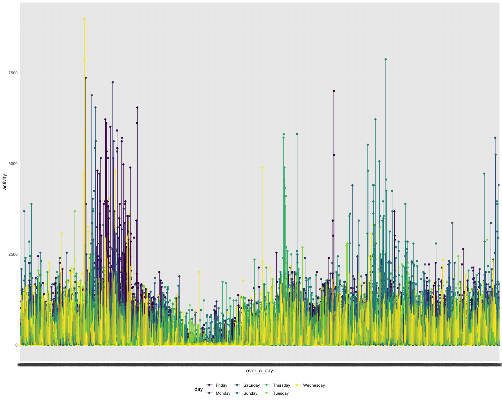

p8105\_hw3\_sl5009
================
Shengzhi Luo
15/10/2021

## Problem 1

``` r
library(p8105.datasets)
data("instacart")
```

Description of the dataset: There are 15 variables with 1384617 columns
showing the online grocery orders from 131,209 unique users, where each
row in the dataset is a product from an order. Order\_dow is the day of
the week on which the order was placed with 0 meaning Monday and so on.
Aisle\_id is aisle identifier. Days\_since\_prior\_order is days since
the last order, capped at 30, NA if order\_number=1.

``` r
library(tidyverse)
library(dplyr)

knitr::opts_chunk$set(
  fig.width = 15,
  fig.asp = .8,
  out.width = "150%"
)

theme_set(theme_minimal() + theme(legend.position = "bottom"))

options(
  ggplot2.continuous.colour = "viridis",
  ggplot2.continuous.fill = "viridis"
)

scale_colour_discrete = scale_colour_viridis_d
scale_fill_discrete = scale_fill_viridis_d
```

### Part 1

``` r
instacart %>%
  group_by(aisle,aisle_id) %>% 
  summarise(n_obs=n()) %>% 
  arrange(desc(n_obs))
```

    ## `summarise()` has grouped output by 'aisle'. You can override using the `.groups` argument.

    ## # A tibble: 134 × 3
    ## # Groups:   aisle [134]
    ##    aisle                         aisle_id  n_obs
    ##    <chr>                            <int>  <int>
    ##  1 fresh vegetables                    83 150609
    ##  2 fresh fruits                        24 150473
    ##  3 packaged vegetables fruits         123  78493
    ##  4 yogurt                             120  55240
    ##  5 packaged cheese                     21  41699
    ##  6 water seltzer sparkling water      115  36617
    ##  7 milk                                84  32644
    ##  8 chips pretzels                     107  31269
    ##  9 soy lactosefree                     91  26240
    ## 10 bread                              112  23635
    ## # … with 124 more rows

As from the above table, we can see there are 134 aisles in total and
the most items ordered are fresh vegetables.

### Part 2

``` r
instacart %>%
  group_by(aisle,aisle_id) %>% 
  summarise(n_obs=n()) %>% 
  filter(n_obs>10000) %>% 
  ggplot(aes(x = aisle_id, y = n_obs, color = aisle_id)) +
    geom_point() + geom_line() +
    theme(legend.position = "bottom")
```

    ## `summarise()` has grouped output by 'aisle'. You can override using the `.groups` argument.


Fresh fruits and fresh vegetables are most frequently ordered among all
groceries. Reasons may be fresh food have short expiration so that
people have to buy them more often.

### Part 3

``` r
instacart %>% 
  filter(aisle==c("baking ingredients","dog food care","packaged vegetables fruits")) %>% 
  group_by(aisle) %>% 
  count(product_name,name = "product_count") %>% 
  mutate(product_rank=min_rank(desc(product_count))) %>% 
  filter(product_rank<=3) %>% 
  arrange(aisle,product_rank) %>% 
  knitr::kable()
```

| aisle                      | product\_name                                   | product\_count | product\_rank |
|:---------------------------|:------------------------------------------------|---------------:|--------------:|
| baking ingredients         | Light Brown Sugar                               |            157 |             1 |
| baking ingredients         | Pure Baking Soda                                |            140 |             2 |
| baking ingredients         | Organic Vanilla Extract                         |            122 |             3 |
| dog food care              | Organix Grain Free Chicken & Vegetable Dog Food |             14 |             1 |
| dog food care              | Organix Chicken & Brown Rice Recipe             |             13 |             2 |
| dog food care              | Original Dry Dog                                |              9 |             3 |
| packaged vegetables fruits | Organic Baby Spinach                            |           3324 |             1 |
| packaged vegetables fruits | Organic Raspberries                             |           1920 |             2 |
| packaged vegetables fruits | Organic Blueberries                             |           1692 |             3 |

The most poppular three things ordered in baking ingredients are Light
Brown Sugar, Pure Baking Soda and Organic Vanilla Extract with 157, 149
and 122 times ordered for each. The most poppular three things ordered
in dog food care are Organix Grain Free Chicken & Vegetable Dog Food,
Organix Chicken & Brown Rice Recipe and Original Dry Dog with 14, 13 and
9 times ordered for each. The most poppular three things ordered in
packaged vegetables fruits are Organic Baby Spinach, Organic Raspberries
and Organic Blueberries with 3324, 1920, 1692 times ordered for each.
Organic food is very popular among groceries.

### Part 4

``` r
mean_instacart =
  instacart %>% 
  filter(product_name==c("Pink Lady Apples","Coffee Ice Cream")) %>% 
  select(order_dow,order_hour_of_day,product_name) %>% 
  group_by(order_dow,product_name) %>% 
  summarise(mean_hour=mean(order_hour_of_day)) %>% 
  pivot_wider(
    names_from = order_dow, 
    values_from = mean_hour
  ) 
```

    ## Warning in product_name == c("Pink Lady Apples", "Coffee Ice Cream"): longer
    ## object length is not a multiple of shorter object length

``` r
colnames(mean_instacart)<-c("product_name","Monday","Tuesday","Wednesday","Thursday","Friday","Saturday","Sunday")
mean_instacart=knitr::kable(mean_instacart,digits = 1)
mean_instacart
```

| product\_name    | Monday | Tuesday | Wednesday | Thursday | Friday | Saturday | Sunday |
|:-----------------|-------:|--------:|----------:|---------:|-------:|---------:|-------:|
| Coffee Ice Cream |   13.2 |    15.0 |      15.3 |     15.4 |   15.2 |     10.3 |   12.4 |
| Pink Lady Apples |   12.2 |    11.7 |      12.0 |     13.9 |   11.9 |     13.9 |   11.6 |

These two drinks are evenly ordered through all week. Coffee Ice Cream
is slightly more popular than Pink Lady Apples.

## Problem 2

``` r
library(p8105.datasets)
data("brfss_smart2010")
brfss_smart2010=janitor::clean_names(brfss_smart2010)
```

### Data Cleaning

``` r
brfss_smart2010_OH=
  brfss_smart2010 %>% 
  filter(topic=="Overall Health") %>% 
  mutate(response = forcats::fct_relevel(response, c("Poor","Fair","Good","Very good","Excellent"))) %>%
  arrange(year,locationabbr,response)
brfss_smart2010_OH
```

    ## # A tibble: 10,625 × 23
    ##     year locationabbr locationdesc   class  topic question  response sample_size
    ##    <int> <chr>        <chr>          <chr>  <chr> <chr>     <fct>          <int>
    ##  1  2002 AK           AK - Anchorag… Healt… Over… How is y… Poor              22
    ##  2  2002 AK           AK - Anchorag… Healt… Over… How is y… Fair              37
    ##  3  2002 AK           AK - Anchorag… Healt… Over… How is y… Good             104
    ##  4  2002 AK           AK - Anchorag… Healt… Over… How is y… Very go…         137
    ##  5  2002 AK           AK - Anchorag… Healt… Over… How is y… Excelle…         116
    ##  6  2002 AL           AL - Jefferso… Healt… Over… How is y… Poor              31
    ##  7  2002 AL           AL - Jefferso… Healt… Over… How is y… Fair              60
    ##  8  2002 AL           AL - Jefferso… Healt… Over… How is y… Good             167
    ##  9  2002 AL           AL - Jefferso… Healt… Over… How is y… Very go…         142
    ## 10  2002 AL           AL - Jefferso… Healt… Over… How is y… Excelle…          92
    ## # … with 10,615 more rows, and 15 more variables: data_value <dbl>,
    ## #   confidence_limit_low <dbl>, confidence_limit_high <dbl>,
    ## #   display_order <int>, data_value_unit <chr>, data_value_type <chr>,
    ## #   data_value_footnote_symbol <chr>, data_value_footnote <chr>,
    ## #   data_source <chr>, class_id <chr>, topic_id <chr>, location_id <chr>,
    ## #   question_id <chr>, respid <chr>, geo_location <chr>

### Part 1

``` r
brfss_smart2010_OH %>% 
  filter(year=="2002") %>% 
  group_by(locationabbr) %>% 
  distinct(locationdesc) %>% 
  summarise(location_obs=n()) %>% 
  filter(location_obs>=7) %>% 
  knitr::kable()
```

| locationabbr | location\_obs |
|:-------------|--------------:|
| CT           |             7 |
| FL           |             7 |
| MA           |             8 |
| NC           |             7 |
| NJ           |             8 |
| PA           |            10 |

``` r
brfss_smart2010_OH %>% 
  filter(year=="2010") %>% 
  group_by(locationabbr) %>% 
  distinct(locationdesc) %>% 
  summarise(location_obs=n()) %>% 
  filter(location_obs>=7) %>% 
  knitr::kable()
```

| locationabbr | location\_obs |
|:-------------|--------------:|
| CA           |            12 |
| CO           |             7 |
| FL           |            41 |
| MA           |             9 |
| MD           |            12 |
| NC           |            12 |
| NE           |            10 |
| NJ           |            19 |
| NY           |             9 |
| OH           |             8 |
| PA           |             7 |
| SC           |             7 |
| TX           |            16 |
| WA           |            10 |

Connecticut, Florida, Massachusetts, North Carolina, New Jersey,
Pennsylvania are observed at least 7 locations in 2002. California,
Colorado, Florida, Massachusetts, Maryland, North Carolina, Nebraska,
New Jersey, New York, Ohio, Pennsylvania, South Carolina, Texas,
Washington are observed at least 7 locations in 2010.

### Part 2

``` r
brfss_smart2010_OH_mean=
  brfss_smart2010_OH %>% 
  filter(response=="Excellent") %>% 
  group_by(year,locationabbr) %>% 
  summarise(
    mean_data=mean(data_value)
  ) %>% 
  mutate(
    mean_data=round(mean_data,digits = 2)
  )
```

    ## `summarise()` has grouped output by 'year'. You can override using the `.groups` argument.

``` r
brfss_smart2010_OH_mean
```

    ## # A tibble: 443 × 3
    ## # Groups:   year [9]
    ##     year locationabbr mean_data
    ##    <int> <chr>            <dbl>
    ##  1  2002 AK                27.9
    ##  2  2002 AL                18.5
    ##  3  2002 AR                24.1
    ##  4  2002 AZ                24.1
    ##  5  2002 CA                22.7
    ##  6  2002 CO                23.1
    ##  7  2002 CT                29.1
    ##  8  2002 DC                29.3
    ##  9  2002 DE                20.9
    ## 10  2002 FL                25.7
    ## # … with 433 more rows

``` r
brfss_smart2010_OH_mean %>% 
  ggplot(aes(x = locationabbr, y = mean_data, color = year)) + 
    geom_point() + geom_line() + 
    theme(legend.position = "bottom")
```

    ## Warning: Removed 4 rows containing missing values (geom_point).

    ## Warning: Removed 3 row(s) containing missing values (geom_path).


According the plot above, The response values within nearly every state
declined from year 2002 to 2010.

### Part 3

``` r
brfss_smart2010_OH %>% 
  filter(locationabbr=="NY",year==c("2006","2010")) %>% 
  ggplot(aes(x =data_value, fill = response)) +
  geom_density(alpha = .5) + 
  facet_grid(~year) + 
  viridis::scale_fill_viridis(discrete = TRUE)
```

    ## Warning in year == c("2006", "2010"): longer object length is not a multiple of
    ## shorter object length


In 2002, responses as Poor in NY are more common than these in 2010.
Responses to very good in both 2002 and 2010 have more values than
others.

## Problem 3

### Part 1

``` r
accel_data=
  read.csv("accel_data.csv") %>% 
  mutate_if(is.numeric, round, 1) %>%
  mutate(weekday_or_weekend=ifelse(day %in% c("Saturday", "Sunday"), "weekend", "weekday")) %>% 
  relocate(weekday_or_weekend,.after = day) %>% 
  pivot_longer(
    activity.1:activity.1440,
    names_to = "over_a_day", 
    names_prefix = "activity.",
    values_to = "activity"
  ) 
accel_data
```

    ## # A tibble: 50,400 × 6
    ##     week day_id day    weekday_or_weekend over_a_day activity
    ##    <dbl>  <dbl> <chr>  <chr>              <chr>         <dbl>
    ##  1     1      1 Friday weekday            1              88.4
    ##  2     1      1 Friday weekday            2              82.2
    ##  3     1      1 Friday weekday            3              64.4
    ##  4     1      1 Friday weekday            4              70  
    ##  5     1      1 Friday weekday            5              75  
    ##  6     1      1 Friday weekday            6              66.3
    ##  7     1      1 Friday weekday            7              53.8
    ##  8     1      1 Friday weekday            8              47.8
    ##  9     1      1 Friday weekday            9              55.5
    ## 10     1      1 Friday weekday            10             43  
    ## # … with 50,390 more rows

We group the data by day and pivot the activity through 24 hours. There
are 6 variables with 50400 obsevations. over\_a\_day variable refers to
the ith minute of the day and activity refers to the activity observed
for every minute.

### Part 2

``` r
sum_of_day=
  accel_data %>% 
  group_by(day_id) %>% 
  summarise(total_activity=sum(activity)) %>% 
  arrange(desc(total_activity)) %>% 
  knitr::kable()
sum_of_day
```

| day\_id | total\_activity |
|--------:|----------------:|
|      16 |        685910.0 |
|       4 |        631105.0 |
|      29 |        620860.0 |
|      10 |        607175.0 |
|       8 |        568839.0 |
|      33 |        549658.0 |
|       1 |        480542.6 |
|      12 |        474048.0 |
|      21 |        468869.0 |
|      15 |        467420.0 |
|      18 |        467052.0 |
|      35 |        445366.0 |
|      14 |        440962.0 |
|      28 |        434460.0 |
|      13 |        423245.0 |
|      11 |        422018.0 |
|      23 |        409450.0 |
|      30 |        389080.0 |
|      17 |        382928.0 |
|      20 |        381507.0 |
|       3 |        376254.0 |
|      19 |        371230.0 |
|      34 |        367824.0 |
|       5 |        355924.4 |
|      26 |        340291.0 |
|       7 |        340115.1 |
|      27 |        319568.0 |
|       6 |        307093.7 |
|       9 |        295431.0 |
|      25 |        260617.0 |
|      22 |        154049.0 |
|      32 |        138421.0 |
|       2 |         78829.2 |
|      24 |          1440.0 |
|      31 |          1440.0 |

The 16th and 4th day of 35 days have the most total activity values. But
this table can’t show any trends apparently since there isn’t any
24-hour activity changes.

``` r
accel_data_24h=
  accel_data %>% 
  group_by(day_id) %>% 
  ggplot(aes(x =over_a_day, y =activity, color = day)) + 
    geom_point() + geom_line() + 
    theme(legend.position = "bottom")
accel_data_24h
```


According to this plot, morning and evening activities in the day are
more efficient. Activities in Friday mornings and Sunday evenings are
often more active than others.
