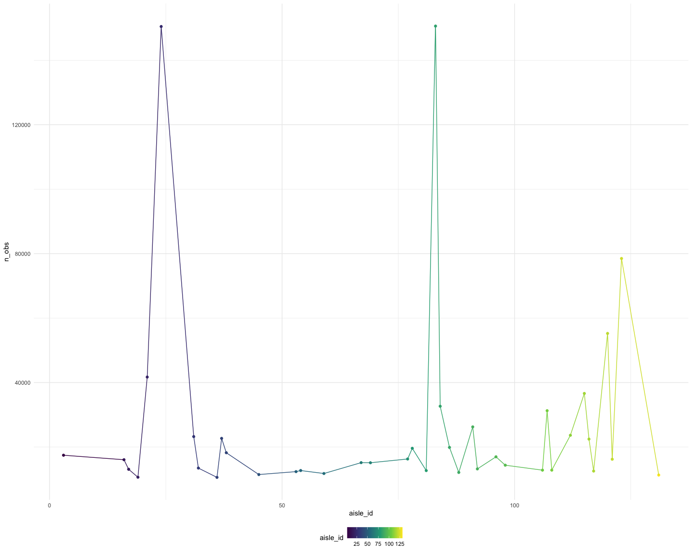

p8105\_hw3\_sl5009
================
Shengzhi Luo
15/10/2021

## Problem 1

``` r
library(p8105.datasets)
data("instacart")
```

``` r
library(tidyverse)
library(dplyr)

knitr::opts_chunk$set(
  fig.width = 15,
  fig.asp = .8,
  out.width = "150%"
)

theme_set(theme_minimal() + theme(legend.position = "bottom"))

options(
  ggplot2.continuous.colour = "viridis",
  ggplot2.continuous.fill = "viridis"
)

scale_colour_discrete = scale_colour_viridis_d
scale_fill_discrete = scale_fill_viridis_d
```

How many aisles are there, and which aisles are the most items ordered
from?

``` r
instacart %>%
  group_by(aisle,aisle_id) %>% 
  summarise(n_obs=n()) %>% 
  arrange(desc(n_obs))
```

    ## `summarise()` has grouped output by 'aisle'. You can override using the `.groups` argument.

    ## # A tibble: 134 × 3
    ## # Groups:   aisle [134]
    ##    aisle                         aisle_id  n_obs
    ##    <chr>                            <int>  <int>
    ##  1 fresh vegetables                    83 150609
    ##  2 fresh fruits                        24 150473
    ##  3 packaged vegetables fruits         123  78493
    ##  4 yogurt                             120  55240
    ##  5 packaged cheese                     21  41699
    ##  6 water seltzer sparkling water      115  36617
    ##  7 milk                                84  32644
    ##  8 chips pretzels                     107  31269
    ##  9 soy lactosefree                     91  26240
    ## 10 bread                              112  23635
    ## # … with 124 more rows

As from the above table, we can see there are 134 aisles in total and
the most items ordered are fresh vegetables.

Make a plot that shows the number of items ordered in each aisle,
limiting this to aisles with more than 10000 items ordered. Arrange
aisles sensibly, and organize your plot so others can read it.

``` r
instacart %>%
  group_by(aisle,aisle_id) %>% 
  summarise(n_obs=n()) %>% 
  filter(n_obs>10000) %>% 
  ggplot(aes(x = aisle_id, y = n_obs, color = aisle_id)) +
    geom_point() + geom_line() +
    theme(legend.position = "bottom")
```

    ## `summarise()` has grouped output by 'aisle'. You can override using the `.groups` argument.


Make a table showing the three most popular items in each of the aisles
“baking ingredients”, “dog food care”, and “packaged vegetables fruits”.
Include the number of times each item is ordered in your table.

``` r
instacart %>% 
  filter(aisle==c("baking ingredients","dog food care","packaged vegetables fruits")) %>% 
  group_by(aisle) %>% 
  count(product_name,name = "product_count") %>% 
  mutate(product_rank=min_rank(desc(product_count))) %>% 
  filter(product_rank==1) %>% 
  knitr::kable()
```

| aisle                      | product\_name                                   | product\_count | product\_rank |
|:---------------------------|:------------------------------------------------|---------------:|--------------:|
| baking ingredients         | Light Brown Sugar                               |            157 |             1 |
| dog food care              | Organix Grain Free Chicken & Vegetable Dog Food |             14 |             1 |
| packaged vegetables fruits | Organic Baby Spinach                            |           3324 |             1 |

Make a table showing the mean hour of the day at which Pink Lady Apples
and Coffee Ice Cream are ordered on each day of the week; format this
table for human readers (i.e. produce a 2 x 7 table).

``` r
mean_instacart =
  instacart %>% 
  filter(product_name==c("Pink Lady Apples","Coffee Ice Cream")) %>% 
  select(order_dow,order_hour_of_day,product_name) %>% 
  group_by(order_dow,product_name) %>% 
  summarise(mean_hour=mean(order_hour_of_day)) %>% 
  pivot_wider(
    names_from = order_dow, 
    values_from = mean_hour
  ) 
```

    ## Warning in product_name == c("Pink Lady Apples", "Coffee Ice Cream"): longer
    ## object length is not a multiple of shorter object length

``` r
colnames(mean_instacart)<-c("product_name","Monday","Tuesday","Wednesday","Thursday","Friday","Saturday","Sunday")
mean_instacart=knitr::kable(mean_instacart,digits = 1)
mean_instacart
```

| product\_name    | Monday | Tuesday | Wednesday | Thursday | Friday | Saturday | Sunday |
|:-----------------|-------:|--------:|----------:|---------:|-------:|---------:|-------:|
| Coffee Ice Cream |   13.2 |    15.0 |      15.3 |     15.4 |   15.2 |     10.3 |   12.4 |
| Pink Lady Apples |   12.2 |    11.7 |      12.0 |     13.9 |   11.9 |     13.9 |   11.6 |

## Problem 2

``` r
library(p8105.datasets)
data("brfss_smart2010")
brfss_smart2010=janitor::clean_names(brfss_smart2010)
```

``` r
brfss_smart2010_OH=
  brfss_smart2010 %>% 
  filter(topic=="Overall Health") %>% 
  mutate(response = forcats::fct_relevel(response, c("Poor","Fair","Good","Very good","Excellent"))) %>%
  arrange(year,locationabbr,response)
brfss_smart2010_OH
```

    ## # A tibble: 10,625 × 23
    ##     year locationabbr locationdesc   class  topic question  response sample_size
    ##    <int> <chr>        <chr>          <chr>  <chr> <chr>     <fct>          <int>
    ##  1  2002 AK           AK - Anchorag… Healt… Over… How is y… Poor              22
    ##  2  2002 AK           AK - Anchorag… Healt… Over… How is y… Fair              37
    ##  3  2002 AK           AK - Anchorag… Healt… Over… How is y… Good             104
    ##  4  2002 AK           AK - Anchorag… Healt… Over… How is y… Very go…         137
    ##  5  2002 AK           AK - Anchorag… Healt… Over… How is y… Excelle…         116
    ##  6  2002 AL           AL - Jefferso… Healt… Over… How is y… Poor              31
    ##  7  2002 AL           AL - Jefferso… Healt… Over… How is y… Fair              60
    ##  8  2002 AL           AL - Jefferso… Healt… Over… How is y… Good             167
    ##  9  2002 AL           AL - Jefferso… Healt… Over… How is y… Very go…         142
    ## 10  2002 AL           AL - Jefferso… Healt… Over… How is y… Excelle…          92
    ## # … with 10,615 more rows, and 15 more variables: data_value <dbl>,
    ## #   confidence_limit_low <dbl>, confidence_limit_high <dbl>,
    ## #   display_order <int>, data_value_unit <chr>, data_value_type <chr>,
    ## #   data_value_footnote_symbol <chr>, data_value_footnote <chr>,
    ## #   data_source <chr>, class_id <chr>, topic_id <chr>, location_id <chr>,
    ## #   question_id <chr>, respid <chr>, geo_location <chr>

In 2002, which states were observed at 7 or more locations? What about
in 2010?

``` r
brfss_smart2010_OH %>% 
  filter(year=="2002") %>% 
  group_by(locationabbr) %>% 
  distinct(locationdesc) %>% 
  summarise(location_obs=n()) %>% 
  filter(location_obs>=7)
```

    ## # A tibble: 6 × 2
    ##   locationabbr location_obs
    ##   <chr>               <int>
    ## 1 CT                      7
    ## 2 FL                      7
    ## 3 MA                      8
    ## 4 NC                      7
    ## 5 NJ                      8
    ## 6 PA                     10

``` r
brfss_smart2010_OH %>% 
  filter(year=="2010") %>% 
  group_by(locationabbr) %>% 
  distinct(locationdesc) %>% 
  summarise(location_obs=n()) %>% 
  filter(location_obs>=7)
```

    ## # A tibble: 14 × 2
    ##    locationabbr location_obs
    ##    <chr>               <int>
    ##  1 CA                     12
    ##  2 CO                      7
    ##  3 FL                     41
    ##  4 MA                      9
    ##  5 MD                     12
    ##  6 NC                     12
    ##  7 NE                     10
    ##  8 NJ                     19
    ##  9 NY                      9
    ## 10 OH                      8
    ## 11 PA                      7
    ## 12 SC                      7
    ## 13 TX                     16
    ## 14 WA                     10

Construct a dataset that is limited to Excellent responses, and
contains, year, state, and a variable that averages the data\_value
across locations within a state. Make a “spaghetti” plot of this average
value over time within a state (that is, make a plot showing a line for
each state across years – the geom\_line geometry and group aesthetic
will help).

``` r
brfss_smart2010_OH_mean=
  brfss_smart2010_OH %>% 
  filter(response=="Excellent") %>% 
  group_by(year,locationabbr) %>% 
  summarise(
    mean_data=mean(data_value)
  ) %>% 
  mutate(
    mean_data=round(mean_data,digits = 2)
  )
```

    ## `summarise()` has grouped output by 'year'. You can override using the `.groups` argument.

``` r
brfss_smart2010_OH_mean
```

    ## # A tibble: 443 × 3
    ## # Groups:   year [9]
    ##     year locationabbr mean_data
    ##    <int> <chr>            <dbl>
    ##  1  2002 AK                27.9
    ##  2  2002 AL                18.5
    ##  3  2002 AR                24.1
    ##  4  2002 AZ                24.1
    ##  5  2002 CA                22.7
    ##  6  2002 CO                23.1
    ##  7  2002 CT                29.1
    ##  8  2002 DC                29.3
    ##  9  2002 DE                20.9
    ## 10  2002 FL                25.7
    ## # … with 433 more rows

``` r
brfss_smart2010_OH_mean %>% 
  ggplot(aes(x = locationabbr, y = mean_data, color = year)) + 
    geom_point() + geom_line() + 
    theme(legend.position = "bottom")
```

    ## Warning: Removed 4 rows containing missing values (geom_point).

    ## Warning: Removed 3 row(s) containing missing values (geom_path).


Make a two-panel plot showing, for the years 2006, and 2010,
distribution of data\_value for responses (“Poor” to “Excellent”) among
locations in NY State.

``` r
brfss_smart2010_OH %>% 
  filter(locationabbr=="NY",year==c("2006","2010")) %>% 
  ggplot(aes(x =data_value, fill = response)) +
  geom_density(alpha = .5) + 
  facet_grid(~year) + 
  viridis::scale_fill_viridis(discrete = TRUE)
```

    ## Warning in year == c("2006", "2010"): longer object length is not a multiple of
    ## shorter object length


## Problem 3

Load, tidy, and otherwise wrangle the data. Your final dataset should
include all originally observed variables and values; have useful
variable names; include a weekday vs weekend variable; and encode data
with reasonable variable classes. Describe the resulting dataset
(e.g. what variables exist, how many observations, etc).

``` r
accel_data=
  read.csv("accel_data.csv") %>% 
  mutate_if(is.numeric, round, 1) %>%
  mutate(weekday_or_weekend=ifelse(day %in% c("Saturday", "Sunday"), "weekend", "weekday")) %>% 
  relocate(weekday_or_weekend,.after = day) %>% 
  pivot_longer(
    activity.1:activity.1440,
    names_to = "over_a_day", 
    names_prefix = "activity.",
    values_to = "activity"
  ) 
accel_data
```

    ## # A tibble: 50,400 × 6
    ##     week day_id day    weekday_or_weekend over_a_day activity
    ##    <dbl>  <dbl> <chr>  <chr>              <chr>         <dbl>
    ##  1     1      1 Friday weekday            1              88.4
    ##  2     1      1 Friday weekday            2              82.2
    ##  3     1      1 Friday weekday            3              64.4
    ##  4     1      1 Friday weekday            4              70  
    ##  5     1      1 Friday weekday            5              75  
    ##  6     1      1 Friday weekday            6              66.3
    ##  7     1      1 Friday weekday            7              53.8
    ##  8     1      1 Friday weekday            8              47.8
    ##  9     1      1 Friday weekday            9              55.5
    ## 10     1      1 Friday weekday            10             43  
    ## # … with 50,390 more rows

Traditional analyses of accelerometer data focus on the total activity
over the day. Using your tidied dataset, aggregate accross minutes to
create a total activity variable for each day, and create a table
showing these totals. Are any trends apparent?

``` r
sum_of_day=
  accel_data %>% 
  group_by(day_id) %>% 
  summarise(total_activity=sum(activity)) %>% 
  arrange(desc(total_activity))
sum_of_day
```

    ## # A tibble: 35 × 2
    ##    day_id total_activity
    ##     <dbl>          <dbl>
    ##  1     16        685910 
    ##  2      4        631105 
    ##  3     29        620860 
    ##  4     10        607175 
    ##  5      8        568839 
    ##  6     33        549658 
    ##  7      1        480543.
    ##  8     12        474048 
    ##  9     21        468869 
    ## 10     15        467420 
    ## # … with 25 more rows

Accelerometer data allows the inspection activity over the course of the
day. Make a single-panel plot that shows the 24-hour activity time
courses for each day and use color to indicate day of the week. Describe
in words any patterns or conclusions you can make based on this graph.

``` r
accel_data_24h=
  accel_data %>% 
  group_by(day_id) %>% 
  ggplot(aes(x =over_a_day, y =activity, color = day)) + 
    geom_point() + geom_line() + 
    theme(legend.position = "bottom")
accel_data_24h
```


